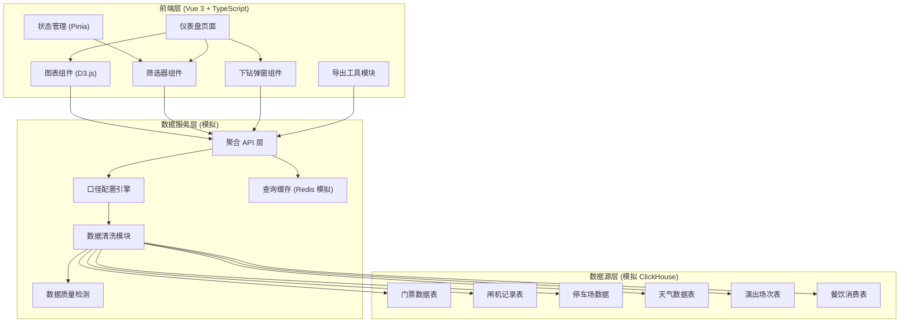
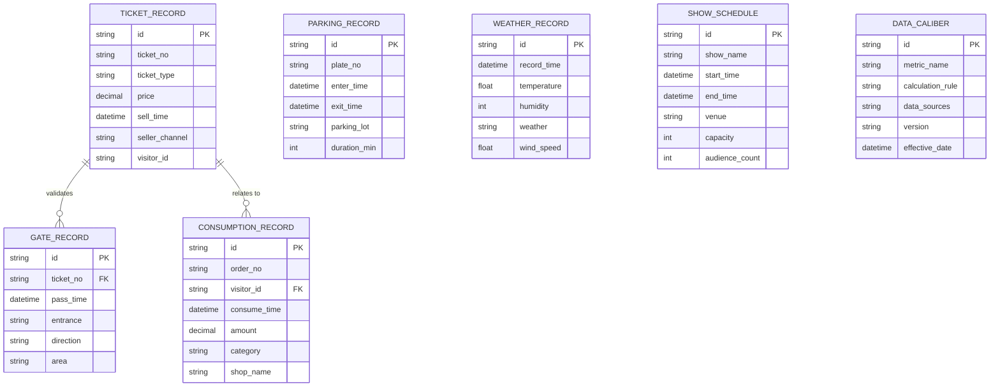

## 1. 架构设计



## 2. 技术描述
- **前端框架**：Vue 3 + TypeScript + Vite
- **图表库**：D3.js v7 (热力地图、折线图、柱状图、漏斗图)
- **状态管理**：Pinia (按视图隔离状态，避免互相干扰)
- **样式方案**：Tailwind CSS 3
- **UI 组件**：自定义组件 + Lucide Vue 图标
- **后端/数据层**：Express.js (模拟 API) + 内存模拟 ClickHouse/Redis
- **数据模拟**：TypeScript 类生成符合真实分布的景区运营数据

## 3. 路由定义
| 路由 | 用途 |
|------|------|
| /dashboard | 主仪表盘页面（核心页面） |
| /settings/data-caliber | 数据口径配置页面（可选） |

## 4. API 定义（模拟）

### TypeScript 类型定义

```typescript
// 筛选条件
interface FilterState {
  entrance: string[];
  area: string[];
  timeRange: { start: Date; end: Date };
  ticketType: string[];
  activity: string[];
}

// 客流热力数据
interface HeatmapData {
  areaId: string;
  areaName: string;
  visitorCount: number;
  capacity: number;
  density: number;
  isClosed: boolean;
  coordinates: [number, number][];
}

// 排队预测数据
interface QueuePrediction {
  timestamp: Date;
  areaId: string;
  predictedWait: number;
  lowerBound: number;
  upperBound: number;
  confidence: number;
  actualWait?: number;
  sampleSize: number;
}

// 票种分析数据
interface TicketAnalysis {
  ticketType: string;
  soldCount: number;
  enteredCount: number;
  entryRate: number;
  avgSpend: number;
  sampleSize: number;
}

// 消费转化数据
interface ConversionFunnel {
  stage: string;
  count: number;
  conversionRate: number;
  sampleSize: number;
}

// 原始记录
interface RawRecord {
  id: string;
  timestamp: Date;
  type: 'ticket' | 'gate' | 'parking' | 'consumption';
  data: Record<string, any>;
}

// 数据质量报告
interface DataQualityReport {
  missingValueRate: number;
  anomalyCount: number;
  totalSampleSize: number;
  lastUpdateTime: Date;
  caliberVersion: string;
}

// API 响应
interface ApiResponse<T> {
  data: T;
  filters: FilterState;
  sampleSize: number;
  queryTime: number;
  cacheHit: boolean;
}
```

### API 端点
| 方法 | 路径 | 描述 |
|------|------|------|
| GET | /api/heatmap | 获取客流热力数据 |
| GET | /api/queue-prediction | 获取排队预测数据 |
| GET | /api/ticket-analysis | 获取票种分析数据 |
| GET | /api/conversion-funnel | 获取消费转化数据 |
| GET | /api/raw-records | 获取原始记录（支持下钻） |
| GET | /api/data-quality | 获取数据质量报告 |
| GET | /api/export | 导出数据 (CSV) |

## 5. 数据模型

### 6.1 数据模型定义



### 6.2 核心口径配置

```typescript
// 数据口径配置
const DATA_CALIBERS = {
  // 实时客流 = 过去15分钟内入园人次 - 出园人次
  realtimeVisitor: {
    name: '实时客流',
    formula: 'SUM(gate_in) - SUM(gate_out) OVER (last 15min)',
    source: ['gate_record'],
    timeWindow: '15min',
    granularity: '5min'
  },
  // 平均排队时长 = 闸机通过时间差的中位数
  avgWaitTime: {
    name: '平均排队时长',
    formula: 'MEDIAN(pass_time - queue_start_time)',
    source: ['gate_record', 'queue_camera'],
    timeWindow: '30min',
    granularity: '10min'
  },
  // 入园率 = 已入园 / 已售票
  entryRate: {
    name: '入园率',
    formula: 'COUNT(DISTINCT gate.ticket_no) / COUNT(DISTINCT ticket.ticket_no)',
    source: ['ticket_record', 'gate_record'],
    timeWindow: '1day',
    granularity: '1hour'
  },
  // 客单价 = 餐饮消费总额 / 入园人次
  avgSpendPerVisitor: {
    name: '客单价',
    formula: 'SUM(consumption.amount) / COUNT(DISTINCT gate.visitor_id)',
    source: ['consumption_record', 'gate_record'],
    timeWindow: '1day',
    granularity: '2hour'
  }
};
```

## 6. 状态管理设计

### Pinia Store 结构
- **useFilterStore**：全局筛选条件，支持视图隔离
- **useHeatmapStore**：客流地图独立状态
- **useQueueStore**：排队预测独立状态
- **useTicketStore**：票种分析独立状态
- **useConversionStore**：消费转化独立状态
- **useDataQualityStore**：数据质量监控状态

每个 Store 独立管理自己的数据加载、缓存、错误状态，避免跨视图干扰。

## 7. 验收标准
- 缺失值检测：各字段缺失率 < 5%，超阈值告警
- 异常点检测：3σ 原则识别离群值，标注在图表上
- 样本量显示：每个图表/指标旁显示有效样本量
- 预测置信区间：95% 置信区间可视化标注
- 临时闭园：容量自动扣除，界面显著提示
