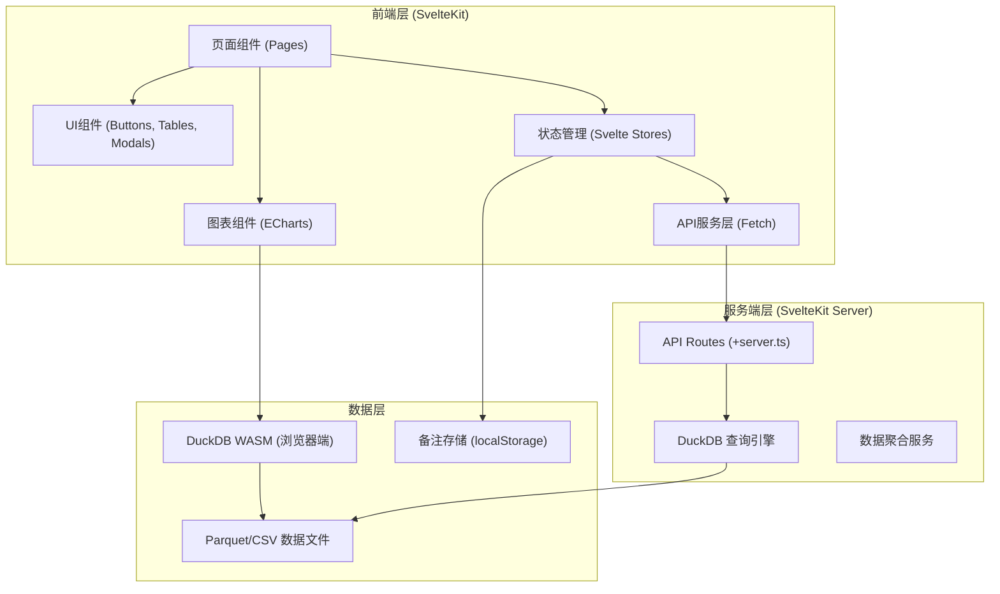

## 1. 架构设计



## 2. 技术描述

- **前端框架**: SvelteKit 2.x (全栈框架，SSR + 客户端路由)
- **UI 样式**: TailwindCSS 3.x
- **图表库**: ECharts 5.x
- **数据引擎**: DuckDB WASM (浏览器端内嵌分析型数据库)
- **图标库**: lucide-svelte
- **状态管理**: Svelte 原生 Stores
- **构建工具**: Vite
- **语言**: TypeScript

### 架构说明

1. **DuckDB WASM 架构**: 
   - 数据文件 (Parquet/CSV) 作为静态资源托管
   - 浏览器端加载 DuckDB WASM，直接在客户端执行 SQL 查询
   - 支持复杂聚合、分组、过滤操作，性能优异
   - 无需后端服务器，纯前端即可完成数据分析

2. **SvelteKit 服务端增强**:
   - 提供 API 路由处理复杂查询
   - 支持服务端预加载数据提升首屏性能
   - 数据文件通过静态资源服务提供

## 3. 路由定义

| 路由 | 用途 |
|------|------|
| `/` | 分析工作台主页面 |
| `/api/query` | DuckDB 查询接口（服务端） |
| `/api/notes` | 备注 CRUD 接口 |

## 4. 数据模型

### 4.1 会话记录表 (sessions)

```sql
CREATE TABLE sessions (
    session_id VARCHAR PRIMARY KEY,
    user_id VARCHAR,
    customer_level VARCHAR,
    channel VARCHAR,
    version VARCHAR,
    start_time TIMESTAMP,
    end_time TIMESTAMP,
    total_rounds INTEGER,
    intent_tag VARCHAR,
    is_transfer_to_human BOOLEAN,
    satisfaction_score INTEGER,
    user_question TEXT,
    bot_answer TEXT,
    transfer_reason VARCHAR,
    hour_of_day INTEGER,
    day_of_week INTEGER
);
```

### 4.2 备注表 (notes)

```typescript
interface Note {
    id: string;
    dimension: string;      // 维度类型: intent/channel/hour/level/version
    dimensionValue: string; // 维度值
    content: string;        // 备注内容
    createdAt: number;      // 创建时间戳
    createdBy: string;      // 创建人
}
```

### 4.3 筛选状态

```typescript
interface FilterState {
    dateRange: [Date, Date];
    channels: string[];
    versions: string[];
    customerLevels: string[];
    intentTags: string[];
}
```

## 5. 核心模块说明

### 5.1 DuckDB 查询层

```typescript
// 核心查询接口
interface QueryService {
    // 获取概览指标
    getOverviewMetrics(filters: FilterState): Promise<OverviewMetrics>;
    
    // 获取漏斗数据
    getFunnelData(filters: FilterState): Promise<FunnelDataPoint[]>;
    
    // 按维度聚合分析
    getDimensionAnalysis(
        dimension: DimensionType, 
        filters: FilterState
    ): Promise<DimensionDataPoint[]>;
    
    // 获取满意度趋势
    getSatisfactionTrend(
        granularity: 'hour' | 'day',
        filters: FilterState
    ): Promise<TrendDataPoint[]>;
    
    // 获取明细表数据
    getSessionDetails(
        filters: FilterState,
        pagination: Pagination
    ): Promise<Session[]>;
    
    // 获取失败问法样例
    getFailureExamples(filters: FilterState, limit: number): Promise<Session[]>;
}
```

### 5.2 组件结构

```
src/
├── components/
│   ├── charts/
│   │   ├── FunnelChart.svelte      # 转人工漏斗图
│   │   ├── IntentHeatmap.svelte    # 意图热度图
│   │   ├── TrendChart.svelte       # 满意度趋势图
│   │   └── ScatterChart.svelte     # 散点图
│   ├── filters/
│   │   ├── DateRangePicker.svelte  # 日期选择器
│   │   ├── DimensionSelector.svelte# 维度选择器
│   │   └── FilterBar.svelte        # 筛选栏
│   ├── metrics/
│   │   ├── KPICard.svelte          # KPI指标卡
│   │   └── MetricGrid.svelte       # 指标网格
│   ├── table/
│   │   ├── DataTable.svelte        # 数据表格
│   │   └── DimensionTable.svelte   # 维度对比表
│   ├── modals/
│   │   ├── DetailModal.svelte      # 明细弹窗
│   │   └── NoteEditor.svelte       # 备注编辑器
│   └── common/
│       ├── Badge.svelte
│       └── Tooltip.svelte
├── stores/
│   ├── filterStore.ts              # 筛选状态
│   ├── dataStore.ts                # 数据缓存
│   └── noteStore.ts                # 备注状态
├── utils/
│   ├── duckdb.ts                   # DuckDB 初始化
│   ├── queries.ts                  # SQL 查询模板
│   └── format.ts                   # 格式化工具
├── data/
│   └── mock_sessions.parquet       # 模拟数据
```

## 6. 性能优化策略

1. **数据预聚合**: 针对常用查询维度预生成聚合表
2. **增量加载**: DuckDB 支持懒加载，按需读取 Parquet 文件
3. **查询缓存**: 相同筛选条件的查询结果缓存 5 分钟
4. **Web Worker**: DuckDB 查询在 Web Worker 中执行，避免阻塞主线程
5. **虚拟滚动**: 明细表使用虚拟滚动处理大量数据
