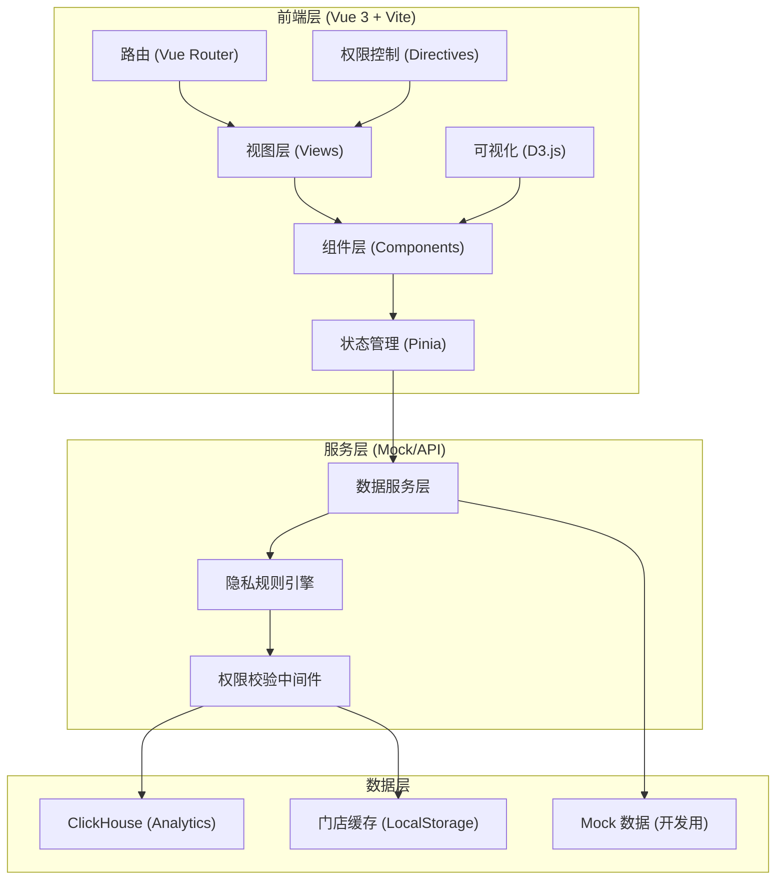
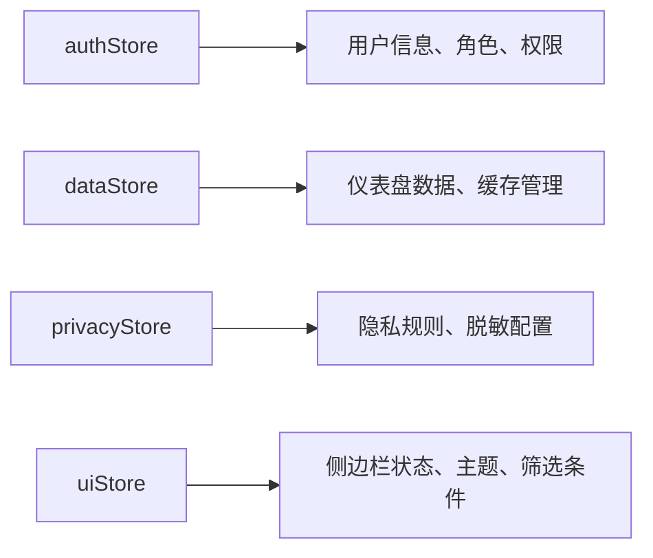

## 1. 架构设计



## 2. 技术描述

- **前端框架**: Vue 3 (Composition API) + Vite 5
- **状态管理**: Pinia 2
- **路由**: Vue Router 4
- **可视化**: D3.js 7
- **样式方案**: Tailwind CSS 3 + SCSS
- **UI 组件库**: Element Plus
- **数据格式**: TypeScript 类型定义
- **数据存储**: LocalStorage (门店缓存、用户偏好)
- **后端数据库**: ClickHouse (分析型查询，前端使用 Mock 数据模拟)

## 3. 路由定义

| 路由路径 | 页面名称 | 权限要求 |
|----------|----------|----------|
| /login | 登录页 | 公开 |
| /dashboard | 仪表盘首页 | 门店经理/大区运营/总部运营 |
| /member/repurchase | 会员复购分析 | 门店经理/大区运营/总部运营 |
| /activity/analysis | 活动效果分析 | 大区运营/总部运营 |
| /medicine/category | 药品分类管理 | 总部运营 |
| /system/settings | 系统设置 | 总部运营 |
| /403 | 无权限页 | 公开 |
| /404 | 页面不存在 | 公开 |

## 4. 核心数据结构定义

```typescript
// 用户角色类型
type UserRole = 'store_manager' | 'region_operation' | 'headquarters_operation'

// 用户信息
interface User {
  id: string
  name: string
  role: UserRole
  storeId?: string
  regionId?: string
  permissions: string[]
}

// 权限控制
interface PermissionConfig {
  canExport: boolean
  canViewPersonalData: boolean
  canViewAllStores: boolean
  canManageCategory: boolean
}

// 隐私规则
interface PrivacyRule {
  field: string
  maskType: 'full' | 'partial' | 'range' | 'aggregate-only'
  maskPattern?: string
  minSampleSize: number
}

// 核心指标
interface CoreMetric {
  name: string
  value: number
  unit: string
  trend: number
  sampleSize: number
  lowSample: boolean
}

// Cohort 数据
interface CohortData {
  cohortPeriod: string
  periods: number[]
  retentionRates: number[]
  sampleSizes: number[]
  lowSampleFlags: boolean[]
}

// 漏斗数据
interface FunnelStep {
  name: string
  value: number
  conversionRate: number
  sampleSize: number
  lowSample: boolean
}

// 门店数据
interface StoreData {
  id: string
  name: string
  region: string
  repurchaseRate: number
  avgOrderValue: number
  sampleSize: number
}

// 药品分类
interface MedicineCategory {
  id: string
  name: string
  parentId: string | null
  level: number
  medicines: string[]
}

// 活动数据
interface ActivityData {
  id: string
  name: string
  startDate: string
  endDate: string
  couponFunnel: FunnelStep[]
  medicineComparison: {
    category: string
    beforeActivity: number
    afterActivity: number
    growthRate: number
    sampleSize: number
  }[]
}
```

## 5. 状态管理设计



## 6. 核心组件结构

```
src/
├── components/
│   ├── charts/
│   │   ├── CohortHeatmap.vue      # Cohort 热力图
│   │   ├── FunnelChart.vue        # 漏斗图
│   │   ├── LineChart.vue          # 趋势折线图
│   │   ├── BarChart.vue           # 柱状图
│   │   └── PieChart.vue           # 饼图/玫瑰图
│   ├── common/
│   │   ├── MetricCard.vue         # 指标卡片
│   │   ├── SampleSizeBadge.vue    # 样本量标签
│   │   ├── LowSampleTip.vue       # 低样本提示
│   │   ├── PrivacyMasked.vue      # 隐私字段遮蔽
│   │   └── PermissionGuard.vue    # 权限守卫
│   ├── layout/
│   │   ├── MainLayout.vue         # 主布局
│   │   ├── Sidebar.vue            # 侧边栏
│   │   └── Header.vue             # 顶部导航
│   └── tables/
│       ├── StoreRankingTable.vue  # 门店排名表
│       └── CategoryMappingTable.vue # 分类映射表
├── views/
│   ├── Dashboard.vue
│   ├── MemberRepurchase.vue
│   ├── ActivityAnalysis.vue
│   ├── MedicineCategory.vue
│   ├── SystemSettings.vue
│   └── Login.vue
├── stores/
│   ├── auth.ts
│   ├── data.ts
│   ├── privacy.ts
│   └── ui.ts
├── utils/
│   ├── privacy.ts                 # 隐私规则引擎
│   ├── permission.ts              # 权限控制工具
│   ├── mock.ts                    # Mock 数据生成
│   └── d3-helpers.ts              # D3 辅助函数
└── types/
    └── index.ts
```

## 7. 隐私安全机制

1. **字段级脱敏**:
   - 姓名：张*三、李*
   - 手机号：138****1234
   - 身份证：110***********1234
   - 处方信息：仅展示区间统计

2. **样本量控制**:
   - 默认阈值：n < 10 触发低样本提示
   - 低样本展示：数据模糊化、显示"样本不足"
   - 可配置：不同指标可设置不同阈值

3. **导出控制**:
   - 门店经理：禁止导出
   - 大区运营：仅导出聚合数据，不含个人信息
   - 总部运营：可导出完整数据，但需记录审计日志

4. **数据范围控制**:
   - 门店经理：仅本店数据
   - 大区运营：本区域内所有门店数据
   - 总部运营：全量数据
