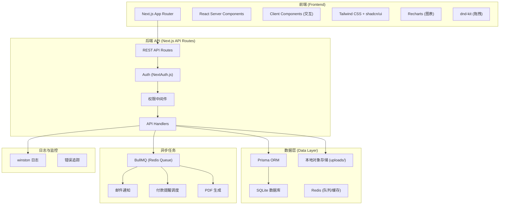
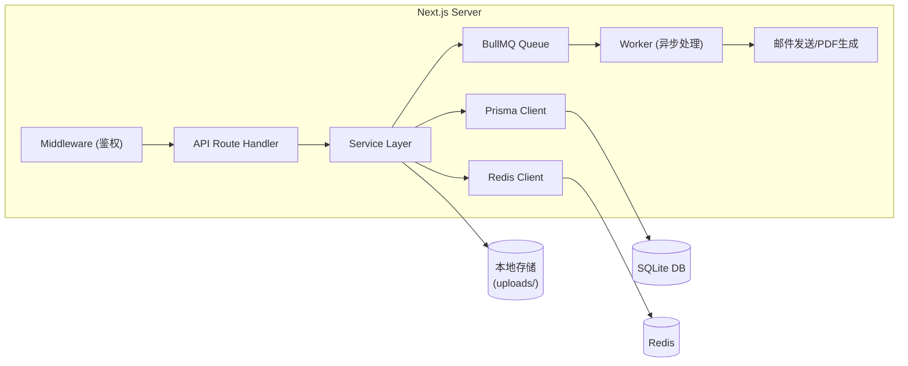
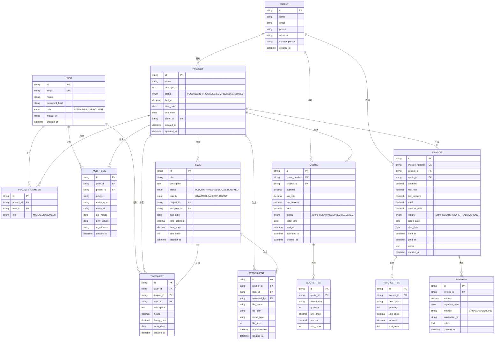

## 1. 架构设计



## 2. 技术描述

### 技术栈选型

| 层级 | 技术 | 版本 | 说明 |
|------|------|------|------|
| 前端框架 | Next.js | ^14.0.0 | App Router，支持 SSR/SSG |
| UI 框架 | React | ^18.2.0 | React 18 并发特性 |
| 样式 | Tailwind CSS | ^3.4.0 | 原子化 CSS |
| 组件库 | shadcn/ui | latest | 基于 Radix UI 的高质量组件 |
| 图标 | lucide-react | ^0.300.0 | 线性图标库 |
| 图表 | recharts | ^2.10.0 | 数据可视化 |
| 拖拽 | @dnd-kit/core | ^6.1.0 | 看板拖拽功能 |
| ORM | Prisma | ^5.8.0 | 类型安全的数据库访问 |
| 数据库 | SQLite | latest | 轻量嵌入式数据库 |
| 认证 | NextAuth.js | ^5.0.0 | 认证鉴权方案 |
| 队列 | BullMQ | ^5.1.0 | Redis 队列，处理异步任务 |
| 缓存/队列存储 | Redis | latest | 内存数据库 |
| 对象存储 | 本地文件系统 | - | uploads 目录存储附件 |
| 日志 | winston | ^3.11.0 | 结构化日志 |
| PDF 生成 | pdfkit | ^0.14.0 | 发票/报价单 PDF 导出 |
| 测试账号 | 种子脚本 | - | prisma/seed.ts 初始化测试数据 |

### 初始化方式

使用 `create-next-app@latest` 初始化，手动配置依赖。

## 3. 路由定义

| 路由 | 权限 | 页面/用途 |
|------|------|----------|
| `/login` | 公开 | 登录页面，含测试账号快捷登录 |
| `/` | 需认证 | 仪表板（数据概览） |
| `/clients` | 管理员/设计师 | 客户列表 |
| `/clients/[id]` | 管理员/设计师 | 客户详情 |
| `/projects` | 需认证 | 项目看板 |
| `/projects/[id]` | 需认证 | 项目详情 |
| `/projects/[id]/tasks/[taskId]` | 需认证 | 任务详情 |
| `/timesheets` | 管理员/设计师 | 工时记录 |
| `/quotes` | 管理员 | 报价单列表 |
| `/quotes/[id]` | 管理员 | 报价单详情 |
| `/invoices` | 管理员 | 发票列表 |
| `/invoices/[id]` | 管理员 | 发票详情 |
| `/payments` | 管理员 | 收款记录 |
| `/reports` | 管理员 | 统计报表 |
| `/portal` | 客户角色 | 客户门户（我的项目） |
| `/portal/projects/[id]` | 客户角色 | 客户查看项目详情 |
| `/api/auth/[...nextauth]` | 公开 | NextAuth 认证接口 |
| `/api/*` | 需认证 + 权限 | 各业务模块 REST API |

## 4. API 定义

### 通用响应格式

```typescript
type ApiResponse<T> = {
  success: boolean;
  data?: T;
  error?: string;
  message?: string;
};
```

### 主要 API 端点

#### 项目 API

```typescript
// GET /api/projects - 获取项目列表（支持筛选）
type GetProjectsQuery = {
  status?: 'PENDING' | 'IN_PROGRESS' | 'COMPLETED' | 'ARCHIVED';
  assigneeId?: string;
  clientId?: string;
  startDateFrom?: string;
  startDateTo?: string;
};

type ProjectResponse = {
  id: string;
  name: string;
  status: string;
  client: { id: string; name: string };
  assignees: { id: string; name: string }[];
  budget: number;
  progress: number;
  dueDate: string;
  createdAt: string;
};

// POST /api/projects - 创建项目
type CreateProjectRequest = {
  name: string;
  description?: string;
  clientId: string;
  budget: number;
  dueDate: string;
  assigneeIds: string[];
};

// PATCH /api/projects/[id] - 更新项目
type UpdateProjectRequest = Partial<CreateProjectRequest> & {
  status?: string;
};
```

#### 任务 API

```typescript
// GET /api/projects/[projectId]/tasks
// POST /api/projects/[projectId]/tasks
// PATCH /api/tasks/[id]
// DELETE /api/tasks/[id]

type TaskResponse = {
  id: string;
  title: string;
  description?: string;
  status: 'TODO' | 'IN_PROGRESS' | 'DONE' | 'BLOCKED';
  priority: 'LOW' | 'MEDIUM' | 'HIGH' | 'URGENT';
  assignee?: { id: string; name: string };
  dueDate?: string;
  timeEstimate?: number;
  timeSpent: number;
};
```

#### 工时 API

```typescript
// POST /api/timesheets - 记录工时
type CreateTimesheetRequest = {
  taskId?: string;
  projectId: string;
  description?: string;
  hours: number;
  date: string;
  hourlyRate?: number;
};

// GET /api/timesheets - 查询工时
type GetTimesheetsQuery = {
  projectId?: string;
  userId?: string;
  dateFrom?: string;
  dateTo?: string;
};
```

#### 发票 API

```typescript
// POST /api/invoices - 创建发票
type CreateInvoiceRequest = {
  projectId: string;
  quoteId?: string;
  items: { description: string; quantity: number; unitPrice: number }[];
  taxRate?: number;
  dueDate: string;
  notes?: string;
};

// GET /api/invoices/[id]/pdf - 导出 PDF
// POST /api/invoices/[id]/send - 发送给客户
// POST /api/invoices/[id]/remind - 发送付款提醒
```

## 5. 服务器架构



### 分层说明

1. **Middleware 层**：路由级鉴权，角色权限校验
2. **API Handler 层**：请求验证、响应格式化、错误处理
3. **Service 层**：业务逻辑、事务控制、权限检查
4. **Repository 层**：通过 Prisma 访问数据库
5. **Queue Worker 层**：异步处理通知、PDF 生成、定时提醒

## 6. 数据模型

### 6.1 ER 图



### 6.2 Prisma Schema 核心定义

```prisma
// 用户
model User {
  id            String    @id @default(cuid())
  email         String    @unique
  name          String
  passwordHash  String
  role          Role      @default(CLIENT)
  avatarUrl     String?
  createdAt     DateTime  @default(now())
  projects      ProjectMember[]
  timesheets    Timesheet[]
  auditLogs     AuditLog[]
}

enum Role {
  ADMIN
  DESIGNER
  CLIENT
}

// 客户
model Client {
  id            String    @id @default(cuid())
  name          String
  email         String?
  phone         String?
  address       String?
  contactPerson String?
  createdAt     DateTime  @default(now())
  projects      Project[]
  invoices      Invoice[]
  quotes        Quote[]
}

// 项目
model Project {
  id          String        @id @default(cuid())
  name        String
  description String?
  status      ProjectStatus @default(PENDING)
  budget      Decimal       @db.Decimal(12, 2)
  startDate   DateTime?
  dueDate     DateTime?
  clientId    String
  client      Client        @relation(fields: [clientId], references: [id])
  members     ProjectMember[]
  tasks       Task[]
  timesheets  Timesheet[]
  quotes      Quote[]
  invoices    Invoice[]
  attachments Attachment[]
  auditLogs   AuditLog[]
  createdAt   DateTime      @default(now())
  updatedAt   DateTime      @updatedAt
}

enum ProjectStatus {
  PENDING
  IN_PROGRESS
  COMPLETED
  ARCHIVED
}
```

## 7. 测试账号

通过 `prisma/seed.ts` 脚本初始化以下测试账号：

| 角色 | 邮箱 | 密码 | 说明 |
|------|------|------|------|
| 管理员 | admin@demo.com | demo123456 | 全部功能权限 |
| 设计师 | designer@demo.com | demo123456 | 任务管理、工时记录 |
| 客户 | client@demo.com | demo123456 | 仅查看自己项目 |

同时会初始化：
- 3 个示例客户
- 5 个示例项目（不同状态）
- 15+ 个示例任务
- 20+ 条工时记录
- 2 个报价单
- 3 张发票（含不同状态）
- 若干附件和审计日志
