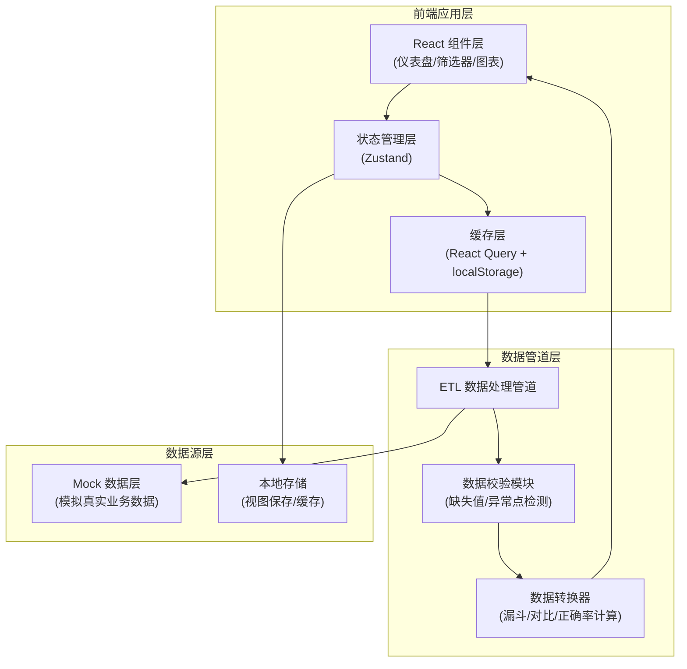

## 1. 架构设计



## 2. 技术选型说明

| 类别 | 技术栈 | 版本 | 选型理由 |
|------|--------|------|----------|
| 前端框架 | React | 18.x | 组件化开发，生态成熟，适合复杂仪表盘交互 |
| 构建工具 | Vite | 5.x | 开发速度快，HMR 体验好 |
| 编程语言 | TypeScript | 5.x | 类型安全，减少数据处理中的 bug |
| 图表库 | Recharts | 2.x | React 原生，定制化能力强，支持漏斗图/雷达图/柱状图 |
| 状态管理 | Zustand | 4.x | 轻量，API 简洁，适合跨组件共享筛选状态 |
| 数据缓存 | @tanstack/react-query | 5.x | 内置缓存/重试/去重，支持时间窗口数据缓存 |
| UI 组件库 | Ant Design | 5.x | 企业级组件，筛选器/表格/抽屉成熟 |
| 样式方案 | TailwindCSS | 3.x | 原子化 CSS，快速构建复杂布局 |
| 工具函数 | Lodash-es | 4.x | 数据处理工具，深拷贝/分组/聚合 |
| 导出功能 | xlsx | 0.18.x | Excel 导出，支持带筛选条件元数据 |

## 3. 目录结构

```
src/
├── components/           # 组件层
│   ├── Dashboard/        # 仪表盘主组件
│   ├── Filters/          # 筛选器组件
│   ├── Charts/           # 图表组件（漏斗/柱状/雷达）
│   ├── Cards/            # KPI 卡片组件
│   ├── Modals/           # 弹窗/抽屉组件
│   └── Common/           # 通用组件
├── hooks/                # 自定义 Hooks
│   ├── useFilterState.ts # 筛选状态管理
│   ├── useETL.ts         # ETL 数据处理
│   ├── useCache.ts       # 缓存策略
│   └── useExport.ts      # 导出功能
├── stores/               # 状态管理
│   ├── filterStore.ts    # 筛选器状态
│   ├── viewStore.ts      # 视图保存状态
│   └── dashboardStore.ts # 仪表盘数据状态
├── data/                 # 数据层
│   ├── mock/             # Mock 数据
│   ├── types.ts          # TypeScript 类型定义
│   └── constants.ts      # 常量配置
├── utils/                # 工具函数
│   ├── etl/              # ETL 管道函数
│   ├── validator.ts      # 数据校验
│   ├── transformer.ts    # 数据转换
│   └── export.ts         # 导出工具
└── App.tsx               # 应用入口
```

## 4. 核心数据模型

### 4.1 TypeScript 类型定义

```typescript
// 学员维度
interface Student {
  id: string;
  name: string;
  cohortId: string;
  isMakeup: boolean; // 是否补课学员
  enrollDate: string;
}

// 学习行为记录
interface LearningActivity {
  id: string;
  studentId: string;
  courseId: string;
  chapterId: string;
  activityType: 'video' | 'homework' | 'quiz' | 'discussion' | 'certificate';
  completedAt: string | null;
  firstCompletedAt: string | null; // 首次完成时间
  score?: number;
  questionId?: string;
}

// 题目数据
interface Question {
  id: string;
  chapterId: string;
  difficulty: 'easy' | 'medium' | 'hard';
  correctRate: number;
  totalAttempts: number;
}

// 筛选条件
interface FilterState {
  courseIds: string[];
  chapterIds: string[];
  studentIds: string[];
  cohortIds: string[];
  questionIds: string[];
  timeRange: {
    start: string;
    end: string;
    preset: 'day' | 'week' | 'month' | 'custom';
  };
}

// 导出元数据
interface ExportMetadata {
  exportAt: string;
  filters: FilterState;
  sampleSize: number;
  dataRange: { start: string; end: string };
}
```

### 4.2 ETL 数据管道设计


**关键处理规则**：
1. **首次完成率去重**：按 `studentId + activityType` 分组，取 `firstCompletedAt` 最早的记录
2. **样本量计算**：每一步聚合后输出样本量，UI 层显示
3. **缺失值标注**：`completedAt` 为 null 时明确标记为未完成，不做默认值填充
4. **异常点检测**：使用 3σ 原则检测完成率异常值，UI 层高亮显示

## 5. 缓存策略

| 缓存层级 | 存储介质 | 缓存 Key | 过期时间 | 适用场景 |
|----------|----------|----------|----------|----------|
| 请求级 | React Query Cache | `['activities', filters.hash]` | 5 分钟 | 相同筛选条件重复访问 |
| 应用级 | localStorage | `view:{viewId}` | 永久 | 保存的用户视图 |
| 会话级 | sessionStorage | `dashboard:lastFilters` | 会话期 | 刷新页面保留筛选条件 |
| 内存级 | Zustand Store | 当前筛选状态 | 实时 | 组件间状态同步 |

## 6. 空数据与异常处理

| 场景 | 处理方式 | UI 表现 |
|------|----------|----------|
| 无筛选结果 | 显示空状态卡片，建议调整筛选条件 | 居中图标 + 提示文字 + 重置按钮 |
| 数据缺失 | 标注「数据缺失」，不展示图表 | 灰色占位 + 缺失说明 |
| 样本量过小 (< 30) | 显示警告提示，结论仅供参考 | 黄色警告标识 + 样本量数字 |
| 异常点 | 高亮显示，hover 显示异常原因 | 红色描边 + 感叹号图标 |

## 7. 核心功能实现要点

### 7.1 学习路径漏斗图
- 使用 Recharts 的自定义 Funnel 组件
- 每个节点显示：人数、转化率、环比变化
- 掉队节点（转化率 < 60%）红色高亮 + 呼吸动画
- 点击节点下钻展示该环节掉队学员列表

### 7.2 班期对比
- 雷达图展示 5 个维度：视频完成率、作业提交率、测验通过率、讨论参与率、证书获取率
- 支持同时选择 2-3 个班期对比
- 选中班期在雷达图中高亮显示

### 7.3 数据导出
- 导出格式：CSV / Excel (.xlsx)
- Excel 文件包含两个 Sheet：
  - Sheet1: 数据明细
  - Sheet2: 筛选条件元数据（导出时间、筛选条件、样本量、数据时间范围）
- 导出前弹窗预览筛选条件，确认后导出

### 7.4 视图管理
- 保存当前所有筛选条件为命名视图
- 视图列表快速切换
- 支持视图重命名、删除
- 存储到 localStorage，换浏览器不丢失
