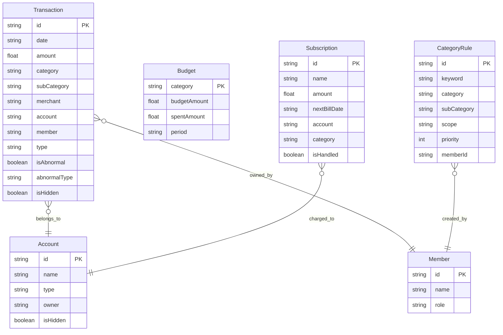

## 1. 架构设计

```mermaid
graph TB
    subgraph "前端层"
        "Vue 3 App" --> "Pinia 状态管理"
        "Pinia 状态管理" --> "筛选状态 Store"
        "Pinia 状态管理" --> "数据状态 Store"
        "Pinia 状态管理" --> "隐私控制 Store"
        "Vue 3 App" --> "D3 图表组件"
        "Vue 3 App" --> "导出模块"
    end

    subgraph "数据服务层"
        "聚合 API 模块" --> "口径配置"
        "聚合 API 模块" --> "清洗脚本"
        "聚合 API 模块" --> "查询缓存 (LRU)"
        "聚合 API 模块" --> "更新时间标记"
    end

    subgraph "数据存储层 (Mock)"
        "Mock ClickHouse" --> "交易明细表"
        "Mock ClickHouse" --> "预算配置表"
        "Mock ClickHouse" --> "分类规则表"
        "Mock Redis" --> "查询缓存"
        "Mock Redis" --> "会话状态"
    end

    "前端层" --> "数据服务层"
    "数据服务层" --> "数据存储层 (Mock)"
```

## 2. 技术说明

- **前端框架**：Vue 3 + Vite + TypeScript
- **状态管理**：Pinia（筛选状态贯穿图表联动与导出）
- **可视化**：D3.js v7（预算进度、分类占比环形图、现金流面积图）
- **样式**：Tailwind CSS 3 + CSS Variables（主题色系统）
- **初始化工具**：create-vue + Vite
- **后端**：前端 Mock 数据层，模拟 ClickHouse + Redis 行为
- **数据库**：Mock 数据（localStorage 持久化），结构对齐 ClickHouse 表设计
- **导出**：jsPDF + PapaParse（CSV/PDF 导出含元信息）

## 3. 路由定义

| 路由 | 用途 |
|------|------|
| `/` | 分析工作台主页，含全部图表与筛选功能 |
| `/rules` | 分类规则管理页，共享规则与个人规则 |

## 4. API 定义

### 4.1 TypeScript 类型定义

```typescript
interface Transaction {
  id: string
  date: string
  amount: number
  category: string
  subCategory: string
  merchant: string
  account: string
  member: string
  type: 'income' | 'expense' | 'subscription' | 'credit_card'
  isAbnormal: boolean
  abnormalType?: 'amount' | 'frequency' | 'merchant'
  isHidden: boolean
}

interface BudgetItem {
  category: string
  budgetAmount: number
  spentAmount: number
  period: string
}

interface Subscription {
  id: string
  name: string
  amount: number
  nextBillDate: string
  account: string
  category: string
  isHandled: boolean
}

interface CategoryRule {
  id: string
  keyword: string
  category: string
  subCategory: string
  scope: 'shared' | 'personal'
  priority: number
  memberId: string
}

interface FilterState {
  accounts: string[]
  categories: string[]
  members: string[]
  months: string[]
  merchants: string[]
  excludeAbnormal: boolean
  hiddenAccounts: string[]
}

interface DataMeta {
  updatedAt: string
  filterSnapshot: FilterState
  sampleSize: number
}

interface CashFlowPoint {
  month: string
  income: number
  expense: number
  net: number
}
```

### 4.2 聚合 API 接口

| 接口 | 方法 | 描述 |
|------|------|------|
| `/api/transactions` | GET | 按筛选条件查询交易明细 |
| `/api/budget-progress` | GET | 预算进度聚合 |
| `/api/category-breakdown` | GET | 分类占比聚合 |
| `/api/cash-flow` | GET | 月度现金流聚合 |
| `/api/subscriptions` | GET | 订阅提醒列表 |
| `/api/abnormal-samples` | GET | 异常样本检测 |
| `/api/rules` | GET/POST/PUT/DELETE | 分类规则 CRUD |
| `/api/meta` | GET | 数据更新时间与样本量 |

## 5. 服务端架构图

```mermaid
graph LR
    "Vue 组件" --> "Composable 层"
    "Composable 层" --> "聚合 API 模块"
    "聚合 API 模块" --> "清洗脚本"
    "清洗脚本" --> "口径配置"
    "聚合 API 模块" --> "查询缓存 (LRU)"
    "聚合 API 模块" --> "更新时间标记"
    "查询缓存 (LRU)" --> "Mock 数据源"
    "口径配置" --> "异常检测规则"
```

## 6. 数据模型

### 6.1 数据模型定义



### 6.2 数据定义语言

```sql
CREATE TABLE transactions (
    id String,
    date Date,
    amount Float64,
    category LowCardinality(String),
    sub_category LowCardinality(String),
    merchant String,
    account LowCardinality(String),
    member LowCardinality(String),
    type Enum8('income'=1, 'expense'=2, 'subscription'=3, 'credit_card'=4),
    is_abnormal UInt8,
    abnormal_type Nullable(String),
    is_hidden UInt8
) ENGINE = MergeTree()
ORDER BY (date, category, member);

CREATE TABLE budgets (
    category String,
    budget_amount Float64,
    spent_amount Float64,
    period String
) ENGINE = ReplaceMergeTree()
ORDER BY (category, period);

CREATE TABLE subscriptions (
    id String,
    name String,
    amount Float64,
    next_bill_date Date,
    account String,
    category String,
    is_handled UInt8
) ENGINE = ReplacingMergeTree()
ORDER BY id;

CREATE TABLE category_rules (
    id String,
    keyword String,
    category String,
    sub_category String,
    scope Enum8('shared'=1, 'personal'=2),
    priority UInt32,
    member_id String
) ENGINE = ReplacingMergeTree()
ORDER BY (scope, priority);
```
