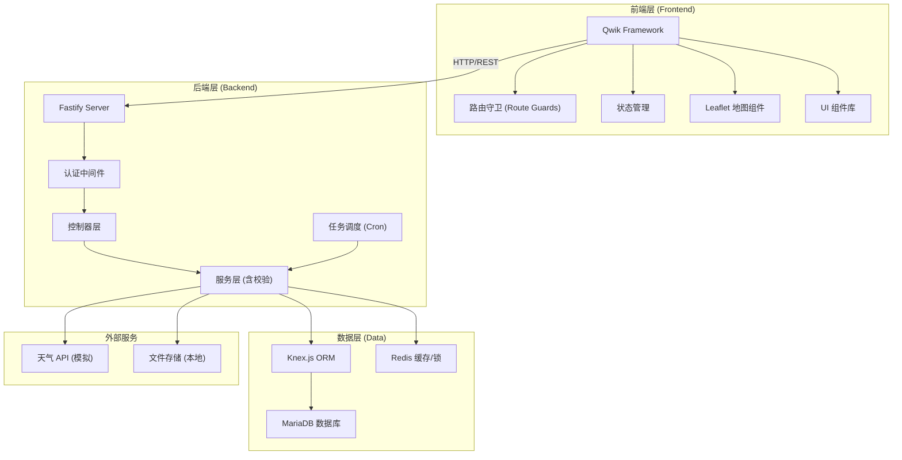
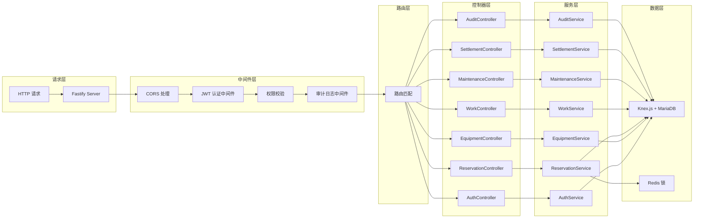
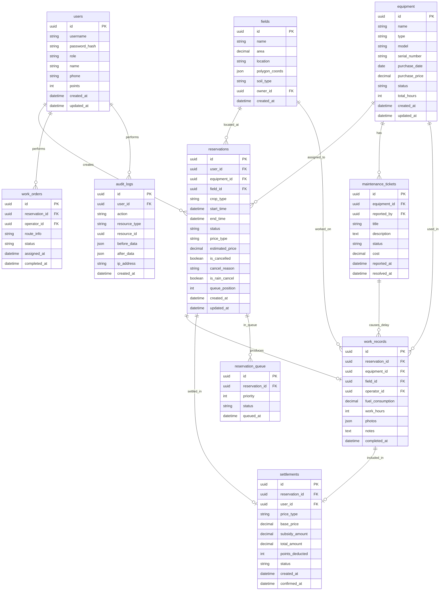

# 农业合作社农机共享平台 - 技术架构文档

## 1. 架构设计



## 2. 技术栈描述

- **前端框架**: Qwik City (基于 Qwik 的全栈框架)
  - 优势：可恢复性、极快的首屏加载、细粒度的响应式
  - 内置路由、数据加载器、服务端渲染
- **状态管理**: Qwik 内置的 useStore / useContext
- **UI 样式**: TailwindCSS 3.x
- **地图组件**: Leaflet + @types/leaflet
- **图表**: Chart.js
- **后端框架**: Fastify 4.x
  - 优势：高性能、插件生态丰富、内置校验
- **数据库**: MariaDB 10.x
- **ORM/查询构建器**: Knex.js
- **缓存/分布式锁**: Redis (用于预约锁定)
- **认证**: JWT (jsonwebtoken)
- **参数校验**: Zod (与 Fastify 集成)
- **任务调度**: node-cron
- **文件上传**: @fastify/multipart

## 3. 项目结构

```
project-root/
├── frontend/                 # Qwik 前端项目
│   ├── src/
│   │   ├── components/       # 可复用组件
│   │   ├── routes/           # 页面路由 (文件路由)
│   │   │   ├── login/
│   │   │   ├── dashboard/
│   │   │   ├── equipment/
│   │   │   ├── fields/
│   │   │   ├── reservations/
│   │   │   ├── work/
│   │   │   ├── maintenance/
│   │   │   ├── settlement/
│   │   │   └── audit/
│   │   ├── guards/           # 路由守卫
│   │   ├── services/         # API 调用服务
│   │   ├── stores/           # 全局状态
│   │   └── types/            # TypeScript 类型定义
│   └── package.json
│
└── backend/                  # Fastify 后端项目
    ├── src/
    │   ├── controllers/      # 控制器层
    │   ├── services/         # 业务逻辑服务层 (含校验)
    │   ├── models/           # 数据模型
    │   ├── plugins/          # Fastify 插件
    │   ├── middleware/       # 中间件
    │   ├── routes/           # 路由定义
    │   ├── utils/            # 工具函数
    │   ├── config/           # 配置文件
    │   └── database/         # 数据库迁移和种子数据
    └── package.json
```

## 4. 路由定义

### 前端路由

| 路由路径 | 页面名称 | 权限要求 |
|---------|---------|----------|
| /login | 登录页 | 公开 |
| /dashboard | 仪表盘 | 所有角色 |
| /equipment | 设备列表 | 所有角色 |
| /equipment/:id | 设备详情 | 所有角色 |
| /fields | 地块地图 | 所有角色 |
| /reservations | 预约列表 | 所有角色 |
| /reservations/new | 新建预约 | 社员/管理员 |
| /work | 作业执行 | 机手/管理员 |
| /maintenance | 维修工单 | 管理员/机手 |
| /settlement | 结算中心 | 管理员/社员 |
| /audit | 审计日志 | 仅管理员 |

### 后端 API 路由

| 方法 | 路径 | 描述 | 权限 |
|-----|------|------|------|
| POST | /api/auth/login | 用户登录 | 公开 |
| GET | /api/auth/me | 获取当前用户 | 已认证 |
| GET | /api/equipment | 获取设备列表 | 已认证 |
| GET | /api/equipment/:id | 获取设备详情 | 已认证 |
| POST | /api/equipment | 创建设备 | 管理员 |
| GET | /api/fields | 获取地块列表 | 已认证 |
| GET | /api/reservations | 获取预约列表 | 已认证 |
| POST | /api/reservations | 创建预约 | 社员/管理员 |
| PUT | /api/reservations/:id | 更新预约 | 已认证 |
| PUT | /api/reservations/:id/cancel | 取消预约 | 已认证 |
| POST | /api/reservations/:id/confirm | 机手确认接单 | 机手/管理员 |
| PUT | /api/work/:id/complete | 完成作业(上传照片/油耗) | 机手/管理员 |
| GET | /api/maintenance | 获取维修工单 | 管理员/机手 |
| POST | /api/maintenance | 创建维修工单 | 管理员/机手 |
| PUT | /api/maintenance/:id | 更新工单状态 | 管理员 |
| GET | /api/settlement | 获取结算列表 | 管理员/社员 |
| POST | /api/settlement/:id/confirm | 确认结算 | 管理员 |
| GET | /api/audit-logs | 获取审计日志 | 管理员 |

## 5. 服务器架构



## 6. 数据模型

### 6.1 ER 图



### 6.2 DDL 语句

```sql
-- 用户表
CREATE TABLE users (
    id CHAR(36) PRIMARY KEY,
    username VARCHAR(50) UNIQUE NOT NULL,
    password_hash VARCHAR(255) NOT NULL,
    role ENUM('member', 'operator', 'admin') NOT NULL,
    name VARCHAR(100) NOT NULL,
    phone VARCHAR(20),
    points INT DEFAULT 100,
    created_at DATETIME DEFAULT CURRENT_TIMESTAMP,
    updated_at DATETIME DEFAULT CURRENT_TIMESTAMP ON UPDATE CURRENT_TIMESTAMP,
    INDEX idx_role (role),
    INDEX idx_username (username)
) ENGINE=InnoDB DEFAULT CHARSET=utf8mb4;

-- 设备表
CREATE TABLE equipment (
    id CHAR(36) PRIMARY KEY,
    name VARCHAR(100) NOT NULL,
    type ENUM('tractor', 'transplanter', 'drone', 'other') NOT NULL,
    model VARCHAR(100),
    serial_number VARCHAR(100) UNIQUE,
    purchase_date DATE,
    purchase_price DECIMAL(12, 2),
    status ENUM('available', 'in_use', 'maintenance', 'broken') DEFAULT 'available',
    total_hours INT DEFAULT 0,
    created_at DATETIME DEFAULT CURRENT_TIMESTAMP,
    updated_at DATETIME DEFAULT CURRENT_TIMESTAMP ON UPDATE CURRENT_TIMESTAMP,
    INDEX idx_type (type),
    INDEX idx_status (status)
) ENGINE=InnoDB DEFAULT CHARSET=utf8mb4;

-- 地块表
CREATE TABLE fields (
    id CHAR(36) PRIMARY KEY,
    name VARCHAR(100) NOT NULL,
    area DECIMAL(10, 2) NOT NULL COMMENT '面积(亩)',
    location VARCHAR(255),
    polygon_coords JSON COMMENT '多边形坐标',
    soil_type VARCHAR(50),
    owner_id CHAR(36),
    created_at DATETIME DEFAULT CURRENT_TIMESTAMP,
    FOREIGN KEY (owner_id) REFERENCES users(id),
    INDEX idx_owner (owner_id)
) ENGINE=InnoDB DEFAULT CHARSET=utf8mb4;

-- 预约表
CREATE TABLE reservations (
    id CHAR(36) PRIMARY KEY,
    user_id CHAR(36) NOT NULL,
    equipment_id CHAR(36) NOT NULL,
    field_id CHAR(36) NOT NULL,
    crop_type VARCHAR(50),
    start_time DATETIME NOT NULL,
    end_time DATETIME NOT NULL,
    status ENUM('pending', 'confirmed', 'in_progress', 'completed', 'cancelled', 'queued') DEFAULT 'pending',
    price_type ENUM('self_use', 'cooperative_subsidy', 'cross_village') NOT NULL,
    estimated_price DECIMAL(12, 2),
    is_cancelled BOOLEAN DEFAULT FALSE,
    cancel_reason TEXT,
    is_rain_cancel BOOLEAN DEFAULT FALSE,
    queue_position INT,
    created_at DATETIME DEFAULT CURRENT_TIMESTAMP,
    updated_at DATETIME DEFAULT CURRENT_TIMESTAMP ON UPDATE CURRENT_TIMESTAMP,
    FOREIGN KEY (user_id) REFERENCES users(id),
    FOREIGN KEY (equipment_id) REFERENCES equipment(id),
    FOREIGN KEY (field_id) REFERENCES fields(id),
    INDEX idx_equipment_time (equipment_id, start_time, end_time),
    INDEX idx_user (user_id),
    INDEX idx_status (status)
) ENGINE=InnoDB DEFAULT CHARSET=utf8mb4;

-- 工单表
CREATE TABLE work_orders (
    id CHAR(36) PRIMARY KEY,
    reservation_id CHAR(36) NOT NULL,
    operator_id CHAR(36) NOT NULL,
    route_info JSON,
    status ENUM('assigned', 'accepted', 'in_progress', 'completed') DEFAULT 'assigned',
    assigned_at DATETIME DEFAULT CURRENT_TIMESTAMP,
    completed_at DATETIME,
    FOREIGN KEY (reservation_id) REFERENCES reservations(id),
    FOREIGN KEY (operator_id) REFERENCES users(id),
    INDEX idx_operator (operator_id),
    INDEX idx_status (status)
) ENGINE=InnoDB DEFAULT CHARSET=utf8mb4;

-- 作业记录表
CREATE TABLE work_records (
    id CHAR(36) PRIMARY KEY,
    reservation_id CHAR(36) NOT NULL,
    equipment_id CHAR(36) NOT NULL,
    field_id CHAR(36) NOT NULL,
    operator_id CHAR(36) NOT NULL,
    fuel_consumption DECIMAL(8, 2) COMMENT '油耗(升)',
    work_hours DECIMAL(4, 1),
    photos JSON COMMENT '照片URL列表',
    notes TEXT,
    completed_at DATETIME DEFAULT CURRENT_TIMESTAMP,
    FOREIGN KEY (reservation_id) REFERENCES reservations(id),
    FOREIGN KEY (equipment_id) REFERENCES equipment(id),
    FOREIGN KEY (field_id) REFERENCES fields(id),
    FOREIGN KEY (operator_id) REFERENCES users(id),
    INDEX idx_equipment (equipment_id),
    INDEX idx_completed_at (completed_at)
) ENGINE=InnoDB DEFAULT CHARSET=utf8mb4;

-- 维修工单表
CREATE TABLE maintenance_tickets (
    id CHAR(36) PRIMARY KEY,
    equipment_id CHAR(36) NOT NULL,
    reported_by CHAR(36) NOT NULL,
    title VARCHAR(200) NOT NULL,
    description TEXT,
    status ENUM('open', 'in_progress', 'resolved', 'closed') DEFAULT 'open',
    cost DECIMAL(12, 2) DEFAULT 0,
    reported_at DATETIME DEFAULT CURRENT_TIMESTAMP,
    resolved_at DATETIME,
    FOREIGN KEY (equipment_id) REFERENCES equipment(id),
    FOREIGN KEY (reported_by) REFERENCES users(id),
    INDEX idx_equipment (equipment_id),
    INDEX idx_status (status)
) ENGINE=InnoDB DEFAULT CHARSET=utf8mb4;

-- 结算表
CREATE TABLE settlements (
    id CHAR(36) PRIMARY KEY,
    reservation_id CHAR(36) NOT NULL,
    user_id CHAR(36) NOT NULL,
    price_type ENUM('self_use', 'cooperative_subsidy', 'cross_village') NOT NULL,
    base_price DECIMAL(12, 2) NOT NULL,
    subsidy_amount DECIMAL(12, 2) DEFAULT 0,
    total_amount DECIMAL(12, 2) NOT NULL,
    points_deducted INT DEFAULT 0,
    status ENUM('pending', 'confirmed', 'paid') DEFAULT 'pending',
    created_at DATETIME DEFAULT CURRENT_TIMESTAMP,
    confirmed_at DATETIME,
    FOREIGN KEY (reservation_id) REFERENCES reservations(id),
    FOREIGN KEY (user_id) REFERENCES users(id),
    INDEX idx_user (user_id),
    INDEX idx_status (status)
) ENGINE=InnoDB DEFAULT CHARSET=utf8mb4;

-- 审计日志表
CREATE TABLE audit_logs (
    id CHAR(36) PRIMARY KEY,
    user_id CHAR(36),
    action VARCHAR(100) NOT NULL,
    resource_type VARCHAR(50) NOT NULL,
    resource_id CHAR(36),
    before_data JSON,
    after_data JSON,
    ip_address VARCHAR(50),
    created_at DATETIME DEFAULT CURRENT_TIMESTAMP,
    INDEX idx_user (user_id),
    INDEX idx_action (action),
    INDEX idx_created_at (created_at)
) ENGINE=InnoDB DEFAULT CHARSET=utf8mb4;

-- 预约队列表
CREATE TABLE reservation_queue (
    id CHAR(36) PRIMARY KEY,
    reservation_id CHAR(36) NOT NULL,
    priority INT DEFAULT 0,
    status ENUM('waiting', 'promoted', 'cancelled') DEFAULT 'waiting',
    queued_at DATETIME DEFAULT CURRENT_TIMESTAMP,
    FOREIGN KEY (reservation_id) REFERENCES reservations(id),
    INDEX idx_status (status)
) ENGINE=InnoDB DEFAULT CHARSET=utf8mb4;
```

## 7. 核心业务逻辑说明

### 7.1 预约锁定机制
- 使用 Redis 分布式锁防止并发预约冲突
- 提交预约时：锁定设备时段 → 检查冲突 → 创建预约记录 → 释放锁
- 锁超时时间：30秒

### 7.2 价格计算规则
| 价格类型 | 计算方式 |
|---------|---------|
| 社员自用 | 基础价格 × 0.7 |
| 合作社补贴 | 基础价格 × 0.5 (合作社补贴50%) |
| 跨村租赁 | 基础价格 × 1.3 (溢价30%) |

### 7.3 雨天取消机制
- 定时任务每小时检查未来24小时预约
- 调用天气API (模拟) 查询降雨概率
- 降雨概率 > 70% 自动取消，不扣积分
- 自动通知相关社员和机手

### 7.4 设备故障重排
- 设备标记为故障时，查询该设备相关待执行预约
- 按预约时间优先级，将排队中的预约依次提升
- 创建维修工单，通知维修人员
