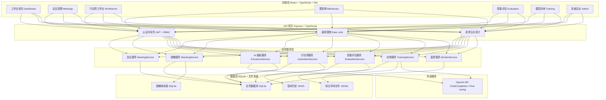
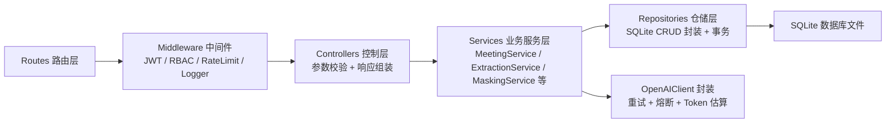

## 1. 架构设计



---

## 2. 技术说明

- **前端**：React@18 + TypeScript + Vite + TailwindCSS@3 + Zustand（状态管理）+ React Router DOM@6 + Lucide React（图标）+ ECharts（图表）
- **初始化工具**：vite-init 模板 `react-express-ts`
- **后端**：Express@4 + TypeScript + ESM
- **数据库**：SQLite（better-sqlite3），文件式存储，无需外部依赖，便于演示与部署
- **AI 集成**：OpenAI Node.js SDK v4，支持 Chat Completion（抽取）+ Fine-tuning（重新训练）

---

## 3. 路由定义

| 路由路径 | 页面名称 | 说明 |
|---------|---------|------|
| `/` | 工作台首页 | 统计概览、待确认列表、风险提示 |
| `/meetings` | 会议管理列表 | 会议列表、新建、搜索、筛选 |
| `/meetings/:id` | 会议详情 | 转写时间轴、议题卡片、行动项入口 |
| `/workbench` | 行动项工作台 | 并排 AI 建议 + 人工改标、批量操作、历史版本 |
| `/milestones` | 项目里程碑 | 看板视图、进度追踪 |
| `/evaluation` | 质量评估中心 | 指标看板、评估集、标注界面 |
| `/training` | 模型与训练中心 | 样本导出、训练版本、A/B 对比 |
| `/admin/users` | 用户管理 | RBAC 角色分配 |
| `/admin/masking` | 脱敏规则配置 | 正则、敏感词库 |
| `/admin/monitor` | 调用监控 | API 用量、速率限制 |
| `/login` | 登录页 | 邮箱+密码登录 |

---

## 4. API 定义

### 4.1 类型定义

```typescript
// ============ 共享类型 shared/types.ts ============

export type Role = 'admin' | 'manager' | 'reviewer' | 'member';

export type ActionItemStatus =
  | 'draft'        // AI 刚抽取
  | 'pending'      // 待确认
  | 'confirmed'    // 已确认
  | 'assigned'     // 已分配负责人
  | 'in_progress'  // 执行中
  | 'completed'    // 已完成
  | 'cancelled';   // 已取消

export type ConfidenceLevel = 'high' | 'medium' | 'low' | 'unknown';

export interface Speaker {
  id: string;
  name: string;
  role?: string;
  color: string;
}

export interface TranscriptSegment {
  id: string;
  speakerId: string;
  startTime: string;   // "00:01:23"
  endTime?: string;
  text: string;        // 脱敏后的文本
  originalText?: string; // 原始文本（权限受控）
}

export interface EvidenceSpan {
  segmentId: string;   // 对应转写段落 id
  startChar: number;   // 段内字符起始位置
  endChar: number;     // 段内字符结束位置
  quotedText: string;  // 原文引用（脱敏后）
}

export interface FieldConfidence {
  field: 'content' | 'assignee' | 'dueDate' | 'topic' | 'milestone' | 'priority';
  confidence: number;  // 0-1
  level: ConfidenceLevel;
  reason?: string;     // 低置信度原因或缺失说明
}

export interface ActionItem {
  id: string;
  meetingId: string;
  content: string;
  assignee: string | null;      // 负责人，模型不确定时为 null
  assigneeStatus: 'confirmed' | 'pending_assignment' | 'ai_suggested';
  dueDate: string | null;       // ISO date，不确定为 null
  topic: string | null;         // 议题
  milestoneId: string | null;
  priority: 'P0' | 'P1' | 'P2' | 'P3';
  status: ActionItemStatus;
  fieldConfidences: FieldConfidence[];
  evidence: EvidenceSpan[];     // 模型输出证据，回到原始样本
  modelVersion: string;
  aiRaw?: unknown;              // 模型原始 JSON（调试用）
  missingFields: string[];      // 数据缺失字段清单
  lowConfidenceFields: string[];// 低置信度字段清单
  remarks: string;              // 人工备注
  version: number;              // 版本号，用于回滚
  createdAt: string;
  updatedAt: string;
  updatedBy: string;
}

export interface VersionHistory {
  id: string;
  actionItemId: string;
  version: number;
  snapshot: Partial<ActionItem>;
  diff: Record<string, { old: unknown; new: unknown }>;
  operatorId: string;
  operatorName: string;
  timestamp: string;
  remark?: string;
}

export interface Meeting {
  id: string;
  title: string;
  date: string;
  projectId: string;
  speakers: Speaker[];
  topics: string[];
  transcript: TranscriptSegment[];
  maskingApplied: boolean;
  status: 'created' | 'extracting' | 'extracted' | 'failed';
  extractionError?: string;
  createdAt: string;
  createdBy: string;
}

export interface ApiCallLog {
  id: string;
  endpoint: string;
  model: string;
  promptTokens: number;
  completionTokens: number;
  totalTokens: number;
  latencyMs: number;
  statusCode: number;
  errorMessage?: string;
  userId: string;
  timestamp: string;
}

export interface MaskingRule {
  id: string;
  name: string;
  type: 'regex' | 'keyword';
  pattern: string;     // regex 模式或关键字
  replacement: string; // 例如 "{{EMAIL}}"
  enabled: boolean;
}

export interface MaskingMapEntry {
  id: string;
  meetingId: string;
  maskedToken: string;
  originalValue: string;
  ruleId: string;
  createdAt: string;
}
```

### 4.2 RESTful API 列表

| 方法 | 路径 | 权限 | 说明 |
|------|------|------|------|
| POST | `/api/auth/login` | 公开 | 登录获取 JWT |
| GET | `/api/meetings` | 全员 | 会议列表（分页+筛选） |
| POST | `/api/meetings` | manager+ | 创建会议并导入转写 |
| GET | `/api/meetings/:id` | 全员 | 会议详情（含脱敏转写） |
| POST | `/api/meetings/:id/extract` | manager+ | 触发 AI 行动项抽取 |
| GET | `/api/action-items` | 全员 | 行动项列表（按状态/会议筛选） |
| PATCH | `/api/action-items/:id` | reviewer+ | 修改单个行动项（产生版本） |
| POST | `/api/action-items/batch-confirm` | manager+ | 批量确认 |
| POST | `/api/action-items/batch-assign` | manager+ | 批量分配负责人 |
| GET | `/api/action-items/:id/history` | 全员 | 获取历史版本列表 |
| POST | `/api/action-items/:id/rollback` | reviewer+ | 回滚到指定版本 |
| GET | `/api/milestones` | 全员 | 里程碑列表 |
| POST | `/api/milestones` | manager+ | 创建里程碑 |
| GET | `/api/evaluation/report` | reviewer+ | 生成评估报告（Precision/Recall/F1） |
| POST | `/api/evaluation/export-jsonl` | reviewer+ | 导出 Fine-tuning JSONL 样本 |
| POST | `/api/training/fine-tune` | admin | 发起 OpenAI Fine-tuning 任务 |
| GET | `/api/training/versions` | admin | 模型版本列表 |
| PATCH | `/api/training/versions/:id/activate` | admin | 切换生产模型版本 |
| GET | `/api/admin/users` | admin | 用户列表 |
| PATCH | `/api/admin/users/:id/role` | admin | 分配角色 |
| GET | `/api/admin/masking-rules` | admin | 脱敏规则列表 |
| PUT | `/api/admin/masking-rules/:id` | admin | 更新脱敏规则 |
| GET | `/api/admin/monitor/api-logs` | admin | API 调用日志统计 |
| POST | `/api/samples/seed` | admin | 注入内置样本集（演示用） |

---

## 5. 服务端分层架构



---

## 6. 数据模型

### 6.1 ER 图

```mermaid
erDiagram
    USERS ||--o{ MEETINGS : creates
    USERS ||--o{ ACTION_ITEMS : updates
    USERS ||--o{ VERSION_HISTORY : operates
    USERS {
        string id PK
        string email UK
        string name
        string role
        string password_hash
        datetime created_at
    }
    MEETINGS ||--|{ TRANSCRIPT_SEGMENTS : contains
    MEETINGS ||--o{ ACTION_ITEMS : has
    MEETINGS ||--o{ MASKING_MAP_ENTRIES : has
    MEETINGS {
        string id PK
        string title
        datetime meeting_date
        string project_id
        string speakers_json
        string topics_json
        string status
        string extraction_error
        boolean masking_applied
        string created_by FK
        datetime created_at
    }
    TRANSCRIPT_SEGMENTS {
        string id PK
        string meeting_id FK
        string speaker_id
        string start_time
        string end_time
        string text
        string original_text
        int char_offset
    }
    ACTION_ITEMS ||--o{ VERSION_HISTORY : tracks
    ACTION_ITEMS {
        string id PK
        string meeting_id FK
        string content
        string assignee
        string assignee_status
        date due_date
        string topic
        string milestone_id
        string priority
        string status
        string field_confidences_json
        string evidence_json
        string model_version
        string missing_fields_json
        string low_confidence_fields_json
        string remarks
        int version
        string updated_by FK
        datetime created_at
        datetime updated_at
    }
    VERSION_HISTORY {
        string id PK
        string action_item_id FK
        int version
        string snapshot_json
        string diff_json
        string operator_id FK
        string operator_name
        string remark
        datetime timestamp
    }
    MASKING_RULES {
        string id PK
        string name
        string type
        string pattern
        string replacement
        boolean enabled
    }
    MASKING_MAP_ENTRIES {
        string id PK
        string meeting_id FK
        string masked_token
        string original_value
        string rule_id FK
        datetime created_at
    }
    API_CALL_LOGS {
        string id PK
        string endpoint
        string model
        int prompt_tokens
        int completion_tokens
        int total_tokens
        int latency_ms
        int status_code
        string error_message
        string user_id FK
        datetime timestamp
    }
    MODEL_VERSIONS {
        string id PK
        string name
        string openai_finetune_id
        string base_model
        string status
        boolean is_active
        string metrics_json
        datetime created_at
    }
    EVALUATION_SAMPLES {
        string id PK
        string meeting_id FK
        string action_item_id FK
        string source "ai" or "human"
        string payload_json
        int quality_score
        datetime created_at
    }
```

### 6.2 DDL 语句

```sql
-- users
CREATE TABLE users (
  id TEXT PRIMARY KEY,
  email TEXT UNIQUE NOT NULL,
  name TEXT NOT NULL,
  role TEXT NOT NULL CHECK(role IN ('admin','manager','reviewer','member')),
  password_hash TEXT NOT NULL,
  created_at TEXT NOT NULL
);

-- meetings
CREATE TABLE meetings (
  id TEXT PRIMARY KEY,
  title TEXT NOT NULL,
  meeting_date TEXT NOT NULL,
  project_id TEXT NOT NULL,
  speakers_json TEXT NOT NULL DEFAULT '[]',
  topics_json TEXT NOT NULL DEFAULT '[]',
  status TEXT NOT NULL DEFAULT 'created' CHECK(status IN ('created','extracting','extracted','failed')),
  extraction_error TEXT,
  masking_applied INTEGER NOT NULL DEFAULT 0,
  created_by TEXT NOT NULL REFERENCES users(id),
  created_at TEXT NOT NULL
);
CREATE INDEX idx_meetings_project ON meetings(project_id);
CREATE INDEX idx_meetings_status ON meetings(status);

-- transcript_segments
CREATE TABLE transcript_segments (
  id TEXT PRIMARY KEY,
  meeting_id TEXT NOT NULL REFERENCES meetings(id) ON DELETE CASCADE,
  speaker_id TEXT NOT NULL,
  start_time TEXT,
  end_time TEXT,
  text TEXT NOT NULL,
  original_text TEXT,
  char_offset INTEGER NOT NULL DEFAULT 0
);
CREATE INDEX idx_segments_meeting ON transcript_segments(meeting_id);

-- action_items
CREATE TABLE action_items (
  id TEXT PRIMARY KEY,
  meeting_id TEXT NOT NULL REFERENCES meetings(id) ON DELETE CASCADE,
  content TEXT NOT NULL,
  assignee TEXT,
  assignee_status TEXT NOT NULL DEFAULT 'pending_assignment',
  due_date TEXT,
  topic TEXT,
  milestone_id TEXT,
  priority TEXT NOT NULL DEFAULT 'P2' CHECK(priority IN ('P0','P1','P2','P3')),
  status TEXT NOT NULL DEFAULT 'draft',
  field_confidences_json TEXT NOT NULL DEFAULT '[]',
  evidence_json TEXT NOT NULL DEFAULT '[]',
  model_version TEXT NOT NULL,
  missing_fields_json TEXT NOT NULL DEFAULT '[]',
  low_confidence_fields_json TEXT NOT NULL DEFAULT '[]',
  remarks TEXT NOT NULL DEFAULT '',
  version INTEGER NOT NULL DEFAULT 1,
  updated_by TEXT NOT NULL REFERENCES users(id),
  created_at TEXT NOT NULL,
  updated_at TEXT NOT NULL
);
CREATE INDEX idx_actionitems_meeting ON action_items(meeting_id);
CREATE INDEX idx_actionitems_status ON action_items(status);
CREATE INDEX idx_actionitems_assignee ON action_items(assignee);

-- version_history
CREATE TABLE version_history (
  id TEXT PRIMARY KEY,
  action_item_id TEXT NOT NULL REFERENCES action_items(id) ON DELETE CASCADE,
  version INTEGER NOT NULL,
  snapshot_json TEXT NOT NULL,
  diff_json TEXT NOT NULL,
  operator_id TEXT NOT NULL REFERENCES users(id),
  operator_name TEXT NOT NULL,
  remark TEXT,
  timestamp TEXT NOT NULL
);
CREATE INDEX idx_versionhistory_item ON version_history(action_item_id);

-- masking_rules
CREATE TABLE masking_rules (
  id TEXT PRIMARY KEY,
  name TEXT NOT NULL,
  type TEXT NOT NULL CHECK(type IN ('regex','keyword')),
  pattern TEXT NOT NULL,
  replacement TEXT NOT NULL,
  enabled INTEGER NOT NULL DEFAULT 1
);

-- masking_map_entries
CREATE TABLE masking_map_entries (
  id TEXT PRIMARY KEY,
  meeting_id TEXT NOT NULL REFERENCES meetings(id) ON DELETE CASCADE,
  masked_token TEXT NOT NULL,
  original_value TEXT NOT NULL,
  rule_id TEXT REFERENCES masking_rules(id),
  created_at TEXT NOT NULL
);
CREATE INDEX idx_masking_meeting ON masking_map_entries(meeting_id);

-- api_call_logs
CREATE TABLE api_call_logs (
  id TEXT PRIMARY KEY,
  endpoint TEXT NOT NULL,
  model TEXT NOT NULL,
  prompt_tokens INTEGER NOT NULL DEFAULT 0,
  completion_tokens INTEGER NOT NULL DEFAULT 0,
  total_tokens INTEGER NOT NULL DEFAULT 0,
  latency_ms INTEGER NOT NULL,
  status_code INTEGER NOT NULL,
  error_message TEXT,
  user_id TEXT REFERENCES users(id),
  timestamp TEXT NOT NULL
);
CREATE INDEX idx_apilogs_time ON api_call_logs(timestamp);
CREATE INDEX idx_apilogs_model ON api_call_logs(model);

-- model_versions
CREATE TABLE model_versions (
  id TEXT PRIMARY KEY,
  name TEXT NOT NULL,
  openai_finetune_id TEXT,
  base_model TEXT NOT NULL,
  status TEXT NOT NULL DEFAULT 'pending',
  is_active INTEGER NOT NULL DEFAULT 0,
  metrics_json TEXT,
  created_at TEXT NOT NULL
);

-- evaluation_samples
CREATE TABLE evaluation_samples (
  id TEXT PRIMARY KEY,
  meeting_id TEXT REFERENCES meetings(id),
  action_item_id TEXT REFERENCES action_items(id),
  source TEXT NOT NULL CHECK(source IN ('ai','human')),
  payload_json TEXT NOT NULL,
  quality_score INTEGER,
  created_at TEXT NOT NULL
);
```

### 6.3 初始化数据

```sql
-- 初始化脱敏规则
INSERT INTO masking_rules (id, name, type, pattern, replacement, enabled) VALUES
('rule_email',   '邮箱地址', 'regex',   '[a-zA-Z0-9._%+-]+@[a-zA-Z0-9.-]+\.[a-zA-Z]{2,}', '{{EMAIL}}', 1),
('rule_phone',   '手机号码', 'regex',   '1[3-9]\d{9}', '{{PHONE}}', 1),
('rule_idcard',  '身份证号', 'regex',   '\d{17}[\dXx]', '{{ID_CARD}}', 1),
('rule_bank',    '银行账号', 'regex',   '\d{16,19}', '{{BANK_ACCOUNT}}', 1),
('rule_secret',  '关键字-机密', 'keyword', '机密|敏感|绝密|薪资|工资', '{{CONFIDENTIAL}}', 1);

-- 初始化用户（密码均为 123456，对应 bcrypt hash）
INSERT INTO users (id, email, name, role, password_hash, created_at) VALUES
('user_admin',    'admin@demo.com',    '系统管理员-王五', 'admin',    '$2a$10$N9qo8uLOickgx2ZMRZoMyeIjZAgcfl7p92ldGxad68LJZdL17lhWy', '2025-01-01T00:00:00Z'),
('user_manager',  'manager@demo.com',  '项目经理-李明',   'manager',  '$2a$10$N9qo8uLOickgx2ZMRZoMyeIjZAgcfl7p92ldGxad68LJZdL17lhWy', '2025-01-01T00:00:00Z'),
('user_reviewer', 'reviewer@demo.com', '审核员-陈静',     'reviewer', '$2a$10$N9qo8uLOickgx2ZMRZoMyeIjZAgcfl7p92ldGxad68LJZdL17lhWy', '2025-01-01T00:00:00Z'),
('user_member1',  'zhangsan@demo.com', '成员-张三',       'member',   '$2a$10$N9qo8uLOickgx2ZMRZoMyeIjZAgcfl7p92ldGxad68LJZdL17lhWy', '2025-01-01T00:00:00Z'),
('user_member2',  'zhaoliu@demo.com',  '成员-赵六',       'member',   '$2a$10$N9qo8uLOickgx2ZMRZoMyeIjZAgcfl7p92ldGxad68LJZdL17lhWy', '2025-01-01T00:00:00Z');

-- 默认模型版本
INSERT INTO model_versions (id, name, openai_finetune_id, base_model, status, is_active, metrics_json, created_at) VALUES
('mv_default', 'gpt-4o-mini 默认版', NULL, 'gpt-4o-mini', 'ready', 1, '{"precision":0.78,"recall":0.72,"f1":0.75}', '2025-01-01T00:00:00Z');
```
