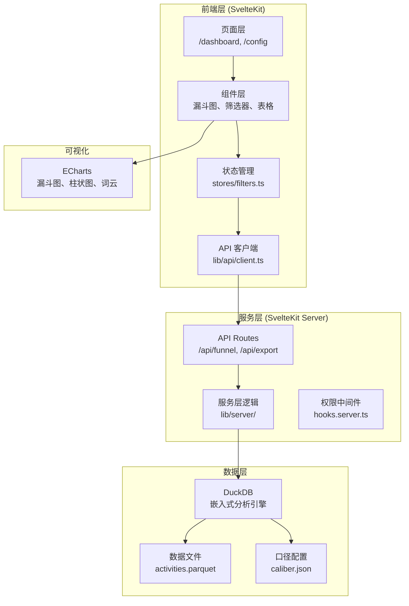
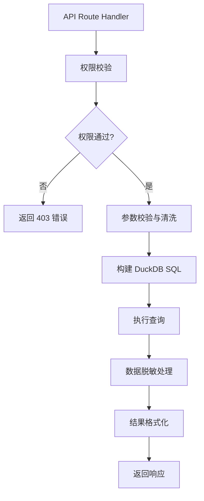
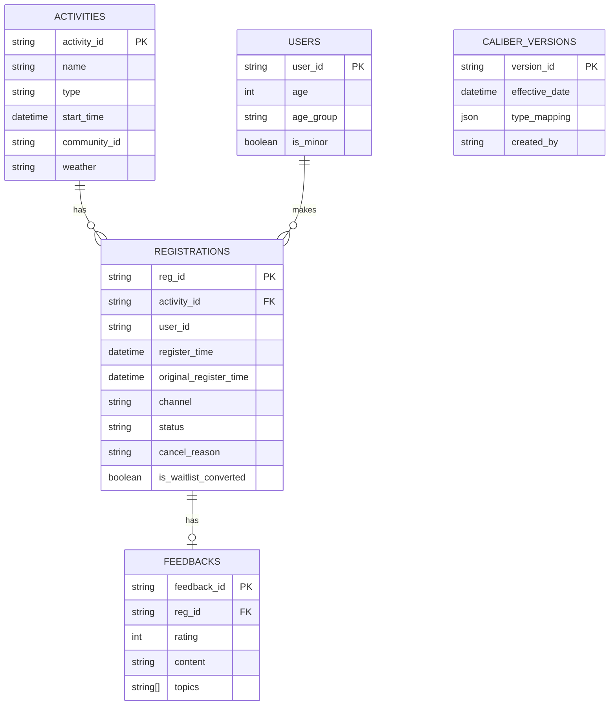

## 1. 架构设计



## 2. 技术栈说明

- **前端框架**：SvelteKit@2（全栈框架，服务端渲染 + 客户端交互）
- **可视化库**：ECharts@5（漏斗图、柱状图、词云展示）
- **数据引擎**：DuckDB@1（嵌入式 OLAP，高性能分析查询）
- **样式方案**：TailwindCSS@3（原子化 CSS）
- **数据格式**：Parquet（列式存储，高效压缩）
- **包管理器**：pnpm

## 3. 路由定义

| 路由 | 用途 | 权限 |
|------|------|------|
| / | 首页重定向到仪表盘 | 公开 |
| /dashboard | 漏斗分析主页面 | 需登录 |
| /config/caliber | 活动口径配置页面 | 管理员 |
| /api/funnel | 获取漏斗数据 | 需登录 |
| /api/activities | 获取活动列表 | 需登录 |
| /api/export | 数据导出接口 | 权限校验 |
| /api/caliber | 口径配置 CRUD | 管理员 |

## 4. API 定义

### 4.1 漏斗数据接口

**POST /api/funnel**

请求体：
```typescript
interface FunnelRequest {
  startDate: string;
  endDate: string;
  activityTypes: string[];
  communities: string[];
  ageGroups: string[];
  channels: string[];
  weather: string[];
  caliberVersion: string; // 口径版本号，'latest' 或具体版本
}
```

响应体：
```typescript
interface FunnelResponse {
  funnel: {
    stage: 'browse' | 'register' | 'checkin' | 'cancel' | 'feedback';
    name: string;
    count: number;
    rate: number; // 相对于上一层的转化率
    totalRate: number; // 相对于浏览的总转化率
  }[];
  byActivityType: { name: string; funnel: number[] }[];
  sampleSize: number;
  hasMinorData: boolean;
}
```

### 4.2 导出接口

**POST /api/export**

请求体同漏斗接口，附加：
```typescript
interface ExportRequest extends FunnelRequest {
  format: 'csv' | 'xlsx';
  includeDetails: boolean; // 是否包含明细（需管理员权限）
  exportType: 'aggregated' | 'detailed';
}
```

响应：文件流下载

## 5. 服务端架构



## 6. 数据模型

### 6.1 ER 图



### 6.2 DuckDB 表创建语句

```sql
-- 活动表
CREATE TABLE activities (
    activity_id VARCHAR PRIMARY KEY,
    name VARCHAR,
    type VARCHAR,
    start_time TIMESTAMP,
    community_id VARCHAR,
    community_name VARCHAR,
    weather VARCHAR
);

-- 注册表（含候补逻辑）
CREATE TABLE registrations (
    reg_id VARCHAR PRIMARY KEY,
    activity_id VARCHAR,
    user_id VARCHAR,
    register_time TIMESTAMP,
    original_register_time TIMESTAMP, -- 候补转正时保留原始报名时间
    channel VARCHAR,
    status VARCHAR, -- 'registered', 'checked_in', 'cancelled', 'waitlist'
    cancel_reason VARCHAR,
    cancel_reason_tag VARCHAR,
    is_waitlist_converted BOOLEAN DEFAULT false,
    checkin_time TIMESTAMP
);

-- 用户表（脱敏存储）
CREATE TABLE users (
    user_id VARCHAR PRIMARY KEY,
    age INTEGER,
    age_group VARCHAR,
    is_minor BOOLEAN
);

-- 反馈表
CREATE TABLE feedbacks (
    feedback_id VARCHAR PRIMARY KEY,
    reg_id VARCHAR,
    rating INTEGER,
    content VARCHAR,
    topics VARCHAR[] -- 主题标签数组
);

-- 口径版本表
CREATE TABLE caliber_versions (
    version_id VARCHAR PRIMARY KEY,
    version_name VARCHAR,
    effective_date TIMESTAMP,
    type_mapping JSON, -- { oldType: newType } 映射关系
    created_at TIMESTAMP DEFAULT CURRENT_TIMESTAMP,
    created_by VARCHAR,
    is_active BOOLEAN DEFAULT true
);
```

### 6.3 核心查询逻辑

**候补转正时间计算**：
```sql
-- 关键：使用 original_register_time 而非 register_time 计算转化
SELECT 
    DATE_TRUNC('day', original_register_time) as reg_date,
    COUNT(*) as registrations
FROM registrations
WHERE status IN ('registered', 'checked_in')
GROUP BY 1
ORDER BY 1;
```

**口径切换查询**：
```sql
WITH caliber_mapping AS (
    SELECT type_mapping FROM caliber_versions 
    WHERE version_id = $1 OR is_active = true
)
SELECT 
    COALESCE(
        (cm.type_mapping->>a.type)::VARCHAR,
        a.type
    ) as activity_type,
    COUNT(*) as count
FROM activities a
LEFT JOIN caliber_mapping cm ON true
GROUP BY 1;
```

**未成年人数据聚合**：
```sql
-- 禁止导出 individual 级别未成年人数据
SELECT 
    age_group,
    COUNT(*) as count,
    AVG(CASE WHEN status = 'checked_in' THEN 1 ELSE 0 END) as checkin_rate
FROM registrations r
JOIN users u ON r.user_id = u.user_id
GROUP BY age_group
-- 结果只返回聚合数据，不含 user_id
```
