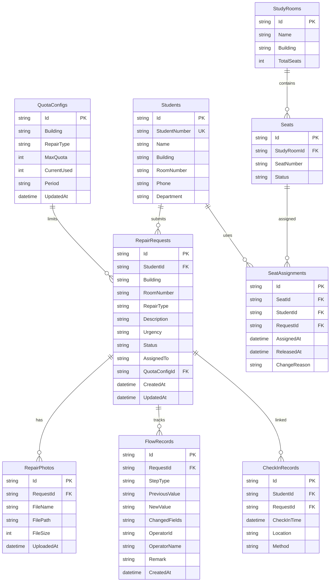

## 1. 架构设计

```mermaid
graph TB
    subgraph "前端层"
        "React 18 + TypeScript"
        "Tailwind CSS"
        "Zustand 状态管理"
        "React Router"
    end
    subgraph "后端层"
        "ASP.NET Core 8 Web API"
        "SignalR 实时通知"
        "EF Core ORM"
    end
    subgraph "数据层"
        "SQL Server"
        "Redis 缓存"
    end
    "React 18 + TypeScript" --> "ASP.NET Core 8 Web API"
    "ASP.NET Core 8 Web API" --> "SQL Server"
    "ASP.NET Core 8 Web API" --> "Redis 缓存"
    "SignalR 实时通知" --> "React 18 + TypeScript"
```

## 2. 技术说明

- **前端**：React@18 + TypeScript + Tailwind CSS@3 + Vite + Zustand
- **后端**：ASP.NET Core 8 Web API + SignalR + EF Core
- **数据库**：SQL Server（主数据存储）
- **缓存**：Redis（会话管理、名额实时计数、热点查询缓存、SignalR 背板）
- **文件存储**：本地文件系统（照片上传），数据库存储文件元信息
- **导出**：ClosedXML 生成 Excel，CSV 流式输出
- **实时通知**：SignalR WebSocket 推送处理效率通知

## 3. 路由定义

| 路由 | 用途 |
|------|------|
| `/` | 首页仪表盘 |
| `/repair/submit` | 提交报修申请 |
| `/repair/track/:id` | 查看报修进度 |
| `/review` | 审核管理列表 |
| `/review/:id` | 审核详情与操作 |
| `/quota` | 名额管理 |
| `/checkin` | 签到管理 |
| `/flow/:id` | 流转记录详情 |
| `/details` | 明细与导出 |
| `/batch` | 批量处理 |
| `/login` | 登录页 |

## 4. API 定义

### 4.1 报修申请

```typescript
interface RepairRequest {
  id: string;
  studentId: string;
  studentName: string;
  building: string;
  roomNumber: string;
  repairType: "plumbing" | "electrical" | "furniture" | "door_window" | "network" | "other";
  description: string;
  urgency: "low" | "medium" | "high" | "critical";
  status: "pending" | "identity_verifying" | "quota_checking" | "assigned" | "processing" | "completed" | "rejected" | "waitlisted";
  photos: PhotoInfo[];
  createdAt: string;
  updatedAt: string;
}

interface PhotoInfo {
  id: string;
  requestId: string;
  fileName: string;
  filePath: string;
  fileSize: number;
  uploadedAt: string;
}

interface CreateRepairRequest {
  building: string;
  roomNumber: string;
  repairType: string;
  description: string;
  urgency: string;
  photos: File[];
}
```

### 4.2 流转记录

```typescript
interface FlowRecord {
  id: string;
  requestId: string;
  stepType: "identity_review" | "repair_process" | "seat_change" | "status_change" | "quota_check";
  previousValue: Record<string, any>;
  newValue: Record<string, any>;
  changedFields: string[];
  operatorId: string;
  operatorName: string;
  remark: string;
  createdAt: string;
}

interface IdentityReviewChange {
  studentId: { before: string; after: string };
  studentName: { before: string; after: string };
  building: { before: string; after: string };
  roomNumber: { before: string; after: string };
  reviewResult: { before: string; after: string };
  reviewRemark: { before: string; after: string };
}

interface SeatChange {
  seatId: { before: string | null; after: string | null };
  studyRoom: { before: string | null; after: string | null };
  seatNumber: { before: string | null; after: string | null };
  changeReason: string;
}
```

### 4.3 名额与签到

```typescript
interface QuotaConfig {
  id: string;
  building: string;
  repairType: string;
  maxQuota: number;
  currentUsed: number;
  period: "daily" | "weekly" | "monthly";
}

interface CheckInRecord {
  id: string;
  studentId: string;
  studentName: string;
  checkInTime: string;
  location: string;
  method: "qrcode" | "manual";
}
```

### 4.4 批量处理

```typescript
interface BatchOperation {
  requestIds: string[];
  operation: "approve" | "reject";
  remark?: string;
}

interface BatchResult {
  totalCount: number;
  successCount: number;
  failCount: number;
  successIds: string[];
  failures: BatchFailureItem[];
}

interface BatchFailureItem {
  requestId: string;
  reason: string;
  retryable: boolean;
}
```

### 4.5 明细与导出

```typescript
interface ExportFilter {
  dateRange: { start: string; end: string };
  building?: string[];
  repairType?: string[];
  status?: string[];
  urgency?: string[];
}

interface SeatUtilizationDetail {
  studyRoom: string;
  totalSeats: number;
  occupiedSeats: number;
  utilizationRate: number;
  averageDuration: number;
}

interface IdentityFailureDetail {
  requestId: string;
  studentId: string;
  studentName: string;
  failureReason: string;
  failedAt: string;
  retryCount: number;
}

interface ProcessingRecordDetail {
  requestId: string;
  repairType: string;
  submittedAt: string;
  completedAt: string;
  processingDuration: number;
  isOverdue: boolean;
  handler: string;
}
```

## 5. 服务端架构图

```mermaid
graph LR
    subgraph "Controller 层"
        "RepairController"
        "ReviewController"
        "QuotaController"
        "CheckInController"
        "FlowRecordController"
        "DetailExportController"
        "BatchController"
    end
    subgraph "Service 层"
        "RepairService"
        "ReviewService"
        "QuotaService"
        "CheckInService"
        "FlowRecordService"
        "ExportService"
        "BatchService"
        "NotificationService"
    end
    subgraph "Repository 层"
        "RepairRepository"
        "FlowRecordRepository"
        "QuotaRepository"
        "CheckInRepository"
        "DetailRepository"
    end
    subgraph "数据层"
        "SQL Server"
        "Redis"
    end
    "RepairController" --> "RepairService"
    "ReviewController" --> "ReviewService"
    "QuotaController" --> "QuotaService"
    "CheckInController" --> "CheckInService"
    "FlowRecordController" --> "FlowRecordService"
    "DetailExportController" --> "ExportService"
    "BatchController" --> "BatchService"
    "RepairService" --> "RepairRepository"
    "RepairService" --> "FlowRecordService"
    "ReviewService" --> "RepairRepository"
    "ReviewService" --> "FlowRecordService"
    "ReviewService" --> "NotificationService"
    "QuotaService" --> "QuotaRepository"
    "QuotaService" --> "Redis"
    "CheckInService" --> "CheckInRepository"
    "FlowRecordService" --> "FlowRecordRepository"
    "ExportService" --> "DetailRepository"
    "BatchService" --> "RepairRepository"
    "BatchService" --> "FlowRecordService"
    "NotificationService" --> "Redis"
    "RepairRepository" --> "SQL Server"
    "FlowRecordRepository" --> "SQL Server"
    "QuotaRepository" --> "SQL Server"
    "CheckInRepository" --> "SQL Server"
    "DetailRepository" --> "SQL Server"
```

## 6. 数据模型

### 6.1 数据模型定义



### 6.2 数据定义语言

```sql
CREATE TABLE Students (
    Id UNIQUEIDENTIFIER PRIMARY KEY DEFAULT NEWID(),
    StudentNumber NVARCHAR(20) NOT NULL UNIQUE,
    Name NVARCHAR(50) NOT NULL,
    Building NVARCHAR(50) NOT NULL,
    RoomNumber NVARCHAR(20) NOT NULL,
    Phone NVARCHAR(20),
    Department NVARCHAR(100),
    CreatedAt DATETIME2 NOT NULL DEFAULT GETUTCDATE(),
    UpdatedAt DATETIME2 NOT NULL DEFAULT GETUTCDATE()
);

CREATE TABLE RepairRequests (
    Id UNIQUEIDENTIFIER PRIMARY KEY DEFAULT NEWID(),
    StudentId UNIQUEIDENTIFIER NOT NULL FOREIGN KEY REFERENCES Students(Id),
    Building NVARCHAR(50) NOT NULL,
    RoomNumber NVARCHAR(20) NOT NULL,
    RepairType NVARCHAR(30) NOT NULL,
    Description NVARCHAR(2000) NOT NULL,
    Urgency NVARCHAR(20) NOT NULL,
    Status NVARCHAR(30) NOT NULL DEFAULT 'pending',
    AssignedTo NVARCHAR(100),
    QuotaConfigId UNIQUEIDENTIFIER FOREIGN KEY REFERENCES QuotaConfigs(Id),
    CreatedAt DATETIME2 NOT NULL DEFAULT GETUTCDATE(),
    UpdatedAt DATETIME2 NOT NULL DEFAULT GETUTCDATE()
);

CREATE INDEX IX_RepairRequests_Status ON RepairRequests(Status);
CREATE INDEX IX_RepairRequests_StudentId ON RepairRequests(StudentId);
CREATE INDEX IX_RepairRequests_CreatedAt ON RepairRequests(CreatedAt);
CREATE INDEX IX_RepairRequests_Building ON RepairRequests(Building);

CREATE TABLE RepairPhotos (
    Id UNIQUEIDENTIFIER PRIMARY KEY DEFAULT NEWID(),
    RequestId UNIQUEIDENTIFIER NOT NULL FOREIGN KEY REFERENCES RepairRequests(Id) ON DELETE CASCADE,
    FileName NVARCHAR(255) NOT NULL,
    FilePath NVARCHAR(500) NOT NULL,
    FileSize INT NOT NULL,
    UploadedAt DATETIME2 NOT NULL DEFAULT GETUTCDATE()
);

CREATE INDEX IX_RepairPhotos_RequestId ON RepairPhotos(RequestId);

CREATE TABLE FlowRecords (
    Id UNIQUEIDENTIFIER PRIMARY KEY DEFAULT NEWID(),
    RequestId UNIQUEIDENTIFIER NOT NULL FOREIGN KEY REFERENCES RepairRequests(Id),
    StepType NVARCHAR(30) NOT NULL,
    PreviousValue NVARCHAR(MAX),
    NewValue NVARCHAR(MAX),
    ChangedFields NVARCHAR(500),
    OperatorId NVARCHAR(100),
    OperatorName NVARCHAR(50),
    Remark NVARCHAR(1000),
    CreatedAt DATETIME2 NOT NULL DEFAULT GETUTCDATE()
);

CREATE INDEX IX_FlowRecords_RequestId ON FlowRecords(RequestId);
CREATE INDEX IX_FlowRecords_StepType ON FlowRecords(StepType);
CREATE INDEX IX_FlowRecords_CreatedAt ON FlowRecords(CreatedAt);

CREATE TABLE QuotaConfigs (
    Id UNIQUEIDENTIFIER PRIMARY KEY DEFAULT NEWID(),
    Building NVARCHAR(50) NOT NULL,
    RepairType NVARCHAR(30) NOT NULL,
    MaxQuota INT NOT NULL,
    CurrentUsed INT NOT NULL DEFAULT 0,
    Period NVARCHAR(20) NOT NULL,
    UpdatedAt DATETIME2 NOT NULL DEFAULT GETUTCDATE(),
    CONSTRAINT UQ_QuotaConfigs_Building_Type_Period UNIQUE (Building, RepairType, Period)
);

CREATE TABLE CheckInRecords (
    Id UNIQUEIDENTIFIER PRIMARY KEY DEFAULT NEWID(),
    StudentId UNIQUEIDENTIFIER NOT NULL FOREIGN KEY REFERENCES Students(Id),
    RequestId UNIQUEIDENTIFIER FOREIGN KEY REFERENCES RepairRequests(Id),
    CheckInTime DATETIME2 NOT NULL DEFAULT GETUTCDATE(),
    Location NVARCHAR(100),
    Method NVARCHAR(20) NOT NULL
);

CREATE INDEX IX_CheckInRecords_StudentId ON CheckInRecords(StudentId);
CREATE INDEX IX_CheckInRecords_RequestId ON CheckInRecords(RequestId);

CREATE TABLE StudyRooms (
    Id UNIQUEIDENTIFIER PRIMARY KEY DEFAULT NEWID(),
    Name NVARCHAR(100) NOT NULL,
    Building NVARCHAR(50) NOT NULL,
    TotalSeats INT NOT NULL
);

CREATE TABLE Seats (
    Id UNIQUEIDENTIFIER PRIMARY KEY DEFAULT NEWID(),
    StudyRoomId UNIQUEIDENTIFIER NOT NULL FOREIGN KEY REFERENCES StudyRooms(Id),
    SeatNumber NVARCHAR(20) NOT NULL,
    Status NVARCHAR(20) NOT NULL DEFAULT 'available',
    CONSTRAINT UQ_Seats_Room_Number UNIQUE (StudyRoomId, SeatNumber)
);

CREATE TABLE SeatAssignments (
    Id UNIQUEIDENTIFIER PRIMARY KEY DEFAULT NEWID(),
    SeatId UNIQUEIDENTIFIER NOT NULL FOREIGN KEY REFERENCES Seats(Id),
    StudentId UNIQUEIDENTIFIER NOT NULL FOREIGN KEY REFERENCES Students(Id),
    RequestId UNIQUEIDENTIFIER FOREIGN KEY REFERENCES RepairRequests(Id),
    AssignedAt DATETIME2 NOT NULL DEFAULT GETUTCDATE(),
    ReleasedAt DATETIME2,
    ChangeReason NVARCHAR(500)
);

CREATE INDEX IX_SeatAssignments_StudentId ON SeatAssignments(StudentId);
CREATE INDEX IX_SeatAssignments_SeatId ON SeatAssignments(SeatId);

CREATE TABLE Users (
    Id UNIQUEIDENTIFIER PRIMARY KEY DEFAULT NEWID(),
    UserName NVARCHAR(100) NOT NULL UNIQUE,
    PasswordHash NVARCHAR(256) NOT NULL,
    Role NVARCHAR(20) NOT NULL,
    DisplayName NVARCHAR(50),
    CreatedAt DATETIME2 NOT NULL DEFAULT GETUTCDATE()
);

INSERT INTO Users (Id, UserName, PasswordHash, Role, DisplayName)
VALUES (NEWID(), 'admin', 'hashed_admin_password', 'admin', '系统管理员');
INSERT INTO Users (Id, UserName, PasswordHash, Role, DisplayName)
VALUES (NEWID(), 'dorm_manager', 'hashed_manager_password', 'dorm_manager', '宿管老师');
```
