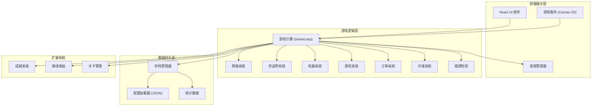
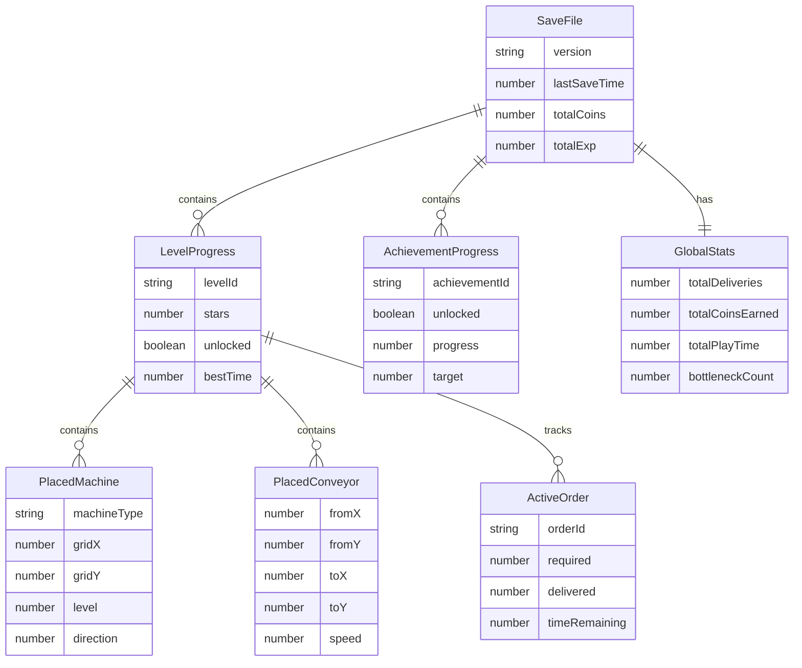
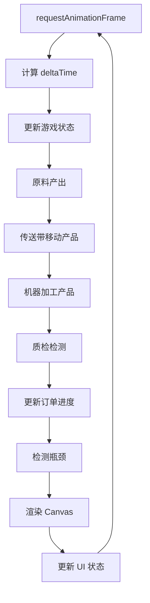

## 1. 架构设计



## 2. 技术选型

- **前端框架**：React@18 + TypeScript + Vite
- **游戏渲染**：Canvas 2D（复古像素风，性能可控）
- **状态管理**：Zustand（游戏状态 + UI 状态分离）
- **样式方案**：Tailwind CSS@3（UI 面板样式）+ Canvas（游戏画面）
- **音频**：Web Audio API（音效合成 + 音频文件播放）
- **数据存储**：localStorage（存档 + 设置 + 统计）
- **初始化工具**：vite-init（react-ts 模板）

## 3. 路由定义

| 路由 | 用途 |
|------|------|
| / | 主菜单页（开始游戏、继续游戏、设置入口） |
| /level-select | 关卡选择页 |
| /factory/:levelId | 工厂车间（核心游戏页面） |
| /achievements | 成就页 |
| /stats | 数据统计页 |
| /settings | 设置页 |

## 4. 核心数据模型

### 4.1 数据模型定义



### 4.2 配置数据结构

所有配置采用 JSON 格式，存储于 `src/config/` 目录：

```
src/config/
  ├── machines.json    -- 机器类型定义
  ├── orders.json      -- 订单模板
  ├── levels.json      -- 关卡配置
  └── achievements.json -- 成就定义
```

机器配置示例：
```json
{
  "id": "press",
  "name": "冲压机",
  "baseSpeed": 2.0,
  "baseQuality": 0.85,
  "upgradeCostMultiplier": 1.8,
  "maxLevel": 10,
  "cost": 100,
  "sprite": "press"
}
```

关卡配置示例：
```json
{
  "id": "level_01",
  "name": "初始车间",
  "gridWidth": 8,
  "gridHeight": 6,
  "startCoins": 500,
  "availableMachines": ["press", "conveyor", "qa_station"],
  "orders": ["order_simple_01", "order_simple_02"],
  "starThresholds": { "1": 60, "2": 45, "3": 30 },
  "entryPoint": { "x": 0, "y": 2 },
  "exitPoint": { "x": 7, "y": 4 }
}
```

## 5. 游戏引擎架构

### 5.1 游戏主循环



### 5.2 模块职责

| 模块 | 文件 | 职责 |
|------|------|------|
| GameEngine | `src/game/engine.ts` | 主循环、帧率控制、模块调度 |
| GridSystem | `src/game/grid.ts` | 网格数据、放置验证、路径查找 |
| ConveyorSystem | `src/game/conveyor.ts` | 传送带逻辑、产品移动、速度计算 |
| MachineSystem | `src/game/machine.ts` | 机器加工、升级效果、质量计算 |
| QASystem | `src/game/qa.ts` | 质检逻辑、合格率、返工处理 |
| OrderSystem | `src/game/order.ts` | 订单生成、倒计时、交付判定 |
| BottleneckDetector | `src/game/bottleneck.ts` | 积压检测、瓶颈标记、提示触发 |
| AchievementManager | `src/game/achievement.ts` | 成就条件检测、解锁触发 |
| OfflineCalculator | `src/game/offline.ts` | 离线时间计算、收益模拟 |
| SaveManager | `src/game/save.ts` | 存档序列化、反序列化、版本迁移 |
| AudioManager | `src/game/audio.ts` | 音效合成、BGM 播放、音量控制 |
| ConfigLoader | `src/game/config.ts` | JSON 配置加载、校验、热更新 |
| Renderer | `src/game/renderer.ts` | Canvas 绘制、精灵管理、动画帧 |

### 5.3 产品流动模型

产品在流水线中以 `Product` 对象表示，携带以下状态：

```typescript
interface Product {
  id: string;
  stage: number;          // 已经过的机器数
  quality: number;        // 当前质量值 0-1
  position: { x: number; y: number };  // 像素坐标
  currentCell: { x: number; y: number };  // 网格坐标
  state: "moving" | "processing" | "qa_check" | "done" | "rejected";
  processingTimer: number;  // 加工倒计时
}
```

### 5.4 存档版本迁移

```typescript
interface SaveData {
  version: number;
  timestamp: number;
  data: unknown;
}

const MIGRATORS: Record<number, (data: unknown) => unknown> = {
  1: migrateV1toV2,
  2: migrateV2toV3,
};
```

加载时依次应用迁移函数，确保旧存档可升级。

## 6. 性能优化策略

- Canvas 渲染仅重绘脏区域（变化的产品和机器）
- 机器和传送带使用离屏 Canvas 缓存静态部分
- 产品数量上限 200，超出则最旧的自动交付/报废
- 瓶颈检测每 2 秒执行一次，非每帧
- 离线收益上限 8 小时
- Zustand 状态分片：游戏状态和 UI 状态独立更新

## 7. 扩展预留

| 扩展方向 | 预留设计 |
|----------|----------|
| 新关卡 | `levels.json` 新增配置，关卡管理器自动识别 |
| 新机器 | `machines.json` 注册，机器系统通过工厂模式创建 |
| 外观皮肤 | 存档中 `skinId` 字段，渲染器根据皮肤选择精灵集 |
| 剧情文本 | 关卡配置中 `storyBefore` / `storyAfter` 字段 |
| 排行榜 | 存档管理器预留 `uploadScore()` 接口 |
| 调试面板 | 开发模式下 `/factory/:id?debug=true` 显示调试 HUD |
