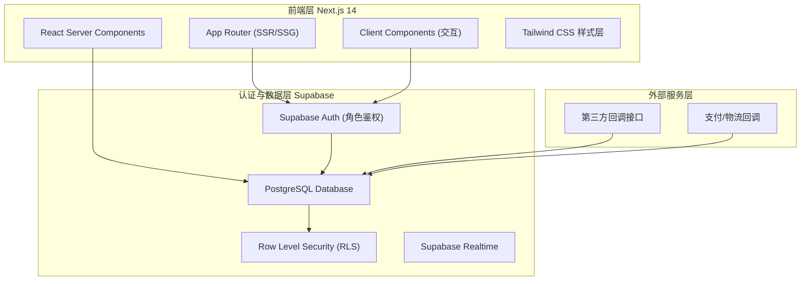
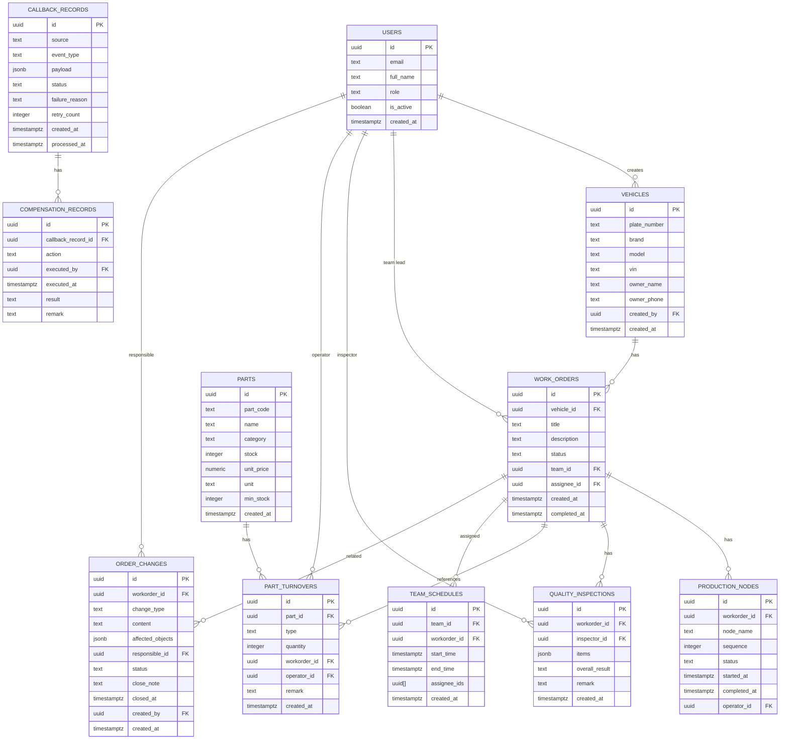

# 汽配门店业务协同平台 - 技术架构文档

## 1. 架构设计



## 2. 技术说明

- 前端框架: Next.js 14 (App Router) + React 18 + TypeScript
- 样式方案: Tailwind CSS 3 + PostCSS
- UI 组件库: lucide-react (图标) + clsx/tailwind-merge (样式合并)
- 数据可视化: recharts
- 状态管理: React Server Components + URL SearchParams (轻量场景)
- 认证鉴权: Supabase Auth + Row Level Security (RLS)
- 数据库: PostgreSQL (通过 Supabase 托管)
- 数据库访问: @supabase/ssr (Server) + @supabase/auth-helpers-nextjs
- 表单处理: react-hook-form + zod 校验
- 初始化工具: create-next-app
- Mock 方案: Supabase 内置 seed 数据 + RLS 策略

## 3. 路由定义

| 路由 | 用途 | 权限要求 |
|------|------|----------|
| `/login` | 登录页 | 公开 |
| `/` | 工作台仪表盘 | 已登录 |
| `/vehicles` | 车辆列表 | 前台/店长 |
| `/vehicles/new` | 车型登记 | 前台/店长 |
| `/vehicles/[id]` | 车辆详情 | 已登录 |
| `/parts` | 配件列表 | 仓库/店长 |
| `/parts/new` | 配件登记 | 仓库/店长 |
| `/parts/turnover` | 配件周转明细 | 仓库/店长 |
| `/workorders` | 维修工单列表 | 已登录 |
| `/workorders/new` | 维修需求录入 | 前台/店长 |
| `/workorders/[id]` | 工单详情 | 已登录 |
| `/production/schedule` | 班组排期 | 班组长/店长 |
| `/production/nodes` | 生产节点批量查询 | 班组长/店长 |
| `/quality` | 质检结果列表 | 质检/店长 |
| `/quality/new` | 质检结果录入 | 质检/店长 |
| `/order-changes` | 订单变更列表 | 前台/店长 |
| `/order-changes/new` | 变更处理页 | 前台/店长 |
| `/callbacks` | 回调监控 | 店长 |
| `/settings/roles` | 角色权限管理 | 店长 |
| `/settings/users` | 用户管理 | 店长 |

## 4. API 与数据层定义

### 4.1 TypeScript 类型定义

```typescript
// 车辆
interface Vehicle {
  id: string;
  plate_number: string;
  brand: string;
  model: string;
  vin: string;
  owner_name: string;
  owner_phone: string;
  created_at: string;
  created_by: string;
}

// 配件
interface Part {
  id: string;
  part_code: string;
  name: string;
  category: string;
  stock: number;
  unit_price: number;
  unit: string;
  min_stock: number;
  created_at: string;
}

// 配件周转记录
interface PartTurnover {
  id: string;
  part_id: string;
  type: 'in' | 'out' | 'transfer';
  quantity: number;
  workorder_id?: string;
  operator_id: string;
  remark?: string;
  created_at: string;
}

// 维修工单
interface WorkOrder {
  id: string;
  vehicle_id: string;
  title: string;
  description: string;
  status: 'pending' | 'assigned' | 'in_progress' | 'quality_check' | 'completed' | 'cancelled';
  team_id?: string;
  assignee_id?: string;
  created_at: string;
  completed_at?: string;
}

// 生产节点
interface ProductionNode {
  id: string;
  workorder_id: string;
  node_name: string;
  sequence: number;
  status: 'pending' | 'in_progress' | 'completed';
  started_at?: string;
  completed_at?: string;
  operator_id?: string;
}

// 班组排期
interface TeamSchedule {
  id: string;
  team_id: string;
  workorder_id: string;
  start_time: string;
  end_time: string;
  assignee_ids: string[];
  created_at: string;
}

// 质检结果
interface QualityInspection {
  id: string;
  workorder_id: string;
  inspector_id: string;
  items: QualityItem[];
  overall_result: 'pass' | 'fail' | 'rework';
  remark?: string;
  created_at: string;
}
interface QualityItem {
  name: string;
  result: 'pass' | 'fail';
  issue?: string;
  rectification?: string;
}

// 订单变更
interface OrderChange {
  id: string;
  workorder_id?: string;
  change_type: string;
  content: string;
  affected_objects: { type: 'vehicle' | 'part' | 'workorder'; id: string; name: string }[];
  responsible_id: string;
  status: 'open' | 'processing' | 'closed';
  close_note?: string;
  closed_at?: string;
  created_by: string;
  created_at: string;
}

// 回调记录
interface CallbackRecord {
  id: string;
  source: string;
  event_type: string;
  payload: Record<string, any>;
  status: 'pending' | 'success' | 'failed';
  failure_reason?: string;
  retry_count: number;
  compensation_records: CompensationRecord[];
  created_at: string;
  processed_at?: string;
}
interface CompensationRecord {
  id: string;
  action: string;
  executed_by: string;
  executed_at: string;
  result: 'success' | 'failed';
  remark?: string;
}

// 用户与角色
interface User {
  id: string;
  email: string;
  full_name: string;
  role: 'store_manager' | 'warehouse' | 'inspector' | 'team_lead' | 'reception';
  is_active: boolean;
  created_at: string;
}
interface RolePermission {
  role: string;
  routes: string[];
  data_scope: 'all' | 'team' | 'self';
}
```

## 5. 服务端架构

```mermaid
graph TB
    A["Next.js Route Handler (app/api/*)"] --> B["Auth 中间件 (Supabase RLS 校验)
    B --> C["业务 Service 层"]
    C --> D["Supabase Postgres 客户端"]
    D --> E["PostgreSQL 数据库 (含 RLS 策略)"]
    
    F["外部回调 Webhook 接收 (/api/callbacks/*)"] --> G["回调记录入库 + 失败兜底"]
    G --> H["补偿任务队列 (数据库表驱动)"]
```

Next.js App Router 作为一体化服务端：
- `app/api/**` 作为 Route Handler 处理 HTTP API
- 通过 `@supabase/ssr` 服务端创建 Supabase 客户端
- RLS (行级安全策略) 在数据库层做权限兜底
- 外部回调统一由 `/api/callbacks/[source]` 接收，异常时记录失败原因并写入补偿表

## 6. 数据模型

### 6.1 ER 图



### 6.2 DDL (PostgreSQL)

```sql
-- 扩展
create extension if not exists "pgcrypto";

-- 用户表 (由 Supabase auth.users 驱动，此处为业务用户 profile)
create table public.profiles (
  id uuid primary key references auth.users(id) on delete cascade,
  full_name text not null,
  role text not null check (role in ('store_manager','warehouse','inspector','team_lead','reception')),
  is_active boolean default true,
  created_at timestamptz default now()
);

-- 车辆表
create table public.vehicles (
  id uuid primary key default gen_random_uuid(),
  plate_number text not null unique,
  brand text not null,
  model text not null,
  vin text,
  owner_name text,
  owner_phone text,
  created_by uuid references public.profiles(id),
  created_at timestamptz default now()
);

-- 配件表
create table public.parts (
  id uuid primary key default gen_random_uuid(),
  part_code text not null unique,
  name text not null,
  category text,
  stock integer default 0,
  unit_price numeric(10,2) default 0,
  unit text default '件',
  min_stock integer default 0,
  created_at timestamptz default now()
);

-- 配件周转明细
create table public.part_turnovers (
  id uuid primary key default gen_random_uuid(),
  part_id uuid not null references public.parts(id) on delete cascade,
  type text not null check (type in ('in','out','transfer')),
  quantity integer not null,
  workorder_id uuid references public.work_orders(id),
  operator_id uuid references public.profiles(id),
  remark text,
  created_at timestamptz default now()
);
create index on public.part_turnovers(part_id);
create index on public.part_turnovers(created_at desc);

-- 维修工单
create table public.work_orders (
  id uuid primary key default gen_random_uuid(),
  vehicle_id uuid not null references public.vehicles(id) on delete cascade,
  title text not null,
  description text,
  status text not null default 'pending' check (status in ('pending','assigned','in_progress','quality_check','completed','cancelled')),
  team_id uuid references public.profiles(id),
  assignee_id uuid references public.profiles(id),
  created_at timestamptz default now(),
  completed_at timestamptz
);

-- 生产节点
create table public.production_nodes (
  id uuid primary key default gen_random_uuid(),
  workorder_id uuid not null references public.work_orders(id) on delete cascade,
  node_name text not null,
  sequence integer not null,
  status text default 'pending' check (status in ('pending','in_progress','completed')),
  started_at timestamptz,
  completed_at timestamptz,
  operator_id uuid references public.profiles(id)
);

-- 班组排期
create table public.team_schedules (
  id uuid primary key default gen_random_uuid(),
  team_id uuid references public.profiles(id),
  workorder_id uuid references public.work_orders(id),
  start_time timestamptz not null,
  end_time timestamptz not null,
  assignee_ids uuid[] default '{}',
  created_at timestamptz default now()
);

-- 质检
create table public.quality_inspections (
  id uuid primary key default gen_random_uuid(),
  workorder_id uuid not null references public.work_orders(id) on delete cascade,
  inspector_id uuid references public.profiles(id),
  items jsonb not null default '[]',
  overall_result text not null check (overall_result in ('pass','fail','rework')),
  remark text,
  created_at timestamptz default now()
);

-- 订单变更
create table public.order_changes (
  id uuid primary key default gen_random_uuid(),
  workorder_id uuid references public.work_orders(id),
  change_type text not null,
  content text not null,
  affected_objects jsonb not null default '[]',
  responsible_id uuid references public.profiles(id),
  status text default 'open' check (status in ('open','processing','closed')),
  close_note text,
  closed_at timestamptz,
  created_by uuid references public.profiles(id),
  created_at timestamptz default now()
);

-- 回调记录
create table public.callback_records (
  id uuid primary key default gen_random_uuid(),
  source text not null,
  event_type text not null,
  payload jsonb not null default '{}',
  status text default 'pending' check (status in ('pending','success','failed')),
  failure_reason text,
  retry_count integer default 0,
  created_at timestamptz default now(),
  processed_at timestamptz
);
create index on public.callback_records(status);

-- 补偿记录
create table public.compensation_records (
  id uuid primary key default gen_random_uuid(),
  callback_record_id uuid not null references public.callback_records(id) on delete cascade,
  action text not null,
  executed_by uuid references public.profiles(id),
  executed_at timestamptz default now(),
  result text not null check (result in ('success','failed')),
  remark text
);

-- RLS: 所有表默认开启行级安全，再按角色建策略
alter table public.profiles enable row level security;
alter table public.vehicles enable row level security;
alter table public.parts enable row level security;
alter table public.part_turnovers enable row level security;
alter table public.work_orders enable row level security;
alter table public.production_nodes enable row level security;
alter table public.team_schedules enable row level security;
alter table public.quality_inspections enable row level security;
alter table public.order_changes enable row level security;
alter table public.callback_records enable row level security;
alter table public.compensation_records enable row level security;

-- 店长：所有数据全权限
create policy "store_manager_all" on public.vehicles for all using (
  exists (select 1 from public.profiles where id = auth.uid() and role = 'store_manager')
);
-- 其他表类似策略，此处省略，实装时补齐
```
