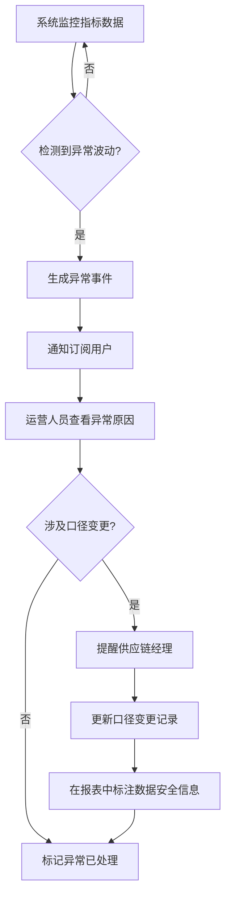
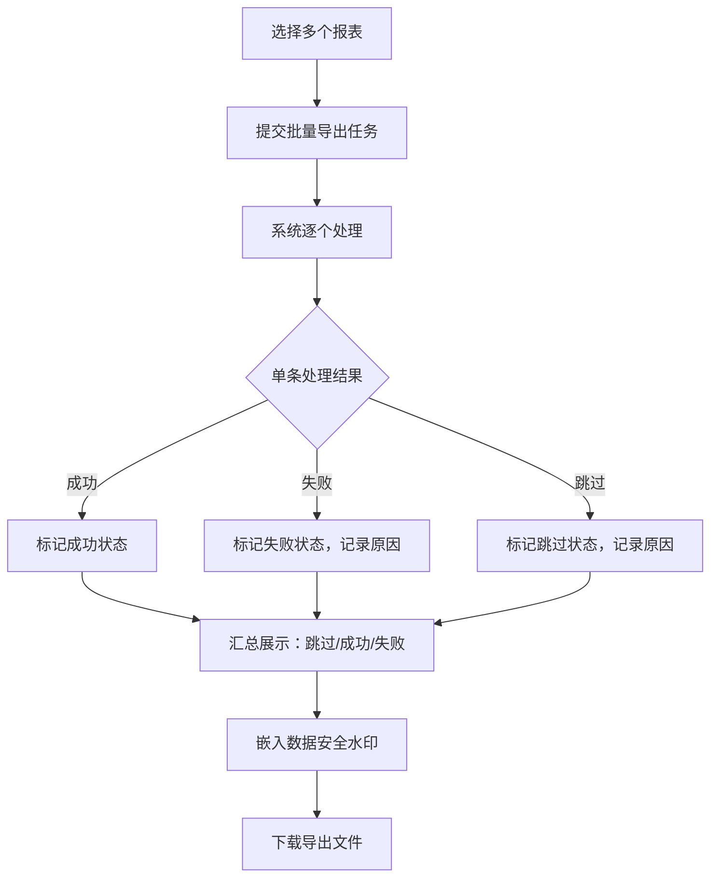
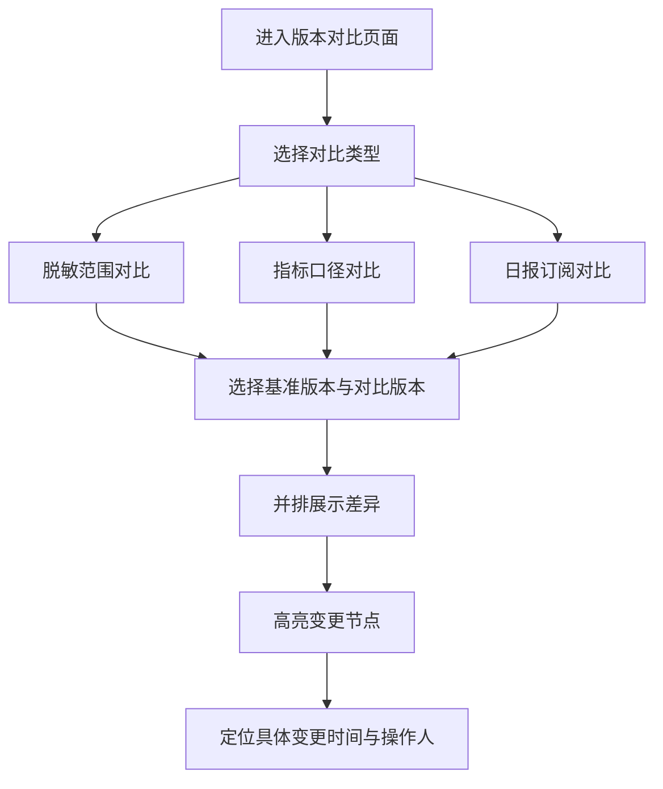

## 1. 产品概述

用户增长自助报表中心是面向运营团队的一站式数据报表平台，解决跨部门数据口径不一致、异常波动发现滞后、报表权限管理分散等核心痛点。目标用户为运营负责人、供应链经理及数据分析师，通过自助化报表配置与智能异常监控，让数据驱动决策落实到具体业务节点。

## 2. 核心功能

### 2.1 用户角色

| 角色 | 注册方式 | 核心权限 |
|------|----------|----------|
| 运营负责人 | 管理员分配账号 | 全部功能，审批权限，查看所有报表 |
| 供应链经理 | 管理员分配账号 | 查看报表，接收口径变更提醒，管理订阅 |
| 数据分析师 | 管理员分配账号 | 创建/编辑数据集与指标维度，导出报表 |
| 系统管理员 | 系统内置 | 用户管理、权限审批、系统配置 |

### 2.2 功能模块

1. **运营仪表盘**：核心指标概览、异常波动告警、待审批事项、快捷入口
2. **数据集管理**：数据集CRUD、字段配置、脱敏规则设定、版本管理
3. **指标维度管理**：指标定义与口径说明、维度配置、口径变更记录与提醒
4. **权限审批中心**：报表访问申请、审批流程、权限到期管理
5. **异常波动订阅**：异常规则配置、订阅管理、告警通知、异常原因分析
6. **报表导出中心**：报表生成、批量导出、导出状态追踪、数据安全水印
7. **历史版本对比**：脱敏范围变更对比、指标口径变更对比、日报订阅变更对比
8. **批量处理监控**：批量任务提交、跳过/成功/失败分状态展示

### 2.3 页面详情

| 页面名称 | 模块名称 | 功能描述 |
|----------|----------|----------|
| 运营仪表盘 | 指标概览卡片 | 展示日活、新增用户、留存率等核心指标及环比变化 |
| 运营仪表盘 | 异常波动告警面板 | 实时展示异常波动事件列表，点击可查看异常原因 |
| 运营仪表盘 | 待审批事项 | 展示待处理的权限申请和口径变更审批 |
| 数据集管理 | 数据集列表 | 分页展示数据集，支持搜索筛选、状态标签 |
| 数据集管理 | 数据集编辑 | 字段配置、脱敏规则设定、关联指标 |
| 数据集管理 | 版本历史 | 数据集配置的历史版本列表，支持对比 |
| 指标维度管理 | 指标列表 | 指标名称、口径说明、关联数据集、变更状态 |
| 指标维度管理 | 指标编辑 | 口径定义、计算公式、维度配置、变更通知设置 |
| 指标维度管理 | 口径变更提醒 | 变更详情、影响范围、通知供应链经理 |
| 权限审批中心 | 申请列表 | 报表访问申请列表，状态筛选 |
| 权限审批中心 | 审批处理 | 同意/拒绝、审批意见、权限有效期设置 |
| 异常波动订阅 | 订阅规则配置 | 异常阈值、监控指标、通知方式 |
| 异常波动订阅 | 异常事件列表 | 异常事件详情、根因分析、处理建议 |
| 报表导出中心 | 导出任务列表 | 任务状态（跳过/成功/失败）、进度、操作 |
| 报表导出中心 | 批量导出 | 选择多报表批量导出，数据安全水印嵌入 |
| 历史版本对比 | 版本选择 | 选择两个版本进行对比 |
| 历史版本对比 | 差异展示 | 脱敏范围、指标口径、日报订阅的前后变化并排展示 |

## 3. 核心流程

**异常波动发现与处理流程**：系统自动监控指标波动，当检测到异常时生成告警事件并通知订阅者。运营人员查看异常原因分析，如涉及口径变更则触发提醒供应链经理，并在报表中标注数据安全信息。

**报表导出批量处理流程**：

**历史版本对比流程**：

## 4. 用户界面设计

### 4.1 设计风格

- 主色调：深蓝灰（#1E293B）+ 翠绿强调色（#10B981），传递数据可信与增长活力
- 辅助色：琥珀色（#F59E0B）用于告警，玫红色（#F43F5E）用于异常/失败，天蓝色（#38BDF8）用于信息提示
- 按钮风格：圆角 6px，中等粗细，主按钮填充、次按钮描边
- 字体：标题使用 DM Sans（粗体），正文使用 Noto Sans SC（常规），数据数字使用 JetBrains Mono
- 布局风格：左侧固定导航栏 + 顶部面包屑 + 内容区卡片布局
- 图标风格：线性图标，2px 描边，与 Element Plus 图标体系一致

### 4.2 页面设计概览

| 页面名称 | 模块名称 | UI元素 |
|----------|----------|--------|
| 运营仪表盘 | 指标概览卡片 | 卡片式布局，数字突出显示，环比箭头，渐变底色 |
| 运营仪表盘 | 异常波动告警 | 列表 + 右侧抽屉详情，告警级别色标 |
| 运营仪表盘 | 待审批事项 | 紧凑列表，状态徽章，快捷操作按钮 |
| 数据集管理 | 数据集列表 | 表格布局，搜索筛选栏，状态标签，操作列 |
| 数据集管理 | 数据集编辑 | 表单布局，字段列表可拖拽排序，脱敏规则开关 |
| 指标维度管理 | 指标列表 | 表格 + 口径标签，变更状态徽章 |
| 指标维度管理 | 口径变更提醒 | 弹窗通知，变更对比视图，影响范围展示 |
| 权限审批中心 | 申请列表 | 表格布局，状态筛选标签页 |
| 权限审批中心 | 审批处理 | 对话框，审批表单 |
| 异常波动订阅 | 订阅规则配置 | 卡片式规则列表，添加规则对话框 |
| 报表导出中心 | 导出任务列表 | 表格 + 状态三色标签（跳过灰/成功绿/失败红），进度条 |
| 历史版本对比 | 差异展示 | 左右分栏并排对比，变更高亮，时间轴 |
| 批量处理监控 | 状态汇总 | 三列统计卡片（跳过/成功/失败），明细表格 |

### 4.3 响应式

- 桌面优先设计，最小宽度 1280px
- 侧边栏可折叠适配中等屏幕
- 表格支持横向滚动
- 卡片布局在窄屏下自动堆叠

### 4.4 3D场景指引

不适用
