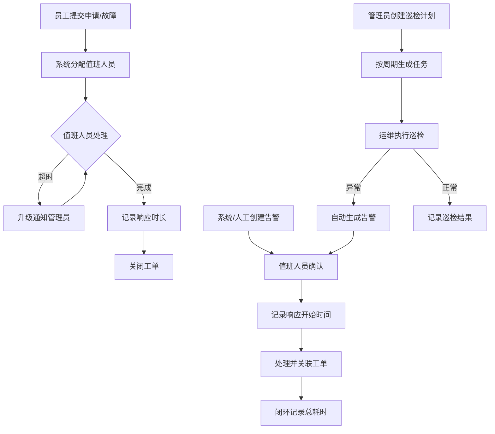

## 1. 产品概述

IT 账号值班响应系统是为 IT 主管设计的一站式运维管理平台，用于统一管理员工账号申请、故障告警确认、设备巡检和值班调度。系统通过关联响应时长、升级通知和审计日志，确保每一笔工单从提交到闭环全程可追溯，提升 IT 团队的响应效率和服务质量。

- 目标用户：门店运维人员、IT 管理员
- 核心价值：缩短响应时间、规范值班流程、保障资产操作合规可审计

## 2. 核心功能

### 2.1 用户角色

| 角色 | 注册方式 | 核心权限 |
|------|----------|----------|
| 门店运维 | 管理员创建账号 | 提交账号申请、提交故障报告、查看自己的工单、查看巡检任务、确认告警 |
| 管理员 | 系统预设 | 全部权限：值班调度、升级通知、审批申请、维护巡检计划、查看时效报表、查看审计日志 |

### 2.2 功能模块

1. **总览仪表盘**：关键指标卡片、待处理工单列表、响应时效图表、值班人员状态
2. **告警确认**：告警列表、确认/升级操作、告警详情与关联工单
3. **账号申请**：申请提交、审批流转、申请记录查询
4. **设备巡检**：巡检计划维护、巡检任务执行、巡检记录查看
5. **值班管理**：值班排班、值班人员调度、值班日历视图
6. **处理记录**：工单处理日志、处理时长统计、历史记录查询
7. **时效报表**：响应时长统计、SLA 达标率、趋势分析图表
8. **审计日志**：资产相关操作日志、操作人追溯、时间线查看

### 2.3 页面详情

| 页面名称 | 模块名称 | 功能描述 |
|----------|----------|----------|
| 总览仪表盘 | 指标卡片 | 展示待处理工单数、今日告警数、平均响应时长、SLA达标率 |
| 总览仪表盘 | 待处理工单 | 按优先级排序的待处理工单列表，支持快速跳转处理 |
| 总览仪表盘 | 响应时效图表 | 近7天/30天响应时长趋势折线图 |
| 总览仪表盘 | 值班状态 | 当前值班人员与联系方式 |
| 告警确认 | 告警列表 | 分页表格展示告警，支持按级别/状态/时间筛选 |
| 告警确认 | 确认操作 | 确认告警并关联值班人员，记录确认时间计算响应时长 |
| 告警确认 | 升级操作 | 超时未处理自动升级，手动升级通知上级 |
| 告警确认 | 告警详情 | 告警上下文、关联工单、处理时间线 |
| 账号申请 | 申请表单 | 员工填写账号类型、用途、紧急程度 |
| 账号申请 | 审批列表 | 管理员查看待审批申请，执行通过/驳回 |
| 账号申请 | 申请记录 | 历史申请查询，按状态/时间/申请人筛选 |
| 设备巡检 | 巡检计划 | 管理员创建/编辑巡检计划（设备、周期、负责人） |
| 设备巡检 | 巡检任务 | 运维人员执行巡检，填写巡检结果 |
| 设备巡检 | 巡检记录 | 历史巡检结果查看，异常标记 |
| 值班管理 | 排班表 | 日历视图展示值班安排，支持拖拽调整 |
| 值班管理 | 人员调度 | 添加/移除值班人员，设置值班时段 |
| 处理记录 | 工单日志 | 按工单查看处理步骤、耗时、处理人 |
| 处理记录 | 时长统计 | 各工单类型平均处理时长对比 |
| 时效报表 | SLA达标率 | 各类工单SLA达标/超标统计 |
| 时效报表 | 趋势分析 | 响应时长月度趋势、同比环比分析 |
| 审计日志 | 操作记录 | 资产相关操作的完整记录（操作人、时间、内容） |
| 审计日志 | 时间线 | 按实体聚合操作历史时间线 |

## 3. 核心流程

**账号申请流程**：员工提交申请 → 系统分配值班人员 → 值班人员处理 → 超时则升级通知管理员 → 处理完成记录响应时长 → 关闭工单

**故障告警流程**：系统/人工创建告警 → 值班人员确认 → 确认时记录响应开始时间 → 处理并关联工单 → 闭环记录总耗时

**设备巡检流程**：管理员创建巡检计划 → 系统按周期生成巡检任务 → 运维人员执行并填写结果 → 异常结果自动生成告警 → 进入告警处理流程

## 4. 用户界面设计

### 4.1 设计风格

- 主色调：深蓝 #1A365D（专业、信赖），辅助色：青绿 #38B2AC（响应、活力）
- 警告色：琥珀 #ECC94B，危险色：红色 #E53E3E，成功色：绿色 #38A169
- 按钮风格：圆角 6px，主按钮实心填充，次按钮描边
- 字体：系统字体栈，标题 20px/16px 加粗，正文 14px 常规，辅助 12px
- 布局：左侧导航栏 + 顶部面包屑 + 内容区卡片式布局
- 图标：Ant Design 内置图标库

### 4.2 页面设计概览

| 页面名称 | 模块名称 | UI 元素 |
|----------|----------|---------|
| 总览仪表盘 | 指标卡片 | 4列统计卡片（Icon + 数字 + 标签），浅色背景渐变 |
| 总览仪表盘 | 待处理工单 | Ant Design Table，紧急标红，带分页 |
| 总览仪表盘 | 响应时效图表 | Ant Design Chart 折线图，7天/30天切换 |
| 总览仪表盘 | 值班状态 | Avatar + 姓名卡片，在线/离线状态指示 |
| 告警确认 | 告警列表 | Table + Tag颜色标记级别，筛选Form在上方 |
| 告警确认 | 确认/升级 | Modal弹窗，确认关联值班人员下拉选择 |
| 账号申请 | 申请表单 | Ant Design Form，含账号类型Select、紧急程度Radio |
| 账号申请 | 审批列表 | Table含操作列，通过/驳回按钮，审批意见弹窗 |
| 设备巡检 | 巡检计划 | Card网格展示，每个计划含进度条 |
| 设备巡检 | 巡检任务 | Table含状态Tag，执行按钮打开Drawer |
| 值班管理 | 排班表 | Ant Design Calendar，日期格子显示值班人员 |
| 处理记录 | 工单日志 | Ant Design Timeline组件，展示处理步骤 |
| 时效报表 | SLA达标率 | 进度环图 + 统计卡片 |
| 时效报表 | 趋势分析 | 柱状图 + 折线图组合 |
| 审计日志 | 操作记录 | Table含操作类型Tag、操作人、时间戳 |

### 4.3 响应式设计

- 桌面优先设计，最小宽度 1280px
- 侧边栏可折叠适配小屏幕
- 表格支持横向滚动
- 卡片布局在窄屏时自动换行

## 5. 权限与安全

- 门店运维：仅可操作自己提交的工单、查看分配的巡检任务、确认分配给自己的告警
- 管理员：全局操作权限，包括审批、调度、报表、审计日志查看
- 资产相关操作（账号创建/删除、设备变更）必须写入审计日志
- 所有 API 接口需验证 Token 和角色权限
- 接口失败时返回结构化错误信息：{ code, message, detail }，message 使用中文可读说明
