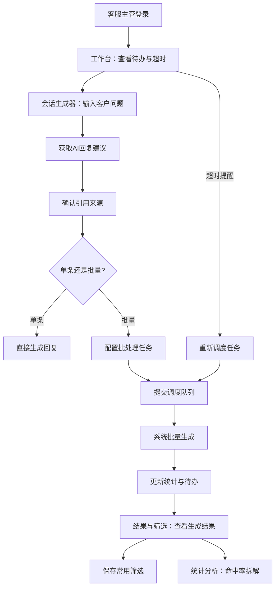
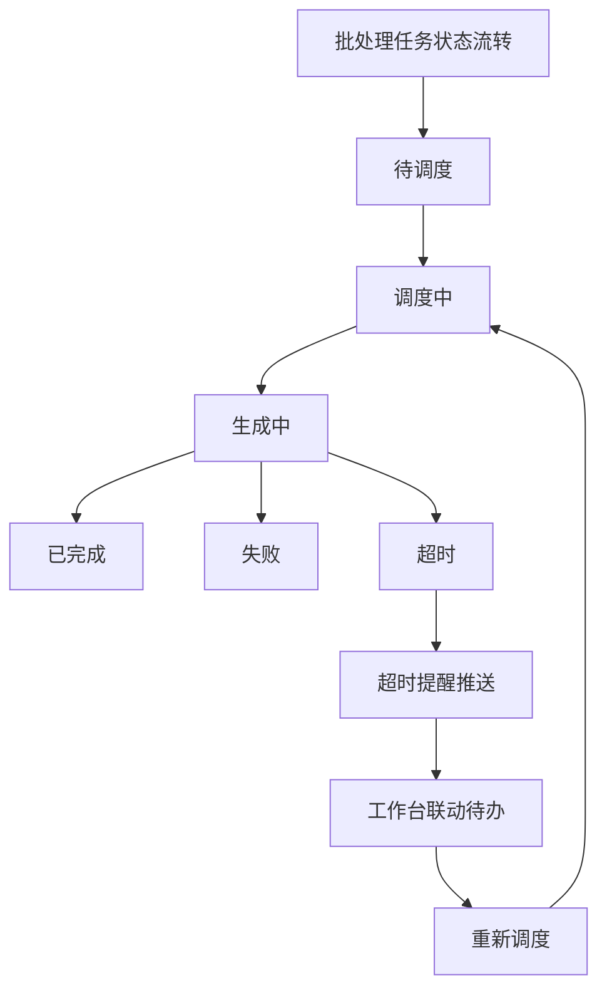

## 1. 产品概述

客服主管客服会话批量生成器——面向客服主管的智能会话生成与质量管控平台，通过输入客户问题自动生成回复建议、批量调度生成任务、统计回复命中率，并将流程状态与待办/超时联动，减少人工翻页操作，提升客服团队响应效率与质量。

## 2. 核心功能

### 2.1 用户角色

| 角色 | 注册方式 | 核心权限 |
|------|----------|----------|
| 系统管理员 | 后台创建 | 账号管理、角色分配、系统配置 |
| 客服主管 | 管理员创建 | 批量生成会话、配置任务、查看统计、管理筛选 |
| 客服专员 | 主管创建 | 查看分配的会话、确认回复、标记引用缺失 |

### 2.2 功能模块

1. **工作台页面**：待办概览、超时提醒、命中率速览、近期批处理任务状态
2. **会话生成器页面**：输入客户问题、获取回复建议、引用来源追踪、单条/批量生成
3. **批处理任务页面**：任务配置、调度队列、执行进度、状态流转
4. **结果与筛选页面**：调用日志、生成结果、引用来源三合一视图，支持保存常用筛选
5. **统计分析页面**：命中率多维拆解（主管/日期/引用缺失原因）、趋势图表

### 2.3 页面详情

| 页面名称 | 模块名称 | 功能描述 |
|----------|----------|----------|
| 工作台 | 待办卡片 | 显示待处理数量、超时数量，点击跳转对应任务 |
| 工作台 | 超时提醒 | 滚动展示即将/已超时的批处理任务，支持一键重新调度 |
| 工作台 | 命中率速览 | 今日/本周命中率概览，按主管维度对比 |
| 工作台 | 近期任务 | 最近5个批处理任务状态摘要（进行中/已完成/超时） |
| 会话生成器 | 问题输入区 | 文本框输入客户问题，支持模板变量插入 |
| 会话生成器 | 回复建议区 | 实时展示AI回复建议及引用来源，可编辑确认 |
| 会话生成器 | 批量配置 | 选择批处理模板、设置生成数量与参数 |
| 会话生成器 | 引用来源 | 展示每条建议的引用文档/FAQ来源及置信度 |
| 批处理任务 | 任务列表 | 展示所有批处理任务，含状态标签、进度条、操作按钮 |
| 批处理任务 | 新建任务 | 表单配置任务参数（问题集、生成数量、调度时间等） |
| 批处理任务 | 状态流转 | 任务状态：待调度→调度中→生成中→已完成/失败/超时 |
| 批处理任务 | 超时联动 | 超时任务自动标记并推送提醒至工作台 |
| 结果与筛选 | 调用日志 | 按时间/任务/状态筛选查看API调用日志 |
| 结果与筛选 | 生成结果 | 查看每条生成的回复建议及命中判定 |
| 结果与筛选 | 引用来源 | 查看引用文档、缺失原因标记 |
| 结果与筛选 | 保存筛选 | 将当前筛选条件保存为常用筛选，支持快速切换 |
| 统计分析 | 命中率总览 | 总命中率、按时间趋势折线图 |
| 统计分析 | 主管维度 | 按客服主管拆分命中率对比柱状图 |
| 统计分析 | 日期维度 | 按日期拆分命中率热力图/趋势图 |
| 统计分析 | 引用缺失 | 按缺失原因分类的命中率下降分析 |

## 3. 核心流程

**会话批量生成主流程**：客服主管在工作台查看待办和超时提醒 → 进入会话生成器输入客户问题 → 获取AI回复建议并确认引用来源 → 配置批处理任务参数 → 提交任务进入调度队列 → 系统批量生成回复建议 → 生成完成后更新命中率统计 → 流程状态联动待办数量和超时提醒。

**筛选与统计流程**：客服主管进入结果与筛选页面 → 通过调用日志/生成结果/引用来源多维度筛选 → 保存常用筛选组合 → 切换到统计分析页面查看命中率多维拆解 → 按主管/日期/引用缺失原因分析。

## 4. 用户界面设计

### 4.1 设计风格

- **主色调**：深靛蓝 (#1E293B) + 琥珀橙 (#F59E0B) 作为强调色，传达专业与效率感
- **辅助色**：石板灰 (#64748B) 用于次要文本，翡翠绿 (#10B981) 用于成功状态，玫瑰红 (#EF4444) 用于超时/错误
- **按钮风格**：圆角8px，主按钮实色填充，次按钮描边，危险按钮红色填充
- **字体**：标题用 Source Han Sans / Noto Sans SC Bold，正文用 Noto Sans SC Regular
- **布局风格**：左侧固定导航栏 + 右侧内容区，卡片式模块布局
- **图标**：Lucide Icons 线性风格

### 4.2 页面设计概览

| 页面名称 | 模块名称 | UI元素 |
|----------|----------|--------|
| 工作台 | 待办卡片 | 白色卡片，左侧橙色竖条指示，数字大字展示，hover阴影提升 |
| 工作台 | 超时提醒 | 红色背景条幅，滚动动画，闪烁图标，一键操作按钮 |
| 工作台 | 命中率速览 | 环形进度图+数字，渐变色填充，主管维度横向对比条 |
| 工作台 | 近期任务 | 紧凑列表行，状态标签彩色小药丸，进度条细线，操作按钮组 |
| 会话生成器 | 问题输入区 | 大文本框，右下角字数统计，模板变量下拉插入 |
| 会话生成器 | 回复建议区 | 建议卡片列表，引用来源折叠展开，置信度进度条 |
| 会话生成器 | 批量配置 | 侧边抽屉面板，表单字段分组，参数滑块+输入框 |
| 批处理任务 | 任务列表 | 表格布局，状态标签，行内进度条，操作下拉菜单 |
| 批处理任务 | 新建任务 | 模态对话框，步骤式表单，上一步/下一步导航 |
| 结果与筛选 | 筛选栏 | 顶部固定筛选条，下拉/日期/搜索组合，保存筛选按钮 |
| 结果与筛选 | 数据表格 | 三Tab切换（日志/结果/引用），斑马纹行，列排序 |
| 统计分析 | 图表区 | Chart.js 渲染，折线/柱状/热力图，日期范围选择器 |

### 4.3 响应式

- 桌面优先设计，最小宽度1280px完整展示
- 平板端(768-1280px)侧边栏收起为图标模式
- 移动端暂不作为核心适配目标

### 4.4 3D场景

不适用
