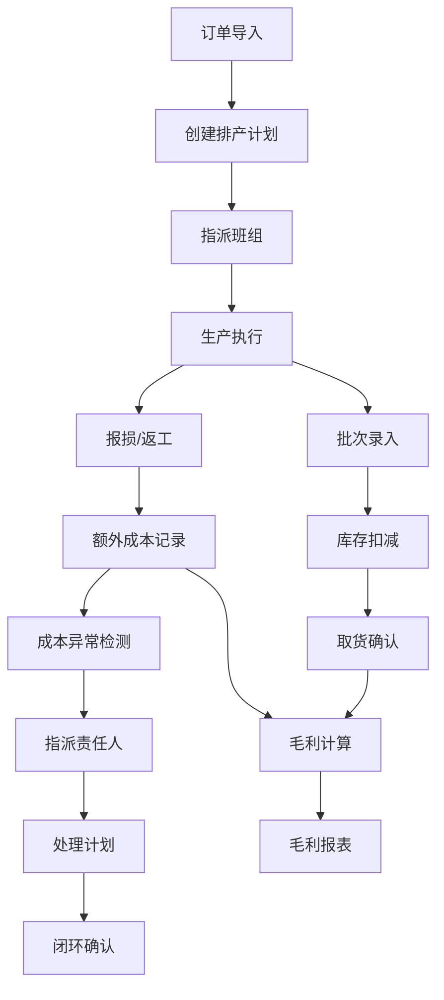

## 1. 产品概述

订单履约台——面向烘焙主理人的生产与成本全栈管理系统，将门店批次录入、取货、报损与后台配方维护、原料成本、订单排产、库存扣减、毛利变化整合为统一平台，帮助主理人实时掌控生产成本与经营利润。

- 解决烘焙门店生产流程碎片化、成本难以追踪、报损与返工缺乏闭环管理的核心痛点
- 目标用户：烘焙品牌主理人、门店店长、生产班组负责人、财务人员

## 2. 核心功能

### 2.1 用户角色

| 角色 | 注册方式 | 核心权限 |
|------|----------|----------|
| 主理人 | 管理员创建 | 全部功能访问、成本异常审批、报表查看 |
| 店长 | 管理员创建 | 门店批次录入、取货确认、报损登记、配方查看 |
| 班组负责人 | 管理员创建 | 排产确认、生产记录填报、返工记录 |
| 财务人员 | 管理员创建 | 毛利报表、成本异常处理、耗材成本分析 |

### 2.2 功能模块

1. **仪表盘**：关键指标概览、成本异常预警、今日排产摘要、近期毛利走势
2. **批次管理**：批次录入、取货登记、报损记录、返工记录、附件与备注
3. **配方管理**：配方维护、原料关联、用量配比、标准成本计算
4. **原料管理**：原料档案、采购成本、供应商信息、成本变动历史
5. **订单排产**：订单导入、排产计划、班组排期、生产进度追踪
6. **库存管理**：实时库存、入库出库、库存扣减记录、低库存预警
7. **毛利分析**：单品毛利、批次毛利、时段毛利对比、成本趋势
8. **成本异常**：异常记录、影响范围、责任人指派、处理计划、跟踪闭环

### 2.3 页面详情

| 页面名称 | 模块名称 | 功能描述 |
|----------|----------|----------|
| 仪表盘 | 关键指标卡片 | 今日产量、报损率、毛利额、异常数 |
| 仪表盘 | 成本异常预警 | 最近7天异常条目高亮，点击可跳转详情 |
| 仪表盘 | 排产摘要 | 今日各班组排产任务列表与状态 |
| 仪表盘 | 毛利走势图 | 近30天毛利变化折线图 |
| 批次管理 | 批次列表 | 支持按日期、产品、班组、状态筛选 |
| 批次管理 | 批次录入 | 新增批次：关联配方、设定数量、指派班组 |
| 批次管理 | 取货登记 | 门店取货确认，自动扣减库存 |
| 批次管理 | 报损记录 | 报损登记：数量、原因、附件、修改历史 |
| 批次管理 | 返工记录 | 返工登记：关联原批次、返工原因、新成本 |
| 批次管理 | 批次详情 | 附件列表、备注、修改历史时间线 |
| 配方管理 | 配方列表 | 搜索、筛选、标准成本对比 |
| 配方管理 | 配方编辑 | 原料选择、用量输入、工艺步骤、损耗率 |
| 原料管理 | 原料列表 | 分类筛选、成本排序、供应商关联 |
| 原料管理 | 原料详情 | 采购历史、成本变动趋势图 |
| 订单排产 | 排产日历 | 日/周视图，班组排期可视化 |
| 订单排产 | 排产任务 | 任务详情、状态流转、班组指派 |
| 库存管理 | 库存总览 | 实时库存量、低库存预警、入库出库流水 |
| 毛利分析 | 毛利报表 | 单品/批次/时段毛利、耗材成本占比 |
| 成本异常 | 异常列表 | 筛选：耗材成本偏高、返工频次、超预算 |
| 成本异常 | 异常详情 | 影响范围、责任人、处理计划、跟踪状态 |

## 3. 核心流程

**生产排产到成本追踪闭环流程**：主理人根据订单创建排产计划，指派班组执行生产；生产完成录入批次并扣减原料库存；取货后确认出库；如出现报损或返工，记录原因并计算额外成本；系统自动计算毛利，成本异常时触发预警并指派责任人跟进处理。

## 4. 用户界面设计

### 4.1 设计风格

- **主色调**：暖棕色 (#8B5E3C) 作为品牌色，搭配奶油白 (#FFF8F0) 背景，传达烘焙行业的温暖质感
- **辅助色**：焦糖橙 (#D4842A) 用于强调和操作按钮，深棕 (#3E2723) 用于标题和正文
- **按钮风格**：圆角 8px，悬停时轻微上浮 + 阴影加深，主操作使用填充色，次要操作使用描边
- **字体**：标题使用 Noto Serif SC 衬线字体，正文使用 Noto Sans SC 无衬线字体
- **布局风格**：左侧固定导航栏 + 顶部面包屑，主内容区卡片式布局
- **图标风格**：线性图标（Lucide），与文字标签配合使用

### 4.2 页面设计概览

| 页面名称 | 模块名称 | UI 元素 |
|----------|----------|----------|
| 仪表盘 | 关键指标卡片 | 4列网格，数字大字+趋势箭头，卡片微阴影 |
| 仪表盘 | 成本异常预警 | 红色边框卡片列表，异常等级标签 |
| 仪表盘 | 排产摘要 | 紧凑表格，状态标签（待产/进行中/已完成） |
| 仪表盘 | 毛利走势图 | 折线图，深色坐标轴，渐变填充 |
| 批次管理 | 批次列表 | 表格+顶部筛选栏，分页，行悬停高亮 |
| 批次管理 | 批次录入/编辑 | 侧滑抽屉表单，分步骤填写 |
| 批次管理 | 批次详情 | 右侧抽屉，时间线展示修改历史 |
| 配方管理 | 配方列表 | 卡片网格，搜索栏，标准成本标签 |
| 配方管理 | 配方编辑 | 全屏模态框，原料选择器+用量表格 |
| 订单排产 | 排产日历 | 周视图日历，班组色块区分 |
| 库存管理 | 库存总览 | 表格+低库存行标红，入库出库标签切换 |
| 毛利分析 | 毛利报表 | 筛选器+柱状图/折线图组合 |
| 成本异常 | 异常列表 | 表格+状态筛选，异常等级色标 |
| 成本异常 | 异常详情 | 模态框：影响范围、责任人选择、处理计划文本域 |

### 4.3 响应式设计

- 桌面端优先（1440px 基准），平板端（768px-1024px）导航折叠为汉堡菜单，移动端（<768px）卡片单列堆叠
- 表格在小屏幕下切换为卡片列表模式

### 4.4 设计氛围

- 整体风格偏向「工业实用主义」：信息密度较高但不拥挤，色彩克制但有温暖感
- 面包屑导航增强空间感，表格行间用极细分割线保持整洁
- 修改历史时间线使用竖向连线+圆点，视觉清晰
