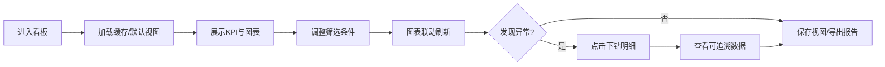

## 1. 产品概述

连锁咖啡店销售与天气影响可视化看板，帮助区域经理和运营团队通过多维度数据分析快速识别业务问题、评估促销效果、制定运营策略。系统整合门店销售、客单价、优惠券、天气、节假日和库存损耗数据，通过交互式图表联动支持下钻分析，日会可直接用于决策讨论。

## 2. 核心功能

### 2.1 用户角色

| 角色 | 使用场景 | 核心需求 |
|------|---------|---------|
| 区域经理 | 每日晨会、周度复盘 | 快速把握整体业绩、识别异常门店、对比促销效果 |
| 运营分析师 | 深度分析、策略制定 | 多维度交叉分析、下钻明细、导出报告 |
| 门店店长 | 门店业绩追踪 | 查看本店排名、天气影响、库存损耗情况 |

### 2.2 功能模块

1. **全局筛选区**: 门店、品类、时段、天气类型、活动批次筛选器，支持多选和级联
2. **KPI概览卡**: 销售额、客单价、订单量、库存损耗率核心指标及同环比
3. **销售趋势分析**: 折线图展示时间维度销售趋势，支持促销活动前后对比
4. **门店热力图**: 地理/矩阵热力图展示各门店销售表现，异常点标注
5. **门店排名榜**: 可排序的门店业绩排名，支持按多指标切换
6. **天气影响分析**: 不同天气类型下的销售表现对比，异常天气标注
7. **时段销量热力图**: 星期×时段二维热力图，识别高峰低谷
8. **活动效果对比**: 促销活动前后同口径数据对比，评估ROI
9. **明细数据面板**: 点击图表下钻查看可追溯明细数据
10. **视图管理**: 保存常用筛选视图，快速切换，支持导出报告

### 2.3 页面详情

| 页面名称 | 模块名称 | 功能描述 |
|---------|---------|----------|
| 主仪表盘 | 全局筛选栏 | 门店多选、品类单选/多选、时段范围、天气类型、活动批次、时间窗口切换（日/周/月） |
| 主仪表盘 | KPI指标卡 | 4个核心指标卡片，显示当前值、同环比变化、趋势小箭头 |
| 主仪表盘 | 销售趋势图 | 多指标折线图，支持活动对比，标注节假日和异常点 |
| 主仪表盘 | 门店热力图 | 矩阵热力图，颜色深浅表示业绩高低，红点标注异常 |
| 主仪表盘 | 门店排名表 | 可排序表格，显示排名、门店名、销售额、客单价、环比、天气影响系数 |
| 主仪表盘 | 天气影响分析 | 分组柱状图，对比不同天气下的销售表现 |
| 主仪表盘 | 时段热力图 | 7×24热力图，展示星期×时段销量分布 |
| 主仪表盘 | 活动对比面板 | 活动前/中/后三期数据对比，计算提升率 |
| 主仪表盘 | 明细抽屉 | 点击图表元素弹出，展示对应明细数据，支持导出 |
| 主仪表盘 | 视图工具栏 | 保存视图、加载视图、导出报告（PDF/Excel）、刷新数据、样本量提示 |

## 3. 核心流程

### 3.1 日常查看流程
用户进入看板 → 系统加载默认视图和缓存数据 → 显示KPI和图表 → 用户调整筛选条件 → 图表联动刷新 → 发现异常点 → 点击下钻查看明细 → 导出报告或保存视图

### 3.2 活动评估流程
选择活动批次筛选器 → 系统自动匹配活动前后时间窗口 → 展示活动对比面板 → 切换不同指标查看效果 → 下钻查看活动期内各门店表现 → 导出活动评估报告

## 4. 用户界面设计

### 4.1 设计风格
- **主色调**: 深咖啡棕 (#6F4E37) 搭配暖米色 (#F5F0E6)，体现咖啡品牌调性
- **辅助色**: 森林绿 (#2E7D32) 表示正向增长，砖红 (#C62828) 表示异常/下降，金色 (#F9A825) 表示促销活动
- **字体**: 标题使用 "Playfair Display" 衬线体体现品质感，正文使用 "Inter" 无衬线体保证可读性
- **布局**: 顶部筛选栏固定，主体采用卡片式网格布局，间距统一使用 4 的倍数
- **卡片风格**: 圆角 12px，轻微阴影，悬停时阴影加深，支持微妙的过渡动画
- **图标**: 使用 Lucide 图标库，线性风格，统一 20px 尺寸

### 4.2 页面设计概览

| 页面名称 | 模块名称 | UI元素 |
|---------|---------|--------|
| 主仪表盘 | 全局筛选栏 | 标签式筛选器、下拉多选、日期范围选择器、时间窗口切换按钮组 |
| 主仪表盘 | KPI指标卡 | 大数字指标、同环比百分比、迷你趋势 sparkline、状态色边框 |
| 主仪表盘 | 图表卡片 | 卡片标题栏含指标切换按钮、ECharts容器、底部样本量提示条 |
| 主仪表盘 | 门店排名表 | 斑马纹表格、排名奖牌图标、进度条可视化、可点击行高亮 |
| 主仪表盘 | 明细抽屉 | 右侧滑入、标题带筛选条件摘要、数据表格、关闭/导出按钮 |
| 主仪表盘 | 视图工具栏 | 右侧悬浮按钮组、视图下拉列表、导出格式选择 |

### 4.3 响应式
- 桌面端优先设计，适配 1440px 及以上宽屏
- 中等屏幕 (1024-1440px): 调整网格列数，KPI卡片横向排列
- 平板端 (768-1024px): 图表单列堆叠，筛选器折叠
- 不强制支持移动端，核心用户为桌面端运营人员

### 4.4 交互动效
- 页面加载: 卡片依次淡入，带 50ms 错开延迟
- 筛选变更: 图表区域显示骨架屏 300-800ms 后平滑过渡
- 图表交互: 悬停高亮、点击涟漪效果、联动时其他图表相关元素闪烁提示
- 抽屉动画: 右侧滑入 250ms ease-out，背景遮罩淡入
- 空状态: 优雅的插画占位，配引导文案和重置按钮
- 加载状态: 骨架屏 + 进度条 + 样本量提示，避免用户焦虑
