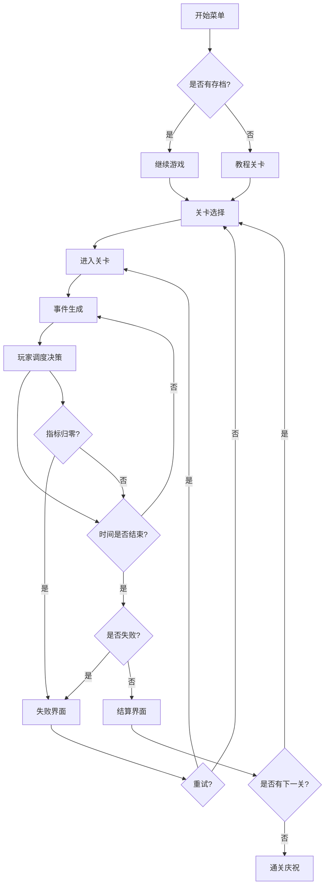

## 1. 产品概述

迷你城市应急调度是一款资源调度模拟游戏，玩家扮演城市应急调度中心指挥官，在暴雨、停电、交通拥堵等灾害中安排维修队和物资路线。核心玩法围绕任务优先级取舍、资源分配和时间管理展开，每次决策都会影响延迟、成本和市民满意度。

- 目标用户：喜欢策略模拟和资源管理类游戏的玩家
- 核心价值：通过紧凑的关卡设计让玩家体验应急调度中的压力与取舍，培养策略思维

## 2. 核心功能

### 2.1 用户角色

| 角色 | 说明 |
|------|------|
| 调度指挥官 | 玩家唯一角色，负责全城应急资源调度 |

### 2.2 功能模块

1. **开始菜单**：游戏标题、开始游戏、继续游戏、设置入口
2. **教程关卡**：引导玩家理解调度操作、任务分配、资源管理
3. **关卡选择**：展示可用关卡及解锁状态
4. **游戏主界面**：城市地图、任务面板、资源面板、时间轴、事件警报
5. **结算界面**：评分、延迟/成本/满意度指标、奖励展示、失败原因
6. **失败重试**：失败原因详细展示、重试/返回关卡选择
7. **设置面板**：音量控制、调试日志开关
8. **调试日志**：实时游戏事件日志，辅助开发与调试

### 2.3 页面详情

| 页面名称 | 模块名称 | 功能描述 |
|----------|----------|----------|
| 开始菜单 | 标题动画 | 城市天际线动画背景，暴雨效果 |
| 开始菜单 | 按钮组 | 开始游戏、继续游戏、设置按钮 |
| 教程关卡 | 引导气泡 | 分步骤引导玩家操作 |
| 教程关卡 | 高亮提示 | 高亮可交互区域 |
| 关卡选择 | 关卡卡片 | 关卡缩略图、难度标签、星级评分、锁定状态 |
| 游戏主界面 | 城市地图 | 网格化城市，显示区域状态（正常/受损/危险） |
| 游戏主界面 | 任务面板 | 当前待处理事件列表，优先级颜色标记 |
| 游戏主界面 | 资源面板 | 维修队/物资数量和状态 |
| 游戏主界面 | 时间轴 | 倒计时进度条，阶段标记 |
| 游戏主界面 | 事件警报 | 新事件弹窗提示，紧急程度动画 |
| 游戏主界面 | 取舍面板 | 分配资源时显示预计延迟/成本/满意度影响 |
| 结算界面 | 三维指标图 | 延迟/成本/满意度雷达图或柱状图 |
| 结算界面 | 奖励展示 | 星级评定、解锁内容 |
| 结算界面 | 事件回放 | 关键决策时间线 |
| 失败重试 | 失败原因 | 红色警告面板，详细失败原因文字 |
| 失败重试 | 操作按钮 | 重试本关/返回关卡选择 |
| 设置面板 | 音量滑块 | 主音量、音效、音乐独立控制 |
| 设置面板 | 调试开关 | 调试日志面板开关 |
| 调试日志 | 日志列表 | 时间戳+事件类型+详情，可滚动查看 |

## 3. 核心流程

玩家从开始菜单进入，选择新游戏或继续存档。首次进入强制教程，完成后解锁关卡选择。每个关卡有固定时长，期间会不断产生应急事件（暴雨、停电、交通拥堵），玩家需要：
1. 查看事件列表，判断优先级
2. 分配维修队到目标区域
3. 规划物资运输路线
4. 在资源有限时做出取舍

关卡结束时进入结算，根据延迟、成本、满意度三项指标评分。任一指标降至零则失败，显示失败原因。成功则获得星级评定和奖励。

## 4. 用户界面设计

### 4.1 设计风格

- **主色调**：深蓝灰（#1a2332）为底，橙红（#ff6b35）为紧急色，翠绿（#00c9a7）为正常色
- **辅助色**：琥珀黄（#ffc107）为警告色，冷灰（#3a4a5c）为卡片底色
- **按钮风格**：圆角矩形，hover时微抬升阴影，紧急操作脉冲动画
- **字体**：标题使用 "Orbitron" 科幻字体，正文使用 "Noto Sans SC" 中文清晰字体
- **布局风格**：左侧地图为主区域，右侧信息面板，底部时间轴
- **图标风格**：线性图标，配合 lucide-react 图标库
- **整体氛围**：指挥中心/调度台风格，深色背景+发光元素+数据可视化

### 4.2 页面设计概览

| 页面名称 | 模块名称 | UI元素 |
|----------|----------|--------|
| 开始菜单 | 背景 | 城市天际线剪影+动态雨滴粒子效果，深蓝渐变 |
| 开始菜单 | 标题 | Orbitron大字，文字发光效果 |
| 开始菜单 | 按钮组 | 琥珀色边框按钮，hover脉冲效果 |
| 游戏主界面 | 城市地图 | 6x6网格，区域颜色表示状态，点击选择目标区域 |
| 游戏主界面 | 任务面板 | 右侧竖向列表，优先级颜色条，倒计时标记 |
| 游戏主界面 | 资源面板 | 图标+数量，拖拽分配到地图区域 |
| 游戏主界面 | 时间轴 | 底部横条，阶段标记，当前时间指示器 |
| 结算界面 | 指标图 | 三项柱状图，颜色渐变填充 |
| 结算界面 | 星级 | 金色星星动画填充 |
| 失败界面 | 警告面板 | 红色边框脉冲，故障风文字效果 |

### 4.3 响应式设计

- 桌面端优先（1200px+）：左右双栏布局
- 平板端（768px-1200px）：地图占满宽度，面板折叠为抽屉
- 移动端（<768px）：单栏，地图/面板切换显示

### 4.4 游戏数据可视化

- 区域状态通过颜色渐变表示：绿（正常）→黄（轻微受损）→橙（严重受损）→红（危险）
- 任务优先级用左侧色条：红（紧急）→橙（重要）→黄（一般）→蓝（低优先）
- 资源状态用进度条和数字组合展示
- 满意度用表情图标+百分比显示
