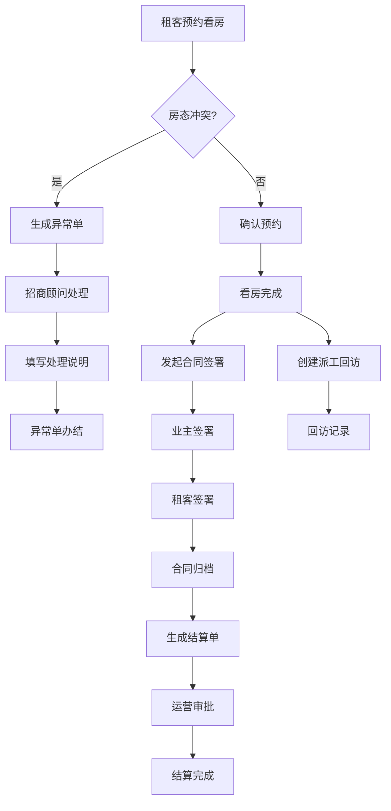

## 1. 产品概述

长租公寓租后服务中心——面向长租公寓运营团队与招商顾问的一体化工作台，涵盖房源展示、预约看房、合同签署、业主结算、派工回访、空置率预警、异常处理及消息/支付重试等全流程，让业务人员可自主维护运营配置，减少对开发团队的依赖。

- 解决长租公寓租后运营流程分散、手工派工效率低、房态冲突处理无记录、空置风险无法预警等痛点
- 目标用户：招商顾问、运营主管、业主、租客

## 2. 核心功能

### 2.1 用户角色

| 角色 | 注册方式 | 核心权限 |
|------|----------|----------|
| 招商顾问 | 管理员分配账号 | 查看房源、预约看房、处理异常单、合同签署、派工办结 |
| 运营主管 | 管理员分配账号 | 派工管理、回访租客、空置率预警查看、业主结算审批、配置维护 |
| 业主 | 邀请注册 | 查看结算单、签署合同 |
| 租客 | 自助注册 | 查看房源、预约看房、在线签约、消息通知 |

### 2.2 功能模块

1. **工作台首页**：待办汇总、空置率预警卡片、今日预约、异常单提醒、快捷操作入口
2. **房源管理**：房源列表、房态看板、房源详情、空置率趋势图
3. **预约看房**：预约列表、新建预约、预约日历、预约状态流转
4. **派工回访**：派工单列表、新建派工、派工状态流转、回访记录
5. **合同签署**：合同模板管理、合同列表、签署流程、合同归档
6. **业主结算**：结算规则配置、结算单列表、结算审批、结算记录
7. **异常处理**：异常单列表、异常详情、处理说明填写、办结确认
8. **消息与支付**：消息发送记录、支付流水、失败重试、处理结果标记
9. **配置中心**：合同模板维护、结算规则维护、预约时段维护、工作流节点配置

### 2.3 页面详情

| 页面名称 | 模块名称 | 功能描述 |
|----------|----------|----------|
| 工作台首页 | 待办汇总 | 显示待处理派工、待回访、待签署合同、待审批结算数量 |
| 工作台首页 | 空置率预警卡片 | 超阈值项目高亮显示，点击跳转详情 |
| 工作台首页 | 今日预约 | 今日看房预约时间线，支持快速导航 |
| 工作台首页 | 异常单提醒 | 未处理异常单计数及最新异常摘要 |
| 房源列表 | 筛选与搜索 | 按区域/户型/状态/空置天数筛选，关键字搜索 |
| 房源列表 | 房态看板 | 看板视图展示空置/已租/维修/预留状态 |
| 房源列表 | 空置率趋势 | 折线图展示近30天空置率变化，支持回看历史数据 |
| 房源详情 | 基本信息 | 房源基础信息、图片、配套设施 |
| 房源详情 | 关联数据 | 关联合同、预约记录、派工记录、结算记录 |
| 预约看房 | 预约列表 | 按状态/日期/顾问筛选，显示预约详情 |
| 预约看房 | 新建预约 | 选择房源、租客、时间段，自动检测冲突 |
| 预约看房 | 预约日历 | 日历视图展示预约分布 |
| 派工回访 | 派工单列表 | 按状态/类型/负责人筛选 |
| 派工回访 | 新建派工 | 选择工单类型、指派负责人、关联房源/租客 |
| 派工回访 | 回访记录 | 回访租客满意度、问题记录、跟进计划 |
| 合同签署 | 合同模板管理 | 新增/编辑合同模板，支持字段占位符 |
| 合同签署 | 合同列表 | 按状态/类型筛选，显示签署进度 |
| 合同签署 | 签署流程 | 发起签署→业主签署→租客签署→归档 |
| 业主结算 | 结算规则配置 | 按项目/房型配置结算周期和规则 |
| 业主结算 | 结算单列表 | 按状态/月份筛选，显示结算金额 |
| 业主结算 | 结算审批 | 审批通过/驳回，填写审批意见 |
| 异常处理 | 异常单列表 | 按类型/状态筛选，房态冲突异常高亮 |
| 异常处理 | 异常详情 | 异常原因、关联房源/预约，处理说明必填 |
| 异常处理 | 办结确认 | 招商顾问填写处理说明后方可办结 |
| 消息与支付 | 消息记录 | 按类型/状态筛选，显示发送结果 |
| 消息与支付 | 支付流水 | 按状态/日期筛选，显示支付详情 |
| 消息与支付 | 失败重试 | 对失败消息/支付一键重试，标记处理结果 |
| 配置中心 | 合同模板维护 | 业务人员可新增/修改合同模板 |
| 配置中心 | 结算规则维护 | 业务人员可调整结算规则 |
| 配置中心 | 预约时段维护 | 配置可预约时间段和间隔 |
| 配置中心 | 工作流节点配置 | 配置流程节点及审批人 |

## 3. 核心流程

### 3.1 预约看房流程
租客选择房源→选择时段→系统检测房态冲突→冲突则生成异常单→无冲突则确认预约→招商顾问跟进→看房完成→回访记录

### 3.2 派工回访流程
运营主管创建派工单→指派招商顾问→顾问处理→回访租客→记录满意度→办结

### 3.3 合同签署流程
招商顾问发起签署→填充模板→业主签署→租客签署→合同归档→触发业主结算

### 3.4 业主结算流程
合同签署完成→系统按规则生成结算单→运营主管审批→结算完成→通知业主

### 3.5 异常处理流程
房态冲突/系统异常→自动生成异常单→招商顾问处理→填写处理说明→办结

### 3.6 消息/支付重试流程
消息发送/支付执行→成功则标记成功→失败则标记失败→运营人员触发重试→标记处理结果

## 4. 用户界面设计

### 4.1 设计风格
- 主色调：深蓝灰 (#1E293B) + 暖橙强调色 (#F97316)，体现专业与活力
- 辅助色：翡翠绿 (#10B981) 表示成功/已租，琥珀黄 (#F59E0B) 表示警告/待处理，玫红 (#EF4444) 表示异常/失败
- 按钮风格：圆角8px，主按钮实心填充，次按钮描边
- 字体：正文使用系统无衬线字体，数据展示使用等宽字体
- 布局风格：左侧固定导航栏 + 顶部面包屑 + 内容区卡片布局
- 图标风格：线性图标（Lucide），尺寸统一16/20/24px

### 4.2 页面设计概览

| 页面名称 | 模块名称 | UI元素 |
|----------|----------|--------|
| 工作台首页 | 待办汇总 | 四宫格卡片，各色图标+数字，悬停微浮起 |
| 工作台首页 | 空置率预警 | 渐变背景卡片，阈值超限红色脉冲动画 |
| 工作台首页 | 今日预约 | 时间轴布局，左时间右内容，状态色条 |
| 房源列表 | 筛选区 | 顶栏多条件下拉+搜索框，折叠展开 |
| 房源列表 | 看板视图 | 四列看板，卡片拖拽，状态色标 |
| 房源列表 | 空置率趋势 | 面积折线图，悬停显示数据点 |
| 预约看房 | 预约日历 | 月历网格，预约点标记，点击展开详情 |
| 派工回访 | 派工单列表 | 表格+状态标签+操作按钮 |
| 合同签署 | 签署流程 | 步骤条，当前步骤高亮，已完成打勾 |
| 业主结算 | 结算审批 | 审批弹窗，金额大字展示，通过/驳回按钮 |
| 异常处理 | 异常详情 | 异常原因高亮框，处理说明文本域必填，办结按钮禁用至填写完成 |
| 消息与支付 | 重试操作 | 行内重试按钮，点击后loading→结果标记 |
| 配置中心 | 规则编辑 | 表单+预览，保存确认弹窗 |

### 4.3 响应式设计
- 桌面端优先（1280px+），侧边栏固定240px
- 平板端（768-1279px），侧边栏收起为图标模式
- 移动端（<768px），侧边栏隐藏，底部标签导航

### 4.4 设计亮点
- 工作台首页数据卡片入场错位动画
- 房态看板卡片悬停3D微倾斜效果
- 空置率超阈值脉冲预警动画
- 签署流程步骤条渐进动画
- 异常单红色边框呼吸灯效果
