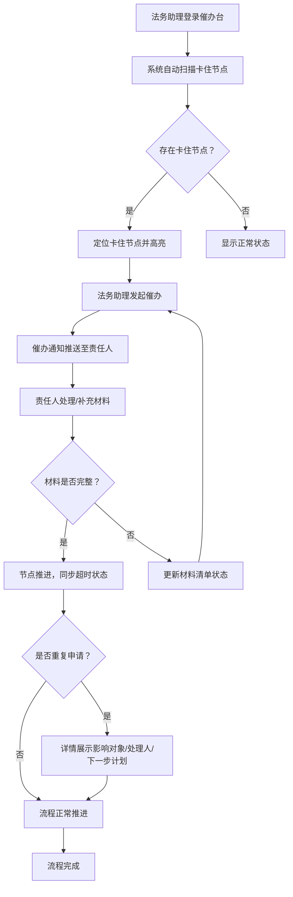

## 1. 产品概述

法务合同盖章节点催办台，面向法务助理及审批相关人员，解决合同盖章流程中节点卡顿、材料缺失、催办无追踪的痛点。系统自动定位卡住节点、催办责任人、追踪材料补齐进度，并统计材料完整率，确保合同盖章流程高效闭环。

- 核心用户：法务助理（后台管理）、审批责任人（被催办方）、普通员工（手机查看进度）
- 目标：将合同盖章平均耗时缩短 30%，材料完整率提升至 95% 以上

## 2. 核心功能

### 2.1 用户角色

| 角色 | 注册方式 | 核心权限 |
|------|----------|----------|
| 法务助理 | 管理员分配账号 | 管理催办台、发起催办、查看统计、管理材料清单 |
| 审批责任人 | 系统自动关联 | 处理审批节点、接收催办通知、补充材料 |
| 普通员工 | 手机端自助查询 | 查看合同审批进度、确认重复申请 |

### 2.2 功能模块

1. **催办台总览**：卡住节点列表、超时预警、催办状态统计、材料完整率
2. **审批流程详情**：节点时间线、催办记录、材料清单、重复申请详情
3. **材料清单管理**：缺失材料列表、补齐进度、完整率统计
4. **数据统计面板**：流程耗时分析、催办频次、节点超时排行
5. **移动端进度页**：员工手机查看审批进度、节点状态

### 2.3 页面详情

| 页面名称 | 模块名称 | 功能描述 |
|----------|----------|----------|
| 催办台总览 | 卡住节点卡片 | 展示当前所有卡住的审批节点，按超时时间倒序排列，高亮超时最久的节点 |
| 催办台总览 | 催办状态看板 | 统计待催办/已催办/已处理数量，环形图展示 |
| 催办台总览 | 材料完整率 | 饼图展示材料完整/缺失/补齐中的比例 |
| 催办台总览 | 超时预警列表 | 即将超时和已超时的节点列表，带倒计时 |
| 审批流程详情 | 节点时间线 | 垂直时间线展示每个审批节点的状态、处理人、耗时 |
| 审批流程详情 | 催办记录 | 当前合同所有催办记录，含催办时间、方式、回复状态 |
| 审批流程详情 | 材料清单 | 列出全部所需材料，标注已提交/缺失/补齐中 |
| 审批流程详情 | 重复申请详情 | 当检测到重复申请时，展示影响对象、处理人、下一步计划 |
| 材料清单管理 | 缺失材料总表 | 按合同分组展示所有缺失材料，支持批量催补 |
| 材料清单管理 | 补齐进度追踪 | 每项材料的补齐状态、预计完成时间、实际完成时间 |
| 数据统计面板 | 流程耗时分析 | 各节点平均耗时柱状图、P90 耗时趋势 |
| 数据统计面板 | 催办频次统计 | 按责任人/部门统计催办次数 |
| 数据统计面板 | 节点超时排行 | 超时次数最多的节点 TOP 排行 |
| 移动端进度页 | 进度时间线 | 精简版节点时间线，适配手机竖屏 |
| 移动端进度页 | 快速操作 | 一键确认/补充材料入口 |

## 3. 核心流程

法务助理登录催办台，系统自动扫描所有合同盖章流程，定位卡住的审批节点。法务助理可对卡住节点发起催办，催办通知自动推送至责任人。责任人补充材料后节点自动推进，处理完成同步更新超时状态。若检测到重复申请，详情页展示影响分析。普通员工可通过手机随时查看审批进度。



员工查看进度流程：

```mermaid
flowchart TD
    A1["员工手机访问"] --> B1["输入合同编号/扫码"]
    B1 --> C1["查看审批进度时间线"]
    C1 --> D1{"需要补充材料？"}
    D1 -->|"是"| E1["点击补充材料入口"]
    D1 -->|"否"| F1["继续等待审批"]
    E1 --> G1["提交材料"]
    G1 -> F1
```

## 4. 用户界面设计

### 4.1 设计风格

- 主色调：深蓝灰 (#1E293B) + 琥珀色警告 (#F59E0B) + 翡翠绿完成 (#10B981)
- 辅助色：石板灰 (#64748B) + 珊瑚红异常 (#EF4444)
- 按钮风格：圆角 6px，轻微阴影，状态色填充
- 字体：思源黑体/Noto Sans SC，标题 16-20px，正文 13-14px，辅助 12px
- 布局风格：左侧导航 + 右侧内容区，卡片式模块，顶部统计摘要条
- 图标风格：线性图标 (Lucide)，与 Ant Design 图标体系一致
- 整体基调：专业、高效、信息密度适中，法务场景偏严肃但不压抑

### 4.2 页面设计概述

| 页面名称 | 模块名称 | UI 元素 |
|----------|----------|---------|
| 催办台总览 | 卡住节点卡片 | 白底卡片，左侧红色超时标记，右侧耗时数字，底部催办按钮 |
| 催办台总览 | 催办状态看板 | Ant Design Statistic + 环形图，三色区分状态 |
| 催办台总览 | 材料完整率 | 环形进度条 + 百分比数字，中心大字 |
| 催办台总览 | 超时预警列表 | 表格行，超时列红色渐变背景，倒计时组件 |
| 审批流程详情 | 节点时间线 | Ant Design Steps/Timeline，每节点含状态图标、时间戳 |
| 审批流程详情 | 催办记录 | 时间线列表，催办方式标签（短信/邮件/系统消息） |
| 审批流程详情 | 材料清单 | Ant Design Table，行状态色标注（绿/黄/红） |
| 审批流程详情 | 重复申请详情 | Alert 组件 + 描述列表，红色边框突出警示 |
| 数据统计面板 | 流程耗时分析 | Ant Design Chart 柱状图 |
| 数据统计面板 | 催办频次统计 | Ant Design Chart 条形图 |
| 数据统计面板 | 节点超时排行 | Ant Design Chart 排行榜 |
| 移动端进度页 | 进度时间线 | 竖向 Steps，卡片式节点，底部操作栏 |

### 4.3 响应式设计

- 桌面端优先，后台管理页面适配 1280px+ 宽度
- 移动端进度页单独适配 375px-428px 竖屏，使用 Ant Design Mobile 风格
- 催办台总览在平板端（768px-1024px）自动折叠侧边栏
- 触控优化：移动端按钮最小 44px 点击区域

### 4.4 3D 场景指导

不适用
