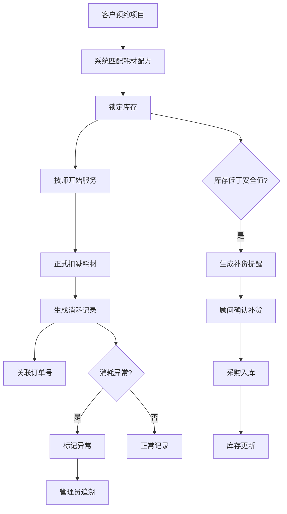
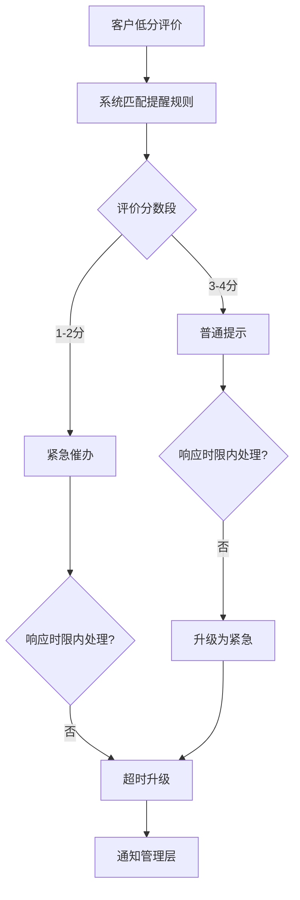

## 1. 产品概述

美甲门店库存消耗台——面向美甲店老板的门店运营管理平台，解决耗材消耗不透明、库存管理混乱、技师绩效与耗材脱钩等核心痛点。通过预约项目自动扣减耗材、库存统计与补货提醒、消耗异常追溯订单、顾问提成与耗材联动分析，实现门店精细化运营。

## 2. 核心功能

### 2.1 用户角色

| 角色 | 注册方式 | 核心权限 |
|------|----------|----------|
| 店老板（管理员） | 系统分配 | 全部功能：看板、统计、配置、库存管理 |
| 前台（顾问） | 管理员创建 | 预约管理、订单查看、客户评价录入 |
| 技师 | 管理员创建 | 查看自己预约、耗材消耗、评价查看 |

### 2.2 功能模块

1. **生产看板**：实时门店运营总览，库存告警、今日预约、消耗统计、异常提醒
2. **耗材管理**：产品库存列表、入库/出库记录、报损登记、补货提醒
3. **预约订单**：技师预约项目时自动扣减耗材，订单与耗材消耗关联
4. **消耗分析**：顾问提成、项目价格、耗材消耗三维列表，异常追溯
5. **评价提醒**：低分评价触发提醒规则，分层处理（普通/紧急/超时升级）
6. **记录详情**：附件上传、备注编辑、修改历史追溯

### 2.3 页面详情

| 页面名称 | 模块名称 | 功能描述 |
|----------|----------|----------|
| 生产看板 | 库存告警卡片 | 低于安全库存的耗材红色高亮，补货按钮直达 |
| 生产看板 | 今日预约概览 | 预约数量、到店率、进行中/已完成/未到统计 |
| 生产看板 | 消耗趋势图 | 近7天/30天耗材消耗折线图 |
| 生产看板 | 异常提醒列表 | 消耗异常订单、低分评价待处理项 |
| 耗材管理 | 产品库存列表 | 产品名称、分类、当前库存、安全库存、状态标签 |
| 耗材管理 | 入库/出库记录 | 按时间倒序，支持筛选产品、类型、操作人 |
| 耗材管理 | 报损登记 | 选择产品、数量、原因、附件上传 |
| 耗材管理 | 补货提醒 | 根据消耗速率预测，自动生成补货建议 |
| 预约订单 | 预约列表 | 日期、技师、客户、项目、状态筛选 |
| 预约订单 | 订单详情 | 项目明细、耗材扣减清单、客户评价、金额 |
| 消耗分析 | 顾问提成表 | 按顾问统计：完成项目数、提成金额、耗材成本 |
| 消耗分析 | 项目价格分析 | 项目定价 vs 耗材成本对比，毛利率排行 |
| 消耗分析 | 耗材消耗排行 | 按耗材统计消耗量、关联订单数、异常标记 |
| 消耗分析 | 异常追溯 | 从异常耗材追溯到关联订单、技师、时间 |
| 评价提醒 | 提醒列表 | 按紧急程度分层：普通提示、紧急催办、超时升级 |
| 评价提醒 | 提醒规则配置 | 按评价分数段配置提醒级别和响应时限 |
| 记录详情 | 附件管理 | 上传/下载附件（图片、文档） |
| 记录详情 | 备注编辑 | 富文本备注，自动记录编辑人和时间 |
| 记录详情 | 修改历史 | 按时间线展示字段变更记录（旧值→新值） |

## 3. 核心流程

### 预约扣减流程
客户预约美甲项目 → 系统匹配项目耗材配方 → 预约确认时锁定库存 → 技师开始服务时正式扣减 → 生成耗材消耗记录 → 关联订单号

### 库存补货流程
库存低于安全值 → 系统生成补货提醒 → 顾问确认补货单 → 采购入库 → 库存更新 → 提醒关闭

### 异常追溯流程
系统检测消耗异常（单次消耗超标/频率异常） → 标记异常订单 → 管理员查看详情 → 追溯到技师、预约、耗材批次

## 4. 用户界面设计

### 4.1 设计风格
- **主色调**：深玫瑰金（#B76E79）+ 暖白底（#FFF8F6），呼应美甲行业精致感
- **辅助色**：灰玫瑰（#9E8A8F）用于次要文字，薄荷绿（#7BC8A4）用于正向状态，珊瑚红（#E85D5D）用于告警
- **按钮风格**：圆角（8px），主按钮填充玫瑰金，次按钮描边风格
- **字体**：标题用 Noto Serif SC 衬线体，正文用 Noto Sans SC
- **布局风格**：左侧导航 + 右侧内容区，卡片式模块布局
- **图标**：Lucide Icons 图标库

### 4.2 页面设计概览

| 页面名称 | 模块名称 | UI 元素 |
|----------|----------|----------|
| 生产看板 | 库存告警卡片 | 玫瑰金边框卡片，红色告警标签，补货按钮 |
| 生产看板 | 今日预约概览 | 圆环进度图（到店率），数字统计卡片 |
| 生产看板 | 消耗趋势图 | 折线图（ECharts），7天/30天切换 |
| 生产看板 | 异常提醒 | 红点标记列表项，紧急程度颜色区分 |
| 耗材管理 | 产品库存列表 | 表格+状态标签，搜索栏+分类筛选 |
| 耗材管理 | 入库/出库记录 | 时间轴列表，类型图标区分 |
| 耗材管理 | 报损登记 | 弹窗表单，附件上传区 |
| 耗材管理 | 补货提醒 | 卡片列表，消耗速率进度条 |
| 预约订单 | 预约列表 | 日期选择器+表格，状态标签颜色区分 |
| 预约订单 | 订单详情 | 抽屉式面板，耗材扣减清单+评价展示 |
| 消耗分析 | 顾问提成表 | 数据表格，提成柱状图 |
| 消耗分析 | 项目价格分析 | 横向对比条形图，毛利率标签 |
| 消耗分析 | 耗材消耗排行 | 排行榜卡片，异常标红 |
| 消耗分析 | 异常追溯 | 面包屑导航链：耗材→订单→技师 |
| 评价提醒 | 提醒列表 | 三栏颜色分区（绿/橙/红），倒计时标签 |
| 评价提醒 | 提醒规则配置 | 规则卡片，分数段滑块+时限输入 |
| 记录详情 | 附件管理 | 缩略图网格，上传拖拽区 |
| 记录详情 | 备注编辑 | 富文本编辑器，自动保存 |
| 记录详情 | 修改历史 | 垂直时间线，字段变更高亮 |

### 4.3 响应式设计
- 桌面优先（1440px基准），平板（768px）侧边栏折叠，手机（375px）单列布局
- 表格在移动端转为卡片列表
- 看板图表自适应宽度

### 4.4 3D 场景
- 不适用
