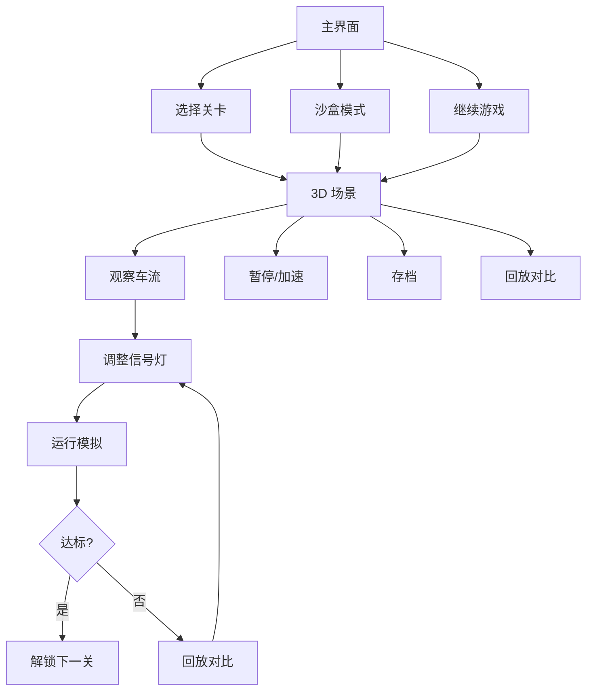

## 1. 产品概述

城市路口信号灯策略模拟游戏 Demo —— 玩家通过调整红绿灯周期与公交优先规则，疏导早晚高峰车流，降低拥堵评分。面向策略/模拟类玩家，核心价值在于"调节—观察—优化"的循环反馈，同时提供关卡渐进与沙盒自由模式，方便后续扩展内容与难度曲线。

## 2. 核心功能

### 2.1 用户角色

| 角色 | 说明 |
|------|------|
| 玩家 | 单人模式，调整信号灯策略、观察车流、挑战关卡 |

### 2.2 功能模块

1. **主界面**：关卡选择、沙盒入口、设置、继续游戏
2. **游戏界面**：3D 路口场景、信号灯面板、车流实时渲染、公交路线、拥堵仪表盘
3. **回放与对比界面**：策略调整前后指标对比、回放时间轴
4. **关卡编辑/配置界面**：路口布局配置、车流参数、信号灯预设
5. **设置界面**：音量、画质、重置存档

### 2.3 页面详情

| 页面名称 | 模块名称 | 功能描述 |
|----------|----------|----------|
| 主界面 | 关卡列表 | 显示关卡缩略图、星级、拥堵评分、锁定/解锁状态 |
| 主界面 | 沙盒入口 | 进入自由编辑模式 |
| 主界面 | 继续游戏 | 读取最近存档快速进入 |
| 游戏界面 | 3D 路口场景 | WebGL 渲染道路网、车辆、信号灯、公交 |
| 游戏界面 | 信号灯控制面板 | 调整各方向红绿灯周期、公交优先开关 |
| 游戏界面 | 拥堵仪表盘 | 实时拥堵评分、等待时长、通行量 |
| 游戏界面 | 时间控制 | 暂停、1x/2x/4x 加速、重开 |
| 游戏界面 | 回放对比 | 调整后回放效果、指标对比面板 |
| 游戏界面 | 存档管理 | 快速存档/读档槽位 |
| 回放与对比界面 | 时间轴 | 拖动回放进度，标记关键事件 |
| 回放与对比界面 | 指标图表 | 调整前后拥堵评分、通行量对比折线图 |
| 关卡编辑界面 | 路口编辑 | 添加/删除路口、连接道路 |
| 关卡编辑界面 | 参数配置 | 车流密度、公交频率、高峰时段设置 |
| 关卡编辑界面 | 导出配置 | 导出 JSON 关卡数据 |
| 设置界面 | 音频设置 | 主音量、音效音量、背景音乐音量滑块 |
| 设置界面 | 画质设置 | 低/中/高画质切换 |
| 设置界面 | 存档管理 | 存档列表、删除存档 |

## 3. 核心流程

1. **关卡流程**：选择关卡 → 查看目标（目标拥堵评分）→ 进入 3D 场景 → 观察初始车流 → 调整信号灯周期 → 运行模拟 → 查看拥堵评分 → 回放对比 → 达成目标则解锁下一关
2. **沙盒流程**：进入沙盒 → 自由编辑路口布局 → 配置车流参数 → 运行模拟 → 随意调整与观察
3. **回放对比流程**：记录调整前快照 → 执行调整 → 回放调整后模拟 → 对比前后指标图表

## 4. 用户界面设计

### 4.1 设计风格

- **整体风格**：工业仪表盘 + 夜间城市俯瞰感，深色主题为主
- **主色调**：深灰/炭黑底色 (#1a1a2e)，交通灯三色为点缀（红 #e74c3c、黄 #f1c40f、绿 #2ecc71）
- **辅助色**：天青蓝 (#0abde3) 用于信息提示、公交标识用蓝白条纹
- **按钮风格**：圆角矩形，微 3D 凸起，hover 发光效果
- **字体**：显示字体用 Orbitron（科技仪表感），正文用 Noto Sans SC（中文可读性）
- **布局风格**：左侧 3D 场景占主区域，右侧面板叠加半透明 HUD 面板
- **图标风格**：线条图标（lucide-react），搭配信号灯圆形状态指示

### 4.2 页面设计概览

| 页面名称 | 模块名称 | UI 元素 |
|----------|----------|---------|
| 主界面 | 关卡列表 | 卡片网格布局，每卡片含缩略图、关卡名、星级、拥堵评分条、锁定遮罩 |
| 主界面 | 沙盒入口 | 独立大按钮，虚线边框，提示文字"自由模式" |
| 游戏界面 | 3D 场景 | 占屏幕 70%，俯视/斜 45° 可切换，可拖拽旋转 |
| 游戏界面 | 信号灯面板 | 右侧半透明面板，每方向一行：方向名、周期滑块、绿时长滑块、公交优先开关 |
| 游戏界面 | 拥堵仪表盘 | 顶部半透明条，拥堵评分环形图、等待时长数值、通行量数值 |
| 游戏界面 | 时间控制 | 底部中央：暂停/播放、1x/2x/4x 按钮、重开按钮 |
| 游戏界面 | 回放对比 | 底部滑出面板：前后对比折线图、关键指标差异高亮 |
| 设置界面 | 音频设置 | 三条滑块：主音量、音效、BGM，带图标 |
| 设置界面 | 存档管理 | 存档卡片列表，含时间戳、关卡名、删除按钮 |

### 4.3 响应式

- 桌面优先设计，最低 1280x720
- 3D 场景自适应容器尺寸
- 面板在小屏下可折叠为抽屉

### 4.4 3D 场景指导

- **环境**：夜间城市氛围，低环境光 + 路灯光源点，地面微反光
- **光照**：方向光模拟月光，点光源模拟路灯和信号灯发光，车辆自带前灯
- **摄像机**：默认斜 45° 俯视，可鼠标拖拽旋转与缩放，支持俯视正交切换
- **构图**：路口居中，道路延伸至边缘，车辆从边缘进入/离开
- **交互**：点击信号灯选中编辑，hover 高亮道路段
- **动画**：车辆平滑移动、信号灯切换渐变、公交车特殊标识闪烁
- **后处理**：Bloom 效果（信号灯发光）、环境遮蔽
- **性能预算**：同屏车辆 ≤ 200，保持 30fps+

## 5. 关卡难度设计

| 关卡 | 名称 | 路口数 | 车流密度 | 高峰时段 | 公交 | 特殊机制 | 目标评分 |
|------|------|--------|----------|----------|------|----------|----------|
| 1 | 十字路口 | 1 | 低 | 无 | 无 | 无 | ≤ 30 |
| 2 | 早高峰 | 1 | 中 | 早高峰 | 1条 | 公交优先 | ≤ 40 |
| 3 | 双路口联动 | 2 | 中 | 双高峰 | 2条 | 绿波带 | ≤ 50 |
| 4 | 复杂枢纽 | 3 | 高 | 双高峰 | 3条 | 转向信号 | ≤ 60 |
| 5 | 终极挑战 | 4 | 极高 | 三高峰 | 4条 | 全机制 | ≤ 70 |

## 6. 数据记录

试玩过程中记录以下数据：
- 每关用时（秒）
- 每关失败次数（未达标重试）
- 关键选择：每次信号灯调整的参数快照（周期值、公交优先开关状态）
- 拥堵评分变化历史
