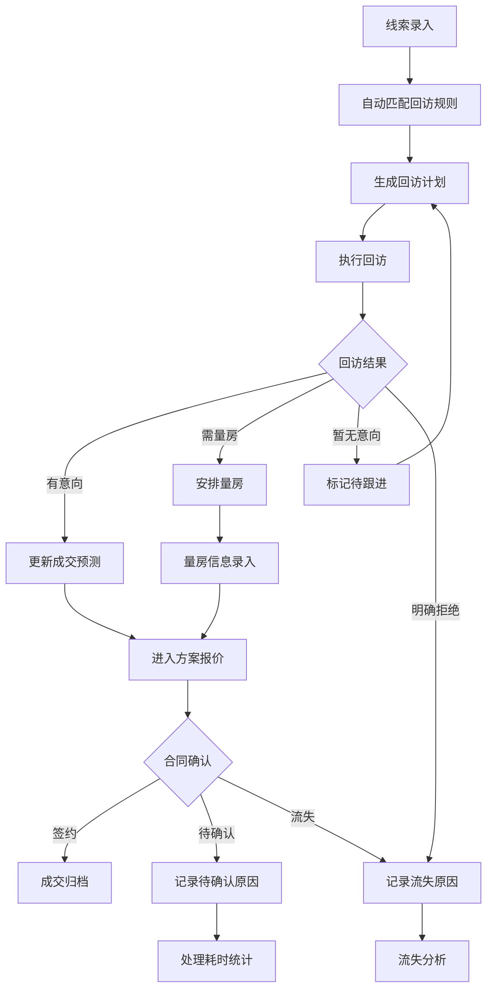

## 1. 产品概述
装修线索回访提醒台是一款面向装修销售经理和内部运营人员的线索管理与回访调度系统，基于客户画像台理念构建。系统解决装修行业线索跟进不及时、回访规则分散、成交预测缺乏数据支撑等痛点，帮助销售团队精准把控每条线索的跟进节奏，降低线索流失率，提升成交转化效率。

- 目标用户：装修公司销售经理、销售顾问、运营主管、系统管理员
- 核心价值：通过结构化的回访规则引擎与成交预测模型，将线索从获取到成交的全生命周期可视化、可量化、可追溯

## 2. 核心功能

### 2.1 用户角色

| 角色 | 注册方式 | 核心权限 |
|------|----------|----------|
| 系统管理员 | 管理员创建 | 全部功能权限，包括配置管理、角色管理、字典管理 |
| 销售经理 | 管理员创建 | 查看团队线索、设置回访规则、查看成交预测、查看报表 |
| 销售顾问 | 管理员创建 | 查看个人线索、执行回访计划、录入量房信息、更新线索状态 |
| 运营主管 | 管理员创建 | 查看线索质量报表、流失分析、标签管理、配置管理 |

### 2.2 功能模块

1. **线索看板页**：装修需求总览、量房信息展示、线索状态流转、快捷筛选
2. **回访规则页**：回访规则配置、提醒设置、生效范围管理、规则优先级
3. **成交预测页**：预测明细列表、预测评分、历史转化率、风险线索标记
4. **回访计划页**：待回访列表、回访日历、批量操作、回访结果录入
5. **流失分析页**：流失原因统计、流失趋势图、流失预警、挽回建议
6. **客户标签页**：标签定义、批量打标、标签组合查询、标签画像
7. **线索报表页**：线索质量分析、合同待确认原因、处理耗时统计、责任人绩效
8. **系统配置页**：字典管理、提醒模板、生效范围配置、角色权限管理

### 2.3 页面详情

| 页面名称 | 模块名称 | 功能描述 |
|----------|----------|----------|
| 线索看板 | 装修需求卡片 | 展示客户装修需求详情：户型、面积、预算区间、装修风格偏好、期望开工时间 |
| 线索看板 | 量房信息面板 | 展示量房记录：量房时间、量房人员、房屋实测面积、结构备注、现场照片 |
| 线索看板 | 状态流转时间线 | 线索从获客→初访→量房→方案→报价→签约/流失的完整时间线 |
| 线索看板 | 快捷筛选栏 | 按状态、来源、时间、责任人等维度快速筛选线索 |
| 回访规则 | 规则列表 | 展示所有回访规则，支持按优先级排序、启用/禁用切换 |
| 回访规则 | 规则编辑器 | 可视化配置回访触发条件（如：线索状态变更后X小时未跟进）、提醒方式、提醒对象 |
| 回访规则 | 生效范围选择器 | 按部门、角色、线索来源等维度设置规则生效范围 |
| 成交预测 | 预测明细表 | 每条线索的成交概率评分、关键影响因素、预测更新时间 |
| 成交预测 | 转化漏斗 | 各阶段转化率可视化，高亮瓶颈环节 |
| 成交预测 | 风险线索列表 | 成交概率骤降的线索列表，标注风险原因 |
| 回访计划 | 待回访队列 | 按紧急程度排列的今日/本周待回访线索 |
| 回访计划 | 回访日历 | 日历视图展示回访安排，支持拖拽调整 |
| 回访计划 | 回访结果录入 | 录入回访方式（电话/微信/上门）、回访内容摘要、下次回访时间 |
| 回访计划 | 批量操作 | 批量分配、批量延期、批量标记状态 |
| 流失分析 | 流失原因统计 | 各流失原因占比饼图：价格不符、工期冲突、竞品签约等 |
| 流失分析 | 流失趋势 | 按月/周统计的流失率趋势折线图 |
| 流失分析 | 流失预警 | 根据行为特征自动标记可能流失的线索 |
| 客户标签 | 标签定义管理 | 新增/编辑/停用标签，支持标签分组和层级 |
| 客户标签 | 批量打标 | 勾选多条线索后批量添加/移除标签 |
| 客户标签 | 标签组合查询 | 通过标签组合条件精确筛选客户群体 |
| 客户标签 | 标签画像 | 按标签维度生成客户画像分布图 |
| 线索报表 | 线索质量分析 | 各渠道线索质量评分、有效率、转化率对比 |
| 线索报表 | 合同待确认原因 | 待确认合同的原因分类统计及明细 |
| 线索报表 | 处理耗时分析 | 各环节平均处理时长、超时占比、责任人对比 |
| 线索报表 | 责任人绩效 | 按责任人统计的线索量、回访率、成交率排名 |
| 系统配置 | 字典管理 | 管理系统中所有下拉选项的枚举值：线索来源、装修风格、流失原因等 |
| 系统配置 | 提醒模板 | 管理各类提醒的文案模板和推送渠道配置 |
| 系统配置 | 生效范围配置 | 统一管理各规则、模板、权限的生效范围定义 |
| 系统配置 | 角色权限管理 | 角色 CRUD、权限分配、数据范围控制 |

## 3. 核心流程

线索从获取到成交/流失的全生命周期管理流程：

1. 线索录入（来源：线上表单/转介绍/展会等）→ 自动匹配回访规则 → 生成首次回访计划
2. 销售顾问执行回访 → 录入回访结果 → 系统根据结果更新预测评分 → 触发下一轮回访计划
3. 量房安排 → 量房信息录入 → 方案报价阶段 → 合同确认或流失
4. 流失线索进入流失分析 → 记录流失原因 → 纳入报表统计

## 4. 用户界面设计

### 4.1 设计风格

- **主色调**：深蓝灰（#1E293B）作为主色，搭配琥珀色（#F59E0B）作为强调色，传递专业可靠与活力
- **辅助色**：石板灰（#64748B）用于次要信息，翠绿（#10B981）用于正向指标，玫红（#EF4444）用于预警/风险
- **按钮风格**：圆角 6px，主按钮深蓝灰底白字，次按钮白底深蓝灰描边
- **字体**：标题使用 Noto Sans SC Bold，正文使用 Noto Sans SC Regular，数字使用 JetBrains Mono
- **布局风格**：左侧固定导航栏 + 顶部面包屑 + 主内容区，卡片式内容组织
- **图标风格**：线性图标，统一 20px，使用 Lucide 图标库

### 4.2 页面设计概览

| 页面名称 | 模块名称 | UI 元素 |
|----------|----------|----------|
| 线索看板 | 装修需求卡片 | 白色卡片，左上角状态色带，悬停提升阴影；网格布局，4列自适应 |
| 线索看板 | 量房信息面板 | 侧边抽屉滑出，表单+图片预览混合布局 |
| 线索看板 | 状态时间线 | 垂直时间线组件，节点颜色随状态变化 |
| 回访规则 | 规则编辑器 | 分步表单，条件选择器+动作配置器组合 |
| 回访规则 | 生效范围 | 树形选择器（部门/角色多选） |
| 成交预测 | 预测明细表 | 数据表格，概率列使用进度条+颜色编码（绿→黄→红） |
| 成交预测 | 转化漏斗 | 水平漏斗图，动画过渡 |
| 回访计划 | 回访日历 | 月视图日历，事件色块标记，拖拽交互 |
| 流失分析 | 流失原因统计 | 环形图+右侧明细列表联动 |
| 客户标签 | 批量打标 | 表格多选+浮动操作栏 |
| 客户标签 | 标签画像 | 雷达图+分布柱状图 |
| 线索报表 | 线索质量 | 混合图表（柱状+折线），支持时间范围切换 |
| 系统配置 | 字典管理 | 树形表格，支持拖拽排序 |

### 4.3 响应式设计

- 桌面优先设计，主要在 1440px 及以上分辨率使用
- 平板端（768px-1024px）导航栏折叠为图标模式，卡片改为 2 列
- 移动端（768px 以下）底部 Tab 导航，卡片单列，表格改为卡片列表

### 4.4 交互设计要点

- 所有表格支持排序、筛选、分页，避免频繁导表核对
- 批量操作提供确认弹窗和操作结果反馈
- 关键操作（删除规则、批量修改状态）需二次确认
- 数据变更后实时更新关联视图，减少手动刷新
