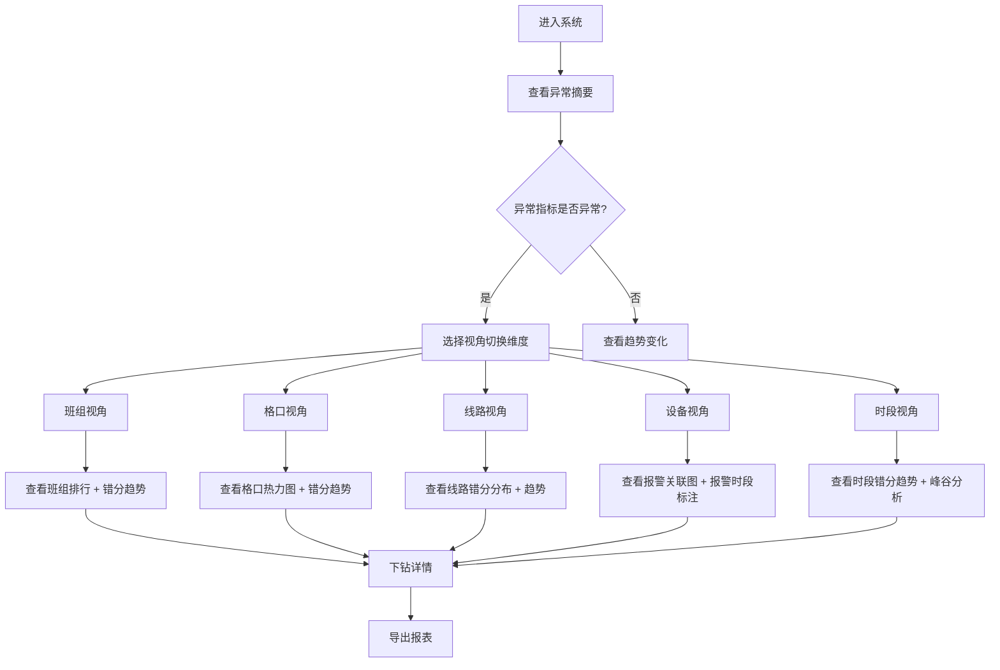

## 1. 产品概述

物流分拣错分率分析系统——面向物流中心主管，以异常摘要驱动、多视角切换为核心交互范式，解析包裹、格口、扫描、错分、复核、班组和设备报警之间的关联关系，帮助主管快速定位错分根因并做出决策。

- 核心价值：将错分从"事后统计"升级为"实时归因"，设备报警时段独立标注，避免班组误担责
- 目标用户：物流中心主管、分拣运营管理人员

## 2. 核心功能

### 2.1 用户角色

| 角色 | 权限 |
|------|------|
| 物流中心主管 | 查看全量数据、切换视角、导出报表、查看指标口径 |
| 运营管理人员 | 查看本班组分片数据、导出报表 |

### 2.2 功能模块

1. **异常摘要仪表盘**：全局异常指标一览，错分率、报警次数、复核未通过率等关键数字
2. **视角切换面板**：按班组、格口、线路、设备、时段五个维度切换数据视角
3. **错分趋势图**：时间维度错分数量与错分率变化趋势
4. **格口热力图**：各格口错分强度可视化
5. **班组排行**：班组错分率排名与对比
6. **报警关联图**：设备报警与错分事件的关联分析，报警时段独立标注
7. **指标口径说明**：各指标定义与计算公式透明化
8. **数据导出**：支持按当前筛选上下文导出报表

### 2.3 页面详情

| 页面名称 | 模块名称 | 功能描述 |
|----------|----------|----------|
| 分析主页面 | 异常摘要卡片区 | 展示当日/当班错分总量、错分率、报警次数、复核未通过数、同比/环比变化 |
| 分析主页面 | 视角切换栏 | 班组/格口/线路/设备/时段五个维度切换按钮，切换后所有图表联动更新 |
| 分析主页面 | 错分趋势图 | ECharts 折线图，支持日/班/小时粒度切换，叠加设备报警时段阴影标注 |
| 分析主页面 | 格口热力图 | ECharts 热力图，X轴格口编号、Y轴时段，颜色深浅表示错分强度 |
| 分析主页面 | 班组排行 | 横向柱状图，按错分率升序排列，点击可下钻到班组详情 |
| 分析主页面 | 报警关联图 | ECharts 关系图/桑基图，展示设备报警→扫描异常→错分的传导路径，报警时段独立标注 |
| 分析主页面 | 筛选上下文栏 | 顶部筛选器，保留当前筛选条件到所有图表 |
| 分析主页面 | 指标口径浮层 | 点击问号图标查看指标定义与计算公式 |
| 分析主页面 | 导出按钮 | 按当前筛选条件生成并下载报表文件 |

## 3. 核心流程

用户进入系统后首先看到异常摘要，快速判断当前错分态势；然后通过视角切换栏选择关注维度，下方图表联动更新；发现异常后可下钻到具体班组或格口查看细节；设备报警时段在趋势图中以阴影标注，不直接归责班组；最终可导出当前视角的报表。

## 4. 用户界面设计

### 4.1 设计风格

- 主色调：深蓝灰（#1a1f36）+ 琥珀色警告（#f59e0b）+ 翠绿正常（#10b981）
- 辅助色：暗红异常（#ef4444）、冰蓝信息（#38bdf8）
- 按钮风格：圆角矩形，主操作实色填充，次操作描边
- 字体：DM Sans（正文）+ JetBrains Mono（数字/数据），标题 20px，正文 14px，数据 24-32px
- 布局风格：深色仪表盘风格，卡片式模块，左侧导航精简，顶部筛选上下文栏
- 图标风格：线性图标（Lucide），与数据面板风格统一

### 4.2 页面设计概览

| 页面名称 | 模块名称 | UI 元素 |
|----------|----------|---------|
| 分析主页面 | 异常摘要卡片区 | 深色卡片，大号数字 + 同比/环比箭头，异常项琥珀/红色高亮 |
| 分析主页面 | 视角切换栏 | 胶囊按钮组，当前选中项填充高亮，切换时图表平滑过渡 |
| 分析主页面 | 错分趋势图 | 折线图 + 面积填充，报警时段半透明琥珀色阴影条带 |
| 分析主页面 | 格口热力图 | 渐变色热力格子，悬停显示格口名 + 错分数 |
| 分析主页面 | 班组排行 | 水平柱状图，正常绿色→异常红色渐变，班组名左对齐 |
| 分析主页面 | 报警关联图 | 桑基图，报警节点琥珀色，错分节点红色，正常节点绿色 |
| 分析主页面 | 筛选上下文栏 | 日期选择器 + 下拉筛选 + 标签式已选条件 |
| 分析主页面 | 指标口径浮层 | 毛玻璃背景弹窗，指标名 + 公式 + 说明 |

### 4.3 响应式设计

- 桌面优先（1440px+），平板自适应（768-1440px），移动端简化为纵向堆叠
- 图表在小屏幕下允许横向滚动或简化为表格视图
- 筛选栏在移动端收起为抽屉式面板

### 4.4 动效设计

- 页面加载：卡片交错渐入（stagger 100ms）
- 视角切换：图表淡入淡出过渡（300ms）
- 数据更新：数字跳动动画（countUp 效果）
- 悬停交互：卡片微浮起 + 阴影加深
