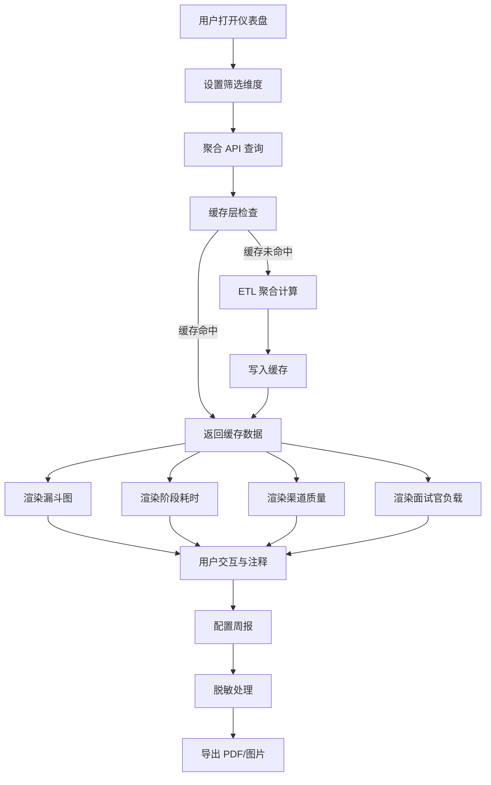

## 1. 产品概述

招聘流程效率仪表盘是一款面向人事运营团队的复盘分析工具，聚焦招聘全流程的效率指标与候选人体验质量。系统仅做流程效率分析与候选人体验洞察，不做自动筛人决策。

- 目标用户：人事运营经理、招聘负责人、HRBP
- 核心价值：量化招聘漏斗转化、识别阶段瓶颈、评估渠道质量、平衡面试官负载，驱动数据化招聘运营改进

## 2. 核心功能

### 2.1 用户角色

| 角色 | 权限范围 |
|------|----------|
| HR 管理员 | 全部看板视图、导出报告、异常注释、指标口径配置 |
| 招聘经理 | 本部门及下属招聘官的数据视图、导出报告 |
| 面试官 | 仅面试官负载相关个人视图 |

### 2.2 功能模块

1. **流程总览仪表盘**：漏斗图、关键转化率、阶段耗时概览
2. **渠道质量分析**：各渠道简历量、转化率、耗时对比
3. **面试官负载看板**：面试官分配量、时间负载、评价完成率聚合视图
4. **周报生成与导出**：带筛选口径的 PDF/图片报告，候选人信息脱敏

### 2.3 页面详情

| 页面名称 | 模块名称 | 功能描述 |
|----------|----------|----------|
| 流程总览 | 筛选器栏 | 按职位、部门、招聘官、渠道、阶段筛选，支持多选和时间范围 |
| 流程总览 | 招聘漏斗图 | 展示发布→简历→面试→Offer→入职各阶段数量与转化率 |
| 流程总览 | 阶段耗时图 | 各阶段平均耗时、中位数、P90 分位数柱状图 |
| 流程总览 | 异常注释面板 | 对异常数据点添加/查看文字注释，标记原因 |
| 流程总览 | 关键指标卡片 | 整体转化率、平均招聘周期、候选人满意度 |
| 渠道质量 | 渠道转化对比 | 各渠道漏斗转化率对比雷达图/分组柱状图 |
| 渠道质量 | 渠道耗时对比 | 各渠道各阶段平均耗时热力图 |
| 渠道质量 | 渠道成本效率 | 渠道投入与产出散点图 |
| 面试官负载 | 负载分布图 | 面试官面试场次分布柱状图（仅聚合结果） |
| 面试官负载 | 时间线视图 | 面试官排班时间线，标识负载高峰 |
| 面试官负载 | 评价完成率 | 面试评价提交时效与完成率 |
| 周报导出 | 报告配置 | 选择筛选口径、报告周期、包含模块 |
| 周报导出 | 预览与导出 | 预览报告内容，导出为 PDF 或图片，候选人信息脱敏 |

## 3. 核心流程

用户打开仪表盘 → 选择筛选维度（职位/部门/招聘官/渠道/阶段/时间范围）→ 系统从聚合 API 获取数据 → 渲染各视图图表 → 用户可对异常数据点添加注释 → 用户选择周报配置并导出脱敏报告

## 4. 用户界面设计

### 4.1 设计风格

- **主色调**：深海蓝 (#0A1628) 为底色，电光青 (#00E5CC) 为强调色，配合暖橙 (#FF6B35) 标注异常
- **辅助色**：冷灰 (#1E293B)、次级蓝 (#3B82F6)、成功绿 (#10B981)、警告黄 (#F59E0B)
- **按钮风格**：圆角微弧 (4px)，填充式主按钮 + 描边式次按钮
- **字体**：数据展示使用 JetBrains Mono，界面文案使用 Noto Sans SC
- **布局**：顶部全局筛选栏 + 左侧导航 + 右侧内容区卡片网格布局
- **图标**：线性风格，2px 描边，与图表统一视觉语言

### 4.2 页面设计概览

| 页面名称 | 模块名称 | UI 元素 |
|----------|----------|---------|
| 流程总览 | 筛选器栏 | 顶部固定，多选下拉 + 日期范围选择器，深色背景 |
| 流程总览 | 招聘漏斗图 | 居中大尺寸漏斗，阶段间箭头标注转化率，悬停展示详情 |
| 流程总览 | 阶段耗时图 | 横向浮动柱状图，标注均值/中位数/P90 |
| 流程总览 | 异常注释面板 | 右侧抽屉，时间线形式展示注释 |
| 流程总览 | 关键指标卡片 | 3列卡片行，数字突出，趋势箭头 |
| 渠道质量 | 渠道转化对比 | 分组柱状图，渠道颜色编码 |
| 渠道质量 | 渠道耗时热力图 | 矩阵热力图，颜色深浅表示耗时 |
| 渠道质量 | 渠道成本效率 | 气泡图，x轴成本y轴转化率，气泡大小为人数 |
| 面试官负载 | 负载分布图 | 堆叠柱状图，按周聚合 |
| 面试官负载 | 时间线视图 | 甘特图风格时间线 |
| 面试官负载 | 评价完成率 | 环形进度图 |
| 周报导出 | 报告配置 | 左侧配置面板，右侧实时预览 |
| 周报导出 | 预览与导出 | A4 预览布局，顶部导出按钮 |

### 4.3 响应式设计

- 桌面优先设计，最小支持 1280px 宽度
- 卡片网格在 1440px 以上展开为 3 列，1280-1440px 为 2 列
- 筛选栏在窄屏下折叠为抽屉

### 4.4 数据脱敏规则

- 候选人姓名：仅展示姓氏 + **（如：张**）
- 手机号：中间四位替换为 ****
- 邮箱：@前仅保留首字母 + ***@domain
- 身份证号：全部替换为 ********
- 导出报告一律执行脱敏，原始数据仅 HR 管理员在系统内可查看
- 面试官负载仅展示聚合数据（场次/时长），不展示个人面试评价原文
