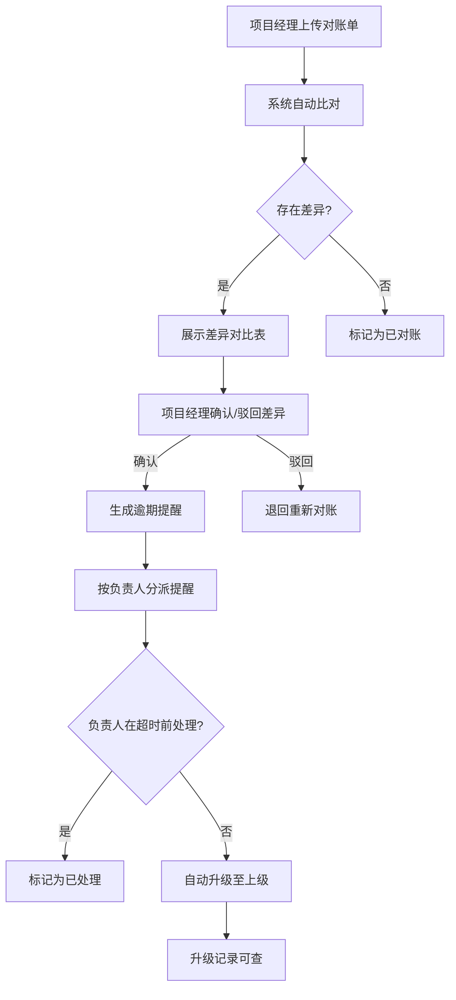
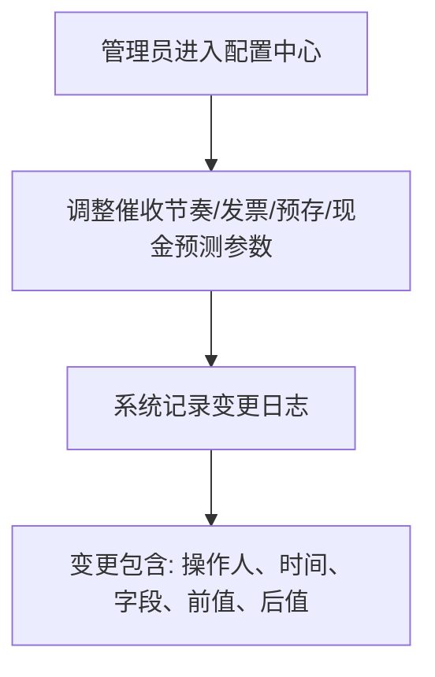

## 1. 产品概述
项目尾款逾期提醒器——基于应收对账台理念，帮助企业追踪项目尾款回款、管理对账差异、自动催收提醒与升级。目标用户为项目经理、财务人员和系统管理员，核心价值是降低尾款逾期率、提高对账效率、确保催收流程可追溯。

## 2. 核心功能

### 2.1 用户角色
| 角色 | 注册方式 | 核心权限 |
|------|----------|----------|
| 系统管理员 | 后台创建 | 催收节奏配置、发票/预存/现金预测参数配置、全部数据查看、权限管理 |
| 项目经理 | 后台创建 | 上传对账单、确认差异、查看逾期明细、处理催收提醒 |
| 财务人员 | 后台创建 | 查看对账差异、导出报表、查看流水不匹配记录 |

### 2.2 功能模块
1. **对账台首页**：逾期项目总览、待处理提醒、关键指标卡片
2. **对账单管理**：上传对账单、自动比对、差异确认
3. **催收管理**：催收节奏配置、提醒分派、超时升级记录
4. **配置中心**：发票申请参数、预存余额规则、现金预测模型、变更日志
5. **明细报表**：逾期金额明细、流水不匹配记录、最后处理记录、导出

### 2.3 页面详情
| 页面名称 | 模块名称 | 功能描述 |
|----------|----------|----------|
| 对账台首页 | 指标概览卡片 | 展示逾期总额、待处理数、本月回收率、超时升级数 |
| 对账台首页 | 待处理提醒列表 | 按优先级排列的催收提醒，显示负责人和剩余时间 |
| 对账台首页 | 近期逾期趋势图 | 折线图展示近30天逾期金额变化 |
| 对账单管理 | 对账单上传 | 支持Excel/CSV上传，自动解析并比对系统记录 |
| 对账单管理 | 差异对比表 | 并排展示系统记录与上传数据，高亮差异行 |
| 对账单管理 | 差异确认操作 | 项目经理确认/驳回差异，记录确认人和时间 |
| 催收管理 | 催收节奏配置 | 管理员设置催收频率、超时阈值、升级规则 |
| 催收管理 | 提醒分派列表 | 按负责人分组显示待处理提醒，支持批量分派 |
| 催收管理 | 升级记录 | 显示已超时自动升级的提醒及升级路径 |
| 配置中心 | 发票申请配置 | 设置发票申请流程参数、审批规则 |
| 配置中心 | 预存余额配置 | 设置预存余额阈值、预警规则 |
| 配置中心 | 现金预测配置 | 设置预测模型参数、时间窗口 |
| 配置中心 | 变更日志 | 记录所有配置变更，包含操作人、时间、前后值 |
| 明细报表 | 逾期金额明细 | 按项目/客户展示逾期金额、逾期天数、负责人 |
| 明细报表 | 流水不匹配记录 | 展示对账差异中流水不匹配的详细记录 |
| 明细报表 | 最后处理记录 | 每个逾期项的最近一次处理操作和时间 |
| 登录页 | 用户认证 | 用户名密码登录，角色鉴权 |

## 3. 核心流程

项目经理上传对账单后，系统自动比对产生差异；项目经理确认差异后，系统根据催收节奏生成提醒并分派给负责人；负责人逾期未处理则自动升级；管理员可在配置中心调整各项参数，所有变更留痕。

## 4. 用户界面设计

### 4.1 设计风格
- 主色调：深靛蓝 (#1e293b) 搭配琥珀强调色 (#f59e0b)，传达专业与紧迫感
- 辅助色：翠绿 (#10b981) 表示正常/已处理，玫红 (#ef4444) 表示逾期/紧急
- 按钮风格：圆角6px，主按钮实心填充，次按钮描边
- 字体：标题使用 Noto Sans SC Bold，正文使用 Noto Sans SC Regular
- 布局风格：左侧固定导航栏 + 顶部面包屑 + 内容区卡片布局
- 图标风格：Lucide 线性图标，与文字搭配使用

### 4.2 页面设计概览
| 页面名称 | 模块名称 | UI元素 |
|----------|----------|--------|
| 对账台首页 | 指标概览卡片 | 4列网格卡片，数字大号加粗，趋势箭头图标，渐变背景 |
| 对账台首页 | 待处理提醒列表 | 表格布局，行左侧色条标识优先级，操作按钮右对齐 |
| 对账台首页 | 近期逾期趋势图 | 面积图，悬浮提示显示具体数值 |
| 对账单管理 | 对账单上传 | 虚线拖拽区域，支持点击选择文件，进度条反馈 |
| 对账单管理 | 差异对比表 | 双栏并排表格，差异行背景高亮(琥珀色)，确认/驳回按钮 |
| 催收管理 | 催收节奏配置 | 表单卡片，滑块调整频率，数字输入阈值，保存按钮 |
| 催收管理 | 提醒分派列表 | 按负责人折叠分组，计数徽章，批量操作工具栏 |
| 配置中心 | 变更日志 | 时间线布局，每条显示操作人头像、变更内容、时间戳 |
| 明细报表 | 逾期金额明细 | 可排序表格，逾期天数热力色标，导出按钮 |

### 4.3 响应式策略
- 桌面优先设计，最小宽度1280px
- 1024-1280px：侧边栏折叠为图标模式
- 768-1024px：单列布局，表格横向滚动
- 触摸优化：按钮最小44px触控区域

### 4.4 3D场景指引
- 不适用
