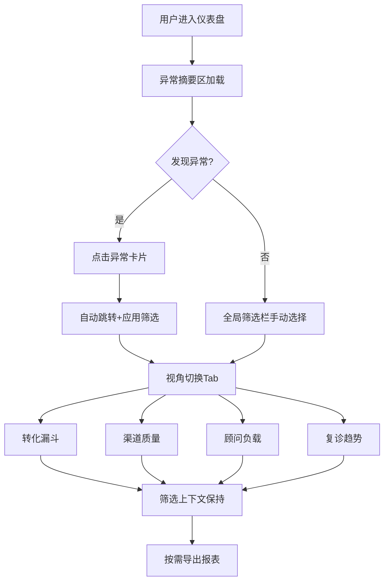

## 1. 产品概述

医美机构咨询转化分析仪表盘——为医美机构运营团队提供从咨询到复诊全链路转化洞察，以异常驱动优先展示、多视角灵活切换为核心理念，帮助管理者快速定位转化瓶颈、顾问负载失衡和渠道质量异常。

- 目标用户：医美机构运营经理、顾问主管、数据分析师
- 核心价值：将分散在咨询、预约、到店、方案、付款、复诊六大环节的数据串联成可视化决策链路，异常摘要先行避免淹没在数据海洋中

## 2. 核心功能

### 2.1 用户角色

| 角色 | 权限说明 |
|------|----------|
| 运营经理 | 查看全量数据、导出报表、配置指标阈值 |
| 顾问主管 | 查看所辖顾问数据、渠道与项目维度分析 |
| 数据分析师 | 全维度分析、自定义筛选、导出原始数据 |

### 2.2 功能模块

1. **仪表盘首页**：异常摘要卡片、全局筛选栏、视角切换导航
2. **转化漏斗视图**：六环节漏斗（咨询→预约→到店→方案→付款→复诊），支持按项目/顾问/渠道/月份下钻
3. **渠道质量视图**：各渠道来源的转化率对比、成本效率排名
4. **顾问负载视图**：顾问在管客户数、各阶段分布、效率指标对比
5. **复诊趋势视图**：复诊率时间趋势、复诊间隔分布、项目复诊关联
6. **导出中心**：异步导出任务管理、历史下载

### 2.3 页面详情

| 页面名称 | 模块名称 | 功能描述 |
|----------|----------|----------|
| 仪表盘首页 | 异常摘要区 | 顶部展示关键异常指标（转化率骤降、顾问超载、渠道异常等），红色/橙色/黄色分级预警 |
| 仪表盘首页 | 全局筛选栏 | 项目、顾问、渠道、客户阶段、月份五维筛选，筛选上下文全局保持 |
| 仪表盘首页 | 视角切换Tab | 项目视角/顾问视角/渠道视角/客户阶段视角/月份视角，切换后下方视图联动刷新 |
| 转化漏斗视图 | 漏斗图 | 六级漏斗，每级显示人数和环比转化率，hover显示详情 |
| 转化漏斗视图 | 环节对比 | 选定两个时段的漏斗对比，高亮差异环节 |
| 渠道质量视图 | 渠道排名 | 按转化率/到店率/成单率排名的渠道列表 |
| 渠道质量视图 | 渠道趋势 | 各渠道关键指标的时间趋势折线图 |
| 顾问负载视图 | 负载热力图 | 顾问×阶段矩阵热力图，颜色深浅代表客户数量 |
| 顾问负载视图 | 效率对比 | 顾问间转化效率柱状对比图 |
| 复诊趋势视图 | 复诊率曲线 | 月度复诊率趋势线 |
| 复诊趋势视图 | 复诊间隔 | 首次到店→复诊间隔天数分布直方图 |
| 复诊趋势视图 | 项目关联 | 按项目类别（脱敏展示）的复诊率对比 |
| 导出中心 | 任务列表 | 已提交的导出任务状态（排队中/生成中/已完成/失败） |
| 导出中心 | 文件下载 | 完成的导出文件下载链接 |

## 3. 核心流程

用户进入仪表盘后，首先看到异常摘要区自动标红的异常指标；点击异常卡片可跳转至对应视图并自动应用相关筛选；用户也可通过全局筛选栏手动选择项目、顾问、渠道、客户阶段、月份等维度；切换视角Tab后，下方四大核心视图（漏斗/渠道/顾问/复诊）的数据和图表联动刷新；所有视图中的筛选上下文保持一致，确保数据可比。

## 4. 用户界面设计

### 4.1 设计风格

- 主色调：深空蓝 (#0F172A) 为底，青绿色 (#10B981) 为正向指标强调色，珊瑚红 (#EF4444) 为异常警示色
- 次要色：琥珀黄 (#F59E0B) 为预警色，石板灰 (#64748B) 为中性色
- 按钮风格：圆角矩形（8px），微阴影，hover时微微上浮
- 字体：数据数字使用 JetBrains Mono，界面文字使用 Noto Sans SC
- 布局：左侧窄导航栏 + 顶部筛选栏 + 主内容区卡片网格
- 图标：lucide-react 图标库，线型风格

### 4.2 页面设计概览

| 页面名称 | 模块名称 | UI元素 |
|----------|----------|--------|
| 仪表盘首页 | 异常摘要区 | 红色/橙色/黄色边框卡片，内含指标名、当前值、异常描述、跳转链接 |
| 仪表盘首页 | 全局筛选栏 | 五个下拉选择器横向排列，选中项以标签形式展示 |
| 仪表盘首页 | 视角切换Tab | 底部带滑动指示器的Tab组，切换时有平滑过渡动画 |
| 转化漏斗视图 | 漏斗图 | 自上而下梯形递减，每级填充渐变色，hover时弹出详情浮窗 |
| 渠道质量视图 | 渠道排名 | 水平条形图，渐变色条，排名变化箭头 |
| 顾问负载视图 | 负载热力图 | 行×列网格，颜色从浅绿到深红渐变，单元格内显示数字 |
| 复诊趋势视图 | 复诊率曲线 | 平滑折线图，区域填充半透明渐变，关键节点圆点标注 |
| 导出中心 | 任务列表 | 表格行，状态列用不同颜色圆点标识 |

### 4.3 响应式策略

- 桌面优先设计，最小宽度1280px
- 1440px以上：四列卡片网格
- 1280-1440px：三列卡片网格，侧栏可收起
- 移动端暂不适配（运营仪表盘以桌面使用为主）

### 4.4 数据脱敏规则

- 敏感项目（如私密整形类）仅按类别展示，不展示个人方案明细
- 顾问视图中不展示客户姓名，仅展示客户编号
- 导出数据中客户手机号中间四位脱敏为****
