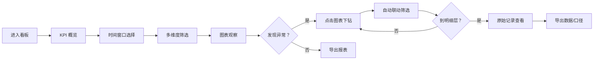

## 1. 产品概述

电商退货原因与退款周期分析看板，为售后负责人提供多维度数据洞察。解决 Excel 仅能看总数、难以解释波动原因的痛点，支持从宏观指标下钻至原始记录，兼顾数据分析效率与用户隐私保护。

- 核心目标：帮助售后团队快速定位退货异常、分析退款周期瓶颈、优化客服处理效率
- 目标用户：售后负责人、运营分析师、客服主管
- 核心价值：数据可追溯、口径可校验、隐私有保障

## 2. 核心功能

### 2.1 用户角色

| 角色 | 登录方式 | 核心权限 |
|------|----------|----------|
| 售后负责人 | 内部账号 | 完整看板访问、数据导出、明细下钻 |
| 运营分析师 | 内部账号 | 看板访问、多维度筛选、数据导出 |
| 客服主管 | 内部账号 | 客服处理时长分析、客服明细查看 |

### 2.2 功能模块

1. **仪表盘主页**：KPI 概览卡片、多维度筛选器、时间窗口切换、样本量提示
2. **退货原因分析**：原因树图（ECharts treemap）、原因分类统计、异常识别
3. **退款周期分析**：周期分布直方图、各阶段耗时拆解、趋势对比
4. **商品维度分析**：商品退货排行、SKU 维度分析、关联原因分布
5. **客服效率分析**：客服处理时长分布、人员排行、异常工单识别
6. **明细追溯**：原始记录列表、下钻路径回溯、筛选条件留存
7. **数据导出**：CSV 格式导出、筛选条件导出、口径说明导出

### 2.3 页面详情

| 页面名称 | 模块名称 | 功能描述 |
|----------|----------|----------|
| 仪表盘主页 | KPI 概览 | 退货率、平均退款周期、客服平均处理时长、重复退货用户占比 |
| 仪表盘主页 | 全局筛选器 | 商品、店铺、原因、仓库、物流商、时间范围多选筛选 |
| 仪表盘主页 | 时间窗口 | 今日/近7天/近30天/自定义快捷切换 |
| 仪表盘主页 | 样本量提示 | 实时显示当前筛选条件下的样本量，标注统计显著性 |
| 退货原因分析 | 原因树图 | ECharts Treemap 展示原因层级结构，支持点击下钻 |
| 退货原因分析 | 原因排行 | Top 10 退货原因及占比变化趋势 |
| 退款周期分析 | 周期分布 | 退款周期直方图，标注中位数、P90、P99 |
| 退款周期分析 | 阶段拆解 | 申请→质检→退款各环节耗时分布 |
| 商品分析 | 商品排行 | 退货量/退货率 Top/Bottom 商品排行 |
| 客服分析 | 处理时长 | 客服处理时长箱线图、人均效率对比 |
| 明细追溯 | 原始记录 | 可追溯的退货单列表，包含完整链路信息 |
| 明细追溯 | 口径校验 | 关键维度一致性校验，标注数据异常点 |
| 数据导出 | 导出功能 | 当前视图数据 CSV 导出，附带筛选条件和口径说明 |

## 3. 核心流程

### 3.1 分析流程描述

售后负责人进入看板后，首先查看 KPI 概览了解整体态势；通过时间窗口切换对比不同周期数据；使用多维度筛选器定位异常范围；观察图表发现异常后，点击图表元素自动联动筛选；继续下钻直至原始记录明细；可导出当前数据用于汇报或进一步分析。

### 3.2 流程图

## 4. 用户界面设计

### 4.1 设计风格

- **主色调**：深蓝色系（#1e3a5f 主色，#2563eb 强调色），体现专业数据分析感
- **辅助色**：绿色（#059669）表示正常，橙色（#d97706）表示警告，红色（#dc2626）表示异常
- **中性色**：#f8fafc 背景，#e2e8f0 边框，#64748b 次要文字，#1e293b 主文字
- **字体**：标题使用 DM Serif Display 衬线体增加专业质感，正文使用 Inter 无衬线体保证可读性
- **布局风格**：卡片式布局，12 列网格，卡片阴影柔和，边角 8px 圆角
- **图标风格**：Lucide 线性图标，统一 16px 尺寸

### 4.2 页面设计概述

| 页面名称 | 模块名称 | UI 元素 |
|----------|----------|---------|
| 仪表盘主页 | KPI 卡片 | 大数字 + 环比趋势箭头 + 迷你 sparkline，hover 显示详细说明 |
| 仪表盘主页 | 筛选栏 | 横向标签式筛选器，已选条件高亮显示，支持清除全部 |
| 仪表盘主页 | 图表区 | 2x2 网格布局，每个图表卡片带标题、样本量标签、导出按钮 |
| 原因分析 | 树图 | 渐变色块填充，hover 显示详情，点击下钻时面包屑导航 |
| 周期分析 | 分布图 | 直方图 + 参考线（中位数/P90），X 轴分箱标注 |
| 商品排行 | 排行榜 | 横向条形图，带退货率标注，前 3 名高亮 |
| 明细追溯 | 数据表格 | 固定表头，斑马纹，支持列排序，关键字段高亮 |
| 明细追溯 | 下钻面板 | 右侧滑出面板，展示单条记录完整链路信息 |

### 4.3 响应式设计

- 桌面端（>1200px）：4 列 KPI，2x2 图表网格
- 平板端（768-1200px）：2 列 KPI，1x2 图表网格
- 移动端（<768px）：单列 KPI，单列图表堆叠，筛选器收起为下拉

### 4.4 动效设计

- 页面加载：KPI 数字滚动动画，图表依次淡入（stagger 100ms）
- 筛选变化：图表数据平滑过渡（ECharts animationDuration 600ms）
- 下钻交互：右侧面板滑入（translateX + opacity 过渡 300ms）
- Hover 状态：卡片阴影加深 + 轻微上移（transform: translateY(-2px)）
