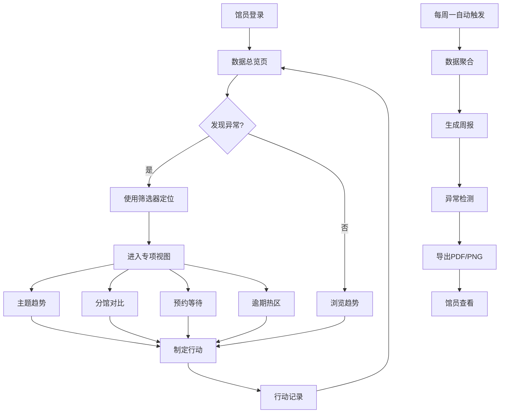

## 1. 产品概述

公共图书馆借阅行为分析平台——为图书馆馆员提供数据驱动的决策支持，聚焦主题趋势、分馆对比、预约等待和逾期热区四大核心视图，通过联动筛选和自动周报帮助馆员发现异常、定位问题、采取行动。所有少儿读者数据仅做聚合展示，严格保护个人阅读隐私。

- 目标用户：图书馆馆长、分馆负责人、采编部门馆员
- 核心价值：将借阅数据转化为可操作洞察，而非单纯图表堆砌

## 2. 核心功能

### 2.1 用户角色

| 角色 | 访问方式 | 核心权限 |
|------|----------|----------|
| 馆长 | 统一登录 | 全局视图、周报管理、口径配置 |
| 分馆负责人 | 统一登录 | 本分馆数据、周报查看 |
| 采编馆员 | 统一登录 | 主题分析、推荐配置 |

### 2.2 功能模块

1. **数据总览页**：全局筛选器、核心KPI卡片、快捷入口
2. **主题趋势分析页**：主题借阅时序、主题排名变动、热门主题下钻
3. **分馆对比页**：分馆借阅量对比、资源利用率对比、分馆间流转
4. **预约等待分析页**：预约排队深度、平均等待时长、预约满足率
5. **逾期热区页**：逾期率分布热力图、逾期读者年龄段画像、逾期主题聚类
6. **周报中心页**：周报自动生成、关键变化摘要、同比环比、异常点标注、下载导出

### 2.3 页面详情

| 页面名称 | 模块名称 | 功能描述 |
|----------|----------|----------|
| 数据总览页 | 全局筛选器 | 馆藏类型、读者分组（少儿/青年/中年/老年）、主题分类、分馆、月份范围联动筛选，筛选状态全局共享 |
| 数据总览页 | KPI 卡片 | 本周借阅量、续借率、预约满足率、逾期率，带同比环比箭头和异常标记 |
| 数据总览页 | 迷你趋势图 | 各KPI的近12周迷你折线，点击跳转详细页 |
| 主题趋势分析页 | 主题时序图 | 多主题折线图，支持选择对比主题，hover显示具体数值和同比 |
| 主题趋势分析页 | 主题排名变动 | 桑基图/排名变动图，展示主题排位升降 |
| 主题趋势分析页 | 主题下钻 | 点击某主题展开子类借阅明细 |
| 分馆对比页 | 分馆借阅柱状图 | 多分馆横向/纵向对比，支持按月/季切换 |
| 分馆对比页 | 资源利用率雷达图 | 各分馆在借阅率、预约率、续借率、逾期率维度的雷达对比 |
| 分馆对比页 | 分馆详情下钻 | 点击分馆进入该分馆的详细借阅画像 |
| 预约等待分析页 | 排队深度柱状图 | 各书目的预约排队人数 |
| 预约等待分析页 | 等待时长分布 | 预约到可借的平均/中位等待天数分布 |
| 预约等待分析页 | 满足率趋势 | 预约满足率时序图，标注异常低点 |
| 逾期热区页 | 逾期热力图 | 主题×年龄段逾期率热力矩阵 |
| 逾期热区页 | 逾期读者画像 | 逾期读者年龄段、借阅频次分布（少儿仅聚合展示） |
| 逾期热区页 | 逾期主题聚类 | 逾期高发主题的聚类视图 |
| 周报中心页 | 周报列表 | 按周排列的历史周报卡片，标记异常周 |
| 周报中心页 | 周报详情 | 本周关键变化、同比环比表、异常点列表、筛选口径快照 |
| 周报中心页 | 导出下载 | 支持PDF和PNG格式导出，筛选状态嵌入报告 |

## 3. 核心流程

### 3.1 日常分析流程

馆员打开平台 → 查看KPI总览和异常标记 → 使用筛选器缩小范围（分馆/主题/月份） → 进入专项视图深入分析 → 识别异常原因 → 制定行动方案

### 3.2 周报流程

系统每周一自动触发 → 聚合上周数据 → 生成关键变化摘要和同比环比 → 检测异常点 → 嵌入当前筛选口径快照 → 生成PDF/PNG → 馆员下载或在线查看

## 4. 用户界面设计

### 4.1 设计风格

- **整体风格**：Tableau 风格——深色侧边栏 + 浅色数据画布，专业数据分析工具感
- **主色调**：深蓝灰 (#1B2838) 侧边栏 + 暖白 (#FAFBFC) 画布区域
- **强调色**：翠绿 (#00B894) 正向指标、珊瑚红 (#FF6B6B) 负向/异常指标、琥珀 (#FDCB6E) 警告
- **图表色板**：6色专业色板 #6C5CE7 / #00B894 / #FDCB6E / #E17055 / #0984E3 / #A29BFE
- **字体**：标题用 DM Sans（粗体有力），正文用 Source Sans 3（清晰专业），数据用 JetBrains Mono
- **按钮**：圆角6px，轻微阴影，hover时提升
- **布局**：左侧固定筛选栏(240px) + 顶部工具栏 + 主画布网格布局
- **图标**：Lucide Icons 线性风格

### 4.2 页面设计概览

| 页面名称 | 模块名称 | UI 元素 |
|----------|----------|---------|
| 数据总览页 | 全局筛选器 | 左侧固定侧栏，多选下拉框（馆藏类型、主题、分馆），月份范围选择器，读者分组标签组，重置按钮，筛选状态标签 |
| 数据总览页 | KPI 卡片 | 4列网格，每卡片含大数字、趋势迷你图、同比环比箭头（绿上红下）、异常点脉冲动画 |
| 数据总览页 | 迷你趋势图 | 4个小型折线图，渐变填充，hover十字准星 |
| 主题趋势分析页 | 主题时序图 | 大面积折线图，多系列叠加，legend可切换，hover tooltip含同比数据 |
| 主题趋势分析页 | 主题排名变动 | 斜率图/桑基图，上升绿色下降红色 |
| 主题趋势分析页 | 主题下钻 | 面包屑导航 + 子类柱状图，动画展开 |
| 分馆对比页 | 分馆借阅柱状图 | 分组柱状图，支持堆叠/并列切换，分馆颜色编码 |
| 分馆对比页 | 资源利用率雷达图 | 5维雷达，多分馆叠加，半透明填充 |
| 分馆对比页 | 分馆详情下钻 | 侧滑面板，该分馆的关键指标和图表 |
| 预约等待分析页 | 排队深度柱状图 | 水平柱状图，颜色渐变表示紧急程度 |
| 预约等待分析页 | 等待时长分布 | 直方图+中位线标注，分馆对比模式 |
| 预约等待分析页 | 满足率趋势 | 折线图+异常点红色脉冲标记 |
| 逾期热区页 | 逾期热力图 | 矩阵热力图，色阶从绿到红，点击格子下钻 |
| 逾期热区页 | 逾期读者画像 | 环形图+年龄段标签，少儿区域锁定聚合 |
| 逾期热区页 | 逾期主题聚类 | 气泡图，气泡大小=逾期量，颜色=逾期率 |
| 周报中心页 | 周报列表 | 卡片网格，封面为本周KPI缩略图，异常周红色边框 |
| 周报中心页 | 周报详情 | 报告式排版，关键变化高亮，同比环比表格，异常点红色标注，筛选口径灰色底纹 |
| 周报中心页 | 导出下载 | 右上角下载按钮，下拉选PDF/PNG，导出含筛选状态水印 |

### 4.3 响应式设计

- 桌面优先（1440px+）：左侧筛选栏 + 3-4列网格
- 平板（768-1439px）：筛选栏折叠为顶部抽屉，2列网格
- 手机（<768px）：单列堆叠，筛选器折叠为底部抽屉，图表缩略后点击全屏

### 4.4 隐私保护 UI 规则

- 少儿读者数据在任何视图中仅展示聚合指标（如"少儿组借阅量占比"）
- 凡涉及少儿数据的图表区域，统一显示蓝色锁图标 + "少儿数据已聚合"提示
- 下钻至个人级别时，少儿区域置灰并显示"为保护隐私，少儿读者数据仅聚合展示"
- 空值区域显示"暂无数据"占位符，不显示0或空图表
- 加载中显示骨架屏，超时显示"数据加载超时，请稍后重试"
- 导出报告中少儿数据同样仅聚合，封面标注"少儿数据已脱敏聚合"
