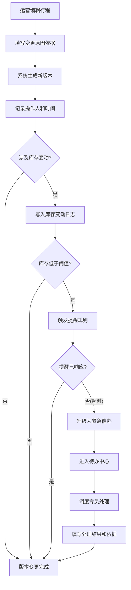
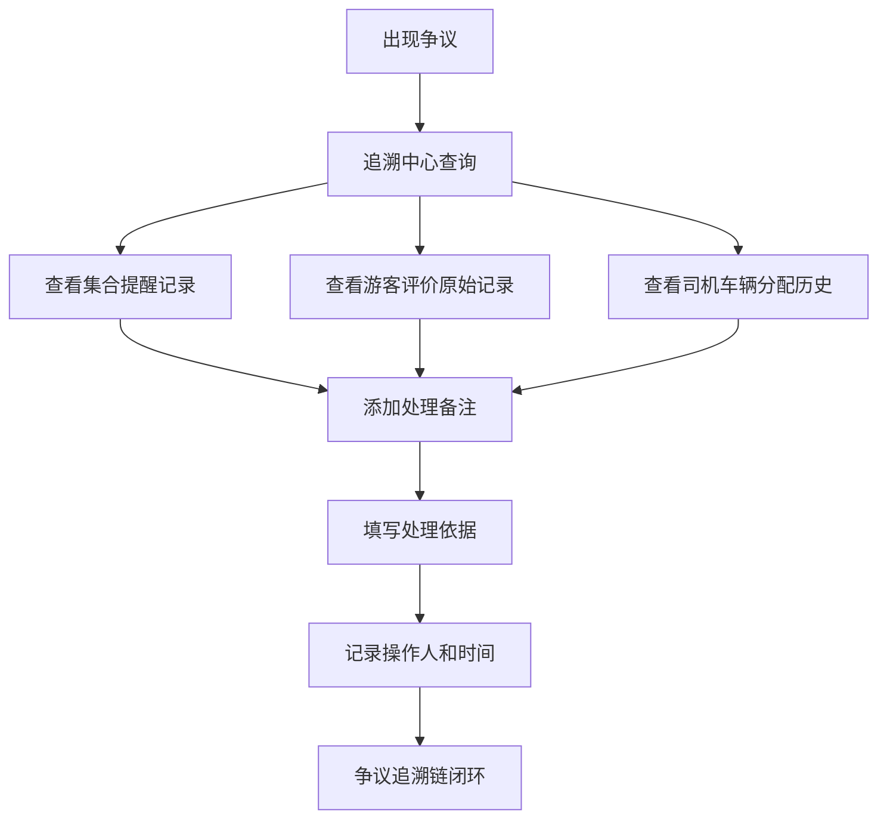

## 1. 产品概述

城市导览行程协作器是面向目的地运营团队的协作管理平台，替代传统表格管理方式。系统覆盖导览路线查看、行程版本管理、库存变动追踪、争议追溯全流程，确保集合提醒、游客评价、司机车辆等关键环节可溯源，提醒规则按库存灵活配置，紧急催办独立进入待办，所有涉及责任人的修改均留依据和操作人。

- 目标用户：目的地运营团队（行程运营、调度、客服）
- 核心价值：消除表格协作的信息孤岛，实现行程数据版本化、库存变动可审计、争议处理可追溯

## 2. 核心功能

### 2.1 用户角色

| 角色 | 进入方式 | 核心权限 |
|------|----------|----------|
| 运营主管 | 管理后台授权 | 查看路线、管理行程版本、配置提醒规则、审批争议处理 |
| 行程运营 | 管理后台授权 | 查看路线、编辑行程、处理集合提醒、管理库存 |
| 调度专员 | 管理后台授权 | 查看路线、分配司机车辆、处理紧急催办 |
| 客服专员 | 管理后台授权 | 查看路线、处理游客评价、记录争议备注 |

### 2.2 功能模块

1. **导览路线总览**：路线卡片列表、路线状态筛选、路线详情查看
2. **行程版本管理**：行程版本列表、版本对比、版本回滚、版本变更日志
3. **库存看板**：实时库存展示、库存变动记录、库存预警
4. **追溯中心**：集合提醒记录、游客评价归档、司机车辆分配记录、争议处理备注
5. **提醒规则配置**：基于库存的规则引擎、规则启停管理、紧急催办升级
6. **待办中心**：紧急催办待办列表、待办状态流转、处理依据留存

### 2.3 页面详情

| 页面名称 | 模块名称 | 功能描述 |
|----------|----------|----------|
| 导览路线总览 | 路线卡片列表 | 展示所有导览路线，按城市/状态/日期筛选，卡片显示路线名称、城市、当前库存、状态标签 |
| 导览路线总览 | 路线搜索栏 | 支持关键词搜索路线，快速定位目标路线 |
| 导览路线总览 | 状态统计面板 | 顶部展示运营中/即将出发/已结束路线数量统计 |
| 行程详情 | 行程基本信息 | 路线名称、出发时间、集合地点、导游、当前版本号 |
| 行程详情 | 版本时间线 | 左侧时间线展示所有历史版本，点击可查看该版本详情 |
| 行程详情 | 版本对比面板 | 选择两个版本进行差异对比，高亮变更字段 |
| 行程详情 | 版本变更日志 | 每次版本变更记录操作人、时间、变更原因依据 |
| 行程详情 | 行程操作栏 | 编辑行程（生成新版本）、回滚到历史版本 |
| 库存看板 | 库存概览卡片 | 按路线分组展示可用库存、已售、预留数量 |
| 库存看板 | 库存变动日志 | 列表展示所有库存变动记录，含变动类型、数量、操作人、时间、备注 |
| 库存看板 | 库存预警条 | 低于阈值的路线以醒目颜色标记预警 |
| 库存看板 | 库存调整操作 | 手动调整库存需填写调整原因依据，自动生成日志记录 |
| 追溯中心 | 集合提醒记录 | 按行程查看所有集合提醒发送记录，含发送时间、方式、接收人、状态 |
| 追溯中心 | 游客评价归档 | 按行程/日期查看游客评价，支持评价回复和处理备注 |
| 追溯中心 | 司机车辆分配 | 查看司机和车辆的分配历史，含分配人、时间、变更原因 |
| 追溯中心 | 争议处理备注 | 对争议事件添加处理备注，需填写处理依据和操作人 |
| 提醒规则配置 | 规则列表 | 展示所有提醒规则，按库存条件配置触发规则 |
| 提醒规则配置 | 规则编辑器 | 可视化配置规则条件（库存阈值/变动幅度/时间窗口）和触发动作 |
| 提醒规则配置 | 紧急催办升级 | 配置当提醒未响应时升级为紧急催办的规则，紧急催办自动进入待办 |
| 提醒规则配置 | 规则启停开关 | 一键启用/停用规则，记录操作人和时间 |
| 待办中心 | 待办列表 | 展示所有紧急催办待办，按紧急程度和时间排序 |
| 待办中心 | 待办处理 | 处理待办需填写处理结果和依据，自动记录操作人 |
| 待办中心 | 待办状态筛选 | 按待办状态（待处理/处理中/已完成）筛选 |

## 3. 核心流程

**行程版本管理流程**：运营人员编辑行程时，系统自动生成新版本，保留历史版本。每次版本变更需填写变更原因，系统记录操作人和时间戳。需要回滚时，选择目标版本确认即可，同样生成回滚记录。

**库存变动追踪流程**：任何库存变动（手动调整、订单扣减、预留释放）均自动写入变动日志，记录变动前后值、变动原因、操作人。当库存低于配置阈值时，触发提醒规则。

**争议追溯流程**：出现争议时，运营人员可在追溯中心查看集合提醒发送记录、游客评价原始记录、司机车辆分配历史。对争议添加处理备注需填写依据和操作人，形成完整的追溯链。

**紧急催办流程**：提醒规则触发后未在配置时间内响应，自动升级为紧急催办并进入待办中心。调度专员处理待办时需填写处理结果和依据。

## 4. 用户界面设计

### 4.1 设计风格

- 主色调：深青色 (#0D4F4F) 搭配暖橙色 (#E8722A) 点缀，传达专业与活力
- 辅助色：浅灰底 (#F7F8FA)、深灰文字 (#2D3748)、预警红 (#E53E3E)
- 按钮风格：圆角（8px），主操作实心填充，次操作描边，危险操作红色
- 字体：标题使用 Noto Serif SC（衬线体，传递文化感），正文使用 Noto Sans SC
- 布局风格：左侧固定导航 + 右侧内容区，卡片式信息组织，时间线组件展示版本历史
- 图标风格：线性图标，2px 描边，统一圆角

### 4.2 页面设计概览

| 页面名称 | 模块名称 | UI 元素 |
|----------|----------|---------|
| 导览路线总览 | 路线卡片列表 | 网格卡片布局，卡片含路线图/名称/城市标签/库存进度条/状态徽章，悬停提升阴影 |
| 导览路线总览 | 路线搜索栏 | 顶部固定搜索输入框，带城市下拉筛选和日期范围选择器 |
| 导览路线总览 | 状态统计面板 | 顶部三个统计卡片（运营中/即将出发/已结束），数字突出显示 |
| 行程详情 | 行程基本信息 | 顶部信息条，路线名+标签+版本号，右侧操作按钮组 |
| 行程详情 | 版本时间线 | 左侧垂直时间线，节点含版本号和时间，当前版本高亮，选中节点右侧展示详情 |
| 行程详情 | 版本对比面板 | 双栏对比视图，变更字段高亮（绿色新增/红色删除/橙色修改） |
| 行程详情 | 版本变更日志 | 底部日志列表，每条含操作人头像、操作描述、时间戳 |
| 库存看板 | 库存概览卡片 | 横向卡片组，每张卡片含路线名+可用/已售/预留数值+进度条 |
| 库存看板 | 库存变动日志 | 表格布局，列含变动时间/路线/类型/数量/操作人/备注，支持筛选 |
| 库存看板 | 库存预警条 | 卡片顶部红色渐变条带，闪烁动画提示低库存 |
| 库存看板 | 库存调整操作 | 滑出面板，含数量输入+原因文本框+确认按钮 |
| 追溯中心 | 集合提醒记录 | 时间线视图，每条含发送时间/方式图标/接收人/送达状态 |
| 追溯中心 | 游客评价归档 | 卡片列表，含评分星标/评价内容/回复输入框/处理备注区 |
| 追溯中心 | 司机车辆分配 | 表格布局，含司机/车辆/分配时间/分配人/变更原因 |
| 追溯中心 | 争议处理备注 | 内嵌面板，含备注列表+新增备注表单（依据必填） |
| 提醒规则配置 | 规则列表 | 卡片列表，每张含规则名称/条件摘要/启停开关/编辑按钮 |
| 提醒规则配置 | 规则编辑器 | 模态框，条件区（库存阈值/变动幅度/时间窗口）+动作区（提醒方式/升级规则） |
| 提醒规则配置 | 紧急催办升级 | 编辑器内嵌区，配置超时时间和升级动作 |
| 待办中心 | 待办列表 | 列表视图，每条含紧急程度标签/描述/创建时间/状态标签/处理按钮 |
| 待办中心 | 待办处理 | 滑出面板，含处理结果下拉+依据文本框+确认按钮 |
| 待办中心 | 待办状态筛选 | 顶部标签页切换（待处理/处理中/已完成） |

### 4.3 响应式设计

- 桌面优先设计，最小适配 1280px 宽度
- 平板端（768-1280px）：导航收缩为图标模式，卡片从三列变两列
- 移动端（<768px）：导航变为底部标签栏，卡片单列堆叠，表格改为卡片列表
- 触控优化：按钮最小 44px 点击区域，滑出面板支持手势关闭
