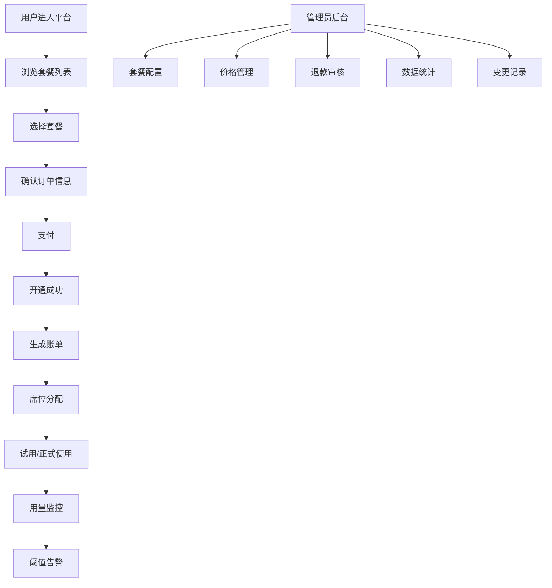

## 1. 产品概述

SaaS 订阅计费管理平台，为 SaaS 创始人提供完整的订阅套餐计费解决方案，涵盖用户自助开通、账单管理、套餐配置、席位维护、退款管理等全流程功能。

- 核心目标：降低 SaaS 计费系统建设成本，提供开箱即用的订阅计费中台
- 目标用户：SaaS 创始人、运营人员、财务人员
- 核心价值：自动化计费流程、精细化运营分析、高效退款管理

## 2. 核心功能

### 2.1 用户角色

| 角色 | 注册方式 | 核心权限 |
|------|----------|----------|
| 普通用户 | 邮箱注册 | 浏览套餐、自助开通升级、查看账单、管理席位 |
| 管理员 | 后台分配 | 套餐配置、价格管理、账期设置、退款审核、数据导出、统计分析 |

### 2.2 功能模块

1. **用户门户**：套餐列表、自助开通升级、账单中心、席位管理
2. **管理后台**：套餐配置、价格管理、账期规则、席位管理、试用管理
3. **账单中心**：账单列表、账单详情、导出记录
4. **退款管理**：退款申请、退款原因、退款统计
5. **变更记录**：套餐变更历史、变更备注、处理结果
6. **运营提醒**：付费转化提醒、用量阈值提醒、续费提醒

### 2.3 页面详情

| 页面名称 | 模块名称 | 功能描述 |
|----------|----------|----------|
| 用户首页 | 概览卡片 | 当前套餐、剩余用量、下次账单、快速操作 |
| 用户首页 | 套餐升级入口 | 展示可升级套餐，一键升级 |
| 套餐列表页 | 套餐卡片 | 展示所有套餐，对比价格和功能，开通/升级按钮 |
| 账单列表页 | 账单表格 | 按时间筛选，状态筛选，导出CSV |
| 账单详情页 | 账单信息 | 账单明细、支付记录、PDF下载 |
| 席位管理页 | 席位列表 | 席位增删改、邀请成员、用量统计 |
| 管理-套餐配置 | 套餐列表 | 套餐CRUD、价格配置、功能点配置 |
| 管理-账期规则 | 账期配置 | 计费周期、试用天数、宽限期设置 |
| 管理-席位管理 | 席位总览 | 全平台席位统计、用户席位调整 |
| 管理-试用管理 | 试用列表 | 试用状态跟踪、转化提醒 |
| 管理-用量阈值 | 阈值配置 | 用量告警阈值、提醒方式设置 |
| 管理-退款管理 | 退款列表 | 退款审核、退款原因记录、处理结果 |
| 管理-退款统计 | 数据看板 | 退款原因分布、退款金额趋势、转化率 |
| 管理-变更记录 | 变更历史 | 套餐变更列表、变更备注、处理结果统计 |

## 3. 核心流程

### 3.1 用户开通套餐流程
用户浏览套餐 → 选择套餐 → 确认订单 → 支付 → 开通成功 → 生成首月账单

### 3.2 套餐升级流程
用户查看当前套餐 → 选择目标套餐 → 计算差价 → 支付差价 → 立即生效 → 生成变更记录

### 3.3 退款流程
用户申请退款 → 填写退款原因 → 管理员审核 → 同意/拒绝 → 退款处理 → 更新账单状态 → 记录退款统计

### 3.4 席位管理流程
管理员开通席位 → 邀请用户 → 用户接受 → 席位生效 → 用量统计 → 阈值告警

## 4. 用户界面设计

### 4.1 设计风格
- 主色调：深靛蓝 #1e40af 搭配活力橙 #f97316 作为强调色
- 辅助色：翡翠绿 #10b981 表示成功，玫瑰红 #f43f5e 表示危险，琥珀黄 #f59e0b 表示警告
- 背景色：浅灰渐变 #f8fafc 到 #f1f5f9，营造专业 SaaS 质感
- 字体：展示字体使用 Space Grotesk，正文字体使用 Inter
- 按钮风格：圆角 8px，悬浮有微上浮效果，主按钮带渐变
- 卡片风格：白色卡片 + 柔和阴影 + 12px 圆角，悬浮阴影加深
- 整体风格：现代简约、专业商务、数据驱动

### 4.2 页面设计概览

| 页面名称 | 模块名称 | UI 元素 |
|----------|----------|---------|
| 用户首页 | 概览看板 | 四宫格数据卡片、当前套餐进度条、快速操作区 |
| 套餐列表 | 套餐卡片 | 三列布局卡片、功能点勾选、价格突出显示、热门标签 |
| 账单列表 | 数据表格 | 筛选栏、状态标签、分页、导出按钮 |
| 管理后台 | 侧边布局 | 深色侧边栏 + 浅色内容区、面包屑导航 |
| 退款统计 | 数据看板 | 饼图、折线图、数据卡片、筛选器 |
| 变更记录 | 时间线 | 垂直时间线、状态节点、备注气泡 |

### 4.3 响应式设计
- 采用桌面端优先设计，适配 1440px / 1024px / 768px / 375px 四个断点
- 管理后台侧边栏在移动端折叠为汉堡菜单
- 表格在小屏设备转为卡片列表展示
- 触控按钮最小尺寸 44px，优化移动端操作

### 4.4 动效与交互
- 页面加载：元素错落渐入，延迟 50ms 递增
- 卡片悬浮：上移 2px + 阴影加深 + 边框高亮
- 按钮交互：点击缩放 0.98，过渡 150ms
- 数据变更：数字滚动动画，进度条平滑过渡
- 状态切换：淡入淡出 + 轻微位移
