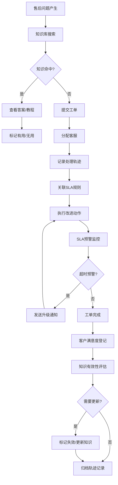

## 1. 产品概述

电商售后SLA预警台是为售后经理打造的一站式售后质量管理平台，集知识库搜索、SLA规则配置、预警通知、处理轨迹追踪和客户满意度分析于一体。解决售后流程中知识分散、规则不透明、处理无迹可寻、复盘困难等核心痛点。

- 核心目标：提升售后响应效率，保障SLA履约率，沉淀售后知识资产，驱动服务质量持续改进
- 目标用户：售后经理、客服团队、运营管理团队

## 2. 核心功能

### 2.1 用户角色

| 角色 | 注册方式 | 核心权限 |
|------|----------|----------|
| 售后经理 | 企业账号登录 | SLA规则配置、全量数据查看、复盘分析、导出管理 |
| 客服人员 | 企业账号登录 | 知识库搜索、工单处理、轨迹记录、满意度登记 |
| 运营管理员 | 企业账号登录 | 用户权限管理、系统配置、数据看板 |

### 2.2 功能模块

1. **预警台首页**：SLA达标率概览、预警通知、待办事项、核心指标趋势
2. **知识库搜索**：答案搜索、教程浏览、智能推荐、知识收藏
3. **SLA规则管理**：规则列表、规则配置、版本管理、规则模拟
4. **知识命中管理**：命中通知、筛查审核、批量导出、命中统计
5. **处理轨迹系统**：轨迹记录、改进动作追踪、工单关联、前后变化对比
6. **知识失效管理**：失效标记、备注管理、处理结果登记、客户满意统计
7. **数据看板**：SLA趋势、知识使用率、满意度分析、处理时效分析

### 2.3 页面详情

| 页面名称 | 模块名称 | 功能描述 |
|---------|----------|----------|
| 预警台首页 | 指标概览 | SLA达标率、处理时效、预警数量、满意度等核心指标卡片展示 |
| 预警台首页 | 预警列表 | 实时SLA预警通知，支持按级别、类型筛选，一键跳转到工单 |
| 知识库搜索 | 搜索区域 | 全文搜索、标签筛选、分类导航，支持模糊匹配和同义词扩展 |
| 知识库搜索 | 知识详情 | 答案内容展示、关联教程、相关问题、更新记录、有效状态 |
| 知识库搜索 | 教程专区 | 步骤式教程、视频嵌入、进度追踪、完成标记 |
| SLA规则管理 | 规则列表 | 规则卡片展示，包含适用场景、响应时效、处理时限、当前状态 |
| SLA规则管理 | 规则配置 | 可视化规则编辑器，支持条件组合、时间阈值、通知方式配置 |
| SLA规则管理 | 版本对比 | 规则变更前后对比，变更原因、变更人、变更时间完整记录 |
| 知识命中管理 | 命中通知 | 实时命中提醒，包含知识条目、命中场景、关联工单 |
| 知识命中管理 | 筛查导出 | 支持多条件筛查、批量勾选、Excel/CSV导出、导出记录追踪 |
| 处理轨迹系统 | 轨迹时间线 | 按时间轴展示处理全过程，每个节点可展开查看详情 |
| 处理轨迹系统 | 变更对比 | 同一工单的SLA规则、改进动作、状态变化前后对比视图 |
| 知识失效管理 | 失效列表 | 待失效、已失效知识列表，标记原因、处理状态、负责人 |
| 知识失效管理 | 满意度统计 | 按知识条目统计满意度、使用频次、反馈关键词云 |
| 数据看板 | 多维图表 | 折线图、柱状图、饼图、热力图，支持时间维度钻取 |

## 3. 核心流程

### 3.1 业务侧知识搜索流程
售后经理或客服人员遇到售后问题，在知识库输入关键词搜索，系统返回匹配的答案和教程，点击查看详情，可收藏或标记为有用。若知识已失效，系统会提示并推荐替代知识。

### 3.2 SLA规则配置流程
售后经理进入SLA规则管理，创建新规则或编辑现有规则，配置触发条件、时间阈值、升级路径和通知方式，保存后系统自动生成新版本记录。可进行规则模拟测试，确认无误后正式发布。

### 3.3 知识命中与导出流程
系统实时监控客服工单，自动匹配知识库条目，生成命中通知。售后经理筛查命中记录，可标记为有效/误报，选择需要的记录批量导出为Excel或CSV，导出过程记录审计日志。

### 3.4 处理轨迹记录流程
客服处理工单时，系统自动记录每一步操作：问题描述、改进动作、关联SLA规则、状态变更、前后值对比。所有记录不可篡改，形成完整的轨迹时间线，便于后续复盘分析。

### 3.5 知识失效管理流程
系统定期扫描知识库，标记长期未使用或反馈不佳的知识。管理员审核失效知识，填写备注和处理结果（更新/替换/删除），关联客户满意度统计数据，确保知识质量持续优化。

## 4. 用户界面设计

### 4.1 设计风格
- **主色调**：深靛蓝 #1e3a5f（专业、稳重、信任感）
- **辅助色**：警示橙 #f59e0b（预警）、成功绿 #10b981（正常）、危险红 #ef4444（超时）、信息蓝 #3b82f6（通知）
- **中性色**：石板灰系列，从 #f8fafc 到 #0f172a
- **按钮风格**：圆角6px，悬停微浮起效果，点击下沉反馈
- **字体**：标题使用 Inter Semibold，正文使用 Inter Regular，数字使用 JetBrains Mono
- **布局风格**：左侧导航 + 顶部状态栏 + 主内容区的经典后台布局，卡片式信息组织
- **图标风格**：Lucide 线性图标，统一16px/20px尺寸，配色跟随语义

### 4.2 页面设计概述

| 页面名称 | 模块名称 | UI元素 |
|---------|----------|--------|
| 预警台首页 | 指标概览 | 渐变数据卡片，数字大号加粗，趋势小图表，状态角标 |
| 预警台首页 | 预警列表 | 表格+卡片混合布局，级别色条，倒计时闪烁效果 |
| 知识库搜索 | 搜索区域 | 大尺寸搜索框，热门标签云，分类侧边筛选 |
| 知识库搜索 | 知识详情 | 富文本内容，关联知识横向滚动卡片，版本时间轴 |
| SLA规则管理 | 规则列表 | 可折叠规则组，开关切换，版本标签 |
| SLA规则管理 | 规则配置 | 表单分步引导，拖拽式条件组，实时预览 |
| 处理轨迹系统 | 轨迹时间线 | 垂直时间轴，彩色节点，展开/收起动画，对比视图双栏布局 |
| 知识失效管理 | 满意度统计 | 热力矩阵图，评分分布柱图，关键词词云 |

### 4.3 响应式设计
- **桌面优先**：1440px及以上为最佳体验，1024px自适应
- **平板适配**：左侧导航可折叠为图标模式，卡片自动换行
- **触摸优化**：按钮最小高度44px，关键操作有触觉反馈（Web Vibration API）
- **窄屏降级**：<768px时转为单列布局，顶部Tab导航替代侧边栏

### 4.4 动效与交互
- 页面加载：内容区渐入（0.3s ease-out），导航元素依次滑入（stagger 50ms）
- 预警闪烁：红色预警项每2秒呼吸一次，持续到处理完毕
- 轨迹展开：高度从0过渡到auto，内容渐显
- 筛选切换：卡片列表平滑过滤，有淡出淡入过渡
- 悬停反馈：卡片微上浮2px，阴影加深，边框高亮
