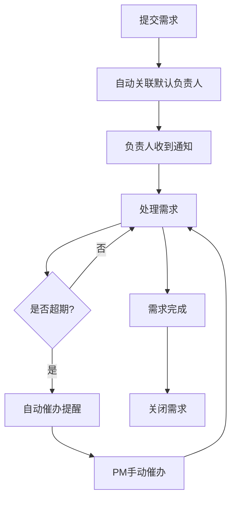
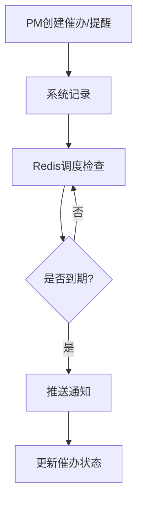

## 1. 产品概述
跨部门需求提醒中心，旨在解决多部门协作中需求流转效率低下、催办混乱、延期原因不清等痛点。通过统一的需求提交、关联负责人、催办与日程提醒机制，提升跨部门协作透明度和执行效率。

- 目标用户：项目 PM、管理员、值班人员
- 核心价值：需求全生命周期可视化管理，智能提醒防延期，操作留痕可追溯

## 2. 核心功能

### 2.1 用户角色
| 角色 | 注册方式 | 核心权限 |
|------|----------|----------|
| 值班人员 | 管理员创建 | 提交需求、查看会议纪要/评论/延期原因、添加备注 |
| 项目 PM | 管理员创建 | 值班人员权限 + 催办发送、日程提醒、需求分配、修改需求状态 |
| 管理员 | 系统初始化 | PM权限 + 用户管理、字典维护、提醒阈值配置、默认负责人设置 |

### 2.2 功能模块
1. **登录页**：账号密码登录、角色鉴权
2. **需求列表页**：需求筛选、快速检索、状态标签、负责人筛选
3. **需求详情页**：附件管理、备注记录、修改历史、关联负责人
4. **需求提交页**：新建需求表单、关联负责人、附件上传
5. **提醒管理页**：催办记录、日程提醒、提醒阈值设置
6. **值班看板页**：会议纪要、评论记录、延期原因快速筛选
7. **后台管理页**：字典维护、提醒阈值、默认负责人、用户管理
8. **操作日志页**：附件缺失动作日志、关键操作审计

### 2.3 页面详情
| 页面名称 | 模块名称 | 功能描述 |
|----------|----------|----------|
| 登录页 | 登录表单 | 账号密码输入、角色自动识别、登录状态持久化 |
| 需求列表页 | 筛选栏 | 按状态、负责人、部门、优先级筛选；支持关键词搜索 |
| 需求列表页 | 需求表格 | 展示需求编号、标题、状态、负责人、优先级、创建时间、截止时间 |
| 需求列表页 | 批量操作 | 批量催办、批量分配负责人 |
| 需求详情页 | 基本信息 | 需求标题、描述、状态、优先级、部门、负责人 |
| 需求详情页 | 附件区 | 附件上传/下载/删除、附件缺失标记与日志 |
| 需求详情页 | 备注区 | 添加备注、备注列表展示 |
| 需求详情页 | 修改历史 | 时间轴展示所有字段变更记录 |
| 需求详情页 | 评论/纪要 | 评论列表、会议纪要关联 |
| 需求提交页 | 提交表单 | 需求标题、描述、优先级、部门、截止时间、附件上传 |
| 需求提交页 | 负责人关联 | 搜索选择负责人、自动填充默认负责人 |
| 提醒管理页 | 催办列表 | 发送催办、催办记录查看、催办状态追踪 |
| 提醒管理页 | 日程提醒 | 创建提醒、提醒时间设置、提醒状态管理 |
| 值班看板页 | 会议纪要 | 按日期/关键词筛选会议纪要 |
| 值班看板页 | 评论记录 | 按需求/人员筛选评论 |
| 值班看板页 | 延期原因 | 延期需求列表、延期原因标注与筛选 |
| 后台管理页 | 字典管理 | 维护需求类型、优先级、部门等字典项 |
| 后台管理页 | 提醒阈值 | 配置催办间隔、超期预警天数等阈值 |
| 后台管理页 | 默认负责人 | 按部门/需求类型配置默认负责人 |
| 后台管理页 | 用户管理 | 创建/编辑/禁用用户账号、角色分配 |
| 操作日志页 | 日志列表 | 按操作类型、时间范围、操作人筛选日志 |
| 操作日志页 | 附件缺失日志 | 专门筛选附件缺失相关操作记录 |

## 3. 核心流程

### 3.1 需求提交与流转
值班人员或PM提交需求 → 自动关联默认负责人 → 负责人收到通知 → 处理需求并更新状态 → 超期触发自动提醒 → PM可手动催办 → 需求完成关闭

### 3.2 催办与提醒
PM创建催办/日程提醒 → 系统记录催办 → Redis调度检查 → 到期推送通知 → 催办状态更新

## 4. 用户界面设计

### 4.1 设计风格
- 主色调：深靛蓝 (#1e293b) 搭配琥珀色强调 (#f59e0b)，传达专业与紧迫感
- 辅助色：石板灰 (#64748b) 用于次要信息，翠绿 (#10b981) 用于成功状态，玫红 (#ef4444) 用于警告/超期
- 按钮风格：圆角微3D效果，主按钮深靛蓝底白字，危险按钮玫红底
- 字体：标题使用 Noto Sans SC Bold，正文使用 Noto Sans SC Regular
- 布局风格：左侧固定导航栏 + 顶部工具栏 + 主内容区卡片式布局
- 图标风格：线性图标 (Lucide)，与文字对齐使用

### 4.2 页面设计概述
| 页面名称 | 模块名称 | UI元素 |
|----------|----------|--------|
| 登录页 | 登录表单 | 居中卡片式表单、深色渐变背景、品牌Logo |
| 需求列表页 | 筛选栏 | 顶部水平筛选条、下拉选择器、搜索输入框 |
| 需求列表页 | 需求表格 | 斑马纹表格、状态彩色标签、行悬停高亮、分页器 |
| 需求详情页 | 基本信息区 | 顶部卡片、字段网格布局 |
| 需求详情页 | 修改历史 | 左侧时间轴、卡片式变更记录 |
| 需求详情页 | 附件区 | 文件卡片列表、拖拽上传区、缺失标记红点 |
| 需求提交页 | 提交表单 | 分步表单卡片、负责人搜索选择器 |
| 提醒管理页 | 催办列表 | 卡片列表、催办状态徽章 |
| 值班看板页 | 三栏布局 | 左：会议纪要 / 中：评论记录 / 右：延期原因 |
| 后台管理页 | 标签页切换 | 字典/阈值/负责人/用户四个Tab |
| 操作日志页 | 日志表格 | 时间轴样式表格、操作类型彩色标签 |

### 4.3 响应式
- 桌面优先设计，最小宽度 1280px
- 平板端（768px-1279px）：导航栏折叠为图标模式，三栏变两栏
- 移动端（<768px）：底部Tab导航，单栏布局
