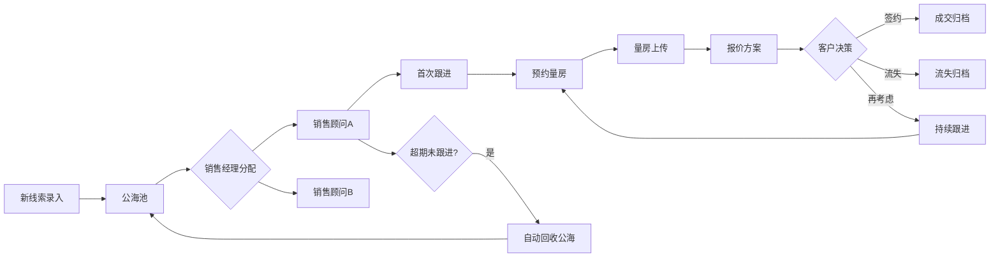

## 1. 产品概述

装修线索跟进管道管理系统，面向装修销售经理团队，提供从线索获取、分配跟进、量房记录、合同签订到成交分析的全流程数字化管理。解决线索流失、跟进混乱、交接断层等问题，提升销售转化率和团队协作效率。

- 核心目标：线索全生命周期可视化管理，销售团队高效协作，数据驱动成交决策
- 目标用户：装修公司销售经理、销售顾问、管理员、数据分析人员
- 市场价值：规范销售流程、降低线索损耗、提升团队业绩、支撑精细化运营

## 2. 核心功能

### 2.1 用户角色

| 角色 | 注册方式 | 核心权限 |
|------|----------|----------|
| 超级管理员 | 后台预置 | 全部权限，角色管理，系统设置，数据导出 |
| 销售经理 | 管理员创建 | 线索分配，公海回收，团队数据查看，成交预测看板 |
| 销售顾问 | 管理员创建 | 个人线索跟进，量房记录上传，客户标签维护，合同附件管理 |
| 数据分析员 | 管理员创建 | 报表查看，回访频次分析，数据导出，看板浏览 |

### 2.2 功能模块

1. **登录认证页**：账号密码登录，角色权限校验，会话管理
2. **工作台仪表盘**：今日待办，线索概览，跟进提醒，成交预测数据
3. **线索管理管道**：看板视图（公海池→待分配→跟进中→量房→报价→签约→成交/流失），列表视图，筛选搜索
4. **线索详情页**：装修需求信息，量房记录，跟进时间轴，合同附件，客户标签，变更历史
5. **公海池管理**：未分配线索列表，批量分配，回收规则，自动回收入池
6. **用户与角色管理**：账号增删改，角色分配，权限配置，操作日志
7. **系统设置**：跟进阶段配置，客户标签管理，校验规则设置，合同附件模板
8. **成交预测看板**：阶段转化率，成交金额预测，销售漏斗，团队业绩排名
9. **回访频次报表**：客户重复咨询分析，处理耗时统计，责任人追溯，回访详情列表
10. **历史变更时间轴**：线索全流程操作记录，字段变更对比，交接备注

### 2.3 页面详情

| 页面名称 | 模块名称 | 功能描述 |
|----------|----------|----------|
| 登录页 | 登录表单 | 账号密码输入，验证码，错误提示，记住登录状态 |
| 工作台 | 数据概览卡片 | 今日新增线索、待跟进、量房预约、预计成交金额 |
| 工作台 | 待办事项列表 | 超时未跟进，今日回访提醒，量房预约提醒 |
| 工作台 | 成交趋势图表 | 近30天成交趋势折线图，环比同比指标 |
| 线索管道 | 看板视图 | 拖拽式阶段切换，每阶段线索卡片，数量统计 |
| 线索管道 | 筛选面板 | 按来源、区域、面积、预算、标签、负责人多条件筛选 |
| 线索管道 | 搜索框 | 按客户姓名、电话、小区名称模糊搜索 |
| 线索详情 | 基础信息 | 客户姓名、电话、小区、面积、预算、装修风格、来源渠道 |
| 线索详情 | 量房信息 | 量房时间、量房人员、房屋照片、测量数据、客户备注 |
| 线索详情 | 跟进时间轴 | 每次跟进记录（时间、方式、内容、下次跟进时间） |
| 线索详情 | 合同附件 | 文件上传、预览、下载，版本记录，上传人信息 |
| 线索详情 | 变更历史 | 字段变更前后对比，操作人，操作时间 |
| 公海池 | 线索列表 | 未分配/已回收线索，批量选择，分配操作 |
| 公海池 | 回收规则 | 自动回收条件（N天未跟进），手动回收入口 |
| 用户管理 | 用户列表 | 账号信息，角色，所属团队，状态，操作按钮 |
| 用户管理 | 角色配置 | 角色名称，权限勾选，成员管理 |
| 系统设置 | 跟进阶段 | 阶段名称、颜色、顺序、是否启用，修改人记录 |
| 系统设置 | 客户标签 | 标签名称、颜色、分类，增删改，修改人记录 |
| 系统设置 | 校验规则 | 必填字段，手机号格式，预算范围，提交校验配置 |
| 成交预测 | 销售漏斗 | 各阶段线索数量、转化率、预估金额 |
| 成交预测 | 业绩排名 | 销售顾问个人业绩，完成率，排行榜 |
| 回访报表 | 重复咨询分析 | 同一客户多次咨询记录，原因归类，时间间隔统计 |
| 回访报表 | 处理耗时统计 | 首次响应时长，平均跟进间隔，签约周期 |
| 回访报表 | 责任人追溯 | 每条记录关联责任人，处理结果，交接记录 |
| 时间轴视图 | 变更时间轴 | 线索全生命周期操作流，颜色区分操作类型，交接标记点 |

## 3. 核心流程

### 3.1 线索跟进主流程

新线索进入系统 → 自动进入公海池 → 销售经理分配给顾问 → 顾问首次跟进 → 预约量房 → 上传量房数据 → 出具报价 → 合同谈判 → 签约成交/流失归档 → 数据统计分析

### 3.2 线索回收流程

顾问超期未跟进（如7天无记录）→ 系统自动提醒 → 再次超期 → 自动回收到公海池 → 销售经理重新分配

### 3.3 Mermaid 流程图

## 4. 用户界面设计

### 4.1 设计风格

- **主色调**：深靛蓝 #1E3A5F（专业可信），辅以暖金色 #D4A853（成交高光），中性灰阶 #F5F7FA / #2C3E50
- **按钮风格**：圆角 8px，主按钮深靛蓝带微渐变，悬停上浮阴影；次级按钮描边透明填充
- **字体**：标题用思源黑体 Bold / Noto Sans SC Bold，正文用思源黑体 Regular / Noto Sans SC Regular，数字用 JetBrains Mono
- **布局风格**：左侧导航栏 + 顶部面包屑 + 主内容卡片式布局，管道看板横向分栏，详情页左右分栏
- **图标风格**：Lucide 线性图标，统一 1.5px 描边，颜色与语义匹配（蓝色=信息，绿色=成交，橙色=提醒，红色=流失）

### 4.2 页面设计概览

| 页面名称 | 模块名称 | UI 元素 |
|----------|----------|---------|
| 登录页 | 登录表单 | 左侧品牌渐变背景 + 装饰几何图形，右侧白色卡片，居中表单，输入框底部描边，按钮悬停微动效 |
| 工作台 | 数据概览 | 4 张渐变色数据卡片，带趋势小箭头和环比百分比，卡片悬停轻微上浮 + 阴影加深 |
| 线索管道 | 看板视图 | 横向 7 列分栏，每列顶部色条+数量徽标，线索卡片白色圆角带左侧状态色条，拖拽时半透明跟随 |
| 线索详情 | 信息面板 | 左侧客户信息卡片（头像+关键信息），右侧 Tab 切换（跟进/量房/合同/变更），时间轴竖向连接线 |
| 成交预测 | 漏斗图表 | 倒三角销售漏斗，每阶层显示数量和转化率，渐变填充，悬停显示详情 Tooltip |
| 回访报表 | 数据表格 | 斑马纹行，状态列彩色标签，悬停行高亮，可展开行显示重复咨询详情 |

### 4.3 响应式

- 桌面端优先（1440px 基准），最小支持 1280px
- 平板端（≤1024px）：左侧导航收起为图标栏，管道看板支持水平滚动
- 移动端（≤768px）：底部 Tab 导航，线索列表替代看板，详情页垂直堆叠

### 4.4 动效与交互

- 页面加载：顶部进度条 + 内容区淡入上移（stagger 延迟）
- 管道拖拽：卡片抓取缩放 0.97，放置目标列高亮背景
- 时间轴：滚动触发节点渐入，连接线 SVG 描边动画
- 数据卡片：数值 CountUp 动画，鼠标悬停阴影 + 微 Y 轴位移
- 模态框：背景模糊 + 缩放弹入，关闭时反向缩小淡出
