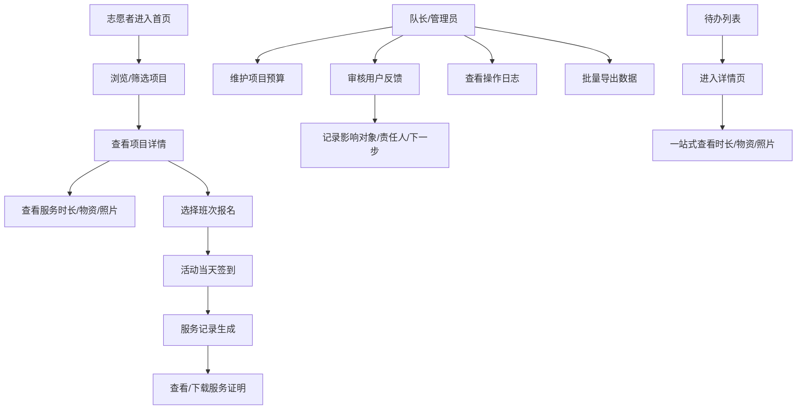

## 1. 产品概述
志愿者活动管理系统，为志愿者队长提供线上志愿活动项目管理平台。前台处理报名班次与签到，后台维护项目预算与审核反馈，实现志愿服务的筛选、回看和下载。

- **目标用户**：志愿者队长、普通志愿者、后台管理员
- **核心价值**：提升志愿活动管理效率，减少信息跳转，关键数据一目了然
- **解决问题**：传统管理方式跳转多、信息分散、大数据量下性能差

## 2. 核心功能

### 2.1 用户角色

| 角色 | 登录方式 | 核心权限 |
|------|----------|----------|
| 普通志愿者 | 账号密码登录 | 浏览项目、报名班次、签到、查看服务记录 |
| 志愿者队长 | 账号密码登录 | 管理项目、班次管理、查看签到数据、提交反馈 |
| 后台管理员 | 账号密码登录 | 预算管理、反馈审核、日志查看、数据导出、系统配置 |

### 2.2 功能模块

1. **首页/项目列表页**：项目公开列表、筛选搜索、快捷入口
2. **项目详情页**：项目信息、服务时长、物资流向、成果照片、班次列表、报名签到
3. **签到页**：扫码/手动签到、签到记录
4. **服务记录页**：个人服务历史、筛选回看、下载证明
5. **后台预算管理**：项目预算录入、支出追踪、报表统计
6. **后台反馈审核**：反馈列表、审核处理、记录影响对象/责任人/下一步安排
7. **后台日志中心**：操作日志、系统日志、导出功能
8. **数据导出页**：批量导出、异步处理、下载中心

### 2.3 页面详情

| 页面名称 | 模块名称 | 功能描述 |
|----------|----------|----------|
| 项目列表页 | 筛选区域 | 按时间、类型、状态筛选项目，支持关键词搜索 |
| 项目列表页 | 项目卡片 | 展示项目封面、名称、时间、状态、报名人数 |
| 项目详情页 | 概览区 | 项目基本信息、累计时长、物资统计、照片轮播 |
| 项目详情页 | 服务时长模块 | 时长统计图表、个人时长记录、排行榜 |
| 项目详情页 | 物资流向模块 | 物资入库/出库记录、流向追踪、库存状态 |
| 项目详情页 | 成果照片模块 | 照片瀑布流、大图预览、分类筛选 |
| 项目详情页 | 班次管理 | 班次列表、报名按钮、签到入口 |
| 签到页 | 签到模块 | 位置验证、签到确认、历史记录 |
| 服务记录页 | 记录列表 | 个人参与记录、时长统计、筛选回看 |
| 后台预算页 | 预算表格 | 预算录入、支出登记、余额显示 |
| 后台反馈审核页 | 反馈处理 | 待审核列表、审核表单（影响对象、责任人、下一步安排）、处理记录 |
| 后台日志页 | 日志列表 | 操作日志、筛选、分页、导出 |
| 数据导出页 | 导出中心 | 导出任务列表、进度显示、下载链接 |

## 3. 核心流程

## 4. 用户界面设计

### 4.1 设计风格
- **主色调**：温暖橙红色系 (#FF6B35)，传递志愿服务的热情与活力
- **辅助色**：深青色 (#004E64)，体现专业与信任
- **中性色**：米白底色 (#FAF7F2)，营造温馨舒适的氛围
- **按钮风格**：圆角 12px，悬停有微妙阴影与轻微放大效果
- **字体**：标题使用 LXGW WenKai（温暖人文感），正文使用 Inter（清晰易读）
- **布局风格**：卡片式布局，信息分层明确，减少视觉噪音
- **图标风格**：Lucide 图标，统一线条粗细，圆润边角

### 4.2 页面设计要点

| 页面名称 | 设计要点 |
|----------|----------|
| 项目详情页 | 采用 Tab + 锚点联动，服务时长、物资流向、成果照片三大模块在单页内切换，避免页面跳转；顶部固定悬浮导航，随时可切换模块 |
| 反馈审核页 | 三栏布局：左侧待审核列表，中间详情与处理表单，右侧历史处理记录；处理表单必填影响对象、责任人、下一步安排 |
| 数据导出页 | 异步处理机制，导出任务后台运行，用户可继续操作；进度条实时显示，完成后邮件/站内通知 |
| 日志中心 | 虚拟滚动处理大数据量，支持多条件组合筛选，导出与浏览完全分离 |

### 4.3 响应式设计
- **桌面端优先**：1280px 以上为主要设计断点
- **平板适配**：1024px 时调整为双栏布局，侧边栏收起为图标菜单
- **移动端适配**：768px 以下单栏布局，底部 Tab 导航，优化触控区域
- **触控优化**：按钮最小高度 44px，列表项间距 16px 以上

### 4.4 性能优化设计
- **虚拟滚动**：日志列表、服务记录列表使用虚拟滚动，仅渲染可视区域
- **分页加载**：项目列表、照片列表采用无限滚动或分页
- **异步导出**：导出任务入队列，Worker 线程处理，避免阻塞主线程
- **图片懒加载**：成果照片使用懒加载 + 渐进式加载
- **接口缓存**：筛选条件、静态数据做本地缓存
- **代码分割**：按路由拆分代码，后台管理页面按需加载
