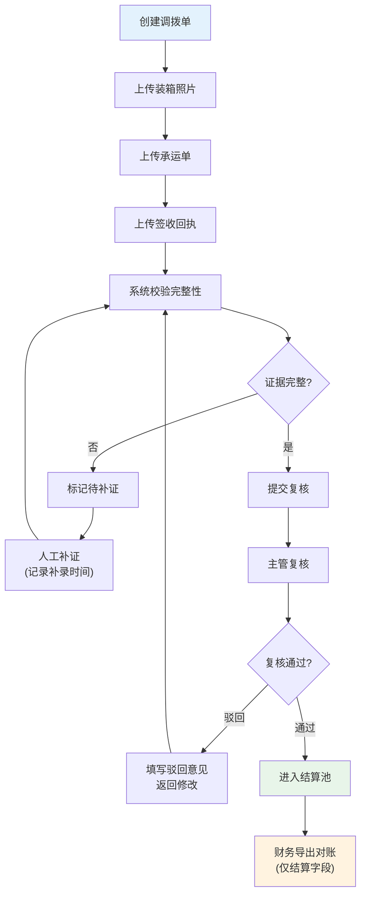

## 1. 产品概述

调拨单证据绑定平台是面向仓库运营的证据管理系统，用于调拨单创建后的证据上传、复核、结算全流程管理。通过标准化的证据校验和流程管控，确保财务结算数据的完整性和可追溯性。

- 核心目标：实现调拨单证据的规范化管理，保障结算流程合规
- 目标用户：仓库值班员、运营主管、财务人员

## 2. 核心功能

### 2.1 用户角色

| 角色 | 登录方式 | 核心权限 |
|------|----------|----------|
| 值班员 | 账号登录 | 上传装箱照片、签收回执、承运单，人工补证 |
| 主管 | 账号登录 | 复核证据完整性，审批通过/驳回，查看审计日志 |
| 财务 | 账号登录 | 查看已复核通过单据，导出对账数据，仅查看结算字段 |

### 2.2 功能模块

1. **调拨单列表页**：导入预览、筛选查询、批次地图、状态展示
2. **调拨单详情页**：附件上传、证据校验、状态流转、补证记录
3. **复核工作台**：待复核列表、证据完整性校验、批量复核
4. **财务对账页**：已通过单据列表、条件筛选、导出对账
5. **审计日志页**：操作记录查询、按责任人追溯、导出筛选条件保留

### 2.3 页面详情

| 页面名称 | 模块名称 | 功能描述 |
|-----------|-------------|---------------------|
| 调拨单列表 | 导入预览 | Excel导入预览，数据校验，异常高亮 |
| 调拨单列表 | 批次地图 | 按批次展示调拨单分布，支持钻取 |
| 调拨单列表 | 筛选面板 | 多条件筛选，条件记忆，导出时保留筛选条件 |
| 调拨单详情 | 附件上传 | 支持装箱照片、签收回执、承运单上传，文件类型校验 |
| 调拨单详情 | 证据校验 | 自动校验附件完整性，缺少签收回执禁止进入结算 |
| 调拨单详情 | 补证记录 | 人工补证标明补录时间和操作人 |
| 复核工作台 | 证据复核 | 主管查看证据，标记通过/驳回，填写复核意见 |
| 财务对账 | 数据导出 | 仅导出已复核通过单据，仅包含结算字段 |
| 审计日志 | 追溯查询 | 按责任人、时间、操作类型查询状态变更记录 |

## 3. 核心流程

### 3.1 业务主流程

值班员创建调拨单并上传证据 → 系统自动校验附件完整性 → 主管人工复核 → 复核通过后进入结算池 → 财务导出对账数据

### 3.2 流程图

### 3.3 审计日志记录点

所有状态变更（创建、上传、补证、提交、复核通过/驳回、导出）均写入审计日志，记录操作人、时间、操作类型、变更前后状态。

## 4. 用户界面设计

### 4.1 设计风格

- **主色调**：深蓝色系（#1565C0）代表专业和信任，辅助色绿色（#2E7D32）表示通过，橙色（#EF6C00）表示待处理，红色（#C62828）表示异常
- **按钮风格**：圆角 6px，实心主按钮，描边次要按钮，悬停有微动画
- **字体**：系统字体栈，标题 16-18px semibold，正文 14px regular
- **布局风格**：顶部导航 + 左侧筛选 + 主内容区卡片式布局
- **图标风格**：线性简洁图标，状态使用标签色块区分

### 4.2 页面设计概览

| 页面名称 | 模块名称 | UI 元素 |
|-----------|-------------|-------------|
| 调拨单列表 | 顶部操作栏 | 导入按钮、导出按钮、刷新、批量操作 |
| 调拨单列表 | 数据表格 | 状态标签色块、附件数量徽标、责任人列 |
| 调拨单详情 | 附件区域 | 缩略图卡片、上传进度条、文件类型图标 |
| 复核工作台 | 待办卡片 | 紧急程度标识、剩余时限、快捷操作按钮 |
| 审计日志 | 时间轴 | 垂直时间轴展示状态变更，彩色节点区分操作类型 |

### 4.3 响应式

桌面端优先设计，表格支持横向滚动，筛选面板在小屏幕可折叠。

### 4.4 交互细节

- 文件上传拖拽区域有高亮反馈
- 状态变更有平滑过渡动画
- 表格行悬停显示操作按钮
- 筛选条件变更即时触发查询并更新 URL 参数
