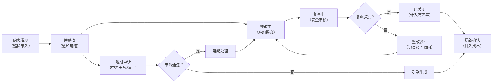

## 1. 产品概述

建筑工地隐患整改看板系统，为安全总监提供数据复盘能力，实现隐患全生命周期闭环管理。系统整合巡检点、隐患类型、责任班组、整改照片、复查结果和罚款记录等多维度数据，提供整改闭环率、逾期榜、楼层热力图、班组趋势等可视化分析。

- **核心目标**：提升安全管理效率，确保隐患整改闭环，降低安全事故风险
- **目标用户**：安全总监、安全管理人员、项目负责人
- **核心价值**：数据驱动的安全决策，透明化的整改流程追溯

## 2. 核心 Features

### 2.1 用户角色

| 角色 | 注册方式 | 核心权限 |
|------|----------|----------|
| 安全总监 | 系统分配 | 全局数据查看、罚款审批、导出报表、附件权限管理 |
| 安全管理员 | 系统分配 | 隐患录入、复查、照片审核、班组申诉处理 |
| 班组负责人 | 系统分配 | 查看本班组隐患、提交整改、申诉申请 |

### 2.2 Feature Module

1. **数据概览看板**：核心指标卡片、整改闭环率趋势、逾期隐患排行、楼层热力分布
2. **隐患明细管理**：隐患列表、多维度筛选、下钻明细、状态流转追踪
3. **整改与复查**：整改照片上传、复查审核、驳回原因记录、申诉处理
4. **罚款与成本**：罚款记录管理、金额确认、成本统计、未确认金额隔离
5. **数据分析中心**：班组趋势分析、隐患类型分布、巡检点覆盖统计
6. **系统管理**：附件权限配置、状态口径定义、筛选上下文管理

### 2.3 页面详情

| 页面名称 | 模块名称 | Feature 描述 |
|----------|----------|--------------|
| 数据看板首页 | 指标卡片区 | 展示总隐患数、待整改数、整改中、复查中、已关闭、闭环率、逾期率等核心KPI |
| 数据看板首页 | 图表展示区 | 整改闭环率趋势图、逾期隐患排行榜、楼层热力分布图、班组整改趋势图 |
| 数据看板首页 | 全局筛选器 | 时间范围、楼层、班组、隐患类型、状态等多维度筛选，切换后保留上下文 |
| 隐患明细页 | 列表展示 | 隐患列表，支持分页、排序、多条件组合筛选 |
| 隐患明细页 | 详情面板 | 点击下钻查看完整信息：巡检点照片、整改前后对比、复查记录、驳回原因、申诉记录 |
| 隐患明细页 | 附件管理 | 根据权限查看/下载整改照片、复查照片、相关文档，支持权限控制 |
| 罚款统计页 | 罚款列表 | 罚款记录展示，区分已确认/未确认状态，未确认不纳入成本统计 |
| 罚款统计页 | 成本分析 | 按班组、按类型、按时间维度的罚款成本统计图表 |
| 申诉处理页 | 申诉列表 | 班组申诉逾期申请，关联天气记录、停工记录作为佐证 |
| 系统配置页 | 状态口径 | 定义隐患各状态的判定规则，确保各图表口径一致 |
| 系统配置页 | 权限管理 | 附件访问权限配置，不同角色可见范围控制 |

## 3. 核心流程

### 3.1 隐患整改闭环流程

### 3.2 数据口径规则

1. **已关闭定义**：复查通过的隐患，复查中状态不算已关闭
2. **闭环率计算**：已关闭数 / (总隐患数 - 申诉通过延期数)
3. **成本统计**：仅包含罚款金额已确认的隐患
4. **逾期判定**：超过整改截止日期且未完成、未申诉或申诉被驳回

## 4. User Interface Design

### 4.1 Design Style

- **主色调**：深蓝 (#165DFF) 代表专业与信任，搭配橙色 (#FF7D00) 作为警示色
- **辅助色**：成功绿 (#00B42A)、警告黄 (#FF7D00)、危险红 (#F53F3F)
- **背景**：深色工业风背景 (#1D2129) 搭配浅灰卡片 (#4E5969)，体现建筑工地的严谨氛围
- **按钮风格**：直角微圆角 (4px)，实心按钮带轻微阴影，强调工业感
- **字体**：主标题使用 Roboto Condensed 粗体，正文使用 Inter Regular，数据数字使用 JetBrains Mono 等宽字体
- **布局风格**：卡片式模块化布局，网格系统，数据密集型设计
- **图标风格**：线性图标搭配填充状态，使用 Lucide Icons 系列

### 4.2 Page Design Overview

| 页面名称 | 模块名称 | UI Elements |
|----------|----------|-------------|
| 数据看板首页 | 顶部导航 | 深色导航栏，项目名称、用户信息、全局搜索、通知中心 |
| 数据看板首页 | 指标卡片行 | 6个KPI卡片横向排列，悬停有微缩放动效，数值动态计数 |
| 数据看板首页 | 图表网格 | 2x2 网格布局：左上闭环率趋势、右上逾期榜、左下楼层热力、右下班组趋势 |
| 数据看板首页 | 筛选器栏 | 固定在顶部下方，标签式筛选，选中状态高亮，支持收起展开 |
| 隐患明细页 | 列表+详情 | 左侧表格列表，右侧抽屉式详情面板，点击平滑过渡 |
| 隐患明细页 | 时间线 | 详情面板中使用垂直时间线展示隐患全生命周期状态变更 |
| 罚款统计页 | 汇总卡片 | 顶部展示总罚款、已确认、未确认金额，下方分类图表 |
| 通用组件 | 状态标签 | 不同状态使用对应颜色的圆角标签，带动画过渡 |

### 4.3 交互细节

- **图表联动**：点击逾期榜某班组，自动筛选其他图表仅显示该班组数据
- **下钻动画**：点击隐患行时，详情面板从右侧滑入，背景轻微模糊
- **筛选记忆**：切换页面后返回，筛选条件保持不变，通过 URL 参数或全局状态管理
- **加载状态**：骨架屏加载，数据加载时显示脉冲动画
- **空状态**：无数据时显示工业风插画+友好提示

### 4.4 Responsiveness

- 桌面端优先设计，适配 1920px、1440px、1024px 宽度
- 平板端：图表网格改为单列滚动，筛选器可折叠
- 移动端：核心指标卡片堆叠展示，图表支持横向滑动查看

## 5. 核心业务规则

### 5.1 状态口径一致性

- 所有图表使用统一的状态枚举定义，避免口径不一致
- 状态变更通过状态机管理，确保流转合法性
- 复查中状态明确排除在"已关闭"统计之外

### 5.2 照片管理规则

- 整改照片驳回时，必须填写驳回原因并永久保留
- 照片支持版本历史，可查看历次提交记录
- 敏感照片（如事故现场）需特殊权限才能查看

### 5.3 申诉与佐证

- 班组申诉逾期时，系统自动关联对应时间段的天气记录和停工记录
- 安全管理员可补充其他佐证材料
- 申诉处理结果影响逾期统计和罚款计算

### 5.4 成本统计隔离

- 罚款金额有"待确认"、"已确认"、"已驳回"三种状态
- 成本统计报表仅包含"已确认"状态的罚款
- 未确认罚款在单独区域展示，提醒及时处理

### 5.5 筛选上下文保留

- 筛选条件同时存储在：URL 参数、全局状态、localStorage
- 页面刷新、切换标签页后筛选条件自动恢复
- 支持"保存筛选方案"功能，便于常用查询快速调用
