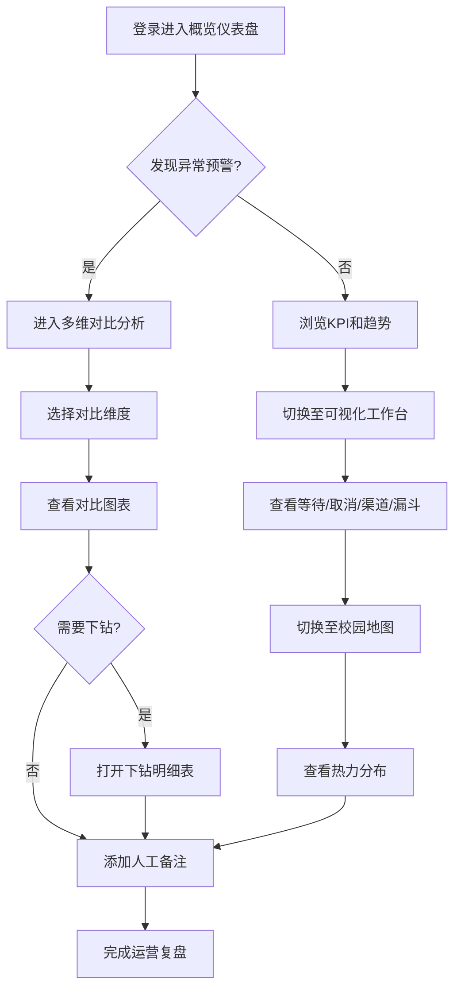

## 1. 产品概述

学校心理咨询预约运营复盘工作台——面向心理中心老师的数据分析平台，通过多维度对比、可视化趋势和下钻明细，帮助老师发现预约异常、追踪取消原因、监控回访漏斗，并在地图上呈现校园咨询需求的空间分布。所有学生数据均匿名化，仅展示聚合趋势。

- **目标用户**：高校心理健康教育中心教师、运营管理人员
- **核心价值**：将散落的预约记录转化为可操作洞察，缩短从"发现异常"到"定位问题"的路径

## 2. 核心功能

### 2.1 用户角色

| 角色 | 注册方式 | 核心权限 |
|------|----------|----------|
| 心理中心教师 | 管理员分配账号 | 查看全部聚合数据、下钻明细、撰写人工备注 |
| 运营管理员 | 管理员分配账号 | 除教师权限外，可导出报告、管理口径配置 |

### 2.2 功能模块

1. **概览仪表盘**：核心 KPI 卡片、预约趋势折线、异常预警信号灯
2. **多维对比分析页**：按年级/咨询类型/时间段/预约渠道/状态进行交叉对比
3. **可视化工作台**：等待时间分布直方图、取消原因饼图、渠道趋势折线、回访漏斗
4. **校园地图页**：Mapbox GL 校园热力图，展示各区域预约密度
5. **下钻明细页**：点击异常点展开脱敏明细表，支持口径说明悬浮提示
6. **人工备注面板**：对任意异常数据点撰写/查看备注

### 2.3 页面详情

| 页面名称 | 模块名称 | 功能描述 |
|----------|----------|----------|
| 概览仪表盘 | KPI 卡片区 | 展示总预约数、取消率、平均等待天数、回访完成率 |
| 概览仪表盘 | 趋势折线图 | 近 30/90/180 天预约量趋势，叠加取消量 |
| 概览仪表盘 | 异常预警信号灯 | 自动检测同比/环比异常变动，红色闪烁提示 |
| 多维对比分析 | 维度选择器 | 年级/咨询类型/时间段/预约渠道/状态，支持多选交叉 |
| 多维对比分析 | 对比图表区 | 柱状图/雷达图展示选维度下的指标对比 |
| 多维对比分析 | 口径说明浮层 | 每个指标旁显示 i 图标，hover 展示统计口径定义 |
| 可视化工作台 | 等待时间分布 | 直方图展示 0-3/3-7/7-14/14+ 天的预约人数分布 |
| 可视化工作台 | 取消原因分析 | 环形图展示各取消原因占比（时间冲突/自行缓解/已转介等） |
| 可视化工作台 | 渠道趋势 | 分渠道堆叠面积图，展示线上/线下/转介趋势 |
| 可视化工作台 | 回访漏斗 | 预约→到场→首次咨询→完成回访的转化漏斗 |
| 校园地图 | Mapbox 热力图 | 校园建筑底图 + 预约密度热力层，支持按时间段筛选 |
| 校园地图 | 区域标注弹窗 | 点击建筑弹出该区域聚合预约统计 |
| 下钻明细 | 明细表格 | 脱敏后的预约记录列表，支持排序/筛选/分页 |
| 下钻明细 | 口径说明栏 | 表头旁标注数据口径和计算规则 |
| 人工备注面板 | 备注输入 | 对异常数据点撰写文字备注，记录分析结论 |
| 人工备注面板 | 备注列表 | 展示当前数据点所有历史备注，按时间排序 |

## 3. 核心流程

用户登录后进入概览仪表盘，查看核心 KPI 和异常预警信号灯。发现某指标异常（如某年级取消率突增）后，进入多维对比分析页选择对应维度深入对比，确认异常范围。随后切换到可视化工作台查看等待时间分布、取消原因、渠道趋势、回访漏斗等图表，定位具体原因。如需查看个体层面信息，点击下钻进入明细页查看脱敏记录。在地图页可查看校园空间维度的需求分布。整个过程中，用户可随时对异常数据点添加人工备注。

## 4. 用户界面设计

### 4.1 设计风格

- **主色调**：深青色 (#0D9488) 搭配暖灰底色 (#F8F7F4)，传达专业而温暖的心理咨询氛围
- **辅助色**：珊瑚色 (#F97066) 用于异常预警，琥珀色 (#F59E0B) 用于需关注项
- **按钮风格**：圆角 (8px)，主按钮实心填充，次要按钮描边
- **字体**：Noto Sans SC（中文主体）+ DM Sans（数字/英文），数据展示用等宽变体
- **布局风格**：左侧固定导航栏 + 右侧内容区，内容区卡片式模块化布局
- **图标风格**：线性图标（lucide-react），24px 尺寸

### 4.2 页面设计概览

| 页面名称 | 模块名称 | UI 元素 |
|----------|----------|----------|
| 概览仪表盘 | KPI 卡片 | 白底卡片，大号数字 + 微型趋势线，底部阴影 |
| 概览仪表盘 | 趋势折线 | 渐变填充面积图，hover 显示精确数据 |
| 概览仪表盘 | 异常信号灯 | 红色脉冲圆点 + 文字提示，有动画效果 |
| 多维对比 | 维度选择器 | 多选下拉菜单 + 标签式已选展示 |
| 多维对比 | 对比图表 | 分组柱状图/雷达图，支持切换图表类型 |
| 可视化工作台 | 等待分布 | 渐变色直方图，hover 显示区间详情 |
| 可视化工作台 | 取消原因 | 环形图，中心显示总取消数 |
| 可视化工作台 | 渠道趋势 | 堆叠面积图，透明度渐变 |
| 可视化工作台 | 回访漏斗 | 水平漏斗图，显示各环节转化率 |
| 校园地图 | 地图主体 | Mapbox GL 暗色底图 + 亮色热力层 |
| 下钻明细 | 明细表格 | 斑马纹表格，固定表头，行 hover 高亮 |
| 人工备注 | 备注面板 | 右侧抽屉式滑出面板，文本域 + 提交按钮 |

### 4.3 响应式设计

- 桌面优先设计，目标分辨率 1440×900 及以上
- 平板端（768-1024px）导航栏折叠为汉堡菜单，卡片自适应单列
- 移动端仅做基础可用性保证，不作为主要使用场景

### 4.4 3D 场景指引

不适用（本项目无 3D 场景需求）
