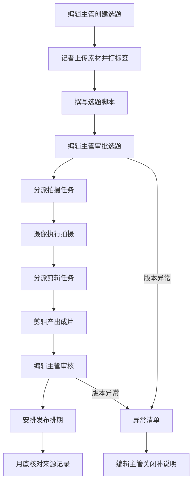
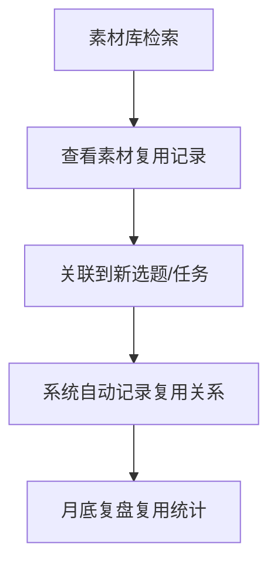
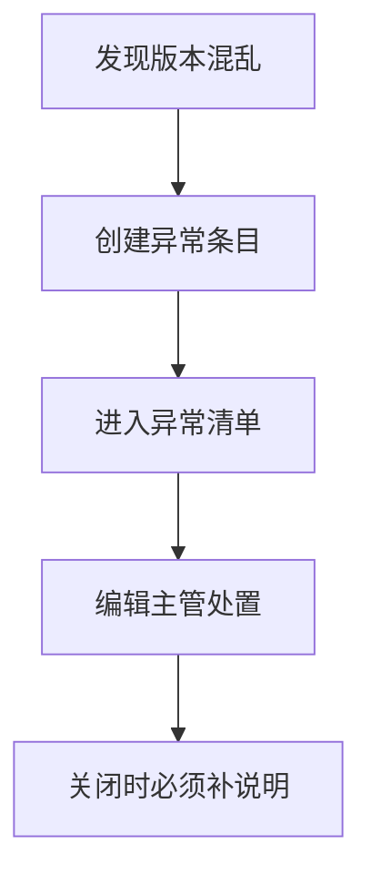

## 1. 产品概述

新闻稿件选题策划台是面向编辑主管的全流程选题管理与素材调度系统，涵盖从采访素材上传打标、选题脚本撰写、拍摄剪辑任务分派到发布排期核对的完整工作链路，确保每个环节的来源可追溯、版本可复盘、异常可闭环。

- 解决选题流程中素材散落、任务分派不透明、排期核对缺少来源记录的痛点
- 目标用户：编辑部主管，负责选题审批、任务调度、月底核对与异常处置

## 2. 核心功能

### 2.1 用户角色

| 角色 | 注册方式 | 核心权限 |
|------|----------|----------|
| 编辑主管 | 管理员分配账号 | 选题审批、素材管理、任务分派、排期核对、异常处置 |
| 记者/编辑 | 管理员分配账号 | 上传素材、打标签、查看被分派任务、提交脚本 |
| 摄像/剪辑 | 管理员分配账号 | 查看被分派任务、提交成片、更新任务状态 |

### 2.2 功能模块

1. **仪表盘**: 选题总览、任务进度看板、异常提醒、近期排期
2. **素材库**: 素材上传、标签管理、筛选检索、复用记录
3. **选题管理**: 选题创建/编辑、脚本关联、素材绑定、状态流转
4. **任务分派**: 拍摄/剪辑任务创建、人员分派、进度跟踪
5. **发布排期**: 月度排期日历、平台账号关联、来源记录与补充说明
6. **异常清单**: 版本混乱类异常列表、处置流程、关闭补说明

### 2.3 页面详情

| 页面名称 | 模块名称 | 功能描述 |
|----------|----------|----------|
| 仪表盘 | 选题概览卡片 | 显示进行中/待审批/已完成选题数量，点击可跳转筛选 |
| 仪表盘 | 任务进度看板 | 按状态（待接单/进行中/待审/已完成）展示任务分布 |
| 仪表盘 | 异常提醒 | 未关闭异常数量、最新异常摘要，点击进入异常清单 |
| 仪表盘 | 近期排期 | 未来7天发布排期预览 |
| 素材库 | 素材上传区 | 支持拖拽上传采访素材（图片/视频/文档），自动提取元信息 |
| 素材库 | 标签管理 | 为素材添加/移除标签，支持多级标签体系 |
| 素材库 | 筛选检索 | 按标签/日期/类型/关键词组合筛选素材 |
| 素材库 | 复用记录 | 展示素材被哪些选题/任务引用的历史记录 |
| 选题管理 | 选题列表 | 按状态/日期/标签筛选选题，支持批量操作 |
| 选题管理 | 选题详情 | 编辑选题信息、关联素材和脚本、查看完整来源记录 |
| 选题管理 | 脚本编辑 | 撰写/编辑选题脚本，保留版本历史 |
| 任务分派 | 任务列表 | 按类型（拍摄/剪辑）/状态/执行人筛选任务 |
| 任务分派 | 创建任务 | 选择任务类型、关联选题、指派执行人、设置截止日期 |
| 任务分派 | 任务详情 | 查看任务进度、提交记录、素材产出 |
| 发布排期 | 排期日历 | 月度视图展示发布排期，按平台颜色区分 |
| 发布排期 | 排期详情 | 查看单条排期关联的选题脚本、平台账号、来源记录 |
| 发布排期 | 来源记录 | 保留每条排期的创建者、关联选题、脚本版本及补充说明 |
| 异常清单 | 异常列表 | 版本混乱类异常列表，按状态/严重程度筛选 |
| 异常清单 | 异常详情 | 查看异常原因、影响范围、处理进展 |
| 异常清单 | 关闭异常 | 编辑主管关闭异常时必须填写处理说明 |

## 3. 核心流程

### 3.1 选题到发布完整流程

编辑主管创建选题 → 记者上传采访素材并打标签 → 选题脚本撰写 → 编辑主管审批选题 → 分派拍摄任务 → 摄像执行拍摄 → 分派剪辑任务 → 剪辑产出成片 → 编辑主管审核 → 安排发布排期（关联平台账号） → 月底核对来源记录与补充说明

### 3.2 素材复用流程

素材库检索 → 查看复用记录 → 关联到新选题/任务 → 系统自动记录复用关系

### 3.3 异常处理流程

发现版本混乱 → 系统自动/人工创建异常条目 → 进入异常清单 → 编辑主管处置 → 关闭时必须补说明

## 4. 用户界面设计

### 4.1 设计风格

- **主色调**: 深墨蓝 (#1a2332) + 铜橙强调 (#e07a3a)，传达专业感与行动力
- **辅色调**: 暖灰底色 (#f5f3ef)，卡片白 (#ffffff)，状态绿 (#2d9a6f)，警示红 (#d94f4f)
- **按钮风格**: 圆角微凸（rounded-lg + shadow-sm），主操作铜橙填充，次操作边框
- **字体**: 标题用 Noto Serif SC 衬线体，正文用 Noto Sans SC，数据用 JetBrains Mono
- **布局风格**: 左侧固定导航栏 + 右侧内容区，内容区卡片化布局
- **图标**: Lucide Icons 线条风格

### 4.2 页面设计概览

| 页面名称 | 模块名称 | UI元素 |
|----------|----------|--------|
| 仪表盘 | 选题概览卡片 | 四宫格统计卡片，铜橙渐变边框，hover微抬 |
| 仪表盘 | 任务看板 | 横向泳道布局，任务卡片可拖拽状态列 |
| 仪表盘 | 异常提醒 | 右侧浮动通知条，警示红角标 |
| 素材库 | 上传区 | 虚线拖拽区，上传进度环，完成后铜橙勾 |
| 素材库 | 标签云 | 圆角胶囊标签，选中态铜橙填充 |
| 素材库 | 复用记录 | 时间线样式，连接选题卡片 |
| 选题管理 | 选题列表 | 表格+卡片切换视图，状态胶囊 |
| 选题管理 | 脚本编辑 | 侧边编辑器，版本历史面板 |
| 任务分派 | 任务列表 | 看板+列表双视图，头像+状态标记 |
| 发布排期 | 排期日历 | 月历网格，平台色条标记，hover展开详情 |
| 发布排期 | 来源记录 | 可折叠溯源链，补充说明可内联编辑 |
| 异常清单 | 异常列表 | 紧凑表格，严重程度色条，关闭按钮带必填说明弹窗 |

### 4.3 响应式设计

- **桌面优先**: 内容区最小宽度 1024px，导航栏 240px
- **平板适配** (768-1024px): 导航栏折叠为图标模式，内容区单列布局
- **手机适配** (<768px): 底部Tab导航，录入表单全屏，筛选折叠为抽屉，详情页独立路由
- **触控优化**: 按钮最小 44px 触控区，卡片间距 ≥12px，下拉选择用原生控件

### 4.4 3D场景指引

不适用
