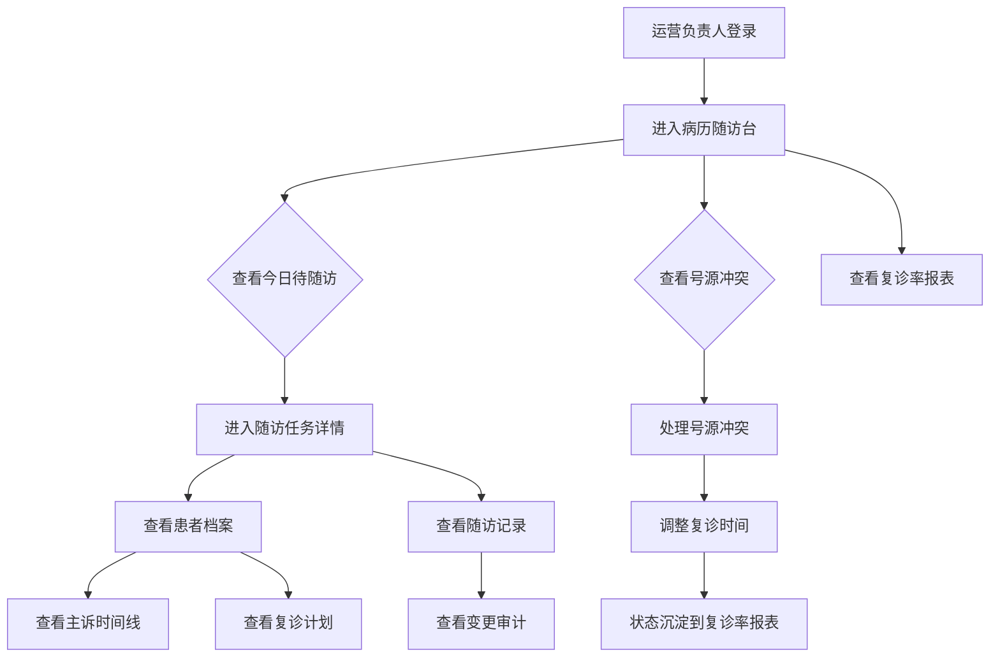
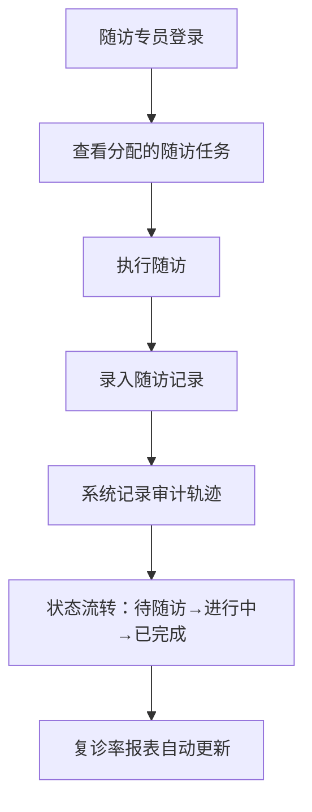

## 1. 产品概述

中医馆病历随访系统——以病历随访台为核心，帮助运营负责人高效管理病历摘要、随访任务和号源冲突，确保每条随访记录可追溯、每次字段变更有审计轨迹，最终将关键状态沉淀到复诊率报表，驱动中医馆运营质量持续提升。

- 目标用户：中医馆运营负责人、随访专员、医师
- 核心价值：随访质量可追溯到每条记录，复诊率数据实时可查，字段变更有完整审计链

## 2. 核心功能

### 2.1 用户角色

| 角色 | 注册方式 | 核心权限 |
|------|----------|----------|
| 运营负责人 | Clerk 邀请注册 | 查看病历与随访任务、维护病例摘要、管理权限、查看复诊率报表、处理号源冲突 |
| 随访专员 | Clerk 邀请注册 | 执行随访任务、录入随访记录、查看分配给自己的任务 |
| 医师 | Clerk 邀请注册 | 查看自己患者的病历和随访记录、更新主诉和诊疗方案 |

### 2.2 功能模块

1. **病历随访台**（核心首页）：今日待随访列表、号源冲突预警、快捷操作面板
2. **患者档案页**：患者基本信息、主诉记录时间线、复诊计划、历史随访记录
3. **随访任务管理页**：任务列表与筛选、任务分配、随访状态流转
4. **复诊率报表页**：按时间段/医师/科室统计复诊率、趋势图表
5. **变更审计页**：字段变更历史、旧值/新值/修改时间对比

### 2.3 页面详情

| 页面名称 | 模块名称 | 功能描述 |
|----------|----------|----------|
| 病历随访台 | 今日随访看板 | 显示今日待随访任务数量、紧急任务标记、号源冲突数量 |
| 病历随访台 | 随访任务列表 | 分页展示随访任务，支持按状态/患者/医师筛选，点击进入详情 |
| 病历随访台 | 号源冲突处理 | 列出冲突的号源，支持一键调整复诊时间并通知患者 |
| 病历随访台 | 快捷操作栏 | 新建随访任务、批量分配、导出报表快捷入口 |
| 患者档案页 | 患者基本信息 | 姓名、性别、年龄、联系方式、过敏史等 |
| 患者档案页 | 主诉记录时间线 | 按时间线展示每次就诊主诉，支持前后对比变化 |
| 患者档案页 | 复诊计划 | 当前复诊计划详情、历史复诊完成情况 |
| 患者档案页 | 随访记录列表 | 该患者所有随访记录，含随访状态、质量评分 |
| 随访任务管理页 | 任务列表 | 全量任务列表，支持多维度筛选和排序 |
| 随访任务管理页 | 任务分配 | 将任务分配给随访专员，支持批量操作 |
| 随访任务管理页 | 状态流转 | 待随访→进行中→已完成/失访，记录每次状态变更 |
| 复诊率报表页 | 复诊率概览 | 总体复诊率、环比变化、目标完成率 |
| 复诊率报表页 | 按维度统计 | 按医师/科室/时间段分组统计复诊率 |
| 复诊率报表页 | 趋势图表 | 复诊率随时间变化的折线图 |
| 变更审计页 | 变更记录列表 | 按实体/字段/时间筛选变更记录 |
| 变更审计页 | 变更详情 | 展示旧值、新值、修改时间、修改人 |

## 3. 核心流程

运营负责人登录后进入病历随访台，查看今日待随访任务和号源冲突。对于冲突的号源，负责人调整复诊时间，状态变更自动沉淀到复诊率报表。负责人可进入患者档案查看主诉记录的前后变化和复诊计划，也可查看每条随访记录的详细过程。随访专员执行随访任务后录入结果，系统自动记录所有字段变更的审计轨迹。

## 4. 用户界面设计

### 4.1 设计风格

- 主色调：深靛蓝 (#1e3a5f) + 草药绿 (#4a7c59)，传达中医馆的专业与自然感
- 辅助色：暖米色 (#f5f0e8) 作为背景底色，琥珀色 (#d4913b) 作为警示与强调
- 按钮风格：圆角 8px，柔和阴影，主要操作用靛蓝色实心按钮，次要操作用描边按钮
- 字体：思源宋体 (Noto Serif SC) 用于标题，思源黑体 (Noto Sans SC) 用于正文
- 布局风格：左侧导航 + 右侧内容区，卡片式信息展示
- 图标风格：线性图标 (Lucide)，1.5px 描边

### 4.2 页面设计概览

| 页面名称 | 模块名称 | UI 元素 |
|----------|----------|---------|
| 病历随访台 | 今日随访看板 | 顶部统计卡片（待随访数/冲突数/完成率），靛蓝底白字数字，草药绿趋势箭头 |
| 病历随访台 | 随访任务列表 | 表格布局，状态用彩色标签（待随访-琥珀/进行中-靛蓝/已完成-草药绿/失访-灰色），行点击展开详情 |
| 病历随访台 | 号源冲突处理 | 冲突卡片列表，每张卡片显示冲突的两位患者信息，提供时间调整弹窗 |
| 患者档案页 | 主诉记录时间线 | 垂直时间线组件，左侧时间轴右侧内容卡，每次主诉显示症状和变化对比箭头 |
| 患者档案页 | 复诊计划 | 卡片布局，当前计划突出显示（草药绿边框），历史计划灰化 |
| 复诊率报表页 | 复诊率概览 | 大号数字卡片 + 环比变化小字，折线图使用草药绿渐变填充 |
| 变更审计页 | 变更详情 | 双列对比布局：左侧旧值（删除线红字）右侧新值（绿色高亮），中间箭头连接 |

### 4.3 响应式设计

- 桌面优先设计，最小宽度 1280px
- 平板端（768-1279px）：侧边栏折叠为图标模式，表格列减少
- 移动端（<768px）：单列布局，底部导航栏替代侧边栏

### 4.4 3D 场景指引

- 不适用
