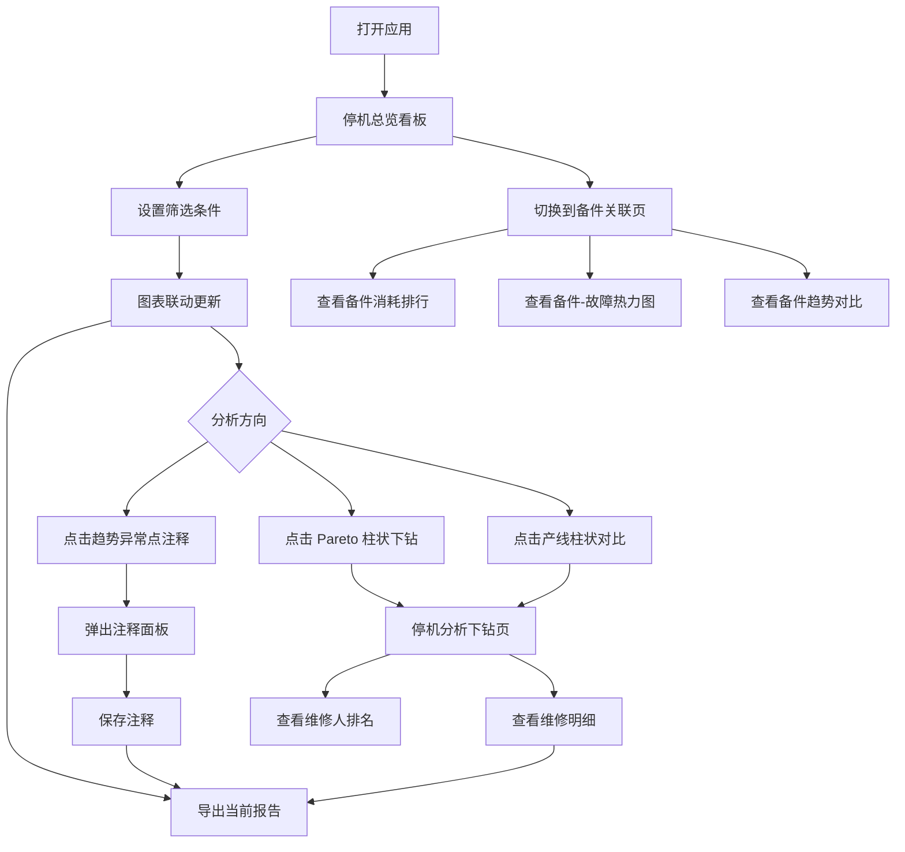

## 1. 产品概述

工厂设备停机原因看板——面向生产主管的数据可视化应用，整合设备运行、报警、维修工单、班组、产量和备件消耗六大分散数据源，以设备、产线、班次、故障类型、维修人为主维度，提供联动筛选、对比、下钻和导出能力，帮助管理者识别停机根因、区分计划检修与突发停机，避免考核误导。

- 目标用户：工厂生产主管、设备管理工程师
- 核心价值：将分散数据统一呈现，区分计划/突发停机，支持异常注释与报告导出，驱动精准决策

## 2. 核心功能

### 2.1 用户角色

| 角色 | 入口方式 | 核心权限 |
|------|----------|----------|
| 生产主管 | 账号登录 | 查看全部看板、下钻分析、添加注释、导出报告 |
| 设备工程师 | 账号登录 | 查看看板、下钻分析、添加注释 |

### 2.2 功能模块

1. **停机总览看板**：KPI 卡片、停机 Pareto 图、产线对比图、计划/突发停机分栏统计、筛选状态栏
2. **停机分析下钻**：维修时长分布、故障类型下钻、维修人维度分析、异常点注释
3. **备件关联分析**：备件消耗与停机关联、备件消耗趋势、备件-故障类型热力图

### 2.3 页面详情

| 页面名称 | 模块名称 | 功能描述 |
|----------|----------|----------|
| 停机总览看板 | 全局筛选栏 | 设备/产线/班次/故障类型/维修人/时间范围联动筛选，计划/突发停机切换 |
| 停机总览看板 | KPI 指标卡片 | 总停机时长、停机次数、平均修复时长、计划停机占比、MTBF、MTTR |
| 停机总览看板 | 停机 Pareto 图 | 按故障类型排序的停机时长柱状图+累计百分比曲线，支持点击下钻 |
| 停机总览看板 | 产线对比图 | 各产线停机时长/次数对比柱状图，计划与突发分色叠加 |
| 停机总览看板 | 停机趋势折线图 | 时间维度停机趋势，计划/突发双线，支持异常注释标注 |
| 停机总览看板 | 数据更新时间标记 | 显示最近数据刷新时间与缓存状态 |
| 停机分析下钻 | 维修时长分布 | 维修工单时长分布直方图，区分计划/突发 |
| 停机分析下钻 | 故障类型下钻面板 | 点击 Pareto 图某类型后展示该类型下设备明细与维修记录 |
| 停机分析下钻 | 维修人分析 | 各维修人处理工单数/平均时长/响应速度排名 |
| 停机分析下钻 | 异常注释面板 | 选中数据点后弹出注释输入框，保存后标注于图表 |
| 备件关联分析 | 备件消耗排行 | 停机关联备件消耗 Top N 排行 |
| 备件关联分析 | 备件-故障热力图 | 备件类型 × 故障类型消耗矩阵热力图 |
| 备件关联分析 | 备件消耗趋势 | 备件消耗时间趋势，支持与停机趋势叠加对比 |
| 备件关联分析 | 备件关联明细表 | 可下钻的备件消耗明细数据表格 |

## 3. 核心流程

用户打开应用后，在总览看板通过筛选栏选择关注的维度和时间范围，所有图表联动更新。点击 Pareto 图中某个故障类型可下钻到分析页查看该类型的设备明细和维修记录。在趋势图上发现异常点时可添加注释说明原因。切换到备件关联页可查看备件消耗与停机的关联关系。最后可将当前筛选状态下的数据导出为报告。

## 4. 用户界面设计

### 4.1 设计风格

- 主色调：深蓝灰(#1a1f36)为底，亮青(#00e5c7)为强调色，橙红(#ff6b4a)为告警色
- 辅助色：计划停机用蓝(#4a90d9)，突发停机用橙(#ff8c42)
- 按钮风格：圆角矩形，悬停时带发光效果
- 字体：标题用 JetBrains Mono（工业感），正文用 Noto Sans SC
- 布局风格：顶栏导航 + 左侧筛选面板 + 右侧图表网格
- 图标风格：线性图标，统一 2px 描边
- 整体风格：工业监控仪表盘，暗色主题，数据密度高但层次清晰

### 4.2 页面设计概览

| 页面名称 | 模块名称 | UI 元素 |
|----------|----------|---------|
| 停机总览看板 | 全局筛选栏 | 顶部固定栏，多选下拉框组，时间范围选择器，计划/突发切换开关 |
| 停机总览看板 | KPI 指标卡片 | 6 张指标卡片横排，数字大字+趋势小箭头+迷你火花图 |
| 停机总览看板 | 停机 Pareto 图 | 左侧柱状+右侧累计曲线，柱状分计划/突发双色 |
| 停机总览看板 | 产线对比图 | 水平堆叠柱状图，计划蓝+突发橙 |
| 停机总览看板 | 停机趋势折线图 | 双色折线+面积填充，异常注释标记点 |
| 停机分析下钻 | 维修时长分布 | 直方图+箱线图叠加，计划/突发分面 |
| 停机分析下钻 | 故障类型下钻面板 | 右侧滑出抽屉面板，设备列表+维修记录表 |
| 停机分析下钻 | 维修人分析 | 横向条形图排名+响应速度散点 |
| 停机分析下钻 | 异常注释面板 | 浮层模态框，文本输入+标签选择 |
| 备件关联分析 | 备件消耗排行 | 水平条形图，带消耗金额标签 |
| 备件关联分析 | 备件-故障热力图 | 矩阵色块，悬停显示具体数值 |
| 备件关联分析 | 备件消耗趋势 | 双轴折线图（消耗量+停机时长） |
| 备件关联分析 | 备件关联明细表 | 可排序可分页数据表格，支持行点击下钻 |

### 4.3 响应式

- 桌面优先设计，最低支持 1280px 宽度
- 1280-1440px：筛选栏可折叠，图表 2 列布局
- 1440px+：筛选栏常驻，图表 3 列布局
- 触控优化：图表区域支持触控缩放

### 4.4 筛选状态贯穿

- 筛选条件变化时所有图表同步更新
- 下钻时自动带入当前筛选条件
- 切换页面时筛选状态保持
- 导出报告时包含当前筛选条件快照
- URL 参数同步筛选状态，支持分享链接
