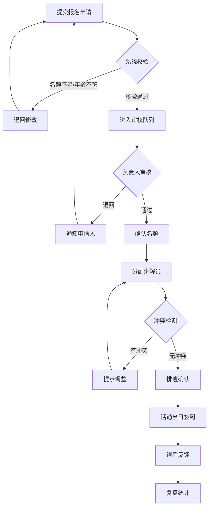
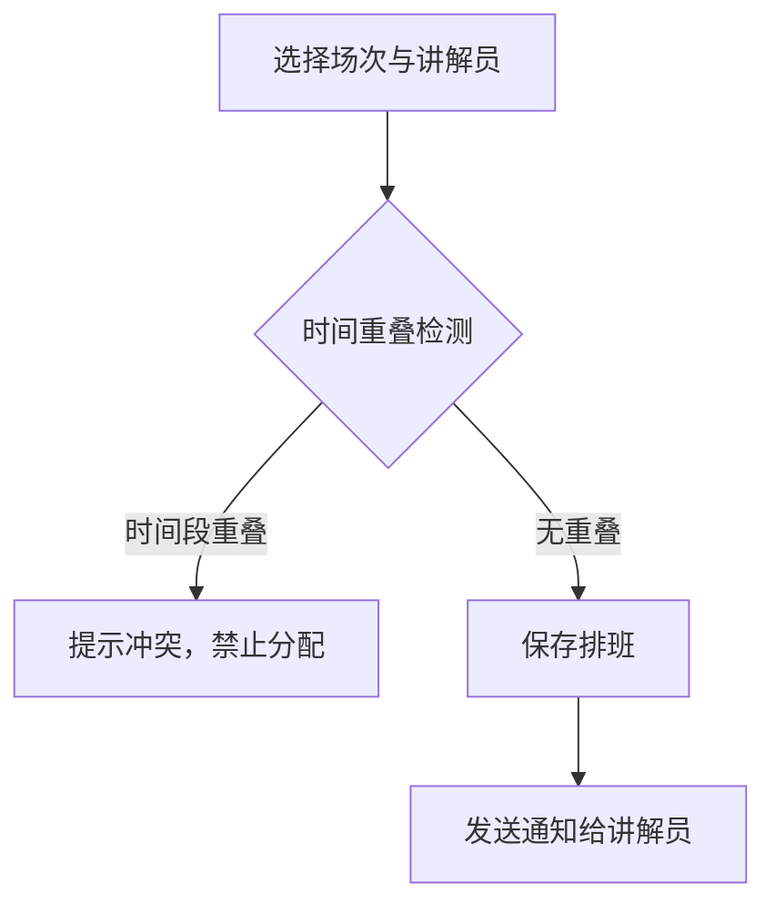
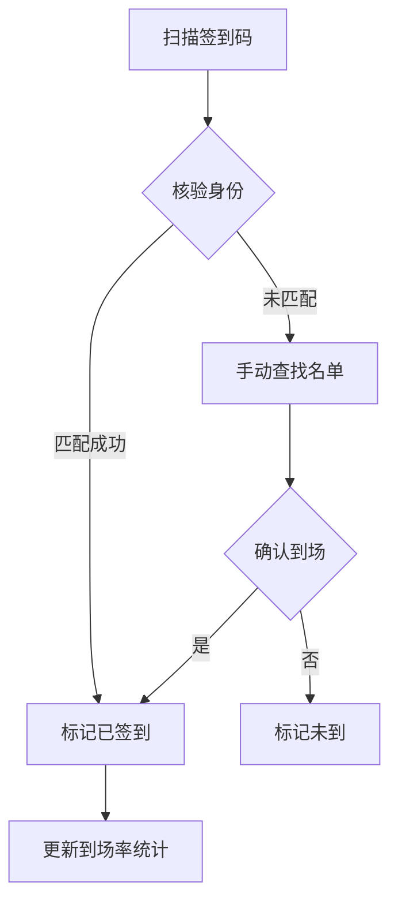

## 1. 产品概述

博物馆研学活动报名平台，面向博物馆教育部，解决学校团体与散客研学课报名中人数、年龄段和讲解员安排的复杂协调问题。系统将申请、审核、执行和复盘四大阶段串联闭环，通过角色化入口、名额控制、讲解员防冲突排班、站内/邮件提醒和后台看板，让负责人实时掌握超时事项与空闲资源。

- 目标用户：博物馆教育部老师、讲解员、学校联系人、散客家长、系统管理员
- 核心价值：将手工排班与纸质流程数字化，减少遗漏和冲突，提升研学活动运营效率

## 2. 核心功能

### 2.1 用户角色

| 角色 | 注册方式 | 核心权限 |
|------|----------|----------|
| 教育部负责人 | 管理员创建 | 审核报名、查看看板、排班管理、复盘统计 |
| 讲解员 | 管理员创建 | 查看排班、签到/签退、提交课后反馈 |
| 学校联系人 | 自助注册 | 提交团体报名、查看申请状态、管理学生名单 |
| 散客家长 | 自助注册 | 提交散客报名、查看申请状态、填写课后反馈 |
| 系统管理员 | 系统内置 | 用户管理、权限矩阵、系统配置、审计日志 |

### 2.2 功能模块

1. **工作台首页**：角色化仪表盘，展示待办、提醒、快捷入口
2. **课程管理**：课程信息、年龄段、容量、教具需求
3. **场次管理**：课程排期、名额控制、时间段设置
4. **报名管理**：团体报名、散客报名、名额校验、退回处理
5. **审核中心**：报名审核、退回备注、审核记录
6. **讲解员排班**：排班日历、冲突检测、空闲查询
7. **签到核验**：二维码签到、名单核对、到场率统计
8. **教具管理**：教具库存、场次分配、归还状态
9. **课后反馈**：评分、文字反馈、统计汇总
10. **通知中心**：站内消息、邮件提醒、已读状态
11. **后台看板**：超时事项、空闲资源、关键指标
12. **审计日志**：操作记录、变更追溯

### 2.3 页面详情

| 页面名称 | 模块名称 | 功能描述 |
|----------|----------|----------|
| 工作台首页 | 待办区域 | 展示当前角色的待处理任务数量与列表 |
| 工作台首页 | 快捷入口 | 按角色展示常用功能入口卡片 |
| 工作台首页 | 消息提醒 | 展示最新站内通知与邮件摘要 |
| 课程列表 | 课程卡片 | 展示课程名称、封面、年龄段、容量 |
| 课程详情 | 基本信息 | 课程描述、适合年龄段、单场容量、所需教具 |
| 课程详情 | 场次列表 | 该课程下所有排期场次及报名状态 |
| 场次日历 | 日历视图 | 按日/周/月查看场次排布与报名进度 |
| 场次详情 | 名额信息 | 总名额、已报名、剩余名额、团体/散客分布 |
| 团体报名表 | 学校信息 | 学校名称、联系人、联系电话 |
| 团体报名表 | 学生名单 | 批量导入学生信息（姓名、年龄/年级），最小化采集 |
| 团体报名表 | 场次选择 | 选择课程与场次，实时显示剩余名额 |
| 散客报名表 | 儿童信息 | 儿童姓名、年龄（最小化采集：仅姓名+年龄） |
| 散客报名表 | 场次选择 | 选择课程与场次，实时显示剩余名额 |
| 审核列表 | 待审核项 | 按时间排序的待审核报名申请 |
| 审核详情 | 申请信息 | 查看报名详情、人数、年龄段匹配情况 |
| 审核详情 | 审核操作 | 通过/退回，退回需填写原因 |
| 排班日历 | 讲解员视图 | 按讲解员查看排班，标记冲突 |
| 排班日历 | 场次视图 | 按场次查看讲解员分配情况 |
| 排班编辑 | 分配讲解员 | 为场次分配讲解员，自动检测时间冲突 |
| 签到页面 | 签到列表 | 当前场次的签到名单，支持扫码签到 |
| 签到页面 | 到场统计 | 实时到场率、未到名单 |
| 教具管理 | 库存列表 | 教具名称、数量、状态 |
| 教具管理 | 分配记录 | 各场次教具分配与归还状态 |
| 反馈页面 | 评分表单 | 评分（1-5星）与文字反馈 |
| 反馈统计 | 汇总图表 | 课程/讲解员/场次的评分统计 |
| 后台看板 | 超时事项 | 审核超时、签到超时、教具未归还等 |
| 后台看板 | 空闲资源 | 空闲讲解员、空闲教具、未满场次 |
| 后台看板 | 关键指标 | 报名转化率、到场率、满意度趋势 |
| 通知中心 | 消息列表 | 全部/未读消息列表，支持标记已读 |
| 审计日志 | 操作记录 | 用户、操作类型、时间、变更内容 |
| 用户管理 | 角色分配 | 创建用户、分配角色、权限矩阵配置 |

## 3. 核心流程

### 3.1 报名-审核-执行-复盘闭环流程

1. 学校联系人或散客家长提交报名申请（选择课程场次、填写参与人信息）
2. 系统自动校验名额与年龄段匹配
3. 教育部负责人审核申请：通过则确认名额，退回则通知申请人修改
4. 审核通过后，系统自动分配讲解员（或由负责人手动分配），检测时间冲突
5. 活动当日，讲解员/负责人通过扫码签到核验到场情况
6. 活动结束后，参与者提交课后反馈，讲解员提交教学记录
7. 教育部负责人在看板中查看复盘数据，识别超时事项与空闲资源

### 3.2 讲解员排班冲突检测流程

### 3.3 签到核验流程

## 4. 用户界面设计

### 4.1 设计风格

- 主色调：深靛蓝 (#1B3A5C) 代表博物馆的沉稳与文化底蕴
- 辅助色：暖金 (#D4A84B) 用于强调与交互元素，传达知识的光芒
- 中性色：石板灰 (#64748B) 用于文字与边框
- 背景：浅象牙 (#FAFAF5) 带微妙纹理感，营造博物馆空间氛围
- 按钮风格：圆角6px，主按钮填充深靛蓝，次按钮描边，禁用态降低透明度
- 字体：标题使用 Noto Serif SC（宋体风格），正文使用 Noto Sans SC
- 布局：左侧导航栏 + 右侧内容区，卡片式模块布局
- 图标：使用 Lucide Icons 线性风格

### 4.2 页面设计概述

| 页面名称 | 模块名称 | UI元素 |
|----------|----------|--------|
| 工作台首页 | 待办区域 | 卡片列表，数字角标，紧急项红色高亮 |
| 工作台首页 | 快捷入口 | 图标+文字卡片网格，hover 微抬升阴影 |
| 课程列表 | 课程卡片 | 封面图、标题、年龄段标签、容量进度条 |
| 场次日历 | 日历视图 | 月历网格，场次色块标记，点击弹出详情 |
| 团体报名表 | 学生名单 | 可编辑表格，支持批量粘贴导入 |
| 审核列表 | 待审核项 | 列表+状态标签，侧滑打开详情面板 |
| 排班日历 | 讲解员视图 | 甘特图样式，冲突项红色闪烁 |
| 签到页面 | 签到列表 | 复选框列表，已签到绿色勾，签到码扫描区 |
| 后台看板 | 超时事项 | 红色警告卡片，倒计时/超时时长 |
| 后台看板 | 空闲资源 | 绿色状态卡片，空闲讲解员/教具/场次 |
| 后台看板 | 关键指标 | 折线图/柱状图，趋势箭头 |

### 4.3 响应式设计

- 桌面优先（1920px 基准），适配 1440px / 1280px
- 平板端（768px-1024px）导航栏折叠为抽屉
- 移动端（<768px）仅保留签到和通知功能入口

### 4.4 无3D场景需求

本项目为管理型平台，不涉及3D场景。
