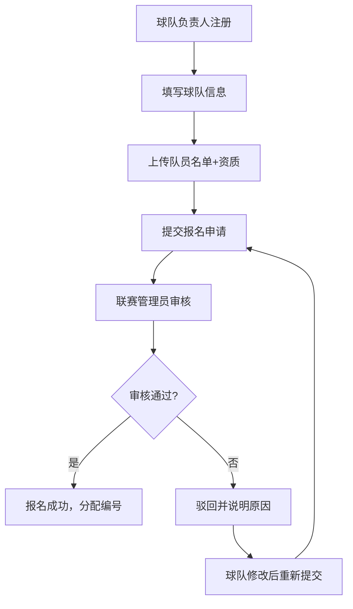
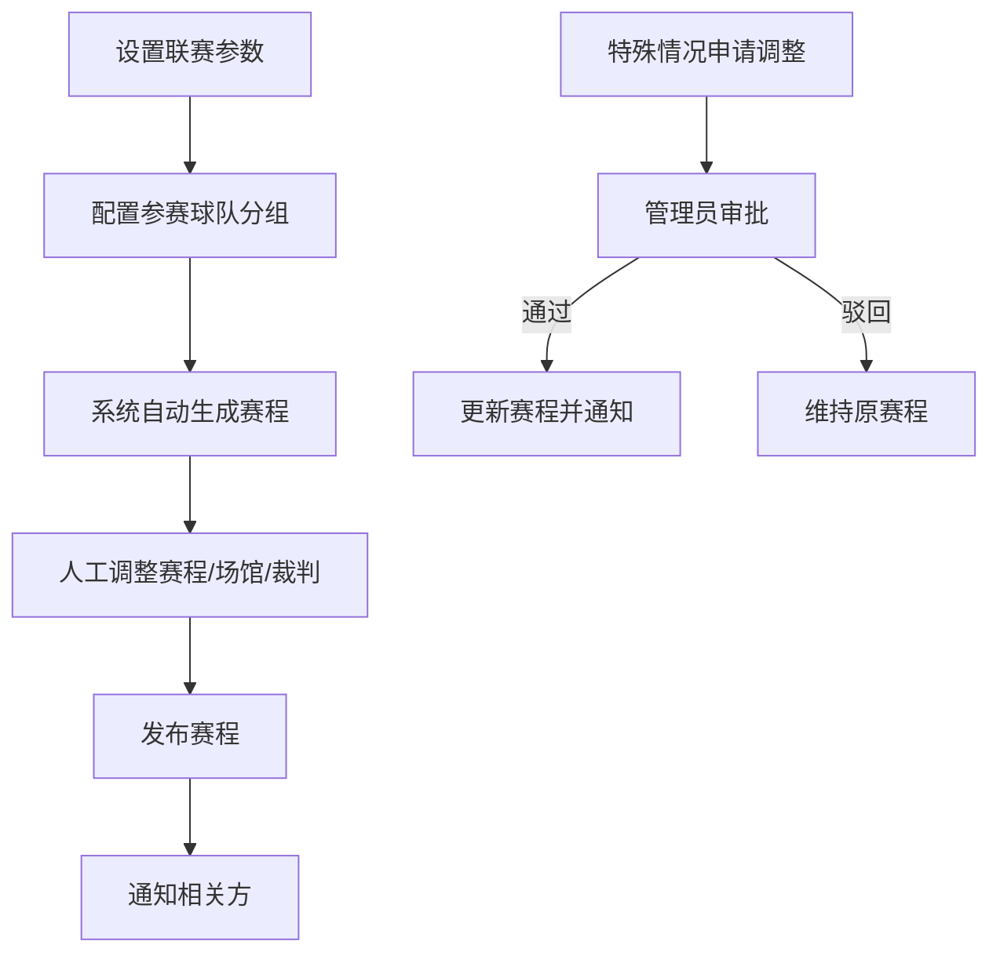
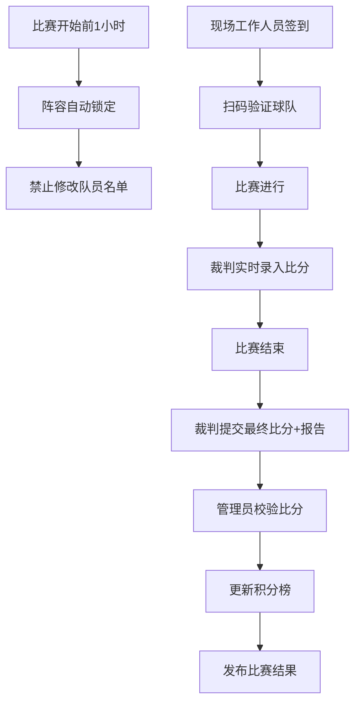
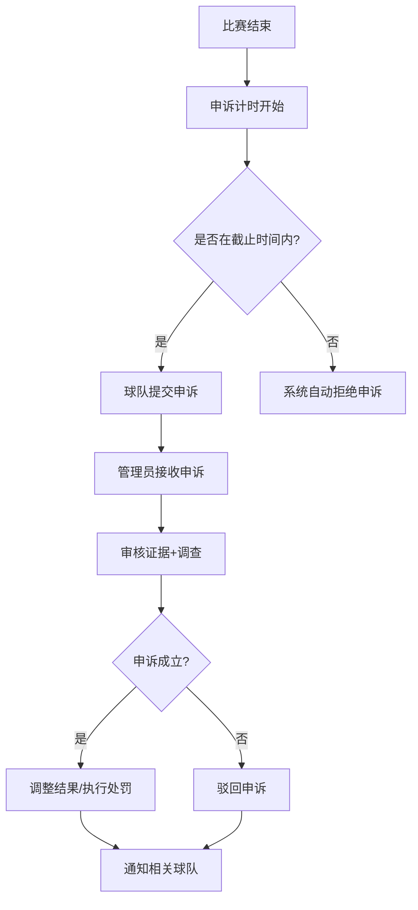

## 1. 产品概述

城市篮球联赛管理系统是面向业余体育联赛组织者的全流程管理平台，解决球队报名、赛程编排、裁判管理、比分录入、积分榜统计、申诉处理等日常运营痛点，实现联赛管理公开透明、高效规范。

- **核心目标**：通过数字化手段提升联赛运营效率，保障比赛公平公正，为组织者、球队、裁判、观众提供统一的信息平台
- **目标用户**：联赛管理员、球队负责人、裁判员、现场工作人员、球员及观众

## 2. 核心功能

### 2.1 用户角色

| 角色 | 注册方式 | 核心权限 |
|------|----------|----------|
| 超级管理员 | 后台创建 | 系统配置、用户管理、数据导入导出、所有权限 |
| 联赛管理员 | 后台创建 | 报名审核、赛程生成调整、裁判安排、申诉处理、比分校验 |
| 球队负责人 | 自主注册+审核 | 球队信息管理、队员报名、查看赛程、提交申诉 |
| 裁判员 | 后台创建 | 接收执法安排、录入比分、上传比赛报告 |
| 现场工作人员 | 后台创建 | 扫码签到、拍照上传、现场数据录入、离线补提交 |
| 普通用户/观众 | 无需注册 | 查看赛程、积分榜、比赛结果、球队信息 |

### 2.2 功能模块

1. **首页/仪表盘**：联赛概览、即将开赛、积分榜、赛事公告
2. **球队管理**：球队报名、队员管理、报名审核、阵容锁定
3. **赛程管理**：赛程生成、赛程调整、场馆安排、裁判分配
4. **比分管理**：比分录入、比分校验、技术统计、比赛报告
5. **积分榜**：实时排名、积分规则、升降级信息
6. **申诉管理**：申诉提交、申诉审核、申诉截止校验
7. **裁判管理**：裁判信息、执法记录、评分体系
8. **场馆管理**：场馆信息、场地调度、维护记录
9. **系统管理**：用户管理、角色权限、数据导入导出、通知配置

### 2.3 页面详情

| 页面名称 | 模块名称 | 功能描述 |
|-----------|-------------|---------------------|
| 首页 | 联赛概览 | 展示当前赛季信息、即将开始的比赛、最新赛果、实时积分榜 |
| 首页 | 赛事公告 | 联赛通知、重要提醒、轮播展示 |
| 球队列表 | 球队展示 | 按分组展示球队、球队详情入口、队员名单 |
| 球队详情 | 球队信息 | 基本信息、队员名单、历史战绩、本赛季数据 |
| 球队报名 | 报名表单 | 球队信息填写、队员批量导入、资质上传、提交审核 |
| 赛程日历 | 赛程展示 | 日历视图/列表视图切换、按轮次/日期/球队筛选 |
| 赛程详情 | 比赛信息 | 对阵双方、时间场馆、裁判、阵容、比分、技术统计 |
| 比分录入 | 录入表单 | 节次比分、球员数据、犯规记录、暂停使用、拍照上传 |
| 积分榜 | 排名展示 | 实时排名、胜负平、积分、净胜球、晋级/降级标识 |
| 申诉列表 | 申诉管理 | 待处理/已处理申诉、筛选查询、详情查看 |
| 申诉提交 | 申诉表单 | 选择比赛、申诉类型、详情描述、证据上传 |
| 裁判中心 | 个人中心 | 执法任务、历史记录、评分、个人信息维护 |
| 管理后台 | 审核中心 | 报名审核、申诉审核、比分审核批量处理 |
| 管理后台 | 系统配置 | 联赛参数、积分规则、通知模板、导入导出 |
| 移动端 | 现场作业 | 扫码签到、快速录入、拍照上传、离线存储、补提交 |

## 3. 核心业务流程

### 3.1 球队报名审核流程

### 3.2 赛程生成与调整流程

### 3.3 比赛日流程

### 3.4 申诉处理流程

## 4. 用户界面设计

### 4.1 设计风格
- **主色调**：#FF6B35（活力橙）- 代表篮球运动的激情与活力
- **辅助色**：#1E3A5F（深蓝）- 代表专业与信任
- **强调色**：#FFD700（金色）- 用于冠军/积分榜高亮
- **中性色**：#F8F9FA 浅灰背景，#2D3748 深灰文字
- **按钮风格**：圆角 8px，轻微阴影，悬停时有上浮效果
- **字体**：标题使用 "Oswald" 粗体（运动感），正文使用 "Noto Sans SC"（可读性）
- **布局风格**：卡片式布局，清晰的区域分隔，数据可视化图表
- **图标风格**：线性图标，统一 24px 网格，运动主题元素

### 4.2 页面设计概览

| 页面名称 | 模块名称 | UI 元素 |
|-----------|-------------|-------------|
| 首页 | 联赛概览 | 大型赛事横幅、倒计时卡片、积分榜小组件、赛程时间轴 |
| 赛程页 | 日历视图 | 月历/周历切换、比赛日高亮、点击展开详情、颜色区分比赛状态 |
| 积分榜 | 排名表格 | 斑马纹表格、前三名高亮、升降级颜色标识、数据条形图 |
| 球队详情 | 队员阵容 | 球员卡片网格、位置标签、照片墙、数据统计雷达图 |
| 比分录入 | 计分板 | 大号数字比分、节次标签、计时器样式、快速加减按钮 |
| 管理后台 | 数据面板 | 侧边栏导航、统计卡片、待办事项列表、操作快捷入口 |
| 移动端 | 现场作业 | 底部导航栏、大按钮、扫码框、拍照预览、离线状态指示器 |

### 4.3 响应式设计
- **设计原则**：桌面优先，移动端深度优化
- **断点设置**：sm (640px) 手机，md (768px) 平板，lg (1024px) 桌面
- **移动端优化**：
  - 触控目标最小 44x44px
  - 表单字段全宽，标签上移
  - 底部导航栏替代侧边栏
  - 列表优先展示核心信息，详情可展开
  - 扫码、拍照功能原生适配
  - 离线状态提示和数据同步指示器

### 4.4 动效设计
- 页面加载：元素渐入 + 轻微上移动画，延迟错开
- 数据更新：数字滚动动画，积分榜排名变化时高亮闪烁
- 卡片交互：悬停轻微上浮 + 阴影加深
- 表单提交：按钮加载状态，成功/失败反馈动效
- 导航切换：平滑过渡，内容区淡入淡出
- 离线同步：同步进度条，完成后成功提示
