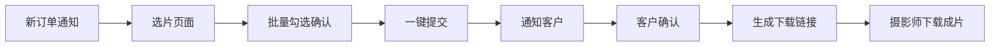
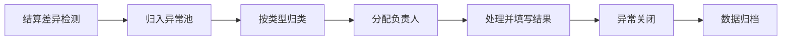
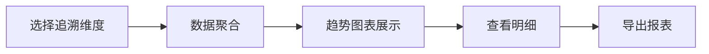

## 1. 产品概述

摄影师订单作品交付台，为摄影工作室提供一站式订单管理、作品交付与追溯系统。解决传统流程中选片确认繁琐、交付节点不透明、追溯困难等痛点，提升工作室运营效率与客户满意度。

- 面向摄影师与管理员的专业工作平台
- 核心价值：简化操作流程、透明交付节点、精准数据追溯

## 2. 核心功能

### 2.1 用户角色

| 角色 | 注册方式 | 核心权限 |
|------|---------|----------|
| 摄影师 | 管理员创建 | 确认选片、下载成片、查询发票周期/作品交付/素材授权 |
| 管理员 | 系统预置 | 订单全生命周期管理、交付节点配置、数据查询与统计、异常池管理、测试账号标记 |
| 视频团队负责人 | 管理员创建 | 处理异常池工单、填写处理结果与原因 |
| 客户 | 邀请链接 | 选片、确认交付、满意度评价 |

### 2.2 功能模块

1. **前台工作台**：订单列表、选片确认、成片下载、查询中心（发票/交付/授权）
2. **后台管理**：订单管理、交付节点配置、用户管理、权限控制
3. **追溯中心**：按时间/人员/状态多维追溯交付满意度
4. **异常池**：结算差异归类、工单处理、结果记录
5. **测试账号管理**：标记与隔离测试数据、避免影响业务指标

### 2.3 页面详情

| 页面名称 | 模块名称 | 功能描述 |
|---------|---------|----------|
| 登录页 | 身份认证 | 账号密码登录、测试账号标识 |
| 摄影师工作台 | 待办卡片 | 待确认选片、待下载成片、待查发票提醒 |
| 摄影师工作台 | 订单列表 | 我的订单、状态筛选、快速操作 |
| 选片确认页 | 缩略图网格 | 批量选择、一键确认、备注留言 |
| 成片下载页 | 文件列表 | 打包下载、分卷下载、下载进度 |
| 查询中心 | 发票周期 | 按时间段查询开票记录与状态 |
| 查询中心 | 作品交付 | 交付历史、客户确认记录 |
| 查询中心 | 素材授权 | 授权范围、有效期、使用记录 |
| 后台订单管理 | 订单列表 | 增删改查、状态流转、批量操作 |
| 后台交付节点 | 节点配置 | 节点定义、触发条件、通知模板 |
| 追溯中心 | 满意度追溯 | 多维度筛选、趋势图表、明细导出 |
| 异常池 | 差异列表 | 按类型归类、分配处理、状态跟踪 |
| 异常处理 | 工单详情 | 处理记录、结果填写、原因说明 |
| 系统设置 | 测试账号 | 账号标记、数据隔离、统计排除 |

## 3. 核心流程

### 3.1 选片交付流程

摄影师收到新订单通知 → 进入选片页面 → 浏览缩略图网格 → 批量勾选确认 → 一键提交 → 系统自动通知客户 → 客户确认后生成成片下载链接 → 摄影师批量下载成片

### 3.2 异常处理流程

系统检测结算差异 → 自动归入异常池 → 按差异类型归类 → 分配给视频团队负责人 → 负责人处理并填写结果与原因 → 异常关闭 → 数据归档

### 3.3 数据追溯流程

管理员选择追溯维度（时间/人员/状态）→ 系统聚合数据 → 展示趋势图表 → 点击查看明细 → 导出报表

## 4. 用户界面设计

### 4.1 设计风格

**极简专业主义** - 以效率为核心的专业工作台设计

- 主色调：深海蓝 `#1e3a5f`，象征专业与信赖
- 辅助色：琥珀金 `#d4a574`，用于强调与交互元素
- 背景色：炭灰 `#f5f5f5` 与纯白 `#ffffff` 交替，营造层次
- 按钮风格：微圆角、轻微阴影、悬停浮起效果
- 字体：标题使用 Cormorant Garamond（优雅衬线），正文使用 Noto Sans SC（清晰易读）
- 布局：卡片式模块化布局，顶部导航 + 左侧菜单 + 主内容区
- 图标：线性简约风格，统一2px描边

### 4.2 页面设计概览

| 页面名称 | 模块名称 | UI元素 |
|---------|---------|--------|
| 摄影师工作台 | 待办卡片 | 渐变背景卡片、数字动效、悬停放大 |
| 选片确认页 | 缩略图网格 | 瀑布流布局、勾选动画、批量操作栏固定底部 |
| 成片下载页 | 文件列表 | 进度条动画、文件图标、批量下载按钮 |
| 追溯中心 | 数据看板 | 时间序列图表、筛选器联动、数据钻取 |
| 异常池 | 差异列表 | 类型标签色别、优先级标记、处理状态流 |

### 4.3 响应式

- 桌面端优先（1920px），适配常见分辨率
- 平板端（1024px）：左侧菜单折叠为图标，内容区自适应
- 移动端（768px）：底部导航、卡片单列布局、触控优化

### 4.4 动效设计

- 页面加载：元素错落入场（staggered reveal），间隔80ms
- 选片交互：勾选时微缩放 + 边框高亮动画
- 数据更新：数字滚动动效（count-up）
- 按钮交互：悬停上浮2px + 阴影加深
- 状态流转：进度条平滑过渡动画
