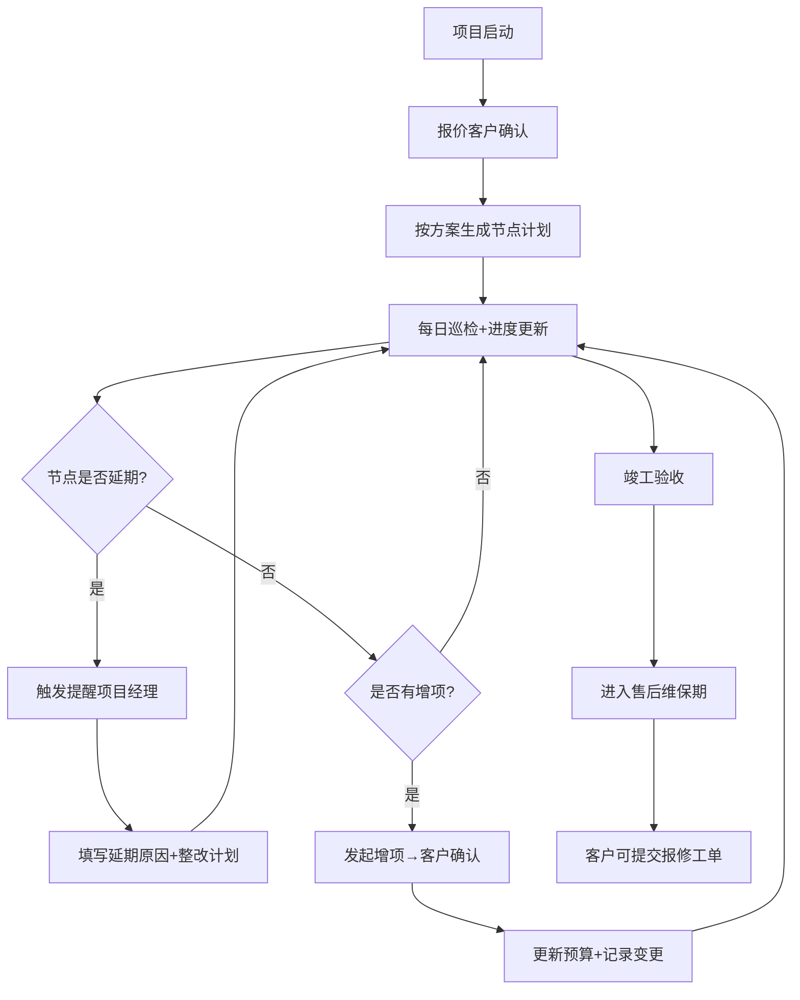

## 1. 产品概述

装修设计图纸进度看板系统，面向装修公司管理层、项目经理、客户三方，实现项目全生命周期的进度追踪、预算管控、质量巡检与售后管理。界面简洁高效，数据维度完整，支持预算复盘、规则版本回退、常用筛选固化等高级功能。

- 解决装修项目进度不透明、增项混乱、延期无人跟进、质量无法追溯等行业痛点
- 核心价值：通过数据驱动的看板体系，实现项目可控、成本可溯、责任到人

## 2. 核心功能

### 2.1 用户角色

| 角色 | 登录方式 | 核心权限 |
|------|----------|----------|
| 超级管理员 | 账号密码 | 系统配置、规则版本管理、用户管理、全项目查看 |
| 项目经理 | 账号密码 | 项目进度维护、延期处理、质量巡检、报表查看、本人项目管理 |
| 客户（前台） | 手机号/邀请链接 | 确认报价、确认增项、查看进度、提交售后报修 |

### 2.2 功能模块

1. **进度看板首页**：项目总览卡片、延期预警列表、关键节点甘特图、预算执行概览
2. **项目详情页**：节点进度追踪、图纸版本管理、施工日志、质量巡检记录
3. **报价与增项（前台）**：报价确认、增项申请与确认、预算变更历史
4. **后台管理**：延期节点维护、提醒规则配置、规则版本管理与回退
5. **装修方案库**：方案模板维护、材料配置、施工标准配置
6. **巡检任务**：巡检计划生成、巡检记录、质量问题闭环
7. **售后报修**：报修工单、处理进度、满意度回访
8. **月度复盘报表**：延期统计、质量分析、预算偏差分析、项目经理绩效
9. **个人配置中心**：常用筛选条件固化、消息通知偏好

### 2.3 页面详情

| 页面名称 | 模块名称 | 功能描述 |
|----------|----------|----------|
| 进度看板首页 | 项目总览卡片 | 展示在建项目数、延期数、本月完工数、预算执行率等关键指标 |
| 进度看板首页 | 延期预警列表 | 红色高亮展示延期/即将延期节点，一键发送提醒给项目经理 |
| 进度看板首页 | 甘特图视图 | 项目关键节点时间轴，支持拖拽调整（限管理员） |
| 进度看板首页 | 预算概览 | 各项目预算与实际支出对比，超支项目红色标记 |
| 项目详情页 | 节点进度追踪 | 节点状态流转（未开始/进行中/已完成/已延期）、负责人、完成时间 |
| 项目详情页 | 图纸版本管理 | 设计图纸上传、版本对比、下载记录 |
| 项目详情页 | 施工日志 | 每日施工内容、现场照片、问题记录 |
| 项目详情页 | 质量巡检记录 | 巡检项评分、问题照片、整改要求与闭环确认 |
| 报价确认页（前台） | 报价明细 | 分项报价清单、总价、客户确认/驳回操作 |
| 增项管理页（前台） | 增项列表 | 增项内容、价格、审批状态、客户确认操作 |
| 增项管理页（前台） | 预算变更历史 | 每次预算变动的时间、原因、金额、操作人 |
| 延期节点维护页 | 延期列表 | 所有延期节点、延期天数、原因分类、处理状态 |
| 提醒规则配置页 | 规则列表 | 延期预警提前天数、通知渠道、通知对象配置 |
| 规则版本管理页 | 版本历史 | 配置变更历史、版本对比、一键回退到指定版本 |
| 装修方案库 | 方案列表 | 方案模板、包含的标准节点、材料清单、施工标准 |
| 巡检任务页 | 巡检计划 | 自动生成巡检计划、巡检频率、负责人员 |
| 巡检任务页 | 巡检记录 | 巡检项评分、照片上传、问题描述、整改期限 |
| 售后报修页 | 报修工单 | 客户报修、工单分配、处理进度、完成确认 |
| 月度复盘报表 | 多维分析 | 延期统计、质量问题分布、预算偏差、项目经理KPI |
| 配置中心 | 筛选条件固化 | 将常用筛选组合保存为"我的筛选"，一键应用 |

## 3. 核心流程

### 3.1 报价与增项确认流程

客户登录前台 → 查看待确认报价 → 逐项核对明细 → 确认/驳回（填写原因）→ 系统同步更新项目预算与状态

项目经理发起增项申请 → 填写增项内容与价格 → 提交客户确认 → 客户确认后预算自动更新 → 生成预算变更记录

### 3.2 延期预警与处理流程

系统每日检查节点计划日期 → 发现延期/即将延期 → 触发提醒规则 → 通知项目经理 → 项目经理填写延期原因与整改计划 → 更新节点状态 → 月底自动汇总到复盘报表

### 3.3 质量巡检流程

系统按计划生成巡检任务 → 项目经理执行巡检 → 填写评分与问题 → 如需整改下发给施工方 → 施工方整改后上传凭证 → 项目经理复核闭环 → 巡检数据自动写入质量报表

## 4. 用户界面设计

### 4.1 设计风格

- **主色调**：深青色 `#0F766E`（专业、稳重），辅助色琥珀橙 `#F59E0B`（预警高亮），危险色红 `#DC2626`
- **按钮风格**：直角圆角 4px，主按钮实心深青色，次要按钮描边，状态按钮使用胶囊样式
- **字体**：标题使用 "Noto Serif SC"（中文衬线，专业感），正文使用 "PingFang SC" / "Helvetica Neue"
- **布局风格**：左侧固定导航 + 顶部状态栏 + 主内容区卡片式布局；数据密度偏高，表格为主辅以图表
- **图标风格**：Lucide 线性图标，统一 18px 尺寸，悬停填充色变化

### 4.2 页面设计概述

| 页面名称 | 模块名称 | UI 元素 |
|----------|----------|---------|
| 进度看板首页 | 项目总览卡片 | 4 列 KPI 卡片，大数字 + 环比趋势小箭头，卡片底部浅灰分隔线 |
| 进度看板首页 | 延期预警列表 | 斑马纹表格，延期行背景浅红，倒计时数字用琥珀橙/红色强调 |
| 进度看板首页 | 甘特图视图 | 横向时间轴，节点用色块标识，悬停显示详情气泡 |
| 项目详情页 | 节点进度追踪 | 竖向时间线，已完成节点深青色圆点+连接线，当前节点脉冲动画 |
| 报价确认页（前台） | 报价明细 | 分组折叠表格，总计行固定底部，确认/驳回按钮大而醒目 |
| 规则版本管理页 | 版本历史 | 左右分屏版本对比，差异行高亮，回退按钮带二次确认弹窗 |
| 月度复盘报表 | 多维分析 | 顶部 Tab 切换维度，图表使用 ECharts，支持导出 Excel |

### 4.3 响应式

桌面端优先设计（1440px 基准），侧边栏在平板宽度收起为图标模式，移动端将表格转为卡片列表展示，确保核心数据可读。

### 4.4 动效

- 页面加载：主体内容淡入上滑（300ms ease-out）
- 节点状态变化：脉冲扩散动画提示用户关注
- 延期预警行：红色左右呼吸边框（2s 循环）
- 筛选条：保存/应用筛选时有轻量 Toast 反馈
