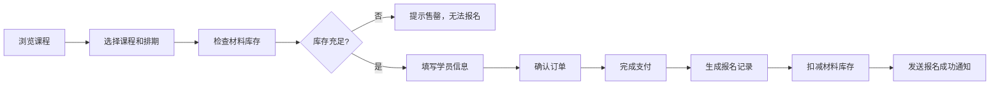
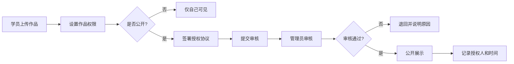
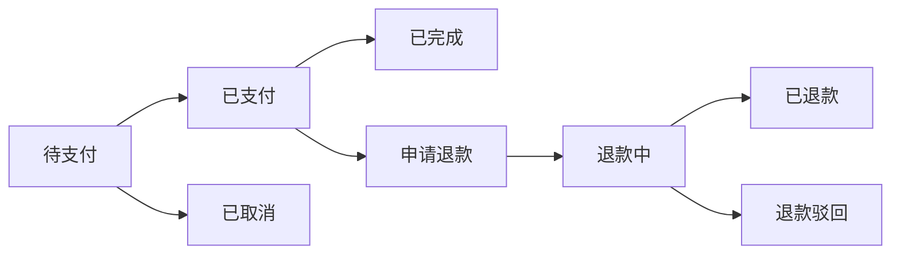

# 手作课程报名和作品展示平台 - 产品需求文档

## 1. 产品概述

手作课程报名和作品展示平台，为陶艺、银饰、皮具等手作工作室提供一体化的课程管理、学员报名、作品展示和运营看板系统。解决工作室主理人日常工作中信息分散、流程繁琐、资源调度难的问题。

- **核心价值**：统一管理课程、老师、材料、学员、作品全链路数据，提升运营效率
- **目标用户**：手作工作室主理人、管理员、老师、学员
- **业务价值**：提升报名转化率、优化材料库存管理、提高老师资源利用率、增强学员粘性

## 2. 核心功能

### 2.1 用户角色

| 角色 | 注册方式 | 核心权限 |
|------|----------|----------|
| 超级管理员 | 后台创建 | 全系统管理、配置、数据查看、看板 |
| 工作室管理员 | 后台创建 | 课程管理、报名审核、材料管理、作品审核、老师结算 |
| 老师 | 后台创建/邀请 | 查看课程排期、上传作品、查看学员评价、结算记录 |
| 学员 | 手机号/微信注册 | 浏览课程、报名付款、上传作品、评价课程、查看个人中心 |

### 2.2 功能模块

1. **课程中心**：课程列表、课程详情、课程日历、课程筛选
2. **报名管理**：在线报名、订单付款、报名状态流转、退款处理
3. **材料库存**：材料包管理、库存预警、出入库记录
4. **作品相册**：作品上传、作品展示、学员授权、作品点赞评论
5. **老师管理**：老师信息、课程排期、结算管理、评价查看
6. **运营看板**：多维度筛选、数据统计、状态监控、资源利用率分析
7. **个人中心**：我的报名、我的作品、我的评价、消息提醒
8. **管理员后台**：系统配置、用户管理、审计记录、数据导出

### 2.3 页面详情

| 页面名称 | 模块名称 | 功能描述 |
|----------|----------|----------|
| 首页 | 轮播Banner | 展示热门课程、新品推荐、活动公告 |
| 首页 | 课程分类 | 陶艺、银饰、皮具分类快速入口 |
| 首页 | 作品展示墙 | 学员公开作品轮播展示 |
| 课程列表页 | 筛选器 | 按课程类型、时间、价格、老师筛选 |
| 课程列表页 | 课程卡片 | 封面、标题、老师、时间、价格、剩余名额 |
| 课程详情页 | 课程信息 | 课程介绍、大纲、适合人群、注意事项 |
| 课程详情页 | 排期日历 | 可选日期和时段选择 |
| 课程详情页 | 报名按钮 | 立即报名、加入购物车 |
| 作品画廊页 | 作品瀑布流 | 公开作品展示，支持点赞、评论 |
| 作品画廊页 | 筛选器 | 按课程类型、老师、时间筛选 |
| 作品详情页 | 作品信息 | 图片、作者、课程、创作心得 |
| 报名确认页 | 订单信息 | 课程信息、学员信息、材料包选择 |
| 报名确认页 | 支付模块 | 多种支付方式、优惠券使用 |
| 个人中心 | 我的报名 | 报名记录、状态查看、取消/退款 |
| 个人中心 | 我的作品 | 作品上传、编辑、公开/私密设置 |
| 个人中心 | 我的评价 | 已评价、待评价课程 |
| 运营看板 | 概览卡片 | 今日报名、收入、作品数、新增学员 |
| 运营看板 | 时间筛选 | 按日、周、月、自定义区间筛选 |
| 运营看板 | 状态看板 | 各环节状态分布、瓶颈识别 |
| 运营看板 | 资源分析 | 老师利用率、材料库存预警 |
| 管理员后台 | 课程管理 | 课程CRUD、排期管理、上下架 |
| 管理员后台 | 报名管理 | 报名列表、状态变更、退款处理 |
| 管理员后台 | 材料管理 | 材料包CRUD、库存管理、出入库记录 |
| 管理员后台 | 老师管理 | 老师信息、排期、结算管理 |
| 管理员后台 | 学员管理 | 学员列表、详情、操作记录 |
| 管理员后台 | 作品审核 | 作品列表、授权审核、违规处理 |
| 管理员后台 | 审计日志 | 全系统操作记录追溯 |
| 管理员后台 | 系统配置 | 参数配置、消息模板、提醒规则 |

## 3. 核心流程

### 3.1 学员报名流程

### 3.2 作品公开展示流程

### 3.3 报名状态流转

## 4. 用户界面设计

### 4.1 设计风格

**风格定位：温暖文艺 · 匠心质感**

- **主色调**：赤陶色 #C17A58 - 代表陶艺的温暖质感
- **辅助色**：深木色 #3D2B1F - 代表手作的质朴与专业
- **点缀色**：橄榄绿 #6B8E23 - 代表银饰的清新、皮具的自然
- **中性色**：米白 #F5F1EB、暖灰 #9A9590、墨黑 #2C241F
- **按钮风格**：圆角中等 (8px)，微立体阴影，悬停时有微妙的纹理变化
- **字体**：标题用「思源宋体」体现文艺质感，正文用「思源黑体」保证可读性
- **布局风格**：卡片式布局，适当留白，纸张质感背景
- **图标风格**：线性图标，手绘质感，粗细适中
- **动效**：柔和的过渡动画，卡片微悬浮效果，图片加载渐显

### 4.2 页面设计概览

| 页面名称 | 模块名称 | UI元素 |
|----------|----------|--------|
| 首页 | 轮播Banner | 全屏宽度，暖色调背景，艺术字体标题，平滑切换动画 |
| 首页 | 课程分类 | 三列图标卡片，悬停放大效果，分类图标手绘风格 |
| 首页 | 作品展示墙 | 瀑布流布局，图片圆角，悬停显示作者信息 |
| 课程列表页 | 筛选器 | 顶部横向标签栏，选中状态下划线强调 |
| 课程列表页 | 课程卡片 | 16:10封面图，底部信息区三层排版，剩余名额用红点提示 |
| 课程详情页 | 课程信息 | 左右布局，左图右文，分段式信息折叠展开 |
| 作品画廊页 | 作品瀑布流 | 交错网格，图片间距适中，无限滚动加载 |
| 运营看板 | 概览卡片 | 四宫格数据卡片，带趋势小箭头，背景微渐变 |
| 运营看板 | 状态看板 | 横向时间轴，状态色块区分，悬停显示详情 |
| 管理员后台 | 列表页 | 表格布局，操作按钮居右，状态标签彩色 |

### 4.3 响应式设计

- **设计原则**：桌面优先，移动端适配
- **断点设计**：
  - 桌面端：≥ 1280px，多列布局，侧边栏导航
  - 平板端：768px - 1279px，两列布局，顶部导航
  - 移动端：< 768px，单列布局，底部Tab导航
- **触摸优化**：移动端按钮最小高度 44px，点击区域足够
- **性能优化**：移动端图片压缩，懒加载，减少动画复杂度

### 4.4 关键交互设计

- **搜索**：全局搜索框，支持课程、老师、作品关键词搜索，输入时实时联想
- **筛选**：多维筛选器，支持时间范围、状态、负责人等多条件组合
- **状态流转**：状态变更有确认弹窗，变更后有toast提示，状态标签颜色区分
- **提醒**：关键节点（报名成功、待审核、库存预警）有系统通知+红点+邮件/短信
- **快捷操作**：看板支持拖拽变更状态，列表支持批量操作
