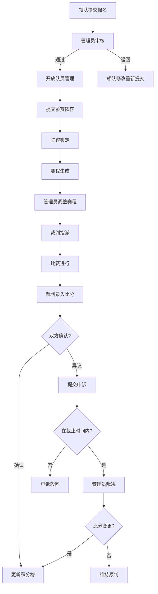

## 1. 产品概述

业余体育联赛管理系统，面向社区/企业业余联赛场景，将球队报名、赛程生成、裁判安排、比分录入、积分排名和申诉处理全流程线上化、透明化，解决信息不公开、流程不闭环、审计缺失等痛点。

- 目标用户：联赛管理员、球队领队、裁判、球员/观众
- 核心价值：申请→审核→执行→复盘全链路闭环，关键节点自动提醒，业务规则硬校验

## 2. 核心功能

### 2.1 用户角色

| 角色 | 注册方式 | 核心权限 |
|------|---------|---------|
| 超级管理员 | 系统预设 | 全部权限，角色分配，系统配置 |
| 联赛管理员 | 管理员创建 | 报名审核、赛程生成/调整、裁判指派、比分确认、申诉裁决 |
| 球队领队 | 自主注册 | 球队报名、队员管理、阵容提交、比分确认、提交申诉 |
| 裁判 | 管理员创建 | 查看指派赛程、录入比分、提交比赛报告 |
| 球员/观众 | 自主注册 | 查看赛程、积分榜、比分、球队信息 |

### 2.2 功能模块

1. **登录与首页**：角色切换、待办提醒、快捷入口、数据概览
2. **球队管理**：球队报名、报名审核、队员花名册、阵容锁定
3. **赛程管理**：赛程自动生成、手动调整、裁判指派、赛程状态流转
4. **比分管理**：比分录入、比分确认、比赛结果公示
5. **积分榜**：自动积分计算、排名展示、赛季统计
6. **申诉管理**：提交申诉、申诉审核、裁决结果、截止时间校验
7. **场馆管理**：场馆信息维护、可用时段管理
8. **消息通知**：站内消息、邮件提醒
9. **审计日志**：操作记录、状态变更追踪

### 2.3 页面明细

| 页面名称 | 模块名称 | 功能描述 |
|---------|---------|---------|
| 登录页 | 登录表单 | 邮箱+密码登录，角色自动识别跳转 |
| 管理员首页 | 数据概览 | 待审核数、近期赛程、未处理申诉、快捷操作入口 |
| 管理员首页 | 待办列表 | 按状态/时间/负责人筛选的待办事项 |
| 领队首页 | 球队概览 | 球队状态、近期比赛、待确认比分、通知 |
| 裁判首页 | 赛程概览 | 指派给我的赛程、待录入比分的比赛 |
| 球队报名页 | 报名表单 | 球队信息录入、队员名单上传、提交审核 |
| 球队审核页 | 审核列表 | 报名申请列表、审核通过/退回、审核意见 |
| 队员管理页 | 队员列表 | 队员增删改、阵容锁定状态展示 |
| 赛程管理页 | 赛程日历 | 赛程日历/列表视图、筛选（时间/场馆/球队/状态） |
| 赛程调整页 | 调整表单 | 修改时间/场馆、更换裁判、调整原因记录 |
| 裁判指派页 | 裁判列表 | 可用裁判列表、指派/更换裁判 |
| 比分录入页 | 录入表单 | 比分录入、赛事事件记录（进球/犯规等） |
| 比分确认页 | 确认界面 | 双方领队确认比分、异议提交 |
| 积分榜页 | 排名表格 | 积分排名、胜/平/负、进失球、赛季筛选 |
| 申诉提交页 | 申诉表单 | 选择比赛、填写申诉原因、附件上传 |
| 申诉审核页 | 审核列表 | 申诉列表、裁决结果录入、截止时间校验 |
| 场馆管理页 | 场馆列表 | 场馆CRUD、可用时段设置 |
| 消息中心页 | 消息列表 | 站内消息已读/未读、邮件通知设置 |
| 审计日志页 | 操作日志 | 全局操作记录、按模块/时间/操作人筛选 |

## 3. 核心流程

### 3.1 球队报名流程
领队提交球队报名 → 管理员审核（通过/退回）→ 审核通过后开放队员管理 → 提交参赛阵容 → 阵容锁定

### 3.2 赛程管理流程
管理员触发赛程生成 → 系统自动排赛 → 管理员调整（时间/场馆/裁判）→ 发布赛程 → 赛前提醒

### 3.3 比分录入流程
比赛结束 → 裁判录入比分 → 双方领队确认 → 确认后自动更新积分榜 → 异议则进入申诉

### 3.4 申诉处理流程
领队提交申诉（截止时间内）→ 管理员审核 → 裁决 → 通知相关方 → 如比分变更则更新积分榜

## 4. 用户界面设计

### 4.1 设计风格

- 主色调：深绿 (#1B5E20) + 白色 — 体现运动与竞技氛围
- 辅助色：金色 (#F9A825) 用于高亮和提醒，红色 (#D32F2F) 用于警告和退回状态
- 按钮：圆角微3D，主按钮深绿底白字，次按钮白底绿边
- 字体：标题使用 Noto Sans SC Bold，正文使用 Noto Sans SC Regular
- 布局：左侧固定导航栏 + 顶部信息栏 + 主内容区，卡片式内容组织
- 图标：线性图标风格 (Lucide Icons)

### 4.2 页面设计概览

| 页面名称 | 模块名称 | UI 元素 |
|---------|---------|---------|
| 登录页 | 登录表单 | 居中卡片式表单，深绿渐变背景，联赛Logo |
| 管理员首页 | 数据概览 | 4列统计卡片（待审核/赛程/申诉/球队），下方待办列表表格 |
| 管理员首页 | 待办列表 | 筛选栏（状态/时间/负责人）+ 表格 + 分页 |
| 领队首页 | 球队概览 | 顶部球队信息卡，下方近期比赛卡片列表，右下通知角标 |
| 球队报名页 | 报名表单 | 分步表单（球队信息→队员名单→确认提交），步骤指示器 |
| 球队审核页 | 审核列表 | 表格列表，行内操作按钮（通过/退回），弹窗填写审核意见 |
| 赛程管理页 | 赛程日历 | 左侧日历视图+右侧赛程列表，色块标注比赛状态 |
| 比分录入页 | 录入表单 | 双列对比布局（主队vs客队），大字号比分显示 |
| 积分榜页 | 排名表格 | 标准联赛积分表，前3名高亮，支持赛季切换 |
| 申诉提交页 | 申诉表单 | 选择比赛下拉框+文本域+文件上传，截止时间倒计时提示 |
| 审计日志页 | 操作日志 | 筛选栏+时间线视图，操作类型颜色编码 |

### 4.3 响应式设计

- 桌面优先设计，1920px 为主设计断点
- 1280px 以下导航栏收起为图标模式
- 768px 以下切换为移动端布局，底部Tab导航

### 4.4 3D 场景

不适用
