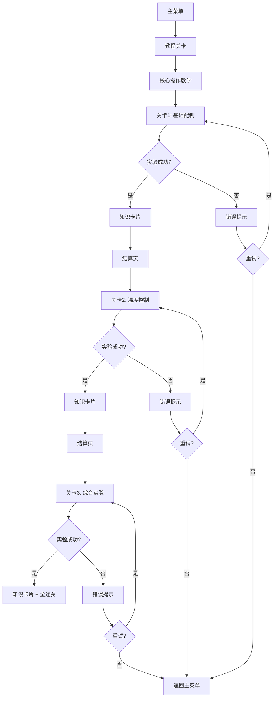

## 1. 产品概述

化学实验室教学游戏是一款基于 HTML5 Canvas 的教育模拟游戏，玩家通过交互式实验步骤学习化学基础操作。游戏以安全第一为原则，在虚拟环境中还原真实实验流程，包括配制溶液、控制温度、观察反应结果等核心操作，配合知识卡片和错误提示强化学习反馈。

- 目标用户：中学及以上化学学习者、教师辅助教学工具
- 核心价值：在零风险虚拟环境中掌握化学实验操作规范，通过关卡递进积累实验知识

## 2. 核心功能

### 2.1 用户角色

| 角色 | 注册方式 | 核心权限 |
|------|----------|----------|
| 学生 | 本地存档创建 | 游玩关卡、查看知识卡片、查看个人记录 |
| 教师（预留） | 本地存档创建 | 查看学习数据统计、配置实验参数 |

### 2.2 功能模块

1. **主菜单页**：开始游戏、继续游戏、设置、实验记录
2. **教程关卡页**：引导式交互教学，带出核心操作动作
3. **实验关卡页**：Canvas 画布 + 实验台 + 步骤指引 + 器材/试剂面板
4. **知识卡片页**：每关结算后展示化学知识
5. **结算页**：用时、评分、失败次数、关键选择回顾
6. **设置页**：输入方式切换、音量、重置存档

### 2.3 页面详情

| 页面名称 | 模块名称 | 功能描述 |
|----------|----------|----------|
| 主菜单页 | 标题动画 | 实验室场景动画背景 |
| 主菜单页 | 菜单按钮 | 开始/继续/设置/记录 |
| 教程关卡页 | 步骤高亮 | 当前步骤闪烁指示，引导玩家操作 |
| 教程关卡页 | 操作提示 | 根据输入方式动态显示按键/点击/触摸提示 |
| 实验关卡页 | 实验台画布 | Canvas 渲染器材、试剂、反应动画 |
| 实验关卡页 | 步骤面板 | 左侧步骤列表，当前步骤高亮 |
| 实验关卡页 | 器材面板 | 底部器材栏，拖拽/点击选取 |
| 实验关卡页 | 试剂面板 | 右侧试剂列表，显示浓度和用量 |
| 实验关卡页 | 温度控制 | 滑块/旋钮控制加热温度 |
| 实验关卡页 | 错误提示 | 操作错误时弹出安全警告和纠正指引 |
| 实验关卡页 | 提示系统 | 卡住时可请求提示，消耗提示次数 |
| 知识卡片页 | 卡片展示 | 反应原理、安全须知、生活应用 |
| 结算页 | 数据统计 | 用时、失败次数、关键选择、评分 |
| 结算页 | 重试按钮 | 重新挑战当前关卡 |
| 设置页 | 输入方式 | 键盘/鼠标/触摸切换，按键提示随之变化 |
| 设置页 | 音量控制 | 背景音乐和音效音量 |
| 设置页 | 存档管理 | 重置存档、导出记录 |

## 3. 核心流程

玩家从主菜单进入教程关卡，通过简短交互学会核心操作（选取器材、添加试剂、控温、观察反应），随后进入正式关卡。每关引入新规则（新器材、新试剂类型、安全规范），玩家按步骤完成实验，操作错误触发安全提示并可重试。通关后展示知识卡片和结算数据，记录用时、失败次数和关键选择。

## 4. 用户界面设计

### 4.1 设计风格

- **主色调**：深蓝绿 (#0D4F4F) 实验室氛围 + 明黄 (#F5C542) 强调色
- **辅助色**：浅灰白 (#F0F4F8) 面板背景 + 红色 (#E74C3C) 错误/危险提示
- **按钮风格**：圆角胶囊形，带微妙 3D 阴影，悬停时微微上浮
- **字体**：标题使用 "ZCOOL KuaiLe"（趣味科学风），正文使用 "Noto Sans SC"
- **布局风格**：实验台居中 Canvas，左侧步骤面板，右侧试剂面板，底部器材栏
- **图标风格**：线条式实验器材图标，统一描边粗细

### 4.2 页面设计概览

| 页面名称 | 模块名称 | UI 元素 |
|----------|----------|---------|
| 主菜单页 | 标题动画 | Canvas 粒子背景，标题渐入，按钮从下方滑入 |
| 教程关卡页 | 引导高亮 | 半透明遮罩 + 聚光灯效果，箭头指引操作目标 |
| 实验关卡页 | 实验台画布 | Canvas 中央渲染，器材可拖拽放置，反应动画播放 |
| 实验关卡页 | 步骤面板 | 左侧垂直列表，完成步骤打勾，当前步骤发光边框 |
| 实验关卡页 | 器材面板 | 底部水平滚动条，器材卡片式排列 |
| 实验关卡页 | 试剂面板 | 右侧垂直列表，滴管图标 + 试剂名 + 浓度标签 |
| 实验关卡页 | 温度控制 | 圆形旋钮组件，刻度标记，数值显示 |
| 实验关卡页 | 错误提示 | 顶部横幅弹出，红色背景 + 白色文字 + 警告图标 |
| 知识卡片页 | 卡片翻转 | 3D 翻转动画，正面示意图，背面文字说明 |
| 结算页 | 数据展示 | 圆环进度条（评分）+ 数字统计 + 选择时间线 |

### 4.3 响应式设计

- 桌面优先（1920×1080 基准），Canvas 自适应缩放
- 平板适配：面板可折叠，Canvas 保持 4:3 比例
- 移动端：竖屏布局，面板改为底部抽屉式，触摸优化（放大点击区域，长按替代右键）

### 4.4 输入方式适配

| 输入方式 | 选择器材 | 添加试剂 | 控制温度 | 确认步骤 |
|----------|----------|----------|----------|----------|
| 键盘 | 数字键 1-9 | Tab + Enter | ↑↓ 方向键 | Space |
| 鼠标 | 点击器材卡片 | 拖拽到实验台 | 滑块拖拽 | 点击按钮 |
| 触摸 | 点选器材 | 点选 + 点目标 | 旋钮手势 | 点按按钮 |
