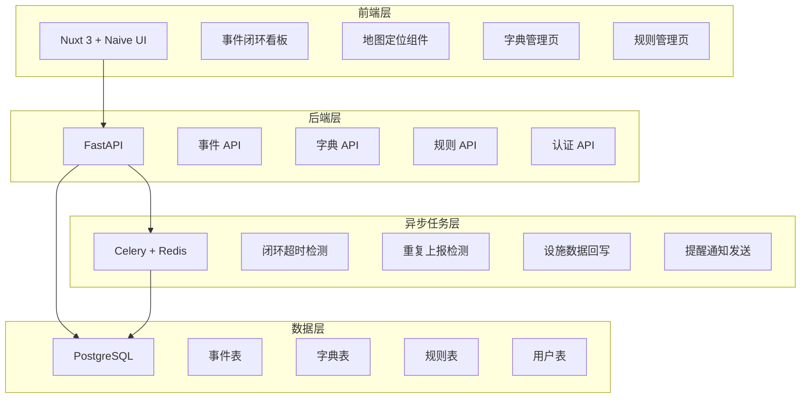
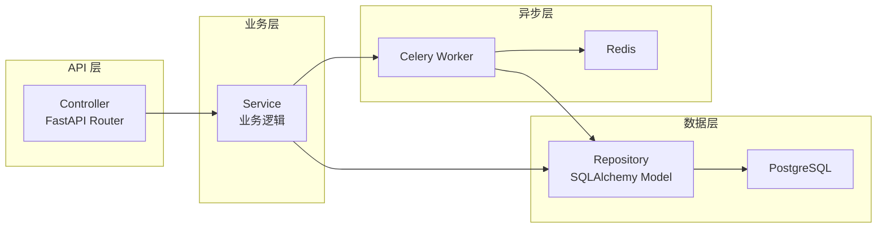
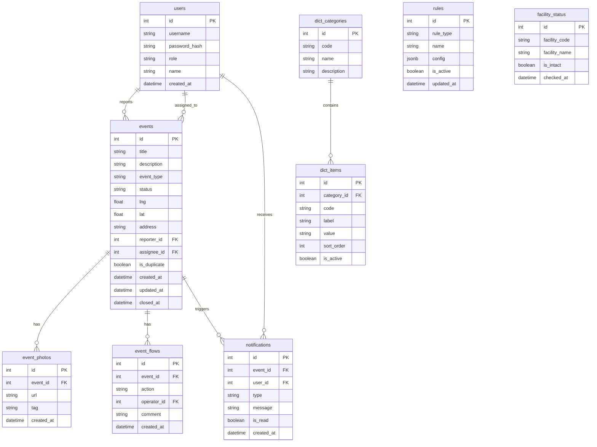

## 1. 架构设计



## 2. 技术说明

- 前端：Nuxt 3 + Naive UI + Pinia + 高德地图 JS API 2.0
- 初始化工具：npx nuxi init
- 后端：FastAPI + SQLAlchemy + Alembic
- 数据库：PostgreSQL 15+
- 异步任务：Celery + Redis（Broker & Backend）
- 认证：JWT（simplejwt 风格）

## 3. 路由定义

| 路由 | 用途 |
|------|------|
| / | 事件闭环看板首页，统计概览 |
| /events | 事件列表，按状态筛选 |
| /events/new | 新增事件上报 |
| /events/:id | 事件详情与流转记录 |
| /rectify | 整改复查列表 |
| /dict | 字典管理页面 |
| /rules | 规则管理页面 |

## 4. API 定义

### 4.1 事件相关

```typescript
interface Event {
  id: number
  title: string
  description: string
  event_type: string
  status: "pending" | "assigned" | "rectifying" | "reviewing" | "closed" | "rejected"
  location: { lng: number; lat: number; address: string }
  reporter_id: number
  assignee_id: number | null
  photos: string[]
  created_at: string
  updated_at: string
  closed_at: string | null
  is_duplicate: boolean
}

interface CreateEventRequest {
  title: string
  description: string
  event_type: string
  location: { lng: number; lat: number; address: string }
  photos: string[]
}

interface EventFlowRecord {
  id: number
  event_id: number
  action: "created" | "assigned" | "rectified" | "reviewed" | "closed" | "rejected" | "timeout_alert"
  operator_id: number
  comment: string
  created_at: string
}
```

### 4.2 字典相关

```typescript
interface DictCategory {
  id: number
  code: string
  name: string
  description: string
}

interface DictItem {
  id: number
  category_id: number
  code: string
  label: string
  value: string
  sort_order: number
  is_active: boolean
}
```

### 4.3 规则相关

```typescript
interface Rule {
  id: number
  rule_type: "timeout_alert" | "duplicate_detect"
  name: string
  config: Record<string, any>
  is_active: boolean
  updated_at: string
}
```

### 4.4 API 端点

| 方法 | 路径 | 说明 |
|------|------|------|
| GET | /api/events | 事件列表（支持状态筛选、分页） |
| POST | /api/events | 创建事件 |
| GET | /api/events/:id | 事件详情 |
| PUT | /api/events/:id/assign | 指派整改责任人 |
| PUT | /api/events/:id/rectify | 提交整改 |
| PUT | /api/events/:id/review | 复查确认 |
| GET | /api/events/stats | 事件统计 |
| GET | /api/dict/categories | 字典分类列表 |
| POST | /api/dict/categories | 创建字典分类 |
| PUT | /api/dict/categories/:id | 更新字典分类 |
| DELETE | /api/dict/categories/:id | 删除字典分类 |
| GET | /api/dict/items | 字典值列表（按分类筛选） |
| POST | /api/dict/items | 创建字典值 |
| PUT | /api/dict/items/:id | 更新字典值 |
| DELETE | /api/dict/items/:id | 删除字典值 |
| GET | /api/rules | 规则列表 |
| POST | /api/rules | 创建规则 |
| PUT | /api/rules/:id | 更新规则 |
| DELETE | /api/rules/:id | 删除规则 |
| POST | /api/auth/login | 登录 |
| GET | /api/auth/me | 当前用户信息 |

## 5. 服务架构图



## 6. 数据模型

### 6.1 数据模型定义



### 6.2 数据定义语言

```sql
CREATE TABLE users (
    id SERIAL PRIMARY KEY,
    username VARCHAR(64) UNIQUE NOT NULL,
    password_hash VARCHAR(256) NOT NULL,
    role VARCHAR(32) NOT NULL DEFAULT 'grid_worker',
    name VARCHAR(64) NOT NULL,
    created_at TIMESTAMP WITH TIME ZONE DEFAULT NOW()
);

CREATE TABLE events (
    id SERIAL PRIMARY KEY,
    title VARCHAR(256) NOT NULL,
    description TEXT,
    event_type VARCHAR(64) NOT NULL,
    status VARCHAR(32) NOT NULL DEFAULT 'pending',
    lng DOUBLE PRECISION,
    lat DOUBLE PRECISION,
    address VARCHAR(512),
    reporter_id INTEGER REFERENCES users(id),
    assignee_id INTEGER REFERENCES users(id),
    is_duplicate BOOLEAN DEFAULT FALSE,
    created_at TIMESTAMP WITH TIME ZONE DEFAULT NOW(),
    updated_at TIMESTAMP WITH TIME ZONE DEFAULT NOW(),
    closed_at TIMESTAMP WITH TIME ZONE
);

CREATE INDEX idx_events_status ON events(status);
CREATE INDEX idx_events_reporter ON events(reporter_id);
CREATE INDEX idx_events_created ON events(created_at);

CREATE TABLE event_photos (
    id SERIAL PRIMARY KEY,
    event_id INTEGER REFERENCES events(id) ON DELETE CASCADE,
    url VARCHAR(1024) NOT NULL,
    tag VARCHAR(64),
    created_at TIMESTAMP WITH TIME ZONE DEFAULT NOW()
);

CREATE TABLE event_flows (
    id SERIAL PRIMARY KEY,
    event_id INTEGER REFERENCES events(id) ON DELETE CASCADE,
    action VARCHAR(32) NOT NULL,
    operator_id INTEGER REFERENCES users(id),
    comment TEXT,
    created_at TIMESTAMP WITH TIME ZONE DEFAULT NOW()
);

CREATE INDEX idx_event_flows_event ON event_flows(event_id);

CREATE TABLE dict_categories (
    id SERIAL PRIMARY KEY,
    code VARCHAR(64) UNIQUE NOT NULL,
    name VARCHAR(128) NOT NULL,
    description TEXT
);

CREATE TABLE dict_items (
    id SERIAL PRIMARY KEY,
    category_id INTEGER REFERENCES dict_categories(id) ON DELETE CASCADE,
    code VARCHAR(64) NOT NULL,
    label VARCHAR(256) NOT NULL,
    value TEXT,
    sort_order INTEGER DEFAULT 0,
    is_active BOOLEAN DEFAULT TRUE,
    UNIQUE(category_id, code)
);

CREATE TABLE rules (
    id SERIAL PRIMARY KEY,
    rule_type VARCHAR(64) NOT NULL,
    name VARCHAR(128) NOT NULL,
    config JSONB DEFAULT '{}',
    is_active BOOLEAN DEFAULT TRUE,
    updated_at TIMESTAMP WITH TIME ZONE DEFAULT NOW()
);

CREATE TABLE facility_status (
    id SERIAL PRIMARY KEY,
    facility_code VARCHAR(64) UNIQUE NOT NULL,
    facility_name VARCHAR(256) NOT NULL,
    is_intact BOOLEAN DEFAULT TRUE,
    checked_at TIMESTAMP WITH TIME ZONE DEFAULT NOW()
);

CREATE TABLE notifications (
    id SERIAL PRIMARY KEY,
    event_id INTEGER REFERENCES events(id) ON DELETE SET NULL,
    user_id INTEGER REFERENCES users(id),
    type VARCHAR(32) NOT NULL,
    message TEXT,
    is_read BOOLEAN DEFAULT FALSE,
    created_at TIMESTAMP WITH TIME ZONE DEFAULT NOW()
);

CREATE INDEX idx_notifications_user ON notifications(user_id, is_read);

-- 初始字典数据
INSERT INTO dict_categories (code, name, description) VALUES
('event_type', '事件类型', '事件上报的分类'),
('photo_tag', '设施照片标签', '设施照片的分类标签'),
('publication_type', '结果公示类型', '结果公示的分类模板'),
('vote_topic', '议题投票分类', '议题投票的选项分类');

INSERT INTO dict_items (category_id, code, label, value, sort_order) VALUES
(1, 'road_damage', '道路破损', 'road_damage', 1),
(1, 'facility_damage', '设施损坏', 'facility_damage', 2),
(1, 'environment', '环境卫生', 'environment', 3),
(1, 'safety_hazard', '安全隐患', 'safety_hazard', 4),
(2, 'road', '道路', 'road', 1),
(2, 'lighting', '照明', 'lighting', 2),
(2, 'greenery', '绿化', 'greenery', 3),
(2, 'drainage', '排水', 'drainage', 4);

-- 初始规则数据
INSERT INTO rules (rule_type, name, config) VALUES
('timeout_alert', '整改超时提醒', '{"hours": 72, "notify_roles": ["grid_worker", "manager"]}'),
('duplicate_detect', '重复上报检测', '{"radius_meters": 50, "time_window_hours": 24, "event_type_match": true}');

-- 初始用户数据（密码均为 changeme 的 bcrypt hash）
INSERT INTO users (username, password_hash, role, name) VALUES
('worker1', '$2b$12$placeholder_hash_1', 'grid_worker', '张网格'),
('manager1', '$2b$12$placeholder_hash_2', 'biz_owner', '李负责'),
('admin1', '$2b$12$placeholder_hash_3', 'admin', '王管理');
```
