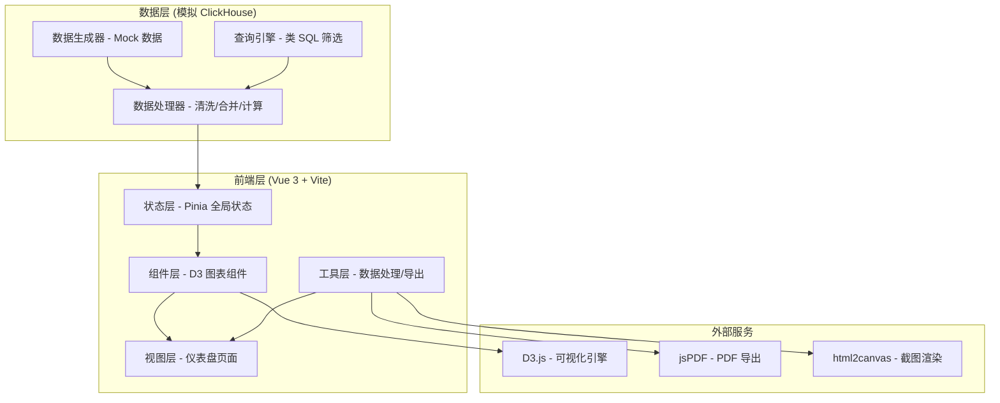
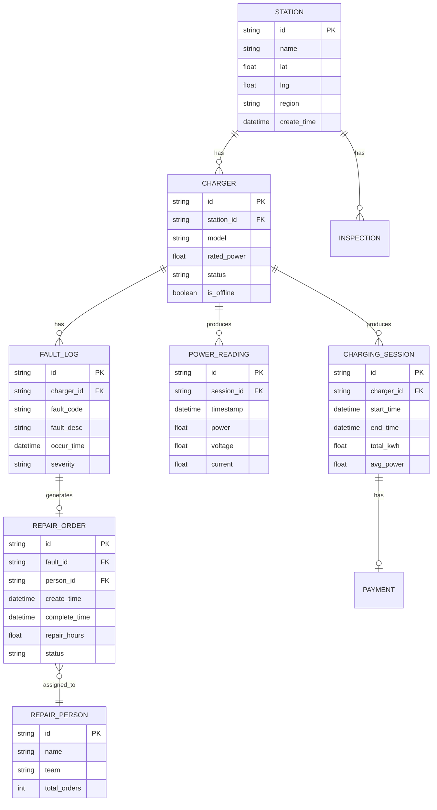

# 电动车充电桩故障可视化数据工作台 - 技术架构

## 1. 架构设计



## 2. 技术选型

- **前端框架**: Vue 3.4 + Composition API + `<script setup>`
- **构建工具**: Vite 5
- **状态管理**: Pinia
- **样式方案**: TailwindCSS 3 + SCSS 变量
- **可视化引擎**: D3.js v7
- **UI 组件**: 自定义组件（非组件库）
- **数据导出**: 
  - CSV: 原生 Blob + FileSaver
  - PDF: jsPDF + html2canvas
- **数据层**: 前端模拟 ClickHouse 查询，生成真实感 Mock 数据

## 3. 目录结构

```
src/
├── components/
│   ├── charts/
│   │   ├── FaultMap.vue        # 故障地图
│   │   ├── PowerCurve.vue      # 功率曲线
│   │   ├── RepairTime.vue      # 维修耗时
│   │   └── StationRank.vue     # 站点排行
│   ├── common/
│   │   ├── KpiCard.vue         # KPI 卡片
│   │   ├── FilterBar.vue       # 全局筛选栏
│   │   ├── ChartHeader.vue     # 图表头（样本量/更新时间）
│   │   └── ChartContainer.vue  # 图表容器
│   └── dashboard/
│       ├── TopAnomalies.vue    # 今日异常三件事
│       └── DrillPanel.vue      # 下钻详情面板
├── stores/
│   └── dataStore.js            # 全局数据状态
├── data/
│   ├── mock/
│   │   ├── generator.js        # Mock 数据生成器
│   │   └── seed.js             # 种子数据
│   ├── processor/
│   │   ├── cleaner.js          # 缺失值处理
│   │   ├── merger.js           # 重复报修合并
│   │   └── calculator.js       # 指标计算（可用率等）
│   └── query/
│       └── engine.js           # 类 ClickHouse 查询引擎
├── utils/
│   ├── exportCSV.js            # CSV 导出
│   ├── exportPDF.js            # PDF 导出
│   └── d3Helpers.js            # D3 辅助函数
├── App.vue
└── main.js
```

## 4. 核心数据模型

### 4.1 ER 图



### 4.2 核心计算逻辑

**可用率计算**（离线桩排除）：
```javascript
function calcAvailability(stations, chargers, faults) {
  const onlineChargers = chargers.filter(c => !c.is_offline);
  const faultyChargerIds = new Set(
    faults.filter(f => 
      f.occur_time > todayStart && 
      chargers.find(c => c.id === f.charger_id && !c.is_offline)
    ).map(f => f.charger_id)
  );
  const normalCount = onlineChargers.filter(c => !faultyChargerIds.has(c.id)).length;
  return normalCount / onlineChargers.length;
}
```

**重复报修合并**（72小时内同桩同故障码）：
```javascript
function mergeDuplicateRepairs(faults) {
  const sorted = [...faults].sort((a, b) => a.occur_time - b.occur_time);
  const merged = [];
  const windowMs = 72 * 60 * 60 * 1000;
  
  for (const fault of sorted) {
    const last = merged.find(m => 
      m.charger_id === fault.charger_id &&
      m.fault_code === fault.fault_code &&
      fault.occur_time - m.occur_time <= windowMs
    );
    if (last) {
      last.duplicate_count = (last.duplicate_count || 1) + 1;
      last.last_occur_time = fault.occur_time;
    } else {
      merged.push({ ...fault, duplicate_count: 1 });
    }
  }
  return merged;
}
```

## 5. 状态管理（Pinia）

```javascript
// dataStore.js
export const useDataStore = defineStore('data', {
  state: () => ({
    // 原始数据
    stations: [],
    chargers: [],
    sessions: [],
    powerReadings: [],
    faultLogs: [],
    repairOrders: [],
    repairPersons: [],
    
    // 筛选条件
    filters: {
      stationIds: [],
      chargerModels: [],
      faultCodes: [],
      timeRange: [todayStart, now],
      repairPersonIds: []
    },
    
    // 下钻状态
    drillDown: {
      level: 'overview', // overview -> station -> charger -> fault
      selectedStationId: null,
      selectedChargerId: null,
      selectedFaultCode: null
    },
    
    // 元信息
    lastUpdateTime: null,
    isLoading: false
  }),
  
  getters: {
    filteredFaults: (state) => applyFilters(state.faultLogs, state.filters),
    filteredRepairs: (state) => applyFilters(state.repairOrders, state.filters),
    topAnomalies: (state) => calcTopAnomalies(state),
    availabilityRate: (state) => calcAvailability(state),
    sampleSizeByChart: (state) => calcSampleSizes(state)
  },
  
  actions: {
    async loadAllData() { ... },
    setFilter(key, value) { ... },
    drillTo(level, id) { ... },
    exportData(format) { ... }
  }
});
```

## 6. D3 图表组件规范

每个图表组件统一结构：
```vue
<template>
  <ChartContainer :sample-size="sampleSize" :update-time="lastUpdate" :filters="activeFilters">
    <svg ref="svgRef"></svg>
  </ChartContainer>
</template>

<script setup>
// 统一接收 props: data, width, height, onSelect
// 使用 onMounted + watch 响应数据变化
// 使用 D3 enter/update/exit 模式绑定数据
</script>
```

## 7. 缺失值处理策略

| 字段 | 缺失处理方式 |
|------|-------------|
| 功率读数 | 线性插值填充，连续缺失 > 5min 标记为断连区段 |
| 故障描述 | 用故障码映射表填充默认描述 |
| 维修完成时间 | 未完工单不计入平均耗时统计，单独标记 |
| 站点坐标 | 用区域中心坐标兜底，地图上半透明显示 |
| 支付数据 | 缺失则不影响故障分析，仅在相关图表标注"数据缺失" |
